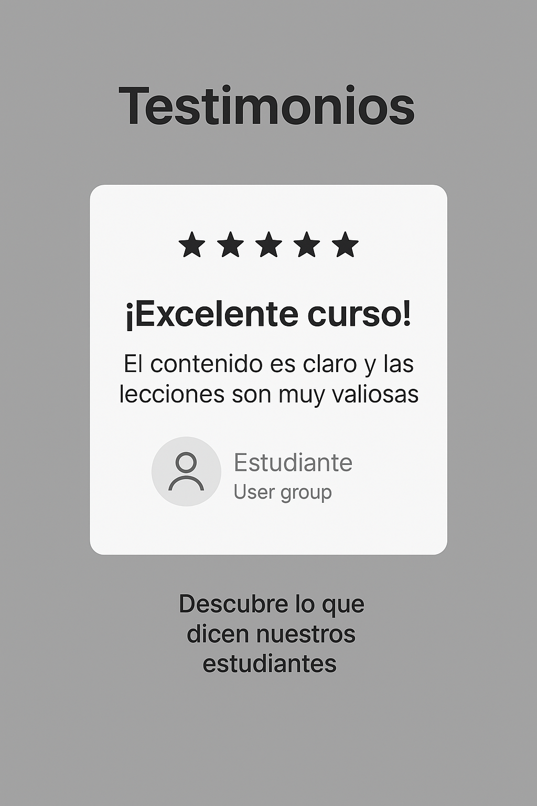
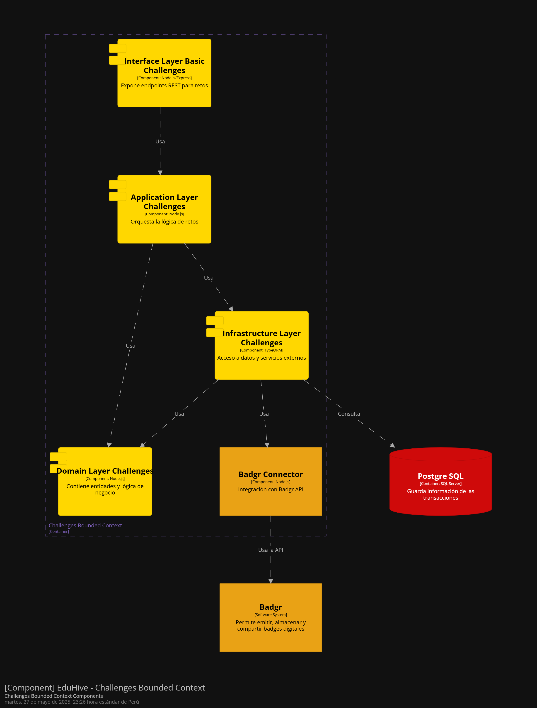

span

# Universidad Peruana de Ciencias Aplicadas

### **CURSO:** Desarrollo de Aplicaciones Open Source

### **NRC**: 4334

### **Profesor:** Hugo Allan Mori Paiva

### **Ingeniería de software**

## Informe de Trabajo Final

### **Nombre del startup:** APX-01

### **Nombre del producto:** EduHive

## **Integrantes**

| **Nombre**                             | **Codigo** |
| -------------------------------------- | ---------- |
| **Alejo Cardenas Jose Antonio**        | U202122484 |
| **Luquillas Asto Omar**                | U20211G641 |
| **Real Calderón Sebastián Omar**     | U20221D964 |
| **Flores Apaico Josue Antonio**        | U20201F773 |
| **Mendoza Vergara Franklin Alejandro** | U202312343 |

Abril 2025

## Registro de Versiones del Informe

| Versión | Fecha | Autor | Descripción de modificación |
| -------- | ----- | ----- | ----------------------------- |

## Project Report Collaboration Insights

## Contenido

- [Student Outcome](#student-outcome)
- [Objetivos SMART](#objetivos-smart)
- [Capítulo I](#capítulo-i)
  - [1.1. Startup Profile](#11-startup-profile)
    - [1.1.1. Descripción de la Startup](#111-descripción-de-la-startup)
    - [1.1.2. Perfiles de integrantes del equipo](#112-perfiles-de-integrantes-del-equipo)
  - [1.2. Solution Profile](#12-solution-profile)
    - [1.2.1. Antecedentes y problemática](#121-antecedentes-y-problemática)
    - [1.2.2. Lean UX Process](#122-lean-ux-process)
      - [1.2.2.1. Lean UX Problem Statements](#1221-lean-ux-problem-statements)
      - [1.2.2.2. Lean UX Assumptions](#1222-lean-ux-assumptions)
      - [1.2.2.3. Lean UX Hypothesis Statements](#1223-lean-ux-hypothesis-statements)
      - [1.2.2.4. Lean UX Canvas](#1224-lean-ux-canvas)
  - [1.3. Segmentos Objetivo](#13-segmentos-objetivo)
- [Capítulo II: Requirements Elicitation & Analysis](#capítulo-ii-requirements-elicitation--analysis)
  - [2.1. Competidores](#21-competidores)
    - [2.1.1. Análisis competitivo](#211-análisis-competitivo)
    - [2.1.2. Estrategias y tácticas frente a competidores](#212-estrategias-y-tácticas-frente-a-competidores)
  - [2.2. Entrevistas](#22-entrevistas)
    - [2.2.1. Diseño de entrevistas](#221-diseño-de-entrevistas)
    - [2.2.2. Registro de entrevistas](#222-registro-de-entrevistas)
    - [2.2.3. Análisis de entrevistas](#223-análisis-de-entrevistas)
  - [2.3. Needfinding](#23-needfinding)
    - [2.3.1. User Personas](#231-user-personas)
    - [2.3.2. User Task Matrix](#232-user-task-matrix)
    - [2.3.3. User Journey Mapping](#233-user-journey-mapping)
    - [2.3.4. Empathy Mapping](#234-empathy-mapping)
    - [2.3.5. As-is Scenario Mapping](#235-as-is-scenario-mapping)
  - [2.4. Ubiquitous Language](#24-ubiquitous-language)
- [Capítulo III: Requirements specification](#capítulo-iii-requirements-specification)
  - [3.1. To-Be Scenario Mapping](#31-to-be-scenario-mapping)
  - [3.2. User Stories](#32-user-stories)
  - [3.3. Impact Mapping](#33-impact-mapping)
  - [3.4. Product Backlog](#34-product-backlog)
- [Capítulo IV: Product Design](#capítulo-iv-product-design)
  - [4.1. Style Guidelines](#41-style-guidelines)
    - [4.1.1. General Style Guidelines](#411-general-style-guidelines)
    - [4.1.2. Web Style Guidelines](#412-web-style-guidelines)
  - [4.2. Information Architecture](#42-information-architecture)
    - [4.2.1. Organization Systems](#421-organization-systems)
    - [4.2.2 Labeling Systems](#422-labeling-systems)
    - [4.2.3 SEO Tags and Meta Tags](#423-seo-tags-and-meta-tags)
    - [4.2.4. Searching Systems](#424-searching-systems)
    - [4.2.5. Navigation Systems](#425-navigation-systems)
  - [4.3. Landing Page UI Design](#43-landing-page-ui-design)
    - [4.3.1. Landing Page Wireframe](#431-landing-page-wireframe)
    - [4.3.2. Landing Page Mock-up](#432-landing-page-mock-up)
  - [4.4. Web Applications UX/UI Design](#44-web-applications-uxui-design)
    - [4.4.1. Web Applications Wireframes](#441-web-applications-wireframes)
    - [4.4.2. Web Applications Wireflow Diagrams](#442-web-applications-wireflow-diagrams)
    - [4.4.2. Web Applications Mock-ups](#442-web-applications-mock-ups)
    - [4.4.3. Web Applications User Flow Diagrams](#443-web-applications-user-flow-diagrams)
  - [4.5. Web Applications Prototyping](#45-web-applications-prototyping)
  - [4.6. Domain-Driven Software Architecture](#46-domain-driven-software-architecture)
    - [4.6.1. Software Architecture Context Diagram](#461-software-architecture-context-diagram)
    - [4.6.2. Software Architecture Container Diagrams](#462-software-architecture-container-diagrams)
    - [4.6.3. Software Architecture Components Diagrams](#463-software-architecture-components-diagrams)
  - [4.7. Software Object-Oriented Design](#47-software-object-oriented-design)
    - [4.7.1. Class Diagrams](#471-class-diagrams)
    - [4.7.2. Class Dictionary](#472-class-dictionary)
  - [4.8. Database Design](#48-database-design)
    - [4.8.1. Database Diagram](#481-database-diagram)
- [Capítulo V: Product Implementation, Validation & Deployment](#capítulo-v-product-implementation-validation--deployment)
  - [5.1. Software Configuration Management](#51-software-configuration-management)
    - [5.1.1. Software Development Environment Configuration](#511-software-development-environment-configuration)
    - [5.1.2. Source Code Management](#512-source-code-management)
    - [5.1.3. Source Code Style Guide & Conventions](#513-source-code-style-guide--conventions)
    - [5.1.4. Software Deployment Configuration](#514-software-deployment-configuration)
  - [5.2. Landing Page, Services & Applications Implementation](#52-landing-page-services--applications-implementation)
    - [5.2.1. Sprint 1](#521-sprint-1)
      - [5.2.1.1. Sprint Planning 1](#5211-sprint-planning-1)
      - [5.2.1.2. Aspect Leaders and Collaborators](#5212-aspect-leaders-and-collaborators)
      - [5.2.1.3. Sprint Backlog 1](#5213-sprint-backlog-1)
      - [5.2.1.4. Development Evidence for Sprint Review](#5214-development-evidence-for-sprint-review)
      - [5.2.1.5. Execution Evidence for Sprint Review](#5215-execution-evidence-for-sprint-review)
      - [5.2.1.6. Services Documentation Evidence for Sprint Review](#5216-services-documentation-evidence-for-sprint-review)
      - [5.2.1.7. Software Deployment Evidence for Sprint Review](#5217-software-deployment-evidence-for-sprint-review)
      - [5.2.1.8. Team Collaboration Insights during Sprint](#5218-team-collaboration-insights-during-sprint)
  - [5.3. Validation Interviews](#53-validation-interviews)
    - [5.3.1. Diseño de entrevistas](#531-diseño-de-entrevistas)
    - [5.3.2. Registro de entrevistas](#532-registro-de-entrevistas)
    - [5.3.3. Evaluaciones según heurísticas](#533-evaluaciones-según-heurísticas)
  - [5.4. Video About-the-Product](#54-video-about-the-product)
- [Conclusiones](#conclusiones)
- [Bibliografía](#bibliografía)
- [Anexos](#anexos)

## Student Outcome

## Objetivos SMART

## Capitulo I

### 1.1. Startup Profile

#### 1.1.1. Descripción de la Startup

#### 1.1.2. Perfiles de integrantes del equipo

### 1.2. Solution Profile

#### 1.2.1. Antecedentes y problemática

#### 1.2.2. Lean UX Process

##### 1.2.2.1. Lean UX Problem Statements

##### 1.2.2.2. Lean UX Assumptions

##### 1.2.2.3. Lean UX Hypothesis Statements

##### 1.2.2.4. Lean UX Canvas

### 1.3. Segmentos Objetivo

## Capítulo II: Requirements Elicitation & Analysis

### 2.1. Competidores

#### 2.1.1. Análisis competitivo

#### 2.1.2. Estrategias y tácticas frente a competidores

### 2.2. Entrevistas

#### 2.2.1. Diseño de entrevistas

#### 2.2.2. Registro de entrevistas

#### 2.2.3. Análisis de entrevistas

### 2.3. Needfinding

#### 2.3.1. User Personas

#### 2.3.2. User Task Matrix

#### 2.3.3. User Journey Mapping

#### 2.3.4. Empathy Mapping

#### 2.3.5. As-is Scenario Mapping

### 2.4. Ubiquitous Language

## Capítulo III: Requirements specification

### 3.1. To-Be Scenario Mapping

### 3.2. User Stories

### 3.3. Impact Mapping

### 3.4. Product Backlog

## Capítulo IV: Product Design

### 4.1. Style Guidelines

En esta parte, daremos a conocer nuestra propuesta para el diseño, estilo y aspecto visual tanto de la página web como de las secciones de nuestra aplicación. Buscamos ofrecer a los usuarios una experiencia cómoda y sencilla mediante una interfaz clara e intuitiva. Para ello, seleccionamos cuidadosamente elementos visuales que resulten atractivos y agradables, además de definir límites que nos permitan evitar el uso de gráficos que puedan afectar negativamente la estética.

#### 4.1.1. General Style Guidelines

**Branding:** Creamos un logotipo distintivo y memorable que encapsula la esencia de nuestra plataforma educativa colaborativa. Incorporamos elementos visuales que representan tanto el mundo académico como el sentido de comunidad y organización, usando una colmena estilizada y una abeja con birrete como símbolos centrales de aprendizaje colectivo, constancia y crecimiento.

**Tipografía** 
Open Sans ha sido seleccionada como la fuente principal para todos los textos de la aplicación. Esta tipografía se distingue por su excelente legibilidad y su estilo moderno, lo que garantiza una experiencia de lectura clara y agradable en cualquier dispositivo.

El tamaño de la fuente se ajusta de manera automática según la pantalla, asegurando una visualización óptima tanto en móviles como en computadoras.

**Colores** 
La paleta de colores está compuesta por cinco tonos principales, cuidadosamente seleccionados para transmitir una apariencia limpia, moderna y profesional en cada sección de la aplicación.

 

<strong>Color Primario:</strong> 
Amarillo Dorado (#F4BE1D): Este color es el más predominante en el diseño, utilizado en botones principales, resaltados visuales y líneas de separación. Aporta energía y visibilidad, creando una experiencia amigable y dinámica para el usuario.

<strong>Colores Secundarios:</strong> 

<ul>
<li>Morado Oscuro (#362A5E): Utilizado en títulos o textos destacados. Añade contraste y profundidad al diseño.
<li>Beige Claro (#FEF8EB): Funciona como fondo o zonas de descanso visual, aportando claridad sin perder calidez.
<li>Gris Oscuro (#2B2B2B): Utilizado para tipografía y elementos de interfaz. Este color garantiza buena legibilidad.
<li>Beige Suave (#F4E0A5): Aparece en elementos secundarios o de soporte, equilibrando la paleta general.
</ul>

<strong>Texto</strong> 
Todos los textos utilizan el color #2B2B2B (Gris Oscuro) para asegurar un alto contraste y una lectura fluida sobre fondos claros.
La tipografía empleada en toda la aplicación es Open Sans, una fuente legible, moderna y profesional.

<strong>Botones</strong> 
Los botones siguen un sistema de color funcional:

<ul>

<li>Botones de Acción Principal:

<ul>
<li>Fondo: #F4BE1D (Amarillo Dorado)
<li>Texto: Blanco
<li>Hover: El fondo se oscurece ligeramente para reforzar la retroalimentación visual.
</ul>

<li>Botones de Acción Secundaria:

<ul>
<li>Fondo: Blanco con borde y texto en #F4BE1D
<li>Hover: Puede invertirse el color de fondo y texto o intensificar el borde para marcar interacción.
</ul>

</ul>

<strong>Formularios</strong> 

<ul>
<li>Los campos de texto siguen un diseño simple con líneas delimitadoras delgadas.
<li>Indicadores como el tiempo, la señal y los íconos del sistema están incluidos para crear una maqueta realista.
</ul>

<strong>Íconos y Sistema Visual</strong> 

<ul>
<li>Los íconos siguen un estilo de línea simple, usando colores oscuros (#2B2B2B) y están inspirados en la librería Vuesax.
<li>Están diseñados para facilitar la comprensión sin sobrecargar la interfaz.
</ul>

<strong>Estados de Hover</strong> 
Cuando el usuario interactúa con botones o íconos, los colores de fondo se intensifican levemente, mejorando la experiencia visual y confirmando la acción.

<strong>Espaciado y Distribución</strong> 
El diseño se basa en un sistema modular de 8px, asegurando alineación precisa y consistencia visual entre todos los elementos.

#### 4.1.2. Web Style Guidelines

1. <strong>Diseño:</strong> 
El diseño tiene que ser claro, actual y adaptable, asegurando una correcta visualización y funcionalidad en cualquier tipo de dispositivo.

  <td colspan="1" rowspan="6">
    
  </td>

2. <strong>Botones:</strong>
   Los botones, tanto principales como secundarios, deben resaltar de forma clara utilizando una paleta de colores uniforme y coherente.

  <td colspan="1" rowspan="6">
    
  </td>

3. <strong>Tema:</strong>
   La apariencia visual debe alinearse con la identidad de la aplicación, haciendo uso de los colores previamente definidos.

* **mode-light**

  <td colspan="1" rowspan="6">
    
  </td>

 

* **mode-black**

  <td colspan="1" rowspan="6">
    
  </td>

 

4. <strong>Logo:</strong>
   El logotipo debe ser claro y fácilmente visible en todo el sitio, conservando siempre sus proporciones originales.

  <td colspan="1" rowspan="6">
    
  </td>

### 4.2. Information Architecture

#### 4.2.1. Organization Systems

Para la landing page de EduHive, se usará una organización de forma jerárquica, en la que se ordenará la información en distintas secciones de una forma clara, ordenada e intuitiva para nuestros dos segmentos objetivos.
Tanto el estudiante como el profesor tendrán acceso a este, pero cada uno tendrá distintas funciones, dependiendo de su rol en la aplicación.

**Estudiante**: Para los estudiantes, las principales funciones que buscan son las de usar las herramientas académicas que ofrece la aplicación, por lo que se usará una organización jerárquica, pues esta juntaría todas las subfunciones que conforman el tema de las actividades de estudio.

**• Challenges**: En este apartado, el estudiante es capaz de visualizar y realizar las diferentes tareas y retos académicos, además de realizar las entregas correspondientes.

**•	Teams**: El estudiante puede gestionar distintos equipos de trabajo de las clases y comunicarse con ellos mediante mensajes o chats.

**•	Analytics**: El estudiante puede observar su progreso a lo largo de sus clases y hacer cálculos de posibles resultados que obtendría según hiciera distintos desafíos.

**•	Schedule**: Aquí, se podrá visualizar un horario con todas las actividades pertinentes del usuario, así como este mismo modificar y agregar sus propios eventos. De esta manera, se llevará una mejor organización de las clases

**•	Badges**: Se pueden observar las distintas medallas e insignias que ha conseguido el estudiante a lo largo del curso, acentuando el valor de las herramientas de gamificación de la aplicación

**Profesor**: Para los profesores, se buscará una organización jerárquica y secuencial, ya que se busca ordenar sus propias subfunciones referentes al del docente y luego seguir pasos para corrección y comunicación con los alumnos.

**•	Challenges**: En este apartado, el profesor es capaz de proponer y realizar las distintas tareas y retos académicos que van a visualizar los alumnos, además de fijar fechas de entrega

**•	Teams**: El profesor puede gestionar los distintos equipos de trabajo entre los estudiantes, para conseguir una comunicación activa entre ellos

**•	Analytics**: Se puede analizar el progreso del alumno al presentar las calificaciones del estudiante para encontrar a los que necesiten un apoyo mayor

**•	Schedule**: Aquí, se podrá visualizar un horario con todas las actividades pertinentes del profesor como las clases, así como este puede modificar y agregar sus propios eventos. De esta manera, se llevará una mejor organización de las clases.

**•	Badges**: Se puede hacer entrega de insignias a los estudiantes que cumplan diversas actividades, además de gestionar el aprendizaje y la motivación de estos mediante estas herramientas

Cada segmento está dividido y organizado para guiar al usuario en entender las funcionalidades y poder usarlas sin problema alguno.

#### 4.2.2. Labeling Systems

Las etiquetas en la landing page son simples y fáciles de entender para no generar confusión en los usuarios, tienen información y títulos claros y descriptivos que sirven para identificar cada funcionalidad sin problema alguno y sin ayuda de terceros. Esto debido a que se omite tecnicismos y muchas palabras para optar por la simpleza.

**•	Challenges**: La sección challenges es el núcleo de la aplicación. Es la que permite crear, visualizar y resolver las diferentes tareas académicas.

**•	Teams**: La sección Teams es la que se encarga de la gestión total de la comunicación entre usuarios, además permite la creación de grupos propios con sus propias funciones como mensajes y chat.

**•	Analytics**: La sección Analyitcs muestra el progreso de los alumnos y los cambios que se tendrían al realizar las tareas

**•	Schedule**: La sección Schedula se encarga de mostrar y editar el horario de las clases.

**•	Badges**: La sección Badges es la encargada de dar y mostrar las diferentes insignias referentes a los desafíos completados

#### 4.2.3. SEO Tags and Meta Tags

Se utilizaron diversos meta tags que mejoran la visibilidad del sitio web en los motores de búsqueda:

**Landing Page**:

**•	Title**:
EduHive: Plataforma para la gestión educativa de cursos

**•	Meta Description**:
EduHive es una Plataforma diseñada para la gestión educativa entre alumnos y profesor que busca conectar ambos sectores en un ecosistema dinámico con distintas herramientas como grupos de estudio o retos académicos

**•	Keywords**:
Plataforma educative, gestion de cursos, administración de tareas, productividad de usuarios

**•	Author**: Eduhive Team

**Challenges**:

**•	Title**: Desafíos académicos

**•	Meta Description**: Gestiona y permite visualizar las tareas y los retos académicos

**•	Keywords**: Tareas, retos académicos, gestión de actividades

**•	Author**: Eduhive Team

**Teams**:

**•	Title**: Gestión de comunicación

**•	Meta Description**: Acceso a mensajes con alumnos y profesores, así como creación de equipos de trabajo

**•	Keywords**: correo, gestión de equipos, reuniones, planificación de trabajo

**•	Author**: Eduhive Team

**Analytics**:

**•	Title**: Gestión de progreso

**•	Meta Description**: Muestra el progreso del alumno a lo largo del curso y calcular notas al resolver desafíos

**•	Keywords**: seguimiento, progreso del alumno, gestión de desempeño

**•	Author**: Eduhive Team

**Schedule**:

**•	Title**: Horario académico

**•	Meta Description**: Acceso a un horario académico que se puede editar al agregar distintos eventos

**•	Keywords**: gestión de tiempo, eventos, organización de clases

**•	Author**: Eduhive Team

**Badges**:

**•	Title**: Gestión de insignias

**•	Meta Description**: Se hace una visualización y entregas de insignias referentes a actividades gamificadas.

**•	Keywords**: herramientas de gamificación, insignias, calificaciones

**•	Author**: Eduhive Team

#### 4.2.4. Searching Systems

La aplicación cuenta con una barra de búsqueda para que los usuarios puedan ingresar a la información y actividades que buscan, como serían las tareas o los retos académicos. Se optó por un sistema de búsqueda sencillo y eficaz, para que el usuario no se pierda entre tantas opciones y encuentre sus búsquedas rápido.
Permite buscar y filtrar por nombre de la incidencia, descripción de cada etiqueta o profesores encargados. Mediante un side bar se podrán observar las diferentes funciones que se encuentran en el header de la aplicación.

#### 4.2.5. Navigation Systems

El sistema principal de navegación es intuitivo y claro. Este se muestra principalmente en una barra de búsqueda que cuenta con todas las funciones de la aplicación, con las que podremos interactuar y nos dirigirá a cada actividad buscada.

**1.	Landing Page**

**•	Estructura**:

* Muestra todas las diferentes opciones del sitio web.
* Botones de acción para gestionar y manipular las funciones que se ofrecen.

**•	Acción del Usuario**:

* Estudiante: Visualiza, se comunica y puede resolver distintas tareas.
* Profesor: Gestiona las actividades de los alumnos y realiza un seguimiento a este.

**2.	Sección de Challenges**

**•	Estructura**:

* Visualización de todos los tipos de actividades que se pueden crear o resolver.
* Submenú para los distintos tipos de desafíos.

**•	Acción del Usuario**:

* Estudiante: Puede interactuar y resolver los desafíos impuestos.
* Profesor: Puede crear y calificar desafíos para los alumnos.

**3.	Sección de Teams**

**•	Estructura**:

* Visualización de alumnos y profesores para interactuar.
* Submenú para crear grupos y usar el sistema de mensajes.

**•	Acción del Usuario**:

* Estudiante: Puede interactuar con compañeros de clase y profesores, además de crear sus propios grupos.
* Profesor: Puede interactuar con los alumnos y profesores, además de crear grupos de estudio seleccionando alumnos.

**4.	Sección de Analytics**

**•	Estructura**:

* Visualización de estadísticas sobre el progreso de los estudiantes
* Acceso a una función para calcular notas futuras.

**•	Acción del Usuario**:

* Estudiante: Visualizar sus estadísticas y calcular futuras notas
* Profesor: Puede analizar el progreso académico de sus alumnos

**5.	Sección de Schedule**

**•	Estructura**:

* Visualización del horario académico de los estudiantes
* Acceso a una función para agregar y editar distintos eventos en el horario.

**•	Acción del Usuario**:

* Estudiante: Visualizar su horario y editarlo como desee
* Profesor: Puede observar su propio horario y gestionar eventos y actividades referentes a sus alumnos

**6.	Sección de Badges**

**•	Estructura**:

* Visualización y entrega de insignias conseguidas por las herramientas de gamificación
* Submenú para filtrar los tipos de insignias conseguidas

**•	Acción del Usuario**:

* Estudiante: Puede visualizar sus insignias conseguidas, así como analizar que desafíos realizar para conseguir más.
* Profesor: Puede entregar las insignias y crearlas en base a las actividades a realizar de los estudiantes.

### 4.3. Landing Page UI Design

#### 4.3.1. Landing Page Wireframe

El wireframe presenta la estructura esencial y el flujo de la landing page, adaptado para versiones tanto en **Desktop** como en **Mobile**. Se organiza en diferentes secciones clave:

**Desktop**

* **Home Landing Page**

<strong>Encabezado:</strong> 
Incluye el logotipo en la esquina superior izquierda y un menú de navegación con las secciones: “Why DriveNow”, “Testimonies”, “Safety”, “Contact”, “Register” y “Login”. Además, se destacan los botones de acceso a cuenta (“Login” y “Register”) dentro de una franja de diseño distintivo que facilita su visibilidad.

<strong>Sección Hero:</strong> 
Contiene un título llamativo: “Upgrade Yourself”, que comunica el propósito de la página. Está acompañado de un breve texto introductorio (placeholder de lorem ipsum) que da contexto al visitante.
También incluye un campo de búsqueda visible con un ícono de lupa, lo que sugiere que el sitio está orientado a encontrar cursos o contenidos personalizados.
Visualmente se apoya en dos imágenes: una junto al título y otra en el lado derecho, ayudando a equilibrar el diseño y hacerlo más atractivo.

  <td colspan="1" rowspan="6">
    
  </td>

 

* **Why DriveNow**

**Encabezado Visual:**  Utiliza formas geométricas como fondo decorativo para crear un entorno visual dinámico y moderno.

**Mensaje Principal (CTA):**  Incluye un título llamativo "You’re Dream To Know More?" que busca captar la atención del usuario e incentivar el interés por saber más sobre el producto o servicio.

**Texto de Apoyo:**  Proporciona una breve descripción que refuerza el valor de unirse o conocer más sobre la oferta.

**Botón de Acción (CTA):**  Presenta un botón destacado con el texto "Join Now" que invita a la conversión inmediata.

**Diseño Visual:**  Contraste marcado entre fondo oscuro y elementos en tonos claros, ideal para mantener la legibilidad y dirigir la atención al contenido relevante.

  <td colspan="1" rowspan="6">
    
  </td>

 

* **Testimonies**

**Título Principal:**  Se destaca la palabra “Testimonials” en el centro, indicando claramente el propósito de la sección.

**Subtítulo Descriptivo:**  Una breve línea de texto complementa el título, brindando contexto sobre la importancia de las opiniones compartidas.

**Citas de Clientes:**  Se presentan dos tarjetas con testimonios de usuarios, incluyendo una cita textual, nombre y cargo del autor (John Doe, CEO).

**Elementos Visuales:**  Se utilizan íconos de comillas como parte del diseño de cada tarjeta para reforzar visualmente la idea de testimonio.

**Navegación Lateral:**  Se incluyen flechas a los lados izquierdo y derecho para explorar más opiniones, funcional tanto en Desktop como adaptado para Mobile con navegación táctil.

**Diseño Limpio y Centrado:**  La estructura mantiene un equilibrio visual con espacio suficiente entre los elementos, priorizando la legibilidad. 

  <td colspan="1" rowspan="6">
    
  </td>

 

* **Safety**

**Sección de Seguridad y Confianza**

**Iconografía Central:**  Se destacan dos íconos principales con temática de seguridad y protección, reforzando visualmente los beneficios del servicio.

**Mensajes de Valor:**  Dos bloques de texto acompañan a los íconos, comunicando confianza en el proceso de arrendamiento y respaldo con seguros aprobados.

**Botones CTA (Call to Action):**  Cada mensaje incluye un botón “Learn More” que invita al usuario a explorar más detalles, manteniendo accesibilidad y visibilidad clara en Desktop y adaptabilidad en Mobile.

**Diseño Equilibrado:**  Distribución en columnas que en Desktop se presenta en línea horizontal, y en Mobile se espera una reorganización vertical para facilitar la navegación táctil.

 **Pie de Página (Footer)**

**Información Institucional:** Se incluyen columnas con enlaces organizados por categorías: Company, Services y Resources.

**Redes Sociales y Selector de Idioma:** Íconos sociales (LinkedIn, Twitter, etc.) y un selector de idioma están disponibles, adaptables a la visualización móvil.

**Derechos y Marca:** Texto con derechos reservados y una imagen de marca ubicada estratégicamente.

  <td colspan="1" rowspan="6">
    
  </td>

 

* **Contact**

**Sección de Formulario de Contacto**

**Encabezado Amigable:**  El título principal "Say Hello to Us" establece un tono cálido y acogedor para fomentar la interacción del usuario.

**Formulario de Entrada:**  Dispuesto en un layout de dos columnas en Desktop que se reorganiza verticalmente para Mobile, incluye los siguientes campos:

<ul>

<li>Nombre completo
<li>Correo electrónico
<li>Número de teléfono
<li>Empresa
<li>Área de mensaje personalizado

</ul>

**Política de Privacidad:**  Se incorpora una casilla de aceptación de Términos de Servicio y Política de Privacidad, obligatoria antes del envío.

**Botón CTA ("Send Message"):**  De gran visibilidad, invita a completar la acción con un solo clic o toque, dependiendo del dispositivo.

**Diseño Estilizado:**  Con bordes redondeados y elementos visuales como el ícono de avión de papel, se refuerza una sensación moderna y accesible, adaptable para pantallas de Desktop y Mobile.

  <td colspan="1" rowspan="6">
    
  </td>

 

* **Register**

**Sección de Registro**

**Mensaje de Bienvenida:**  En Desktop, se muestra una tarjeta lateral con un saludo amigable (“Nice to meet you :)”), que se ubica en la parte superior o se elimina en Mobile para dar prioridad al formulario.

**Formulario de Registro:** 

<ul>

<li>Opción para registrarse mediante redes sociales (Facebook, Twitter, Google), con botones claramente diferenciados.
<li>Alternativa para registrarse con correo electrónico ingresando:
<ul>
<li>Nombre
<li>Correo electrónico
<li>Contraseña y confirmación
</ul>
<li>Casilla para aceptar los Términos de Servicio y Política de Privacidad antes de habilitar el botón de registro.

</ul>

**Diseño Dividido:**  En Desktop, se divide en dos paneles visuales bien contrastados. En Mobile, se reordena en una sola columna para facilitar la navegación táctil.

**Estética Moderna:**  Tipografía clara, esquinas redondeadas y elementos gráficos sutiles (como los rombos decorativos) aportan dinamismo visual manteniendo una estructura funcional.

  <td colspan="1" rowspan="6">
    
  </td>

 

* **Login**

**Mensaje de Bienvenida:**  En Desktop, se visualiza un panel lateral con un mensaje de saludo (“Welcome back”), que se ajusta o elimina en Mobile para centrarse en la funcionalidad.

**Opciones de Autenticación:**

<ul>
<li>Login a través de redes sociales (Facebook, Twitter, Google), con botones visualmente diferenciados y accesibles.
<li>Alternativa con correo electrónico, solicitando:
<ul>
<li>Nombre de usuario o correo
<li>Contraseña
<li>Opción para recordar la sesión
<li>Enlace para recuperación de contraseña
</ul>
</ul>

**Diseño Dividido:**  Panel izquierdo con imagen y bienvenida; panel derecho con el formulario. En Mobile, el diseño se reorganiza en formato vertical para una mejor experiencia de usuario.

**Estilo Visual:**  Uso de bloques suaves, esquinas redondeadas, y decoración con rombos sutiles que mantienen coherencia con la sección de registro.

  <td colspan="1" rowspan="6">
    
  </td>

 

**Mobile**

* **Mobile Landing Page**

  <td colspan="1" rowspan="6">
    
  </td>

 

* **Mobile Why DriveNow**

  <td colspan="1" rowspan="6">
    
  </td>

 

* **Mobile Testimonies**

  <td colspan="1" rowspan="6">
    
  </td>

 

* **Mobile Safety**

  <td colspan="1" rowspan="6">
    
  </td>

 

* **Mobile Footer**

  <td colspan="1" rowspan="6">
    
  </td>

 

* **Mobile Register**

  <td colspan="1" rowspan="6">
    
  </td>

 

* **Mobile Login**

  <td colspan="1" rowspan="6">
    
  </td>

 

#### 4.3.2. Landing Page Mock-up

### 4.4. Web Applications UX/UI Design

#### 4.4.1. Web Applications Wireframes

#### 4.4.2. Web Applications Wireflow Diagrams

#### 4.4.2. Web Applications Mock-ups

* **Dashboard Student**

 

* **Group View**

 

* **Challenge View**

 

* **Profile Student**

 

* **Dashboard Teacher**

 

#### 4.4.3. Web Applications User Flow Diagrams

### 4.5. Web Applications Prototyping

### 4.6. Domain-Driven Software Architecture

Para el desarrollo del sistema EduHive, se ha adoptado un enfoque de Domain-Driven Design (DDD), que permite organizar la arquitectura del software en torno a los dominios clave del negocio académico. Esta metodología facilita la modularidad, escalabilidad y mantenibilidad del sistema, al dividir la lógica en Bounded Contexts especializados, cada uno con sus propias capas. A continuación, se detallan los diagramas que representan esta arquitectura.

#### 4.6.1. Software Architecture Context Diagram

El Context Diagram de EduHive presenta una visión de alto nivel del sistema, centrándose en su interacción con los usuarios principales (estudiantes y profesores) y el sistema externo Open Badges. En este diagrama, EduHive representa el sistema completo, recibiendo interacciones directas de los usuarios y comunicándose con Open Badges para la gestión de insignias digitales. No se detallan componentes internos, sino que se enfoca en delimitar el alcance del sistema y sus relaciones externas, destacando quiénes lo utilizan y con qué servicios externos se integra.

#### 4.6.2. Software Architecture Container Diagrams

El Container Diagram de EduHive detalla la estructura interna del sistema, mostrando sus principales contenedores, la Landing Page, la Web App como interfaz principal para usuarios, la API REST que centraliza las comunicaciones, y la base de datos PostgreSQL. El sistema se organiza en cinco Bounded Contexts especializados: Challenges BC, Teams BC, Analytics BC, Schedule BC y Badges BC. Cada contexto sigue un patrón de capas (interfaz, aplicación, dominio e infraestructura) y se comunica con la base de datos, mientras que el Badges BC adicionalmente interactúa con el sistema externo Open Badges para las insignias digitales.

#### 4.6.3. Software Architecture Components Diagrams

Los Component Diagrams detallan la estructura interna de cada Bounded Context, mostrando sus cuatro capas principales: Interface, Application, Domain e Infrastructure. Estos diagramas reflejan cómo interactúan las capas dentro de un mismo contexto y cómo se conectan a la base de datos o sistemas externos (como Open Badges en el caso de BadgesBC).

- Analytics BC

- Badges BC

- Challenges BC

- Schedule BC

- Teams BC

### 4.7. Software Object-Oriented Design

#### 4.7.1. Class Diagrams

Link del Diagrama de Clases: [Enlace](https://lucid.app/lucidchart/cc8ce46e-0c42-4459-97d9-51e9b7a93953/edit?viewport_loc=-2060%2C36%2C5447%2C2532%2CHWEp-vi-RSFO&invitationId=inv_4a9b55a8-0f3e-4474-ad69-061d4b596f88)

#### 4.7.2. Class Dictionary

**User:**

| Atributos | Tipo   | Descripción                                   |
| --------- | ------ | ---------------------------------------------- |
| userId    | int    | Identificador único del usuario en el sistema |
| firstName | string | Nombre(s) del usuario                          |
| lastName  | string | Apellido(s) del usuario                        |
| email     | string | Correo electrónico del usuario (único)       |
| password  | string | Contraseña encriptada del usuario             |

**Teacher:**

| Atributos   | Tipo              | Descripción                               |
| ----------- | ----------------- | ------------------------------------------ |
| teacherId   | int               | Identificador único del profesor          |
| ownedGroups | List&lt;Group&gt; | Lista de grupos que administra el profesor |

**Student:**

| Atributos | Tipo | Descripción                        |
| --------- | ---- | ----------------------------------- |
| studentId | int  | Identificador único del estudiante |

**Group:**

| Atributos   | Tipo                  | Descripción                                 |
| ----------- | --------------------- | -------------------------------------------- |
| groupId     | int                   | Identificador único del grupo               |
| groupName   | string                | Nombre descriptivo del grupo                 |
| studentList | List&lt;Student&gt;   | Lista de estudiantes pertenecientes al grupo |
| challenges  | List&lt;Challenge&gt; | Retos o actividades asignadas al grupo       |

**Content:**

| Atributos | Tipo                 | Descripción                                 |
| --------- | -------------------- | -------------------------------------------- |
| contentId | int                  | Identificador único del contenido           |
| images    | List&lt;Image&gt;    | Lista de imágenes incluidas en el contenido |
| documents | List&lt;Document&gt; | Lista de documentos adjuntos                 |
| text      | string               | Texto principal del contenido                |

**Challenge:**

| Atributos   | Tipo                   | Descripción                            |
| ----------- | ---------------------- | --------------------------------------- |
| challengeId | int                    | Identificador único del reto           |
| title       | string                 | Título descriptivo del reto            |
| content     | Content                | Contenido detallado del reto            |
| submissions | List&lt;Submission&gt; | Entregas realizadas por los estudiantes |

**Submission:**

| Atributos    | Tipo                | Descripción                           |
| ------------ | ------------------- | -------------------------------------- |
| submissionId | int                 | Identificador único de la entrega     |
| content      | Content             | Contenido de la entrega del estudiante |
| comments     | List&lt;Comment&gt; | Comentarios asociados a la entrega     |

**Comment:**

| Atributos | Tipo    | Descripción                        |
| --------- | ------- | ----------------------------------- |
| commentId | int     | Identificador único del comentario |
| content   | Content | Contenido textual del comentario    |

### 4.8. Database Design

#### 4.8.1. Database Diagram

## Capítulo V: Product Implementation, Validation & Deployment

### 5.1. Software Configuration Management

#### 5.1.1. Software Development Environment Configuration

#### 5.1.2. Source Code Management

#### 5.1.3. Source Code Style Guide & Conventions

#### 5.1.4. Software Deployment Configuration

### 5.2. Landing Page, Services & Applications Implementation.

#### 5.2.1. Sprint 1

##### 5.2.1.1. Sprint Planning 1

##### 5.2.1.2. Aspect Leaders and Collaborators

##### 5.2.1.3. Sprint Backlog 1

##### 5.2.1.4. Development Evidence for Sprint Review

##### 5.2.1.5. Execution Evidence for Sprint Review

##### 5.2.1.6. Services Documentation Evidence for Sprint Review

##### 5.2.1.7. Software Deployment Evidence for Sprint Review

##### 5.2.1.8. Team Collaboration Insights during Sprint

### 5.3. Validation Interviews

#### 5.3.1. Diseño de entrevistas

#### 5.3.2. Registro de entrevistas

#### 5.3.3. Evaluaciones según heurísticas

### 5.4. Video About-the-Product

## Conclusiones

## Bibliografía

## Anexos
