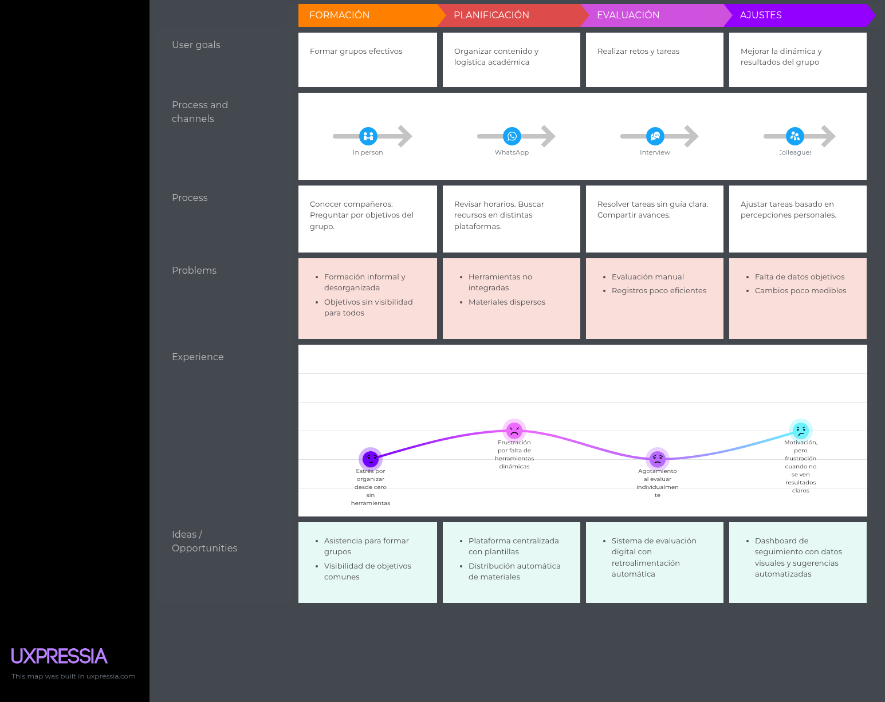

# Universidad Peruana de Ciencias Aplicadas

### **CURSO:** Desarrollo de Aplicaciones Open Source

### **NRC**: 4334

### **Profesor:** Hugo Allan Mori Paiva

### **Ingeniería de software**

## Informe de Trabajo Final

### **Nombre del startup:** APX-01

### **Nombre del producto:** EduHive

## **Integrantes**

| **Nombre**                             | **Codigo** |
| -------------------------------------- | ---------- |
| **Alejo Cardenas Jose Antonio**        | U202122484 |
| **Luquillas Asto Omar**                | U20211G641 |
| **Real Calderón Sebastián Omar**     | U20221D964 |
| **Flores Apaico Josue Antonio**        | U20201F773 |
| **Mendoza Vergara Franklin Alejandro** | U202312343 |

Abril 2025

## Registro de Versiones del Informe

| Versión | Fecha | Autor | Descripción de modificación |
| -------- | ----- | ----- | ----------------------------- |

## Project Report Collaboration Insights

## Contenido

- [Student Outcome](#student-outcome)
- [Objetivos SMART](#objetivos-smart)
- [Capítulo I](#capítulo-i)
  - [1.1. Startup Profile](#11-startup-profile)
    - [1.1.1. Descripción de la Startup](#111-descripción-de-la-startup)
    - [1.1.2. Perfiles de integrantes del equipo](#112-perfiles-de-integrantes-del-equipo)
  - [1.2. Solution Profile](#12-solution-profile)
    - [1.2.1. Antecedentes y problemática](#121-antecedentes-y-problemática)
    - [1.2.2. Lean UX Process](#122-lean-ux-process)
      - [1.2.2.1. Lean UX Problem Statements](#1221-lean-ux-problem-statements)
      - [1.2.2.2. Lean UX Assumptions](#1222-lean-ux-assumptions)
      - [1.2.2.3. Lean UX Hypothesis Statements](#1223-lean-ux-hypothesis-statements)
      - [1.2.2.4. Lean UX Canvas](#1224-lean-ux-canvas)
  - [1.3. Segmentos Objetivo](#13-segmentos-objetivo)
- [Capítulo II: Requirements Elicitation & Analysis](#capítulo-ii-requirements-elicitation--analysis)
  - [2.1. Competidores](#21-competidores)
    - [2.1.1. Análisis competitivo](#211-análisis-competitivo)
    - [2.1.2. Estrategias y tácticas frente a competidores](#212-estrategias-y-tácticas-frente-a-competidores)
  - [2.2. Entrevistas](#22-entrevistas)
    - [2.2.1. Diseño de entrevistas](#221-diseño-de-entrevistas)
    - [2.2.2. Registro de entrevistas](#222-registro-de-entrevistas)
    - [2.2.3. Análisis de entrevistas](#223-análisis-de-entrevistas)
  - [2.3. Needfinding](#23-needfinding)
    - [2.3.1. User Personas](#231-user-personas)
    - [2.3.2. User Task Matrix](#232-user-task-matrix)
    - [2.3.3. User Journey Mapping](#233-user-journey-mapping)
    - [2.3.4. Empathy Mapping](#234-empathy-mapping)
    - [2.3.5. As-is Scenario Mapping](#235-as-is-scenario-mapping)
  - [2.4. Ubiquitous Language](#24-ubiquitous-language)
- [Capítulo III: Requirements specification](#capítulo-iii-requirements-specification)
  - [3.1. To-Be Scenario Mapping](#31-to-be-scenario-mapping)
  - [3.2. User Stories](#32-user-stories)
  - [3.3. Impact Mapping](#33-impact-mapping)
  - [3.4. Product Backlog](#34-product-backlog)
- [Capítulo IV: Product Design](#capítulo-iv-product-design)
  - [4.1. Style Guidelines](#41-style-guidelines)
    - [4.1.1. General Style Guidelines](#411-general-style-guidelines)
    - [4.1.2. Web Style Guidelines](#412-web-style-guidelines)
  - [4.2. Information Architecture](#42-information-architecture)
    - [4.2.1. Organization Systems](#421-organization-systems)
    - [4.2.2 Labeling Systems](#422-labeling-systems)
    - [4.2.3 SEO Tags and Meta Tags](#423-seo-tags-and-meta-tags)
    - [4.2.4. Searching Systems](#424-searching-systems)
    - [4.2.5. Navigation Systems](#425-navigation-systems)
  - [4.3. Landing Page UI Design](#43-landing-page-ui-design)
    - [4.3.1. Landing Page Wireframe](#431-landing-page-wireframe)
    - [4.3.2. Landing Page Mock-up](#432-landing-page-mock-up)
  - [4.4. Web Applications UX/UI Design](#44-web-applications-uxui-design)
    - [4.4.1. Web Applications Wireframes](#441-web-applications-wireframes)
    - [4.4.2. Web Applications Wireflow Diagrams](#442-web-applications-wireflow-diagrams)
    - [4.4.2. Web Applications Mock-ups](#442-web-applications-mock-ups)
    - [4.4.3. Web Applications User Flow Diagrams](#443-web-applications-user-flow-diagrams)
  - [4.5. Web Applications Prototyping](#45-web-applications-prototyping)
  - [4.6. Domain-Driven Software Architecture](#46-domain-driven-software-architecture)
    - [4.6.1. Software Architecture Context Diagram](#461-software-architecture-context-diagram)
    - [4.6.2. Software Architecture Container Diagrams](#462-software-architecture-container-diagrams)
    - [4.6.3. Software Architecture Components Diagrams](#463-software-architecture-components-diagrams)
  - [4.7. Software Object-Oriented Design](#47-software-object-oriented-design)
    - [4.7.1. Class Diagrams](#471-class-diagrams)
    - [4.7.2. Class Dictionary](#472-class-dictionary)
  - [4.8. Database Design](#48-database-design)
    - [4.8.1. Database Diagram](#481-database-diagram)
- [Capítulo V: Product Implementation, Validation & Deployment](#capítulo-vi-product-implementation-validation--deployment)
  - [5.1. Software Configuration Management](#51-software-configuration-management)
    - [5.1.1. Software Development Environment Configuration](#511-software-development-environment-configuration)
    - [5.1.2. Source Code Management](#512-source-code-management)
    - [5.1.3. Source Code Style Guide & Conventions](#513-source-code-style-guide--conventions)
    - [5.1.4. Software Deployment Configuration](#514-software-deployment-configuration)
  - [5.2. Landing Page, Services & Applications Implementation](#52-landing-page-services--applications-implementation)
    - [5.2.1. Sprint 1](#521-sprint-1)
      - [5.2.1.1. Sprint Planning 1](#5211-sprint-planning-1)
      - [5.2.1.2. Aspect Leaders and Collaborators](#5212-aspect-leaders-and-collaborators)
      - [5.2.1.3. Sprint Backlog 1](#5213-sprint-backlog-1)
      - [5.2.1.4. Development Evidence for Sprint Review](#5214-development-evidence-for-sprint-review)
      - [5.2.1.5. Execution Evidence for Sprint Review](#5215-execution-evidence-for-sprint-review)
      - [5.2.1.6. Services Documentation Evidence for Sprint Review](#5216-services-documentation-evidence-for-sprint-review)
      - [5.2.1.7. Software Deployment Evidence for Sprint Review](#5217-software-deployment-evidence-for-sprint-review)
      - [5.2.1.8. Team Collaboration Insights during Sprint](#5218-team-collaboration-insights-during-sprint)
  - [5.3. Validation Interviews](#53-validation-interviews)
    - [5.3.1. Diseño de entrevistas](#531-diseño-de-entrevistas)
    - [5.3.2. Registro de entrevistas](#532-registro-de-entrevistas)
    - [5.3.3. Evaluaciones según heurísticas](#533-evaluaciones-según-heurísticas)
  - [5.4. Video About-the-Product](#54-video-about-the-product)
- [Conclusiones](#conclusiones)
- [Bibliografía](#bibliografía)
- [Anexos](#anexos)

## Student Outcome

## Objetivos SMART

## Capitulo I

### 1.1. Startup Profile

#### 1.1.1. Descripción de la Startup

#### 1.1.2. Perfiles de integrantes del equipo

### 1.2. Solution Profile

#### 1.2.1. Antecedentes y problemática

#### 1.2.2. Lean UX Process

##### 1.2.2.1. Lean UX Problem Statements

##### 1.2.2.2. Lean UX Assumptions

##### 1.2.2.3. Lean UX Hypothesis Statements

##### 1.2.2.4. Lean UX Canvas

### 1.3. Segmentos Objetivo

## Capítulo II: Requirements Elicitation & Analysis

### 2.1. Competidores

En esta sección, se presenta un análisis de los principales competidores de nuestra startup, centrado en aquellos que operan con modelos de negocio digitales similares o que, aunque no sean idénticos, ofrecen productos o servicios que se superponen parcialmente con los de EduHive. Evaluamos tanto competidores directos, que se encuentran en el mismo segmento de mercado, como competidores indirectos, que abordan áreas relacionadas como el uso de grupos de estudio, horarios, calendarios, etc.

**1. Chamilo**

**Descripción:**

Chamilo es una plataforma de aprendizaje libre y de código abierto orientada a facilitar la educación en línea. Es ligera, fácil de usar y tiene una fuerte presencia en instituciones educativas de habla hispana, especialmente en Latinoamérica.

**Principales características:**

* Gestión de cursos, tareas, exámenes y contenidos multimedia.
* Interfaz intuitiva, ideal para entornos con poca experiencia técnica.
* Herramientas colaborativas: foros, chats, wikis, encuestas.
* Seguimiento del progreso del estudiante.
* Certificaciones automáticas y calificaciones.
* Soporte multilingüe.
* Se instala fácilmente en servidores modestos.

**2. Canvas LMS**

**Descripción:**

Canvas LMS es una plataforma moderna y flexible, ampliamente utilizada en universidades de EE.UU. Tiene un enfoque centrado en la experiencia de usuario y permite integraciones con otras herramientas educativas.

**Principales características:**

* Gestión de cursos, tareas, evaluaciones y rúbricas.
* Integración con videollamadas, Google Docs, etc.
* Sistema de calendario y notificaciones.
* Interfaz moderna y personalizable.
* Alta escalabilidad, aunque la versión completa es de pago (Open Source cubre lo esencial).

**3. Moodle**

**Descripción:**

Moodle es una de las plataformas LMS más populares del mundo. Se destaca por su extensibilidad a través de plugins y su amplia comunidad de desarrolladores. Utilizada por universidades, escuelas y empresas.

**Principales características:**

* Creación de cursos, cuestionarios, tareas, foros, wikis y más.
* Sistema de roles y permisos muy detallado.
* Seguimiento avanzado del progreso del alumno.
* Interfaz personalizable con miles de plugins.
* Integración con herramientas externas y videoconferencias (BigBlueButton, Zoom).
* Soporte para gamificación (medallas, rankings, niveles).
* Multiplataforma y multilingüe.

**4. Open edX**

**Descripción:**

Desarrollado por Harvard y el MIT, Open edX es una plataforma robusta para cursos en línea tipo MOOC. Aunque más compleja de implementar, es ideal para proyectos educativos a gran escala.

**Principales características:**

* Creación de cursos interactivos con vídeos, exámenes, y tareas.
* Soporte para cursos auto-dirigidos o con fechas definidas.
* Análisis avanzados del aprendizaje.
* Herramientas de colaboración como foros y wikis.
* Compatible con gamificación y credenciales digitales.
* Escalable para miles de usuarios concurrentes.

#### 2.1.1. Análisis competitivo

<table> 
  <tr>
    <th colspan="6"> Competitive Analysis Landscape </th>
  </tr>
  <tr>
    <td colspan="2" rowspan="2"> ¿Por qué llevar acabo este análisis? </td>
    <td colspan="4"> Pregunta </td>
  </tr>
  <tr>
    <td colspan="4"> Deberíamos llevar a cabo este análisis para conocer el entorno, la competencia, tomar decisiones de desarrollo y construir nuestra propuesta de valor. </td>
  </tr>
  <tr>
    <td colspan="2"> Productos </td>
    <td style="text-align: center;"> 
EduHive
  </td>
    <td style="text-align: center;"> 
Chamilo
  </td>
    <td style="text-align: center;"> 
Canvas
  </td>
    <td style="text-align: center;"> 
Moodle
  </td>
  </tr>
  <tr>
    <td rowspan="2">Perfil</td>
    <td>Overview</td>
    <td>Plataforma gamificada para conectar a estudiantes y profesores mediante gestión de retos, tareas y grupos de estudio colaborativos.</td>
    <td>Plataforma educativa open source ligera y sencilla para crear y gestionar cursos virtuales con enfoque en colaboración.</td>
    <td>LMS moderno y escalable, enfocado en la experiencia de usuario y la integración con herramientas de terceros.</td>
    <td>LMS ampliamente utilizado, muy configurable, con comunidad activa y enfoque en educación formal y continua.</td>
  </tr>
  <tr>
    <td>Ventaja competitiva ¿Qué valor ofrece a los clientes? </td>
    <td>Gamificación integrada, conexión directa estudiante-docente, interfaz moderna, enfoque colaborativo y motivacional.</td>
    <td>Facilidad de uso, bajo consumo de recursos, ideal para instituciones pequeñas/medianas.</td>
    <td>Interfaz intuitiva, integración robusta (API, LTI), apps móviles, experiencia moderna.</td>
    <td>Extensibilidad, miles de plugins, comunidad global, adaptabilidad a distintos niveles educativos.</td>
  </tr>
  <tr>
    <td rowspan="2">Perfil de Marketing</td>
    <td> Mercado Objetivo </td>
    <td>Estudiantes y profesores universitarios en Perú; instituciones que buscan digitalizar su enseñanza con una experiencia atractiva.</td>
    <td>Centros educativos de habla hispana, especialmente de educación básica y media.</td>
    <td>Universidades y centros educativos grandes en países desarrollados; instituciones con foco en experiencia digital.</td>
    <td>Universidades, colegios, gobiernos y empresas de todo el mundo; adaptable a distintas necesidades educativas.</td>
  </tr>
  <tr>
    <td> Estrategias de Marketing </td>
    <td>Generar alianzas con universidades y redes estudiantiles</td>
    <td>Promoción por su facilidad de implementación y uso; comunidad y eventos educativos.</td>
    <td>Campañas institucionales, participación en conferencias, marketing directo a universidades.</td>
    <td>Distribución vía comunidad, asociaciones educativas, y marketing institucional.</td>
  </tr>
  <tr>
    <td rowspan="3">Perfil de Producto</td>
    <td> Productos & Servicios </td>
    <td>Gestión de grupos, retos, tareas, horarios; perfiles docentes; gamificación; métricas de progreso.</td>
    <td>Cursos virtuales, tareas, exámenes, seguimiento, colaboración básica.</td>
    <td>Gestión de cursos, tareas, integración de apps externas, mobile apps, calendario académico.</td>
    <td>Cursos, exámenes, plugins avanzados, aprendizaje adaptativo, integraciones multimedia.</td>
  </tr>
  <tr>
    <td> Precios & Costos</td>
    <td>Modelo gratuito para estudiantes, versión premium de 7 dolares para brindar soporte o funcionalidades personalizadas.</td>
    <td>Completamente gratuito (open source); costos asociados a servidores/soporte.</td>
    <td>Open source con versión gratuita; versión cloud/enterprise con costo.</td>
    <td>Gratuito (open source); servicios premium disponibles con MoodleCloud o partners.</td>
  </tr>
  <tr>
    <td> Canales de distribución </td>
    <td>Web oficial, convenios con universidades</td>
    <td>Descarga directa desde web.</td>
    <td>GitHub, partners educativos, sitio oficial (Canvas Free for Teachers).</td>
    <td>Web oficial y empresas proveedoras autorizadas.</td>
  </tr>
  <tr>
    <td rowspan="5">Análisis SWOT</td>
    <td> Fortalezas </td>
    <td>Innovación, gamificación nativa, enfoque en experiencia estudiantil, motivación académica.</td>
    <td>Ligero, fácil de usar y buen rendimiento en servidores básicos.</td>
    <td>Moderno, escalable, apps móviles, excelente UI/UX, alta compatibilidad.</td>
    <td>Altamente configurable, comunidad enorme, muy probado a nivel global.</td>
  </tr>
  <tr>
    <td> Debilidades</td>
    <td>Poca presencia en el mercado, requiere validación institucional.</td>
    <td>Menos funciones avanzadas comparado con otros LMS, interfaz menos moderna.</td>
    <td>Complejo de instalar, depende de servicios cloud si se desea escalar rápido.</td>
    <td>Puede ser complejo para usuarios nuevos, requiere personal técnico para mantener.</td>
  </tr>
  <tr>
    <td> Oportunidades</td>
    <td>Expansión en universidades peruanas, integración con apps educativas, escalamiento regional.</td>
    <td>Mejorar diseño, expandir funciones modernas para captar nuevos usuarios.</td>
    <td>Mayor adopción en América Latina, alianzas con plataformas edtech.</td>
    <td>Integración con IA y nuevas tecnologías educativas, adaptación a educación híbrida.</td>
  </tr>
  <tr>
    <td> Amenazas</td>
    <td>Resistencia al cambio por parte de instituciones tradicionales.</td>
    <td>Limitado crecimiento frente a plataformas más modernas.</td>
    <td>Dependencia de actualizaciones constantes, competencia con Moodle y Blackboard.</td>
    <td>Riesgo de sobrecarga por su complejidad; posible saturación de mercado LMS.</td>
  </tr>
</table>

#### 2.1.2. Estrategias y tácticas frente a competidores

**Frente a Chamilo**

Estrategias:

* **Diferenciación por experiencia de usuario (UX/UI)**: Mientras Chamilo tiene una interfaz funcional pero básica, apostaremos por una plataforma más intuitiva y visualmente atractiva.
* **Estrategia de comunidad activa**: Aprovechar la baja visibilidad de la comunidad de Chamilo para formar una comunidad más activa y comprometida en nuestra plataforma (eventos).

Tácticas:

* Realizar pruebas de usabilidad frecuentes para optimizar la interfaz.
* Ofrecer documentación amigable y soporte proactivo, donde Chamilo es más limitado.

---

**Frente a Canvas**

Estrategias:

* **Penetración en mercados con menos recursos**: Canvas es fuerte en instituciones grandes, pero tu startup puede enfocarse en medianas y pequeñas instituciones educativas.
* **Agilidad e innovación en funciones**: Aprovecha que Canvas, al ser robusto, puede ser más lento en adoptar cambios o innovaciones.

Tácticas:

* Ofrecer una versión gratuita limitada pero útil para captar usuarios en etapa inicial.
* Incluir funcionalidades nuevas o innovadoras como gamificación.
* Utilizar canales alternativos (influencers edtech, redes locales) para captar usuarios donde Canvas no llega fácilmente.

---

**Frente a Moodle**

Estrategias:

* **Simplificación y experiencia out-of-the-box**: Moodle es muy personalizable, pero eso también lo hace complejo para usuarios no técnicos. Tu producto puede destacarse ofreciendo soluciones listas para usar.
* **Integraciones modernas y nativas**: Moodle requiere plugins adicionales para muchas funciones; puedes destacar al tener todo integrado desde el inicio.

Tácticas:

* Crear plantillas prediseñadas para diferentes tipos de cursos (educación básica, profesional, corporativa).
* Incluir soporte técnico especializado para evitar que los usuarios dependan de técnicos propios como en Moodle.

### 2.2. Entrevistas

#### 2.2.1. Diseño de entrevistas

**Segmento Objetivo 1: Estudiantes Universitarios**

**Preguntas principales:**

1. ¿Podrías contarme un poco sobre ti? (edad, carrera, lugar de residencia y ocupacion)
2. ¿Cómo organizas actualmente tus tareas, horarios y trabajos en grupo?
3. ¿Qué herramientas digitales utilizas con más frecuencia para estudiar o coordinar con tu equipo?
4. ¿Qué tan fácil o difícil es para ti mantenerte motivado/a durante el ciclo académico?
5. ¿Qué valoras más en una plataforma educativa o de gestión del aprendizaje?
6. ¿Qué te parecería si se añadieran retos o elementos gamificados a tus cursos?

**Preguntas complementarias:**

7. ¿Utilizas más el celular, la laptop o una tablet para estudiar?
8. ¿Has usado plataformas como Moodle, Canvas u otras? ¿Qué te gustó o no te gustó?
9. ¿Qué tan importante es para ti recibir reconocimientos o insignias por tus logros?
10. ¿Qué redes sociales o canales digitales usas más para temas académicos?

**Segmento Objetivo 2: Profesores Universitarios**

**Preguntas principales:**

1. ¿Podría contarme un poco sobre usted? (edad, distrito de residencia y ocupacion)
2. ¿Qué herramientas digitales utiliza actualmente para gestionar sus clases?
3. ¿Qué aspectos de su trabajo le consumen más tiempo fuera del aula?
4. ¿Cómo monitorea actualmente el avance de sus estudiantes?
5. ¿Qué valoraría más en una plataforma educativa para apoyar su enseñanza?
6. ¿Qué tipo de actividades interactivas suele aplicar o le gustaría aplicar en clase?
7. ¿Qué tan dispuesto estaría a incorporar retos o elementos gamificados para motivar a sus alumnos?

**Preguntas complementarias:**

8. ¿Prefiere trabajar desde laptop, PC o tablet?
9. ¿Qué tan importante es para usted tener estadísticas o datos visuales sobre el desempeño del grupo?
10. ¿Qué otros canales (correo, redes, WhatsApp, campus virtual) usa para comunicarse con sus alumnos?

#### 2.2.2. Registro de entrevistas

*Segmento Estudiantes Universitarios:*

- *Entrevista 1*
  - Nombre: Sebastián
  - Apellidos: Pacheco Astiguetta
  - Edad: 22 Años
  - Distrito: San Miguel

- Inicio: 0:23
- Duración: 4:46

URL: [Link de la Entrevista](https://drive.google.com/file/d/1O7KD7yPBEEN0ZW6fmfPgLXTRWlm64wF5/view?usp=sharing)

- Resumen de la entrevista:

  - La entrevista con Sebastián Pacheco nos indica principalmente la dificultad que tienen varios estudiantes universitarios para mantenerse motivados a través del ciclo escolar. Nos comenta como la falta de participación o interacción por parte de sus compañeros puede llevar a una desmotivación. También nos comenta que aprecia que una aplicación dedicada al estudio tenga una funcionalidad de notificaciones, que le permitan recordarse a si mismo las tareas pendientes. Por último, Sebastián expresa una opinión positiva hacia la idea de un sistema gamificado que involucre medallas o premios para mantener la motivación en los proyectos.
- *Entrevista 2*

  - Nombre: Luis
  - Apellidos: Alejo Cárdenas
  - Edad: 22 Años
  - Distrito: San Martin de Porres
  - Inicio de la entrevista: 0:30
  - Duracion: 03:54

URL: [Entrevista Luis](https://drive.google.com/file/d/1BhuX4fWP7TAfVWXeDaHPoxkAYatOYrYv/view?usp=sharing)

- Resumen de la entrevista:

  - La entrevista con Luis nos indica principalmente tiene la dificultad de organizar su tiempo con sus horarios siendo estudiante y practicante.Asi mismo, usa herramientas como Google calendar, Trello y Notion para agendar clases, definir reuniones, seguir el profeso de sus tareas,etc. Nos comenta que usa googlemet y discord para reuniones, Notion para apuntes y GitHub para el codigo. También nos comenta que su motivacion se ve mermada conforme avanza el ciclo,ya que es mas dificil tener una buena organizacion con mas tareas. Ademas, busca un app organizada y centralizada priorizando la comunicacion. Por otro lado, considera que la gamificacion haria mucho mas interesante los cursos o temas. Por ultimo, usa bastante Whatsapp y Discord para temas academicos, pues le permiten una mayor libertad, comodidad y simplicidad mediante sus interfaces.
- *Entrevista 3*

  - Nombre: Jhon Alexander
  - Apellidos: Chuchon
  - Edad: 19 años
  - Distrito: San Martin de Porres
  - Inicio de la entrevista: 0:10
  - Duración: 07:30

URL: [Link de la Entrevista](https://drive.google.com/file/d/13wdEr0jYvA2IRAnuAReC42t7sB5QRqY7/view?usp=drive_link)

- Resumen de la entrevista:
  - La entrevista con Jhon resalta la importancia de que los estudiantes universitarios se mantengan comunicados, organizados y motivados. Él menciona que valora las plataformas que están bien estructuradas y que ofrecen diversas herramientas integradas en un solo lugar. Además, considera que un sistema gamificado sería útil, ya que fomentaría la competitividad, la motivación por superarse y una mayor participación entre los estudiantes. Finalmente, destaca la utilidad de poder visualizar fácilmente las fechas límite de tareas o pendientes, ya que es común que los estudiantes las olviden.

*Segmento Profesores Universitarios:*

- Entrevista 1

  - Nombre: Jose Alejandro
  - Apellidos: Marchena Chauca
  - Edad: 23 Años
  - Distrito: -
  - Inicio de la entrevista: -
  - Duración: -

URL: [Link de la Entrevista](https://drive.google.com/file/d/1YY7Z6qGQi_AiX7WK-ms3v26tmmknqYqK/view?usp=drive_link)

- Resumen de la entrevista:

  - Durante la entrevista, el docente compartió su experiencia como profesor en un instituto, destacando las limitaciones que enfrentaba en su labor diaria. A pesar de que recibía material por parte de la institución, este resultaba insuficiente y carecía de elementos interactivos que facilitaran el aprendizaje de sus alumnos. Además, comentó que los canales de comunicación eran poco eficientes, ya que solían limitarse a mensajes por WhatsApp o correos electrónicos, lo que dificultaba un acompañamiento más cercano y organizado.
  - Al presentarle la plataforma educativa, su interés fue inmediato. Señaló que le ofrecía precisamente las herramientas que le hubiera gustado tener en su etapa docente. Le llamó la atención la posibilidad de interactuar con sus estudiantes de manera más dinámica, ya sea enviando horarios, proponiendo retos personalizados o haciendo seguimiento al progreso individual de cada alumno. Valoró especialmente la función de análisis del rendimiento, ya que permite identificar en qué temas destaca cada estudiante, lo que facilitaría una enseñanza más personalizada y efectiva.
- Entrevista 2

  - Nombre: Melina Micaela
  - Apellidos: Orderique Castro
  - Edad: 22 Años
  - Distrito: -
  - Inicio de la entrevista: -
  - Duración: -

URL: [Link de la Entrevista](https://drive.google.com/file/d/1ImXhOUmLZpevvlPW1oYm_Y7A9z5AXstp/view?usp=drive_link)

- Resumen de la entrevista:

  - Durante la entrevista, la docente compartió su experiencia previa en el ámbito educativo, destacando que había utilizado diversos recursos para apoyar el aprendizaje de sus alumnos, como una pizarra interactiva y juegos didácticos, entre ellos el popular "pupiletras", con el objetivo de captar su atención de manera lúdica.
  - Sin embargo, mencionó que enfrentaba ciertas limitaciones, especialmente en lo que respecta a la participación activa de los estudiantes. Aunque deseaba que ellos pudieran interactuar directamente en la pizarra durante sus explicaciones, las herramientas disponibles no lo permitían. Además, señaló que la comunicación y organización fuera del aula resultaban poco prácticas, ya que debía enviar horarios o comunicados a través de WhatsApp o correos electrónicos. También comentó que no contaba con una plataforma donde pudiera centralizar actividades, tareas o avisos, lo que la obligaba a anunciar todo exclusivamente durante las clases presenciales.

**Entrevista 3**

- Nombre: Ariana
- Apellidos: Castilla
- Edad: 24 Años
- Distrito: La Victoria
- Inicio de la entrevista: 0:03
- Duracion: 06:14

URL: https://youtu.be/QTE_TH3pnVc

- Resumen de la entrevista:

  - La entrevista con Ariana nos cuenta que, como profesora de idiomas, actualmente usa aplicaciones como Canva, materiales de libros en la red y videos de Youtube, además del uso de la IA para preparar fichas para resolver. Lo que más busca en una aplicación educativa es que se realice un seguimiento al progreso de los alumnos, para saber que partes se le complica. Además, como actividades interactivas destaca el uso de exposiciones y ve como una buena idea el uso de herramientas gamificadas y un sistema de contactos directos con el alumno para mejorar el aprendizaje.

#### 2.2.3. Análisis de entrevistas

**Análisis Segmento 1**: Estudiantes Universitarios

La entrevista con estudiantes universitarios destaca una diversa cantidad de problemas con los que lidian en su vida académica, tales como la falta de organización, la desmotivación y la falta de comunicación.

La mayoría de ellos resalta que una buena aplicación educativa debería contar con un sistema de notificaciones y una correcta organización para ayudar a los estudiantes menos hábiles. Además, todos acordaron que un sistema de gamificación con medallas y premios sería una gran idea que haría las clases más interesantes y motivarían más a los alumnos

Los estudiantes están enfocados en mejorar su situación académica con herramientas útiles e innovadores que busquen sacar la mayor productividad de cada uno de ellos.

**Análisis Segmento 2**: Profesores Universitarios

La entrevista con profesores revela los distintos desafíos con los que luchan para llevar a cabo sus clases, como una comunicación limitada, falta de materiales y dificultad en el seguimiento del progreso del alumno.

Los docentes destacaron el uso de una plataforma capaz de contar con diversas funciones que solucionarían sus problemas, tales como un sistema de notificaciones, un seguimiento del alumno y herramientas lúdicas para captar la atención de este. Concordaron que todas estas funciones mejorarían y facilitaría considerablemente sus trabajos, además de que brindaría un gran apoyo a todo tipo de estudiantes que tuviesen problemas en este ámbito.

### 2.3. Needfinding

#### 2.3.1. User Personas

A continuación, presentamos los User Persona correspondientes a cada segmento objetivo, basados en las características de sus usuarios ideales.

**Segmento 1: Estudiantes Universitarios**

**Segmento 2: Profesores Universitarios**

#### 2.3.2. User Task Matrix

**Segmento 1: Estudiantes Universitarios**

<table  cellspacing="0" border="1">
  <thead>
    <tr>
      <th>Tarea (Task)</th>
      <th>Frecuencia</th>
      <th>Importancia</th>
    </tr>
  </thead>
  <tbody>
    <tr>
      <td>Revisar los miembros y objetivo del grupo de estudio al que pertenece</td>
      <td>Baja</td>
      <td>Alta</td>
    </tr>
    <tr>
      <td>Revisar el horario y organización del grupo</td>
      <td>Media</td>
      <td>Alta</td>
    </tr>
    <tr>
      <td>Acceder y consultar materiales académicos subidos por el profesor</td>
      <td>Media</td>
      <td>Media</td>
    </tr>
    <tr>
      <td>Resolver retos académicos planteados por el profesor</td>
      <td>Alta</td>
      <td>Alta</td>
    </tr>
    <tr>
      <td>Revisar el progreso personal dentro del grupo</td>
      <td>Baja</td>
      <td>Media</td>
    </tr>
    <tr>
      <td>Recibir y analizar feedback de actividades realizadas</td>
      <td>Media</td>
      <td>Media</td>
    </tr>
    <tr>
      <td>Ajustar su ritmo o estrategia de estudio según feedback y resultados</td>
      <td>Media</td>
      <td>Alta</td>
    </tr>
  </tbody>
</table>

**Segmento 2: Profesores Universitarios**

<table  cellpadding="8" cellspacing="0">
  <thead>
    <tr>
      <th>Tarea (Task)</th>
      <th>Frecuencia</th>
      <th>Importancia</th>
    </tr>
  </thead>
  <tbody>
    <tr>
      <td>Gestionar los miembros y definir el objetivo del grupo de estudio</td>
      <td>Baja</td>
      <td>Alta</td>
    </tr>
    <tr>
      <td>Crear el grupo de estudio y establecer su horario</td>
      <td>Media</td>
      <td>Alta</td>
    </tr>
    <tr>
      <td>Subir y actualizar materiales académicos (lecturas, videos, recursos)</td>
      <td>Media</td>
      <td>Media</td>
    </tr>
    <tr>
      <td>Crear y configurar retos académicos para el grupo</td>
      <td>Alta</td>
      <td>Media</td>
    </tr>
    <tr>
      <td>Monitorear el progreso y participación de los estudiantes</td>
      <td>Alta</td>
      <td>Media</td>
    </tr>
    <tr>
      <td>Ajustar la dificultad o el enfoque de los retos según el avance del grupo</td>
      <td>Media</td>
      <td>Alta</td>
    </tr>
    <tr>
      <td>Revisar y dar feedback sobre actividades realizadas</td>
      <td>Media</td>
      <td>Alta</td>
    </tr>
  </tbody>
</table>

#### 2.3.3. User Journey Mapping

* **Estudiantes Universitarios**

* **Profesores Universitarios**

#### 2.3.4. Empathy Mapping

**Segmento 1: Estudiantes Universitarios**

**Segmento 2: Profesores Universitarios**

#### 2.3.5. As-is Scenario Mapping

**Segmento 1: Estudiantes Universitarios**

**Segmento 2: Profesores Universitarios**

### 2.4. Ubiquitous Language

<table cellpadding="8" cellspacing="0">
  <thead>
    <tr>
      <th colspan="3"><strong>Ubiquitous Language</strong></th>
    </tr>
    <tr>
      <th><strong>Término en inglés</strong></th>
      <th><strong>Término en español</strong></th>
      <th><strong>Descripción</strong></th>
    </tr>
  </thead>
  <tbody>
    <tr>
      <td>Study Group</td>
      <td>Grupo de Estudio</td>
      <td>Un grupo conformado por estudiantes que colaboran para estudiar y resolver retos académicos. Se define un objetivo común y una estructura de trabajo para su éxito.</td>
    </tr>
    <tr>
      <td>Task</td>
      <td>Tarea</td>
      <td>Actividad específica asignada a un estudiante o grupo, generalmente con plazos o metas claras.</td>
    </tr>
    <tr>
      <td>Academic Challenge</td>
      <td>Reto Académico</td>
      <td>Actividad educativa diseñada por el profesor para evaluar y motivar el aprendizaje de los estudiantes. Incluye tareas prácticas o de resolución de problemas.</td>
    </tr>
    <tr>
      <td>Group Objective</td>
      <td>Objetivo del Grupo</td>
      <td>Meta clara definida para el grupo de estudio, relacionada con el tema de estudio o el resultado esperado de su trabajo colaborativo.</td>
    </tr>
    <tr>
      <td>Schedule</td>
      <td>Horario</td>
      <td>La planificación temporal de actividades del grupo, como las sesiones de estudio o la entrega de tareas.</td>
    </tr>
    <tr>
      <td>Feedback</td>
      <td>Retroalimentación</td>
      <td>Comentarios y observaciones proporcionados por el profesor o compañeros, con el fin de mejorar el rendimiento de los estudiantes.</td>
    </tr>
    <tr>
      <td>Progress Tracking</td>
      <td>Seguimiento del Progreso</td>
      <td>Método de monitoreo del avance individual o grupal, utilizado por los profesores para evaluar la participación y el desempeño académico.</td>
    </tr>
    <tr>
      <td>Motivation</td>
      <td>Motivación</td>
      <td>Factor que impulsa a los estudiantes a participar activamente, basado en incentivos como los sistemas de puntuación o logros.</td>
    </tr>
    <tr>
      <td>Learning Materials</td>
      <td>Materiales de Aprendizaje</td>
      <td>Recursos académicos proporcionados por el profesor, como lecturas, videos y ejercicios, para apoyar el proceso de aprendizaje.</td>
    </tr>
    <tr>
      <td>Study Session</td>
      <td>Sesión de Estudio</td>
      <td>Encuentro o periodo de tiempo dedicado a trabajar en conjunto sobre materiales de estudio o tareas académicas.</td>
    </tr>
    <tr>
      <td>Student Profile</td>
      <td>Perfil del Estudiante</td>
      <td>Información personal y académica de un estudiante, como sus logros, metas, y desempeño dentro de un grupo.</td>
    </tr>
    <tr>
      <td>Instructor Profile</td>
      <td>Perfil del Profesor</td>
      <td>Información relacionada con el profesor, sus especializaciones, horarios de atención y métodos de contacto.</td>
    </tr>
    <tr>
      <td>Analytics</td>
      <td>Análisis</td>
      <td>Herramienta utilizada para interpretar y visualizar el rendimiento de los estudiantes a través de datos recopilados de sus actividades.</td>
    </tr>
    <tr>
      <td>Group Collaboration</td>
      <td>Colaboración en Grupo</td>
      <td>Trabajo conjunto de los miembros del grupo para alcanzar un objetivo común. Incluye la comunicación y cooperación entre los estudiantes.</td>
    </tr>
    <tr>
      <td>Achievement System</td>
      <td>Sistema de Logros</td>
      <td>Sistema diseñado para reconocer el rendimiento y éxito de los estudiantes mediante puntos, medallas o certificados, fomentando la competitividad sana.</td>
    </tr>
  </tbody>
</table>

## Capítulo III: Requirements specification

### 3.1. To-Be Scenario Mapping

### 3.2. User Stories

### 3.3. Impact Mapping

### 3.4. Product Backlog

## Capítulo IV: Product Design

### 4.1. Style Guidelines

#### 4.1.1. General Style Guidelines

#### 4.1.2. Web Style Guidelines

### 4.2. Information Architecture

#### 4.2.1. Organization Systems

#### 4.2.2 Labeling Systems

#### 4.2.3 SEO Tags and Meta Tags

#### 4.2.4. Searching Systems

#### 4.2.5. Navigation Systems

### 4.3.  Landing Page UI Design.

#### 4.3.1. Landing Page Wireframe.

#### 4.3.2. Landing Page Mock-up.

### 4.4.  Web Applications UX/UI Design.

#### 4.4.1. Web Applications Wireframes

#### 4.4.2. Web Applications Wireflow Diagrams

#### 4.4.2. Web Applications Mock-ups

#### 4.4.3. Web Applications User Flow Diagrams

### 4.5.  Web Applications Prototyping

### 4.6.  Domain-Driven Software Architecture

#### 4.6.1. Software Architecture Context Diagram

#### 4.6.2. Software Architecture Container Diagrams

#### 4.6.3. Software Architecture Components Diagrams

### 4.7.  Software Object-Oriented Design

#### 4.7.1. Class Diagrams

#### 4.7.2. Class Dictionary

### 4.8.  Database Design

#### 4.8.1. Database Diagram

## Capítulo V: Product Implementation, Validation & Deployment

### 5.1. Software Configuration Management

#### 5.1.1. Software Development Environment Configuration

#### 5.1.2. Source Code Management

#### 5.1.3. Source Code Style Guide & Conventions

#### 5.1.4. Software Deployment Configuration

### 5.2. Landing Page, Services & Applications Implementation.

#### 5.2.1. Sprint 1

##### 5.2.1.1. Sprint Planning 1

##### 5.2.1.2. Aspect Leaders and Collaborators

##### 5.2.1.3. Sprint Backlog 1

##### 5.2.1.4. Development Evidence for Sprint Review

##### 5.2.1.5. Execution Evidence for Sprint Review

##### 5.2.1.6. Services Documentation Evidence for Sprint Review

##### 5.2.1.7. Software Deployment Evidence for Sprint Review

##### 5.2.1.8. Team Collaboration Insights during Sprint

### 5.3. Validation Interviews

#### 5.3.1. Diseño de entrevistas

#### 5.3.2. Registro de entrevistas

#### 5.3.3. Evaluaciones según heurísticas

### 5.4. Video About-the-Product

## Conclusiones

## Bibliografía

## Anexos
