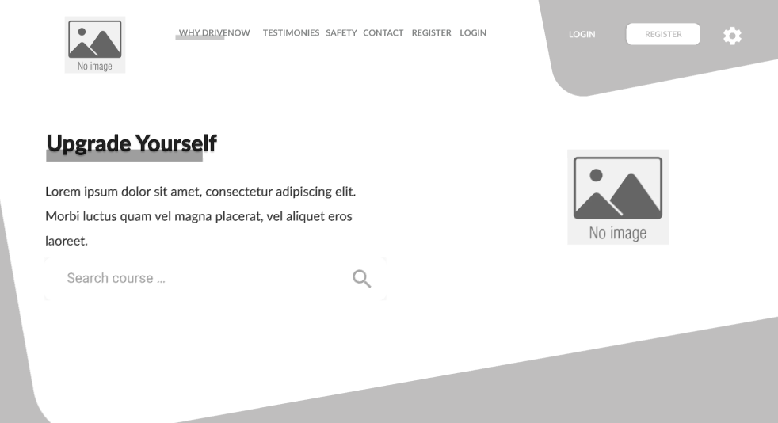
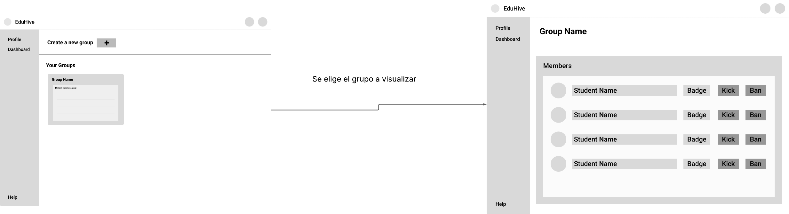
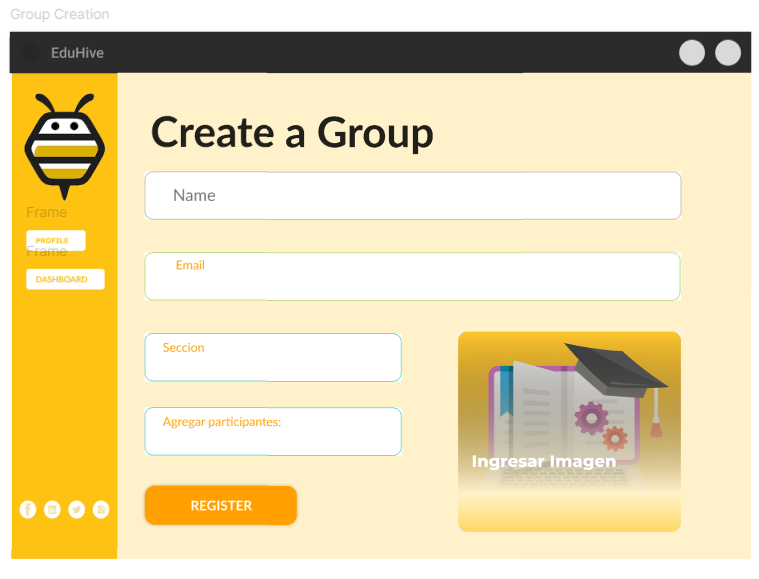
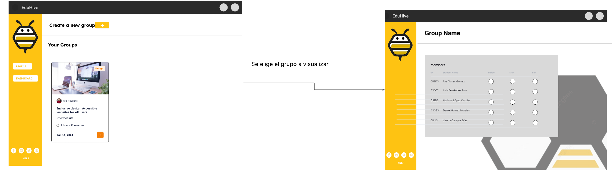
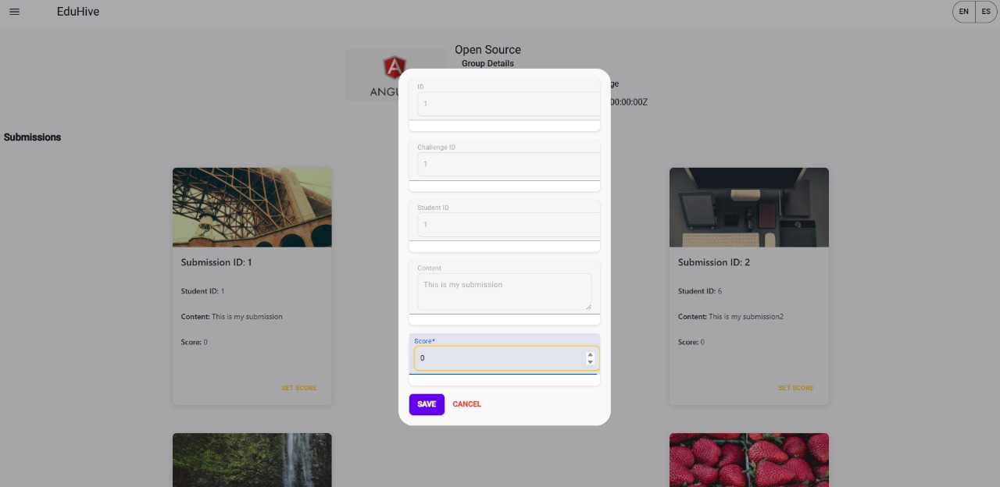
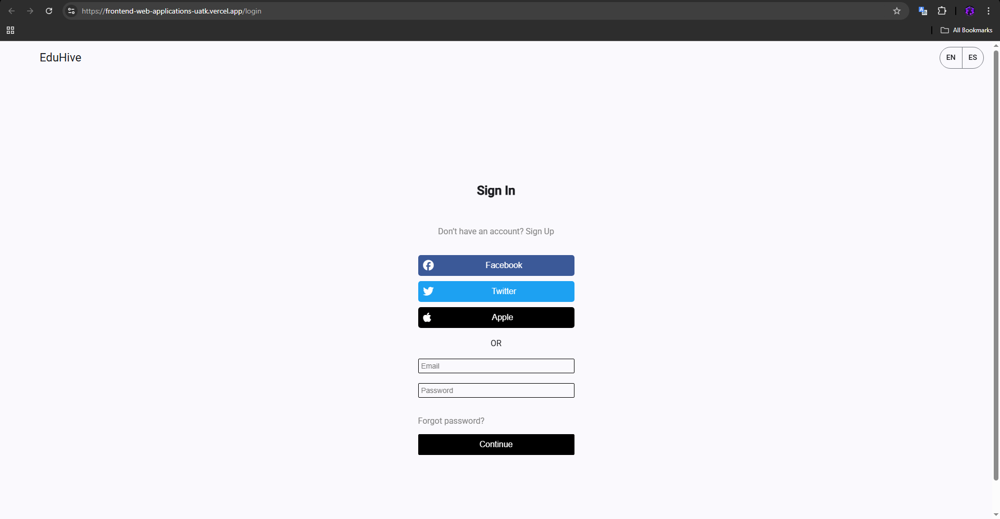

# Universidad Peruana de Ciencias Aplicadas

### **CURSO:** Desarrollo de Aplicaciones Open Source


### **NRC**: 4334

### **Profesor:** Hugo Allan Mori Paiva


### **Ingeniería de software**

## Informe de Trabajo Final


### **Nombre del startup:** APX-01

### **Nombre del producto:** EduHive


## **Integrantes**


| **Nombre**                             | **Codigo** |
| -------------------------------------- | ---------- |
| **Alejo Cardenas Jose Antonio**        | U202122484 |
| **Luquillas Asto Omar**                | U20211G641 |
| **Real Calderón Sebastián Omar**     | U20221D964 |
| **Flores Apaico Josue Antonio**        | U20201F773 |
| **Mendoza Vergara Franklin Alejandro** | U202312343 |

Abril 2025

## Registro de Versiones del Informe


<table>
  <thead>
    <tr>
      <th>Versión</th>
      <th>Fecha</th>
      <th>Autor</th>
      <th>Descripción de modificación</th>
    </tr>
  </thead>
  <tbody>
    <tr>
      <td>0.1</td>
      <td>2025-04-14</td>
      <td>Real Calderón Sebastián Omar y Luquillas Asto Omar</td>
      <td>Desarrollo de los ítems: 1.1. Startup Profile 
1.1.1. Descripción de la Startup ,1.1.2. Perfiles de integrantes del equipo ,1.2. Solution Profile ,1.2.1  Antecedentes y problemática ,1.2.2 Lean UX Process. ,1.2.2.1.Lean UX Problem Statements 1.2.2.2. Lean UX Assumptions. 1.2.2.3.Lean UX Hypothesis Statements 1.2.2.4.Lean UX Canvas 1.3.Segmentos objetivo 
 </td>
    </tr>
    <tr>
      <td>0.2</td>
      <td>2025-04-17</td>
      <td>Alejo Cardenas Jose Antonio, Flores Apaico Josue Antonio y Mendoza Vergara Franklin Alejandro</td>
      <td>Desarrollo de los ítems: 2.1. Competidores, 2.1.1. Análisis competitivo, 2.1.2. Estrategias y tácticas frente a competidores, 2.2. Entrevistas, 2.2.1. Diseño de entrevistas, 2.2.2. Registro de entrevistas, 2.2.3. Análisis de entrevistas, 2.3. Needfinding, 2.3.1. User Personas, 2.3.2. User Task Matrix, 2.3.3. User Journey Mapping, 2.3.4. Empathy Mapping, 2.3.5. As-is Scenario Mapping, 2.4. Ubiquitous Language. </td>
    </tr>
    <tr>
      <td>0.3</td>
      <td>2025-04-21</td>
      <td>Alejo Cardenas Jose Antonio y Real Calderón Sebastián Omar </td>
      <td>Desarrollo de los ítems: 3.1.To-Be Scenario Mapping, 3.2.Avance de User Stories (12 user stories), 3.3. Impact Mapping y 3.4. Product Backlog. </td>
    </tr>
    <tr>
      <td>0.4</td>
      <td>2025-04-24</td>
      <td>Real Calderón Sebastián Omar, Flores Apaico Josue Antonio, Mendoza Vergara Franklin Alejandro y Luquillas Asto Omar </td>
      <td>Desarrollo de los ítems: 3.2.User Stories 4.1. Style Guidelines, 4.1.1. General Style Guidelines, 4.1.2. Web Style Guidelines, 4.2. Information Architecture, 4.2.1. Organization Systems, 4.2.2. Labeling Systems, 4.2.3. SEO Tags and Meta Tags, 4.2.4. Searching Systems, 4.2.5. Navigation Systems, 4.3. Landing Page UI Design, 4.3.1. Landing Page Wireframe, 4.3.2. Landing Page Mock-up, 4.4. Web Applications UX/UI Design, 4.4.1. Web Applications Wireframes, 4.4.2. Web Applications Wireflow Diagrams, 4.4.3. Web Applications Mock-ups, 4.4.4. Web Applications User Flow Diagrams, 4.5. Web Applications Prototyping, 4.6. Domain-Driven Software Architecture, 4.6.1. Software Architecture Context Diagram, 4.6.2. Software Architecture Container Diagrams, 4.6.3. Software Architecture Components Diagrams, 4.7. Software Object-Oriented Design, 4.7.1. Class Diagrams, 4.7.2. Class Dictionary, 4.8. Database Design, 4.8.1. Database Diagram.  </td>
    </tr>
    <tr>
      <td>0.5</td>
      <td>2025-04-24</td>
      <td>Luquillas Asto Omar y Alejo Cardenas Jose Antonio</td>
      <td>Desarrollo de los ítems:  5.1. Software Configuration Management, 5.1.1. Software Development Environment Configuration, 5.1.2. Source Code Management, 5.1.3. Source Code Style Guide & Conventions, 5.1.4. Software Deployment Configuration, 5.2. Landing Page, Services & Applications Implementation, 5.2.1. Sprint 1, 5.2.1.1. Sprint Planning 1, 5.2.1.2. Aspect Leaders and Collaborators, 5.2.1.3. Sprint Backlog 1, 5.2.1.4. Development Evidence for Sprint Review, 5.2.1.5. Execution Evidence for Sprint Review, 5.2.1.6. Services Documentation Evidence for Sprint Review, 5.2.1.7. Software Deployment Evidence for Sprint Review, 5.2.1.8. Team Collaboration Insights during Sprint.  </td>
    </tr>
    <tr>
      <td>1.0</td>
      <td>2025-04-22</td>
      <td>Luquillas Asto Omar, Real Calderón Sebastián Omar y Alejo Cardenas Jose Antonio</td>
      <td>Revisión completa hasta el capitulo 5, corrección ortográfica y coherencia global del reporte.</td>
    </tr>
  </tbody>
</table>


## Project Report Collaboration Insights

|  URL de la organización del proyecto  |          URL del repositorio del reporte          |
| :-----------------------------------: | :-----------------------------------------------: |
| https://github.com/APX-01 | https://github.com/APX-01/report.git |

TP1: Todas las tareas del TP1 fueron completadas y registradas en el repositorio de Github de nuestro equipo: https://github.com/APX-01. Para el informe, cada integrante revisó y mejoró aspectos de la entrega anterior en: https://github.com/APX-01/report.git. Asimismo, el desarrollo de la landing page se trabajó en: https://github.com/APX-01/Landing-Page.git. Cabe mencionar que, con la incorporación de un nuevo miembro en el equipo, surgieron modificaciones en la landing page, por lo que se incluyen capturas de los commits de los últimos dos meses.

<br>**Vista de commits: Report:**  


## Contenido

- [Student Outcome](#student-outcome)
- [Capítulo I](#capítulo-i)
  - [1.1. Startup Profile](#11-startup-profile)
    - [1.1.1. Descripción de la Startup](#111-descripción-de-la-startup)
    - [1.1.2. Perfiles de integrantes del equipo](#112-perfiles-de-integrantes-del-equipo)
  - [1.2. Solution Profile](#12-solution-profile)
    - [1.2.1. Antecedentes y problemática](#121-antecedentes-y-problemática)
    - [1.2.2. Lean UX Process](#122-lean-ux-process)
      - [1.2.2.1. Lean UX Problem Statements](#1221-lean-ux-problem-statements)
      - [1.2.2.2. Lean UX Assumptions](#1222-lean-ux-assumptions)
      - [1.2.2.3. Lean UX Hypothesis Statements](#1223-lean-ux-hypothesis-statements)
      - [1.2.2.4. Lean UX Canvas](#1224-lean-ux-canvas)
  - [1.3. Segmentos Objetivo](#13-segmentos-objetivo)
- [Capítulo II: Requirements Elicitation & Analysis](#capítulo-ii-requirements-elicitation--analysis)
  - [2.1. Competidores](#21-competidores)
    - [2.1.1. Análisis competitivo](#211-análisis-competitivo)
    - [2.1.2. Estrategias y tácticas frente a competidores](#212-estrategias-y-tácticas-frente-a-competidores)
  - [2.2. Entrevistas](#22-entrevistas)
    - [2.2.1. Diseño de entrevistas](#221-diseño-de-entrevistas)
    - [2.2.2. Registro de entrevistas](#222-registro-de-entrevistas)
    - [2.2.3. Análisis de entrevistas](#223-análisis-de-entrevistas)
  - [2.3. Needfinding](#23-needfinding)
    - [2.3.1. User Personas](#231-user-personas)
    - [2.3.2. User Task Matrix](#232-user-task-matrix)
    - [2.3.3. User Journey Mapping](#233-user-journey-mapping)
    - [2.3.4. Empathy Mapping](#234-empathy-mapping)
    - [2.3.5. As-is Scenario Mapping](#235-as-is-scenario-mapping)
  - [2.4. Ubiquitous Language](#24-ubiquitous-language)
- [Capítulo III: Requirements specification](#capítulo-iii-requirements-specification)
  - [3.1. To-Be Scenario Mapping](#31-to-be-scenario-mapping)
  - [3.2. User Stories](#32-user-stories)
  - [3.3. Impact Mapping](#33-impact-mapping)
  - [3.4. Product Backlog](#34-product-backlog)
- [Capítulo IV: Product Design](#capítulo-iv-product-design)
  - [4.1. Style Guidelines](#41-style-guidelines)
    - [4.1.1. General Style Guidelines](#411-general-style-guidelines)
    - [4.1.2. Web Style Guidelines](#412-web-style-guidelines)
  - [4.2. Information Architecture](#42-information-architecture)
    - [4.2.1. Organization Systems](#421-organization-systems)
    - [4.2.2 Labeling Systems](#422-labeling-systems)
    - [4.2.3 SEO Tags and Meta Tags](#423-seo-tags-and-meta-tags)
    - [4.2.4. Searching Systems](#424-searching-systems)
    - [4.2.5. Navigation Systems](#425-navigation-systems)
  - [4.3. Landing Page UI Design](#43-landing-page-ui-design)
    - [4.3.1. Landing Page Wireframe](#431-landing-page-wireframe)
    - [4.3.2. Landing Page Mock-up](#432-landing-page-mock-up)
  - [4.4. Web Applications UX/UI Design](#44-web-applications-uxui-design)
    - [4.4.1. Web Applications Wireframes](#441-web-applications-wireframes)
    - [4.4.2. Web Applications Wireflow Diagrams](#442-web-applications-wireflow-diagrams)
    - [4.4.2. Web Applications Mock-ups](#442-web-applications-mock-ups)
    - [4.4.3. Web Applications User Flow Diagrams](#443-web-applications-user-flow-diagrams)
  - [4.5. Web Applications Prototyping](#45-web-applications-prototyping)
  - [4.6. Domain-Driven Software Architecture](#46-domain-driven-software-architecture)
    - [4.6.1. Software Architecture Context Diagram](#461-software-architecture-context-diagram)
    - [4.6.2. Software Architecture Container Diagrams](#462-software-architecture-container-diagrams)
    - [4.6.3. Software Architecture Components Diagrams](#463-software-architecture-components-diagrams)
  - [4.7. Software Object-Oriented Design](#47-software-object-oriented-design)
    - [4.7.1. Class Diagrams](#471-class-diagrams)
    - [4.7.2. Class Dictionary](#472-class-dictionary)
  - [4.8. Database Design](#48-database-design)
    - [4.8.1. Database Diagram](#481-database-diagram)

- [Capítulo V: Product Implementation, Validation & Deployment](#capítulo-v-product-implementation-validation--deployment)

  - [5.1. Software Configuration Management](#51-software-configuration-management)
    - [5.1.1. Software Development Environment Configuration](#511-software-development-environment-configuration)
    - [5.1.2. Source Code Management](#512-source-code-management)
    - [5.1.3. Source Code Style Guide & Conventions](#513-source-code-style-guide--conventions)
    - [5.1.4. Software Deployment Configuration](#514-software-deployment-configuration)
  - [5.2. Landing Page, Services & Applications Implementation](#52-landing-page-services--applications-implementation)
    - [5.2.1. Sprint 1](#521-sprint-1)
      - [5.2.1.1. Sprint Planning 1](#5211-sprint-planning-1)
      - [5.2.1.2. Aspect Leaders and Collaborators](#5212-aspect-leaders-and-collaborators)
      - [5.2.1.3. Sprint Backlog 1](#5213-sprint-backlog-1)
      - [5.2.1.4. Development Evidence for Sprint Review](#5214-development-evidence-for-sprint-review)
      - [5.2.1.5. Execution Evidence for Sprint Review](#5215-execution-evidence-for-sprint-review)
      - [5.2.1.6. Services Documentation Evidence for Sprint Review](#5216-services-documentation-evidence-for-sprint-review)
      - [5.2.1.7. Software Deployment Evidence for Sprint Review](#5217-software-deployment-evidence-for-sprint-review)
      - [5.2.1.8. Team Collaboration Insights during Sprint](#5218-team-collaboration-insights-during-sprint)
    - [5.2.2. Sprint 2](#522-sprint-2)
      - [5.2.2.1. Sprint Planning 2](#5221-sprint-planning-2)
      - [5.2.2.2. Sprint Backlog 2](#5222-sprint-backlog-2)
      - [5.2.2.3. Development Evidence for Sprint Review.](#5223-development-evidence-for-sprint-review)
      - [5.2.2.4. Testing Suite Evidence for Sprint Review.](#5224-testing-suite-evidence-for-sprint-review)
      - [5.2.2.5. Execution Evidence for Sprint Review.](#5225-execution-evidence-for-sprint-review)
      - [5.2.2.6. Services Documentation Evidence for Sprint Review.](#5226-services-documentation-evidence-for-sprint-review)
      - [5.2.2.7. Software Deployment Evidence for Sprint Review.](#5227-software-deployment-evidence-for-sprint-review)
      - [5.2.2.8. Team Collaboration Insights during Sprint.](#5228-team-collaboration-insights-during-sprint)
  - [5.3. Validation Interviews](#53-validation-interviews)
    - [5.3.1. Diseño de entrevistas](#531-diseño-de-entrevistas)
    - [5.3.2. Registro de entrevistas](#532-registro-de-entrevistas)
    - [5.3.3. Evaluaciones según heurísticas](#533-evaluaciones-según-heurísticas)
  - [5.4. Video About-the-Product](#54-video-about-the-product)
- [Conclusiones](#conclusiones)
- [Bibliografía](#bibliografía)
- [Anexos](#anexos)

## Student Outcome

<br>

<table>
  <thead>
    <tr>
      <th style="text-align: left;">Criterio específico</th>
      <th style="text-align: left;">Acciones realizadas</th>
      <th style="text-align: left;">Conclusiones</th>
    </tr>
  </thead>
  <tbody>
    <tr>
      <td>1. Comunica oralmente con efectividad a diferentes rangos de audiencia. </td>
      <td>
Alejo Cardenas Jose Antonio-TB1:<br>
Durante el desarrollo del proyecto, fortalecí mi comunicación oral al presentar y explicar temas como el análisis de competidores, los resultados de las entrevistas, el proceso de needfinding y el uso del Ubiquitous Language. Me aseguré de adaptar mi discurso según el público, ya fuera técnico o no técnico, para que mis aportes fueran comprendidos con claridad. También participé activamente en exposiciones grupales sobre el Impact Mapping, el Product Backlog y el Software Configuration Management, así como en reuniones donde propuse ideas relacionadas con la Landing Page y la implementación de servicios, buscando siempre que mis ideas sean claras y bien estructuradas.
<br><br> 
Luquillas Asto Omar-TB1:<br>
Me encargué de presentar oralmente entregables como el Solution Profile, los resultados de las entrevistas, el To-Be Scenario Mapping y las User Stories, explicándolos con claridad a mis compañeros y profesores. En cada exposición, procuré utilizar un lenguaje técnico adecuado, pero accesible para todos. Además, durante sesiones de trabajo en equipo, expuse mi visión sobre la arquitectura orientada al dominio, el desarrollo de la Landing Page y la implementación de servicios, buscando generar consenso y asegurar una comprensión compartida de los objetivos del proyecto.
<br><br> 
Real Calderón Sebastián Omar-TB1:<br>
Contribuí con la redacción de diversos documentos como el Startup Profile, el Solution Profile y los entregables sobre los segmentos objetivo, cuidando la estructura y el lenguaje para que fueran claros y coherentes. También elaboré contenido técnico para las User Stories, el diseño de UX/UI, la arquitectura orientada a objetos y el diseño de base de datos, utilizando una redacción precisa y enfocada en que tanto técnicos como no técnicos pudieran comprender la información. Busqué siempre que mis aportes escritos comunicaran bien el propósito y el funcionamiento de cada elemento del proyecto.
<br><br>
Flores Apaico Josue Antonio-TB1:<br>
Fortalecí mi comunicación oral al exponer los resultados de las entrevistas, el análisis del needfinding y mi participación en la definición de User Stories, buscando explicar claramente mis ideas al equipo. También compartí mi propuesta para las Style Guidelines y participé activamente en las discusiones sobre la interfaz de la Landing Page, así como en sesiones de diseño de UX/UI, donde me aseguré de justificar mis decisiones y adaptar mi lenguaje según el perfil del interlocutor.
<br><br>
Mendoza Vergara Franklin Alejandro-TB1:<br>
Desarrollé mi comunicación oral participando en las exposiciones sobre los hallazgos de las entrevistas y la definición de las User Stories, donde expliqué de forma clara cómo estas se alineaban con los objetivos del proyecto. También presenté propuestas para la arquitectura de la información, utilizando ejemplos visuales y explicaciones técnicas que facilitaron el entendimiento del equipo. Mi participación en sesiones de diseño de UX/UI me permitió argumentar mis ideas de forma estructurada y accesible.<br>

<br>
Alejo Cárdenas José Antonio - TP:<br>
Durante el transcurso del proyecto, me desempeñé en tareas esenciales como la configuración del software, la creación de la Landing Page y la implementación de los servicios de la aplicación. En los espacios de revisión de sprint, presenté los avances y resultados obtenidos, explicando de manera clara cómo se integraban al cumplimiento de los objetivos del equipo. Ajusté mi forma de comunicarme según el perfil de la audiencia, ya fueran compañeros con conocimientos técnicos o profesores con una perspectiva académica.<br><br>

Flores Apaico Josue Antonio - TP:<br>
Mi rol se enfocó en diseñar la interfaz de la Landing Page y la experiencia del usuario en la aplicación web. Durante nuestras reuniones y presentaciones, compartí las razones detrás de cada elección de diseño de forma clara y visual. También expuse las evidencias del desarrollo y pruebas realizadas, comunicando los resultados de manera que tanto el equipo como los docentes pudieran comprender fácilmente los avances logrados.<br><br>

Mendoza Vergara Franklin Alejandro - TP:<br>
Participé activamente en el diseño UX/UI, además de contribuir con la elaboración de las conclusiones, la bibliografía y los anexos del proyecto. En los momentos de presentación, expliqué con claridad las decisiones relacionadas al diseño de experiencia, argumentando cómo respondían a las necesidades del usuario. Me aseguré de que los documentos estuvieran bien organizados y que el contenido fuera accesible para cualquier tipo de lector.<br><br>

Luquillas Asto Omar - TP:<br>
Fui responsable de presentar conceptos técnicos como la arquitectura orientada al dominio, así como el desarrollo de la Landing Page y los servicios de la aplicación. Durante los Sprint Reviews, compartí pruebas de implementación y ejecución, procurando que mi explicación fuera entendible tanto para miembros del equipo como para evaluadores. Me enfoqué en simplificar ideas complejas y facilitar el diálogo en todo momento.<br><br>

Real Calderón Sebastián Omar - TP:<br>
Mis aportes se centraron en el diseño de la base de datos, el desarrollo del Product Backlog y el prototipado funcional de la aplicación. En los espacios de revisión, expuse cómo se estructuraba la información y cómo se relacionaban los servicios. Presenté documentación y evidencias del trabajo técnico de forma clara, buscando que tanto los compañeros como los docentes pudieran seguir el hilo de los procesos realizados.

<br>
      </td>
      <td>
      <strong>TB1</strong><br>
        A lo largo del desarrollo del proyecto, el equipo demostró una comunicación oral efectiva al participar activamente en presentaciones, reuniones y sesiones colaborativas. Cada integrante logró adaptar su discurso según el perfil de la audiencia, ya sea en contextos técnicos con sus compañeros o en espacios académicos con docentes. Esta habilidad se evidenció en la explicación clara y argumentada de conceptos como el perfil de solución, la segmentación de usuarios, las arquitecturas propuestas y el diseño de experiencias de usuario. El equipo también destacó por su capacidad para presentar hallazgos de entrevistas y resultados de investigación de forma comprensible, lo que permitió un diálogo fluido y enriquecedor dentro del grupo. En conjunto, la comunicación oral fue clave para alinear criterios, validar decisiones y transmitir ideas de forma clara y profesional.<br><br>
        <strong>TP</strong><br>
        Durante el desarrollo de EduHive, el equipo mostró una comunicación oral clara y efectiva, adaptando sus intervenciones al público presente en cada ocasión. Ya fuera en presentaciones técnicas, reuniones internas o espacios académicos, cada integrante explicó sus aportes de forma organizada, permitiendo el entendimiento colectivo y la toma de decisiones fundamentadas. Esta capacidad de expresar ideas con claridad fue fundamental para el avance coherente y profesional del proyecto.
      </td>
    </tr>
    <tr>
      <td>2. Comunica por escrito con efectividad a diferentes rangos de audiencia. </td>
      <td>
Alejo Cardenas Jose Antonio-TB1:<br>
A lo largo del proyecto, desarrollé mis habilidades de comunicación escrita al redactar documentos como el análisis de competidores, los entregables del Product Backlog, y la documentación del Software Configuration Management. También colaboré en la redacción de secciones para la Landing Page y los reportes de Services & Applications Implementation. Además, me encargué del registro de versiones del informe y participé en la elaboración de los comentarios dentro de Project Report Collaboration Insights, donde busqué mantener una redacción clara, técnica y adaptada a diferentes tipos de lectores dentro del equipo.
<br><br>  
Luquillas Asto Omar-TB1:<br>
Tuve la responsabilidad de redactar varios entregables clave como el Solution Profile, las User Stories y partes del Product Backlog, utilizando un lenguaje preciso y bien estructurado. También escribí documentación técnica sobre la Domain-Driven Software Architecture, colaboré en el diseño de la Landing Page, y desarrollé contenidos para la sección de Services & Applications Implementation. Además, redacté avances de las Conclusiones, la Bibliografía y los Anexos, enfocándome en mantener un estilo claro, coherente y profesional que pudiera ser comprendido por diversos tipos de audiencia.
<br><br> 
Real Calderón Sebastián Omar-TB1:<br>
Durante el proyecto, participé activamente en presentaciones donde expuse el Startup Profile, el Solution Profile y los segmentos objetivo, siempre procurando que mi mensaje fuera comprensible tanto para mis compañeros como para los docentes. También colaboré en la explicación de los resultados de las entrevistas y en la creación de User Stories, lo cual me permitió comunicar con claridad cómo esas necesidades se traducían en funcionalidades. En las sesiones de diseño de UX/UI, pude expresar mis ideas visuales y funcionales, ajustando mi lenguaje a la naturaleza técnica o general del público.
<br><br>
Flores Apaico Josue Antonio-TB1:<br>
Aporté a la comunicación escrita del equipo al redactar User Stories que reflejaban de manera clara las necesidades del usuario, además de desarrollar las Style Guidelines y la documentación visual para la Landing Page UI Design. También contribuí a la elaboración del documento de Web Applications UX/UI Design, manteniendo un lenguaje visualmente descriptivo y técnico, pero accesible, con el fin de que cualquier lector pudiera comprender el propósito de los elementos diseñados y cómo se conectaban con las necesidades identificadas.
<br><br>
Mendoza Vergara Franklin Alejandro-TB1:<br>
Contribuí a la redacción de las User Stories del proyecto, redactándolas con detalle y claridad para asegurar su correcta interpretación por parte del equipo. También participé en la creación de la Information Architecture, asegurándome de organizar la información de forma lógica y comprensible. En la documentación de Web Applications UX/UI Design, redacté propuestas visuales y funcionales usando un lenguaje técnico pero accesible, garantizando que la documentación fuera útil para desarrolladores, diseñadores y docentes por igual.<br><br>


Alejo Cárdenas José Antonio - TP:<br>
Me encargué de elaborar documentos técnicos como los relacionados con Software Configuration Management, la implementación de la Landing Page y los servicios de la aplicación. En cada uno de estos entregables, cuidé que la redacción fuera clara, estructurada y entendible tanto para lectores con perfil técnico como para docentes y revisores académicos. Además, participé en la redacción de evidencias de sprint, asegurando que los procesos y resultados fueran comunicados de manera precisa y profesional.<br>

Flores Apaico Josue Antonio - TP:<br>
Contribuí a la redacción de entregables vinculados al diseño de la interfaz de la Landing Page y al diseño UX/UI general de la aplicación. Me enfoqué en que los documentos fueran visuales, coherentes y accesibles para todos los miembros del equipo. Además, redacté la evidencia de desarrollo y de pruebas (Testing Suite), explicando los procedimientos con un lenguaje técnico comprensible y detallado.<br>

Mendoza Vergara Franklin Alejandro - TP:<br>
Redacté secciones importantes del informe final, como las conclusiones, la bibliografía y los anexos, asegurándome de mantener una redacción formal, clara y alineada con los estándares académicos. También participé en la documentación de decisiones de diseño UX/UI, buscando que los entregables fueran entendidos tanto por perfiles técnicos como no técnicos, y facilitando así el análisis y evaluación del proyecto.<br>

Luquillas Asto Omar - TP:<br>
Fui responsable de la documentación escrita sobre la arquitectura orientada al dominio y la implementación de la Landing Page junto con los servicios asociados. Además, redacté entregables de despliegue de software y ejecución de sprint, organizando la información de forma clara y completa. Me aseguré de que los textos reflejaran tanto la parte técnica como el impacto funcional de las soluciones propuestas.<br>

Real Calderón Sebastián Omar - TP:<br>
Elaboré documentación sobre el diseño de base de datos, el Product Backlog y los prototipos funcionales de la aplicación. También desarrollé evidencia escrita sobre la implementación de servicios, cuidando que el contenido fuera detallado, estructurado y entendible por diferentes tipos de lectores. En cada entregable, me aseguré de transmitir con precisión el propósito, funcionamiento y resultado de cada componente técnico.<br><br>
<br>
      <td>
      <strong>TB1</strong><br>
        El equipo demostró una sólida competencia en comunicación escrita al redactar diversos apratdos del proyecto, como entrevistas, User Stories, Backlog, documentación técnica, diseño de interfaces, y partes del informe final. Cada integrante empleó un estilo claro, coherente y adaptado a diferentes audiencias, logrando que la información fuera comprensible tanto para profesionales del área técnica como para lectores con menos conocimientos especializados. La precisión en la redacción de conceptos técnicos, combinada con una adecuada organización de la información, permitió que los documentos cumplieran su función informativa, explicativa y de soporte para la toma de decisiones. Esta capacidad de comunicar de manera escrita de forma efectiva fue fundamental para mantener la coherencia del proyecto y asegurar una documentación completa, profesional y alineada con los objetivos del equipo.<br><br>
        <strong>TP</strong><br>
        El equipo demostró una competencia destacada en comunicación escrita durante el Sprint 2 al desarrollar documentos técnicos y organizativos como el Sprint Planning, el Sprint Backlog, y la asignación de líderes y colaboradores por aspecto. Asimismo, se elaboraron evidencias claras y bien estructuradas del desarrollo, ejecución, despliegue y documentación de servicios, lo cual permitió un seguimiento efectivo del avance del proyecto. Cada entregable fue redactado con precisión y adaptado a diferentes niveles de comprensión, asegurando que tanto miembros técnicos como docentes pudieran interpretar los resultados y decisiones del equipo. Esta capacidad de redactar con claridad, orden y enfoque técnico fue clave para mantener la coherencia del sprint, sustentar los avances y comunicar de manera profesional los logros alcanzados.
      </td>
    </tr>
  </tbody>
</table>


## Capitulo I

### 1.1. Startup Profile

#### 1.1.1. Descripción de la Startup

APX-01 es una startup fundada por estudiantes de la Universidad Peruana de Ciencias Aplicadas (UPC), dedicada a desarrollar soluciones tecnológicas para revolucionar la educación en Perú. Nuestro primer proyecto, EduHive, es una plataforma integral que conecta a estudiantes y profesores en un ecosistema dinámico, donde la gestión de grupos de estudio, retos académicos y tareas se simplifica y gamifica.

EduHive ofrece una experiencia integral para los estudiantes, permitiéndoles gestionar sus tareas, revisar retos académicos activos y acceder a sus horarios de clases de manera sencilla y organizada. Además, los alumnos pueden explorar los perfiles de sus profesores, conocer sus especializaciones, horarios de atención y métodos de contacto, facilitando una comunicación más fluida y efectiva. De la misma manera, los profesores pueden crear y administrar grupos de estudio en los que podrán establecer retos académicos y monitorear el progreso de sus alumnos. La plataforma también incorpora elementos de gamificación, como sistemas de puntuación y reconocimientos, para motivar el aprendizaje y fomentar la participación activa en grupos de estudio y desafíos educativos, promoviendo un ecosistema educativo dinámico, digital y accesible.

- Misión:
  "Democratizar el acceso a herramientas educativas colaborativas en Perú mediante tecnología open-source, rompiendo las barreras de la educación tradicional con soluciones gamificadas que empoderen a estudiantes y docentes por igual."
- Visión:
  "Convertirnos en el ecosistema educativo digital líder en el Perú, transformando la manera en que se aprende y enseña mediante soluciones tecnológicas orientadas a las necesidades de tanto estudiantes como docentes."

#### 1.1.2. Perfiles de integrantes del equipo

<table>
  <tr>
    <th colspan="2"> Jose Antonio Alejo Cardenas </th>
  </tr>
  <tr>
    <td>  </td>
    <td> Soy José Alejo Cárdenas, estudiante de la carrera de Ingeniería de Software del sexto ciclo. Desde pequeño he sentido facinacion por la tecnologia en general sobretodo por el funcionamiento, desarrollo y proteccion del software en el ambito de ciberseguridad. He estudiado lenguajes de programacion (javascript, python y C++), bases de datos (Microsoft SQL Server y Mongo DB) y Sistemas Operativos (Kali Linux y Windows). Asi mismo, tengo experiencia con hardware a nivel de esamblamiento de equipos y funcionamiento del mismo con sus especificaciones tecnicas. Además, mi constante comunicacion y organizacion durante cualquier trabajo grupal aportara mucho dinamismo al proyecto. Mis principales hobbies son entrenar en el gimnasio, jugar videojuegos con mis amigos y salir a conversar con estos ultimos durante algun almuerzo o cena. Para el proyecto aportare organizacion, comunicacion e inspiracion durante todo el transcurso del mismo. </td>
  </tr>
  <tr>
    <th colspan="2"> Sebastián Omar Real Calderón </th>
  </tr>
  <tr>
    <td>  </td>
    <td> Soy Sebastián Real Calderón, estudainte de Ingeniería de Software. Tengo conocimiento de diferentes lenguajes de programación, como C#, C++ y Java. Mi mayor objetivo al desarrollar software es crear una experiencia de usuario con la que los consumidores puedan sentirse satisfechos al trabajar con nuestras aplicaciones. Asimismo, aspiro a ser un buen participante al mantener una comunicación constante con mis compañeros, resolviendo problemas y apoyándo a quién lo necesite para crear un ambiente cómodo para todos. </td>
  </tr>
  <tr>
    <th colspan="2"> Omar Luquillas Asto </th>
  </tr>
  <tr>
    <td>  </td>
    <td> Soy Omar Luquillas Asto, estudiante de la carrera de Ingeniería de Software. Elegí esta carrera porque me apasiona la tecnología, el desarrollo de software y la programación. Tengo conocimientos en lenguajes de programación como C++, Python y Java. Me considero una persona investigadora, ya que me gusta aprender cosas nuevas y siempre estoy en busca de soluciones creativas e innovadoras que generen un impacto positivo en la vida de las personas. Además, valoro el trabajo en equipo, soy responsable y me comprometo a cumplir con mis tareas de manera eficiente. </td>
  </tr>
  <tr>
    <th colspan="2">Alejandro Mendoza</th>
  </tr>
  <tr>
    <td>  </td>
    <td> Mi nombre es Alejandro Mendoza y soy estudiante de la carrera de Ingeniería de Software.Actualmente tengo experiencia en C++ y Python. Estoy interesado en seguir aprendiendo sobre diferentes lenguajes de programación y en la creación de distintas aplicaciones web y móviles, por lo que intento dar todo de mí para tener buenos resultados.
    
 </td>
  </tr>
  <tr>
    <th colspan="2">Josue Flores Apaico</th>
  </tr>
  <tr>
    <td>  </td>
    <td> Soy Josue Flores es una persona creativa, perseverante y empática, con interés en áreas como la Inteligencia Artificial, ciberseguridad y ciencia de datos. Busca aplicar sus conocimientos en C++, Python, C# y Java dentro de una startup tecnológica, impulsando la innovación y la mejora continua. Cuenta con experiencia práctica en proyectos y participación en conferencias de ciberseguridad. </td>
  </tr>
</table>

### 1.2. Solution Profile

#### 1.2.1. Antecedentes y problemática

**1. What / ¿QUÉ?**
- ¿Cuál es el problema que se está presentando?

El problema es que las plataformas educativas existentes no resuelven eficientemente la gestión colaborativa de grupos de estudio en el Perú.

**2. When / ¿CUÁNDO?**
- ¿Cuándo estamos viendo el problema?

El problema se presenta durante los periodos académicos de proyectos grupales y exámenes parciales.

- ¿En qué momento del día o del proceso en cuestión?

Sucede principalmente en las semanas previas a entregas o evaluaciones.

**3. Where / ¿DÓNDE?**

- ¿Dónde estamos viendo los problemas?

Estamos viendo los problemas dentro de universidades peruanas (públicas y privadas), específicamente en cursos donde las plataformas o medios usados que requieren trabajo en equipo (ej: ingenierías).

- ¿En qué parte del proceso estamos viendo el problema?

El problema aparece en la etapa de organización y seguimiento del trabajo colaborativo, ya que las herramientas actuales no facilitan una coordinación efectiva entre los estudiantes.

**4. Who / ¿QUIÉN?**

- ¿A quién le sucede?

Este problema le sucede principalmente a los estudiantes universitarios con dificultad para organizar grupos de estudio efectivos, en docentes con carga administrativa al coordinar actividades colaborativas y en instituciones que no cuentan con métricas de participación estudiantil.

- ¿El problema está relacionado con las habilidades de las personas?

No está directamente relacionado con sus habilidades, sino con la falta de herramientas adecuadas que apoyen la colaboración horizontal entre los miembros del grupo.

**5. Why / ¿POR QUÉ?**

- ¿Por qué sucede el problema?

Porque las plataformas actuales (ej: Google Classroom) están diseñadas para una gestión unilateral entre docentes y alumnos, pero no ofrecen funciones específicas para la gestión autónoma de grupos por parte de los estudiantes.

**6. How / ¿CÓMO?**

- ¿Cómo se diferencia el problema del estado normal (óptimo)?

En un estado óptimo, los estudiantes deberían poder organizarse, asignar tareas, y comunicarse desde una misma plataforma, pero actualmente tienen que usar diferentes aplicaciones y métodos informales para hacerlo.

- ¿La tendencia en la que aparece el problema es aleatoria o sigue un patrón?

Sigue un patrón claro, ya que siempre aparece cuando se requiere colaboración entre estudiantes, especialmente en cursos que exigen trabajos en grupo o actividades evaluativas conjuntas.

**7. How Much / ¿CUÁNTO?**

- ¿Cuántos problemas se dan en un día, una semana o un mes?

Cada grupo puede enfrentar dificultades de coordinación varias veces por semana, especialmente en etapas críticas del curso.

- ¿Cuánto dinero están implicando?

Aunque no hay un gasto directo, las instituciones podrían ahorrar hasta un 30% del tiempo de gestión docente si existiera una solución automatizada que facilite el seguimiento y organización de los grupos de estudio.

#### 1.2.2. Lean UX Process

El Lean UX process es una metodología iterativa de diseño que pone al usuario en el centro del proceso, enfocándose en la colaboración continua del equipo y en ciclos cortos de trabajo. A través de investigaciones, pruebas rápidas y validación constante de ideas, se busca comprobar la validez de las ideas planteadas. A diferencia de los métodos tradicionales, este evita la documentación pesada y prioriza la retroalimentación temprana para validar o descartar hipótesis de manera ágil, siempre orientándose a satisfacer las necesidades reales de los usuarios.

##### 1.2.2.1. Lean UX Problem Statements

Nuestro servicio está diseñado para facilitar la organización académica y la colaboración entre estudiantes y profesores universitarios en un solo entorno digital. Hemos observado que los usuarios aún dependen de múltiples herramientas desconectadas (como WhatsApp, correo electrónico y agendas externas), lo que impide una gestión efectiva de tareas y grupos de estudio. Esto está causando desorganización, pérdida de tiempo y menor participación académica, afectando el rendimiento de los estudiantes y la eficiencia del trabajo docente.
¿Cómo podríamos mejorar nuestra plataforma para que los usuarios puedan coordinar sus actividades académicas de forma más eficiente, midiendo el éxito a través de una mayor participación en grupos de estudio, cumplimiento de tareas y reducción del tiempo invertido en la coordinación?

##### 1.2.2.2. Lean UX Assumptions

**User Assumptions (Suposiciones de Usuario)**

- ¿Quién es el usuario?: Los usuarios son estudiantes y profesores universitarios que buscan mejorar la organización de sus actividades académicas, productividad y la comunicación en el entorno educativo.
- ¿Dónde encaja nuestro producto en su trabajo o vida?: Nuestro producto encaja como una herramienta diaria para planificar clases, tareas, retos académicos y la gestión de grupos de estudio, facilitando la interacción constante entre estudiantes y profesores.
- ¿Qué problemas resuelve nuestro producto?: Nuestro producto resuelve problemas de desorganización, falta de comunicación efectiva, dispersión de herramientas y baja motivación por la falta de dinamismo en las actividades académicas.
- ¿Cuándo y cómo se usa nuestro producto?: Nuestro producto se utiliza antes y después de clases, para revisar tareas pendientes, crear o unirse a grupos de estudio, consultar horarios, participar en retos académicos y comunicarse directamente con los profesores o compañeros.
- ¿Qué características son importantes?: Las características importantes son la gestión de tareas, administración de grupos de estudio, perfiles detallados de profesores, sistema de retos académicos, visualización de horarios, interfaz sencilla e intuitiva.
- ¿Cómo debe verse y comportarse nuestro producto?: Nuestro producto debe tener un diseño amigable y moderno, con navegación fluida, colores que generen motivación y claridad visual, y tiempos de respuesta rápidos para no frustrar a los usuarios.

**Business Assumptions (Suposiciones de Negocio)**

- Necesidades y problemas: Creemos que las universidades necesitan herramientas que mejoren la productividad académica y la colaboración digital entre alumnos y docentes.
- Plataforma: Estas necesidades se pueden resolver mediante una aplicación web para mayor accesibilidad.
- Segmentación: Los usuarios serán estudiantes y profesores universitarios de todas las áreas académicas.
- Comportamientos: El valor principal que un usuario quiere obtener de nuestro servicio es una mayor facilidad, colaboración y disciplina en el área académica.
- Beneficios: Los usuarios obtendrán una mejora de la organización académica, aumento en la participación de los estudiantes, comunicación más fluida y mayor motivación.
- Captación de clientes: Obtendremos nuestros usuarios a través de promociones de alianzas con universidades, redes sociales, y recomendaciones de usuarios dentro de las comunidades universitarias.
- Modelos de ingresos: Al tratarse de una aplicación open source orientada al uso académico y comunitario, no se contempla un modelo de ingresos directo.
- Competencia: Nuestra competencia serán las plataformas similares en el área de educación, gestión académica y organización.
- Ventaja competitiva: Superaremos a la competencia gracias a nuestra plataforma que ofrece varias funciones en un solo lugar y que esta enfocada en la experiencia, motivación y colaboración del estudiante y del profesor universitario.

**Technical Assumptions (Suposiciones Técnicas)**

- Tecnología utilizada: Se utilizarán tecnologías web modernas para el desarrollo de la plataforma.
- Integraciones: La plataforma se integrará con un servicio externo de badges digitales para implementar elementos de gamificación.
- Escalabilidad: La aplicación será diseñada para soportar un número creciente de usuarios y datos.

**Market Assumptions (Suposiciones de Mercado)**

- Tamaño del mercado: El mercado objetivo incluye universidades, abarcando a estudiantes y docentes que buscan soluciones digitales para la organización académica.
- Competencia: Los principales competidores son otras plataformas de organización y gestión educativa.
- Tendencias: Existe un crecimiento en la digitalización de la educación y mayor preferencia por soluciones de productividad.

**Design Assumptions (Suposiciones de Diseño)**

- Interacción del usuario: La plataforma estará diseñada para una navegación sencilla, intuitiva y accesible.
- Experiencia del usuario: El enfoque estará en ofrecer una experiencia fluida y agradable, facilitando la realización de actividades sin complicaciones.
- Colores y tipografía: Los usuarios valoran el uso de una paleta de colores que transmita dinamismo y profesionalismo, junto con tipografías modernas y legibles que mejoren la experiencia visual.
- Preferencias visuales: Los usuarios prefieren un diseño visual atractivo pero limpio, que los permita concentrarse fácilmente en las funciones principales de la plataforma.
- Prototipos y pruebas: Se desarrollarán validaciones de las características principales que serán evaluados mediante pruebas de usabilidad.

##### 1.2.2.3. Lean UX Hypothesis Statements

Hypothesis Statement 01:

- Creemos que los usuarios necesitan una plataforma centralizada para gestionar actividades académicas y mejorar la comunicación.
- Sabremos que estamos en lo correcto cuando veamos una adopción activa de la herramienta dentro de grupos de estudio y recibamos comentarios positivos sobre la facilidad de organización que ofrece.

Hypothesis Statement 02:

- Creemos que la falta de integración entre herramientas actuales genera desorganización y pérdida de información importante para los estudiantes y docentes.
- Sabremos que estamos en lo correcto cuando los usuarios nos indiquen que ya no necesitan usar múltiples aplicaciones por separado y notemos una reducción en quejas relacionadas con la desorganización.

Hypothesis Statement 03:

- Creemos que una plataforma que permita crear y gestionar grupos de estudio facilitará la colaboración entre estudiantes.
- Sabremos que estamos en lo correcto cuando veamos un aumento en la creación de grupos dentro de la plataforma.

Hypothesis Statement 04:

- Creemos que la inclusión de un horario de clases dentro de la plataforma ayudará a los usuarios a organizar mejor su tiempo y visualizar de manera clara sus actividades académicas.
- Sabremos que estamos en lo correcto cuando observemos una mejora en la puntualidad de asistencia a clases y una mayor percepción de organización por parte de los usuarios.

Hypothesis Statement 05:

- Creemos que la implementación de retos académicos incentivará la participación y el compromiso de los estudiantes.
- Sabremos que estamos en lo correcto cuando veamos un aumento en la participación de actividades opcionales y retos dentro de la plataforma.

Hypothesis Statement 06:

- Creemos que una interfaz intuitiva y accesible facilitará la adopción de la plataforma por parte de los usuarios.
- Sabremos que estamos en lo correcto cuando los usuarios utilicen la aplicación con fluidez y la tasa de abandono inicial sea baja.

Hypothesis Statement 07:

- Creemos que permitir a los profesores monitorear el progreso de sus estudiantes mejorará la efectividad del seguimiento académico.
- Sabremos que estamos en lo correcto cuando los profesores utilicen frecuentemente las funciones de seguimiento y den feedback positivo.

Hypothesis Statement 08:

- Creemos que facilitar el acceso a la información de contacto y disponibilidad de los profesores mejorará la comunicación entre estudiantes y docentes.
- Sabremos que estamos en lo correcto cuando los estudiantes reporten mayor facilidad para contactar a sus profesores y se reduzcan las consultas relacionadas con cómo ubicarlos.

Hypothesis Statement 09:

- Creemos que la incorporación de elementos de gamificación, como badges y sistemas de puntuación, aumentará la motivación y participación de los usuarios en los retos académicos y grupos de estudio.
- Sabremos que estamos en lo correcto cuando observemos un incremento en la participación activa en desafíos educativos y una mayor frecuencia de interacción dentro de la plataforma.

Hypothesis Statement 10:

- Creemos que ofrecer una vista clara y centralizada del horario de clases ayudará a los usuarios a planificar mejor su semana académica.
- Sabremos que estamos en lo correcto cuando los usuarios consulten regularmente su horario y reporten una mayor facilidad para organizar otras actividades en función de sus clases.

Hypothesis Statement 11:

- Creemos que mostrar logros y avances individuales motivará a los estudiantes a continuar usando la plataforma.
- Sabremos que estamos en lo correcto cuando observemos una alta interacción con los paneles de progreso y mejoras.

Hypothesis Statement 12:

- Creemos que la privacidad y seguridad de la información son fundamentales para la adopción de la plataforma.
- Sabremos que estamos en lo correcto cuando los usuarios expresen confianza en el manejo de sus datos y no haya incidentes reportados.

Hypothesis Statement 13:

- Creemos que una experiencia de usuario que minimice la curva de aprendizaje aumentará la retención de usuarios nuevos.
- Sabremos que estamos en lo correcto cuando los nuevos usuarios se familiaricen con la plataforma en menos de una semana.

Hypothesis Statement 14:

- Creemos que una paleta de colores atractiva y una tipografía clara mejorarán la experiencia visual y la permanencia en la aplicación.
- Sabremos que estamos en lo correcto cuando los usuarios valoren positivamente el diseño en encuestas de satisfacción.

Hypothesis Statement 15:

- Creemos que ofrecer soporte rápido y accesible motivará a los usuarios a permanecer en la plataforma.
- Sabremos que estamos en lo correcto cuando las consultas de soporte sean resueltas de manera efectiva.

Hypothesis Statement 16:

- Creemos que el crecimiento de la educación híbrida aumentará la demanda de herramientas digitales integradas.
- Sabremos que estamos en lo correcto cuando identifiquemos un incremento sostenido en la adopción de la plataforma durante ciclos académicos híbridos o virtuales.

Hypothesis Statement 17:

- Creemos que permitir a los estudiantes compartir recursos y materiales dentro de sus grupos mejorará el aprendizaje colaborativo.
- Sabremos que estamos en lo correcto cuando observemos una alta frecuencia de archivos y enlaces compartidos en los espacios grupales.

Hypothesis Statement 18:

- Creemos que la disponibilidad de estadísticas y reportes académicos ayudará a los profesores a tomar mejores decisiones pedagógicas.
- Sabremos que estamos en lo correcto cuando los profesores utilicen estas herramientas para ajustar sus clases y estrategias de enseñanza.

Hypothesis Statement 19:

- Creemos que promocionar la plataforma a través de programas académicos y redes sociales, atraerá la mayoría de nuestros usuarios.
- Sabremos que estamos en lo correcto cuando veamos un aumento significativo en los registros de nuevos usuarios.

Hypothesis Statement 20:

- Creemos que incluir una sección de anuncios importantes permitirá mantener informada a la comunidad académica sin depender de medios externos.
- Sabremos que estamos en lo correcto cuando los usuarios accedan frecuentemente a esta sección.

##### 1.2.2.4. Lean UX Canvas


### 1.3. Segmentos Objetivo

### **Segmento Objetivo 1: Estudiantes Universitarios**

Jóvenes que buscan herramientas digitales para optimizar su aprendizaje colaborativo. Necesitan centralizar tareas, horarios y materiales académicos, además de motivación mediante retos gamificados. Benefician de conexión directa con profesores y sistemas de reconocimiento por logros.

**Características Demográficas:**

- Edad: 17 a 25 años.
- Género: Todos los géneros.
- Ubicación geográfica: Universidades públicas y privadas en zonas urbanas.
- Nivel socioeconómico: Clase media-baja y medio-bajo (acceso a internet y smartphone, pero con recursos limitados).
- Dispositivos de acceso: Teléfonos inteligentes (95%), laptops (60%), computadoras de escritorio en universidades (35%).

**Necesidades:**

- Organización eficiente de estudios grupales.
- Acceso centralizado a materiales, horarios y tareas.
- Motivación mediante gamificación y reconocimiento académico.

**Beneficios clave:**

- Plataforma única para gestión de aprendizaje colaborativo.
- Sistema de retos que potencia habilidades prácticas.
- Conexión directa con profesores y compañeros.

**Información Estadística de Sustento:**

- 83% de estudiantes universitarios peruanos reporta haber experimentado estrés académico durante el semestre. [Fuente: SciELO Perú](https://www.scielo.org.pe/scielo.php?pid=S1729-48272021000200005&script=sci_arttext)
- 42.3% de los alumnos presentaron más de 3 situaciones estresantes, predominando la realización de exámenes, sobrecarga académica y número de tareas interpuestas. [Fuente: Revista Vanguardia - UNICA](https://revistas.unica.edu.pe/index.php/vanguardia/article/download/527/810/1770)


### **Segmento Objetivo 2: Profesores Universitarios**

Educadores innovadores que requieren soluciones para dinamizar sus clases y reducir carga administrativa. Buscan crear actividades interactivas, monitorear progreso estudiantil y adaptarse a diferentes metodologías pedagógicas.

**Características Demográficas:**

- Edad: 30 a 55 años.
- Género: Todos los géneros.
- Ubicación geográfica: Universidades públicas y privadas en zonas urbanas.
- Nivel socioeconómico: Medio y medio-alto.
- Dispositivos de acceso: Laptops (90%), computadoras de escritorio (70%), smartphones (65%).

**Necesidades:**

- Herramientas para dinamizar la enseñanza.
- Reducción de carga administrativa.
- Monitoreo del progreso estudiantil.

**Beneficios clave:**

- Creación de retos académicos personalizables.
- Panel de analytics para seguimiento de alumnos.
- Integración flexible con metodologías educativas existentes.

**Información Estadística de Sustento:**

- 61% de los docentes reporta sobrecarga administrativa al gestionar grupos de trabajo. [Fuente: Diagnóstico Nacional Docente Universitario, MINEDU, 2022.](https://cdn.www.gob.pe/uploads/document/file/6894408/5957002-rvm_n-_095-2024-minedu.pdf)
- 74% de los docentes afirma que carece de herramientas digitales adecuadas para monitorear el trabajo colaborativo de los estudiantes. [Fuente: La transformación digital aplicada a las universidades – PUCP.](https://calidad.pucp.edu.pe/la-transformacion-digital-aplicada-a-las-universidades/)
- 65% estaría dispuesto a adoptar nuevas tecnologías si reducen el tiempo invertido en seguimiento académico.
[Fuente: La Tecnología y la Educación Superior en época de crisis - ESAN.](https://revistas.um.es/red/article/view/481161)


## Capítulo II: Requirements Elicitation & Analysis

### 2.1. Competidores

En esta sección, se presenta un análisis de los principales competidores de nuestra startup, centrado en aquellos que operan con modelos de negocio digitales similares o que, aunque no sean idénticos, ofrecen productos o servicios que se superponen parcialmente con los de EduHive. Evaluamos tanto competidores directos, que se encuentran en el mismo segmento de mercado, como competidores indirectos, que abordan áreas relacionadas como el uso de grupos de estudio, horarios, calendarios, etc.

**1. Chamilo**


**Descripción:**

Chamilo es una plataforma de aprendizaje libre y de código abierto orientada a facilitar la educación en línea. Es ligera, fácil de usar y tiene una fuerte presencia en instituciones educativas de habla hispana, especialmente en Latinoamérica.

**Principales características:**

* Gestión de cursos, tareas, exámenes y contenidos multimedia.
* Interfaz intuitiva, ideal para entornos con poca experiencia técnica.
* Herramientas colaborativas: foros, chats, wikis, encuestas.
* Seguimiento del progreso del estudiante.
* Certificaciones automáticas y calificaciones.
* Soporte multilingüe.
* Se instala fácilmente en servidores modestos.

**2. Canvas LMS**


**Descripción:**

Canvas LMS es una plataforma moderna y flexible, ampliamente utilizada en universidades de EE.UU. Tiene un enfoque centrado en la experiencia de usuario y permite integraciones con otras herramientas educativas.

**Principales características:**

* Gestión de cursos, tareas, evaluaciones y rúbricas.
* Integración con videollamadas, Google Docs, etc.
* Sistema de calendario y notificaciones.
* Interfaz moderna y personalizable.
* Alta escalabilidad, aunque la versión completa es de pago (Open Source cubre lo esencial).

**3. Moodle**


**Descripción:**

Moodle es una de las plataformas LMS más populares del mundo. Se destaca por su extensibilidad a través de plugins y su amplia comunidad de desarrolladores. Utilizada por universidades, escuelas y empresas.

**Principales características:**

* Creación de cursos, cuestionarios, tareas, foros, wikis y más.
* Sistema de roles y permisos muy detallado.
* Seguimiento avanzado del progreso del alumno.
* Interfaz personalizable con miles de plugins.
* Integración con herramientas externas y videoconferencias (BigBlueButton, Zoom).
* Soporte para gamificación (medallas, rankings, niveles).
* Multiplataforma y multilingüe.

**4. Open edX**


**Descripción:**

Desarrollado por Harvard y el MIT, Open edX es una plataforma robusta para cursos en línea tipo MOOC. Aunque más compleja de implementar, es ideal para proyectos educativos a gran escala.

**Principales características:**

* Creación de cursos interactivos con vídeos, exámenes, y tareas.
* Soporte para cursos auto-dirigidos o con fechas definidas.
* Análisis avanzados del aprendizaje.
* Herramientas de colaboración como foros y wikis.
* Compatible con gamificación y credenciales digitales.
* Escalable para miles de usuarios concurrentes.

#### 2.1.1. Análisis competitivo

<table> 
  <tr>
    <th colspan="6"> Competitive Analysis Landscape </th>
  </tr>
  <tr>
    <td colspan="2" rowspan="2"> ¿Por qué llevar acabo este análisis? </td>
    <td colspan="4"> Pregunta </td>
  </tr>
  <tr>
    <td colspan="4"> Deberíamos llevar a cabo este análisis para conocer el entorno, la competencia, tomar decisiones de desarrollo y construir nuestra propuesta de valor. </td>
  </tr>
  <tr>
    <td colspan="2"> Productos </td>
    <td style="text-align: center;"> <div>EduHive</div>  </td>
    <td style="text-align: center;"> <div>Chamilo</div>  </td>
    <td style="text-align: center;"> <div>Canvas</div>  </td>
    <td style="text-align: center;"> <div>Moodle</div>  </td>
  </tr>
  <tr>
    <td rowspan="2">Perfil</td>
    <td>Overview</td>
    <td>Plataforma gamificada para conectar a estudiantes y profesores mediante gestión de retos, tareas y grupos de estudio colaborativos.</td>
    <td>Plataforma educativa open source ligera y sencilla para crear y gestionar cursos virtuales con enfoque en colaboración.</td>
    <td>LMS moderno y escalable, enfocado en la experiencia de usuario y la integración con herramientas de terceros.</td>
    <td>LMS ampliamente utilizado, muy configurable, con comunidad activa y enfoque en educación formal y continua.</td>
  </tr>
  <tr>
    <td>Ventaja competitiva ¿Qué valor ofrece a los clientes? </td>
    <td>Gamificación integrada, conexión directa estudiante-docente, interfaz moderna, enfoque colaborativo y motivacional.</td>
    <td>Facilidad de uso, bajo consumo de recursos, ideal para instituciones pequeñas/medianas.</td>
    <td>Interfaz intuitiva, integración robusta (API, LTI), apps móviles, experiencia moderna.</td>
    <td>Extensibilidad, miles de plugins, comunidad global, adaptabilidad a distintos niveles educativos.</td>
  </tr>
  <tr>
    <td rowspan="2">Perfil de Marketing</td>
    <td> Mercado Objetivo </td>
    <td>Estudiantes y profesores universitarios en Perú; instituciones que buscan digitalizar su enseñanza con una experiencia atractiva.</td>
    <td>Centros educativos de habla hispana, especialmente de educación básica y media.</td>
    <td>Universidades y centros educativos grandes en países desarrollados; instituciones con foco en experiencia digital.</td>
    <td>Universidades, colegios, gobiernos y empresas de todo el mundo; adaptable a distintas necesidades educativas.</td>
  </tr>
  <tr>
    <td> Estrategias de Marketing </td>
    <td>Generar alianzas con universidades y redes estudiantiles</td>
    <td>Promoción por su facilidad de implementación y uso; comunidad y eventos educativos.</td>
    <td>Campañas institucionales, participación en conferencias, marketing directo a universidades.</td>
    <td>Distribución vía comunidad, asociaciones educativas, y marketing institucional.</td>
  </tr>
  <tr>
    <td rowspan="3">Perfil de Producto</td>
    <td> Productos & Servicios </td>
    <td>Gestión de grupos, retos, tareas, horarios; perfiles docentes; gamificación; métricas de progreso.</td>
    <td>Cursos virtuales, tareas, exámenes, seguimiento, colaboración básica.</td>
    <td>Gestión de cursos, tareas, integración de apps externas, mobile apps, calendario académico.</td>
    <td>Cursos, exámenes, plugins avanzados, aprendizaje adaptativo, integraciones multimedia.</td>
  </tr>
  <tr>
    <td> Precios & Costos</td>
    <td>Modelo gratuito para estudiantes, versión premium de 7 dolares para brindar soporte o funcionalidades personalizadas.</td>
    <td>Completamente gratuito (open source); costos asociados a servidores/soporte.</td>
    <td>Open source con versión gratuita; versión cloud/enterprise con costo.</td>
    <td>Gratuito (open source); servicios premium disponibles con MoodleCloud o partners.</td>
  </tr>
  <tr>
    <td> Canales de distribución </td>
    <td>Web oficial, convenios con universidades</td>
    <td>Descarga directa desde web.</td>
    <td>GitHub, partners educativos, sitio oficial (Canvas Free for Teachers).</td>
    <td>Web oficial y empresas proveedoras autorizadas.</td>
  </tr>
  <tr>
    <td rowspan="5">Análisis SWOT</td>
    <td> Fortalezas </td>
    <td>Innovación, gamificación nativa, enfoque en experiencia estudiantil, motivación académica.</td>
    <td>Ligero, fácil de usar y buen rendimiento en servidores básicos.</td>
    <td>Moderno, escalable, apps móviles, excelente UI/UX, alta compatibilidad.</td>
    <td>Altamente configurable, comunidad enorme, muy probado a nivel global.</td>
  </tr>
  <tr>
    <td> Debilidades</td>
    <td>Poca presencia en el mercado, requiere validación institucional.</td>
    <td>Menos funciones avanzadas comparado con otros LMS, interfaz menos moderna.</td>
    <td>Complejo de instalar, depende de servicios cloud si se desea escalar rápido.</td>
    <td>Puede ser complejo para usuarios nuevos, requiere personal técnico para mantener.</td>
  </tr>
  <tr>
    <td> Oportunidades</td>
    <td>Expansión en universidades peruanas, integración con apps educativas, escalamiento regional.</td>
    <td>Mejorar diseño, expandir funciones modernas para captar nuevos usuarios.</td>
    <td>Mayor adopción en América Latina, alianzas con plataformas edtech.</td>
    <td>Integración con IA y nuevas tecnologías educativas, adaptación a educación híbrida.</td>
  </tr>
  <tr>
    <td> Amenazas</td>
    <td>Resistencia al cambio por parte de instituciones tradicionales.</td>
    <td>Limitado crecimiento frente a plataformas más modernas.</td>
    <td>Dependencia de actualizaciones constantes, competencia con Moodle y Blackboard.</td>
    <td>Riesgo de sobrecarga por su complejidad; posible saturación de mercado LMS.</td>
  </tr>
</table>

#### 2.1.2. Estrategias y tácticas frente a competidores

**Frente a Chamilo**


Estrategias:

* **Diferenciación por experiencia de usuario (UX/UI)**: Mientras Chamilo tiene una interfaz funcional pero básica, apostaremos por una plataforma más intuitiva y visualmente atractiva.
* **Estrategia de comunidad activa**: Aprovechar la baja visibilidad de la comunidad de Chamilo para formar una comunidad más activa y comprometida en nuestra plataforma (eventos).

Tácticas:

* Realizar pruebas de usabilidad frecuentes para optimizar la interfaz.
* Ofrecer documentación amigable y soporte proactivo, donde Chamilo es más limitado.

---

**Frente a Canvas**


Estrategias:

* **Penetración en mercados con menos recursos**: Canvas es fuerte en instituciones grandes, pero tu startup puede enfocarse en medianas y pequeñas instituciones educativas.
* **Agilidad e innovación en funciones**: Aprovecha que Canvas, al ser robusto, puede ser más lento en adoptar cambios o innovaciones.

Tácticas:

* Ofrecer una versión gratuita limitada pero útil para captar usuarios en etapa inicial.
* Incluir funcionalidades nuevas o innovadoras como gamificación.
* Utilizar canales alternativos (influencers edtech, redes locales) para captar usuarios donde Canvas no llega fácilmente.

---

**Frente a Moodle**


Estrategias:

* **Simplificación y experiencia out-of-the-box**: Moodle es muy personalizable, pero eso también lo hace complejo para usuarios no técnicos. Tu producto puede destacarse ofreciendo soluciones listas para usar.
* **Integraciones modernas y nativas**: Moodle requiere plugins adicionales para muchas funciones; puedes destacar al tener todo integrado desde el inicio.

Tácticas:

* Crear plantillas prediseñadas para diferentes tipos de cursos (educación básica, profesional, corporativa).
* Incluir soporte técnico especializado para evitar que los usuarios dependan de técnicos propios como en Moodle.

### 2.2. Entrevistas

#### 2.2.1. Diseño de entrevistas

**Segmento Objetivo 1: Estudiantes Universitarios**

**Preguntas principales:**

1. ¿Podrías contarme un poco sobre ti? (edad, carrera, lugar de residencia y ocupacion)
2. ¿Cómo organizas actualmente tus tareas, horarios y trabajos en grupo?
3. ¿Qué herramientas digitales utilizas con más frecuencia para estudiar o coordinar con tu equipo?
4. ¿Qué tan fácil o difícil es para ti mantenerte motivado/a durante el ciclo académico?
5. ¿Qué valoras más en una plataforma educativa o de gestión del aprendizaje?
6. ¿Qué te parecería si se añadieran retos o elementos gamificados a tus cursos?

**Preguntas complementarias:**

7. ¿Utilizas más el celular, la laptop o una tablet para estudiar?
8. ¿Has usado plataformas como Moodle, Canvas u otras? ¿Qué te gustó o no te gustó?
9. ¿Qué tan importante es para ti recibir reconocimientos o insignias por tus logros?
10. ¿Qué redes sociales o canales digitales usas más para temas académicos?

**Segmento Objetivo 2: Profesores Universitarios**

**Preguntas principales:**

1. ¿Podría contarme un poco sobre usted? (edad, distrito de residencia y ocupacion)
2. ¿Qué herramientas digitales utiliza actualmente para gestionar sus clases?
3. ¿Qué aspectos de su trabajo le consumen más tiempo fuera del aula?
4. ¿Cómo monitorea actualmente el avance de sus estudiantes?
5. ¿Qué valoraría más en una plataforma educativa para apoyar su enseñanza?
6. ¿Qué tipo de actividades interactivas suele aplicar o le gustaría aplicar en clase?
7. ¿Qué tan dispuesto estaría a incorporar retos o elementos gamificados para motivar a sus alumnos?

**Preguntas complementarias:**

8. ¿Prefiere trabajar desde laptop, PC o tablet?
9. ¿Qué tan importante es para usted tener estadísticas o datos visuales sobre el desempeño del grupo?
10. ¿Qué otros canales (correo, redes, WhatsApp, campus virtual) usa para comunicarse con sus alumnos?

#### 2.2.2. Registro de entrevistas

*Segmento Estudiantes Universitarios:*

- *Entrevista 1*
  - Nombre: Sebastián
  - Apellidos: Pacheco Astiguetta
  - Edad: 22 Años
  - Distrito: San Miguel


- Inicio: 0:23
- Duración: 4:46

URL: [Link de la Entrevista](https://drive.google.com/file/d/1O7KD7yPBEEN0ZW6fmfPgLXTRWlm64wF5/view?usp=sharing)

- Resumen de la entrevista:

  - La entrevista con Sebastián Pacheco nos indica principalmente la dificultad que tienen varios estudiantes universitarios para mantenerse motivados a través del ciclo escolar. Nos comenta como la falta de participación o interacción por parte de sus compañeros puede llevar a una desmotivación. También nos comenta que aprecia que una aplicación dedicada al estudio tenga una funcionalidad de notificaciones, que le permitan recordarse a si mismo las tareas pendientes. Por último, Sebastián expresa una opinión positiva hacia la idea de un sistema gamificado que involucre medallas o premios para mantener la motivación en los proyectos.
- *Entrevista 2*

  - Nombre: Luis
  - Apellidos: Alejo Cárdenas
  - Edad: 22 Años
  - Distrito: San Martin de Porres
  - Inicio de la entrevista: 0:30
  - Duracion: 03:54


URL: [Entrevista Luis](https://drive.google.com/file/d/1BhuX4fWP7TAfVWXeDaHPoxkAYatOYrYv/view?usp=sharing)

- Resumen de la entrevista:

  - La entrevista con Luis nos indica principalmente tiene la dificultad de organizar su tiempo con sus horarios siendo estudiante y practicante.Asi mismo, usa herramientas como Google calendar, Trello y Notion para agendar clases, definir reuniones, seguir el profeso de sus tareas,etc. Nos comenta que usa googlemet y discord para reuniones, Notion para apuntes y GitHub para el codigo. También nos comenta que su motivacion se ve mermada conforme avanza el ciclo,ya que es mas dificil tener una buena organizacion con mas tareas. Ademas, busca un app organizada y centralizada priorizando la comunicacion. Por otro lado, considera que la gamificacion haria mucho mas interesante los cursos o temas. Por ultimo, usa bastante Whatsapp y Discord para temas academicos, pues le permiten una mayor libertad, comodidad y simplicidad mediante sus interfaces.
- *Entrevista 3*

  - Nombre: Jhon Alexander
  - Apellidos: Chuchon
  - Edad: 19 años
  - Distrito: San Martin de Porres
  - Inicio de la entrevista: 0:10
  - Duración: 07:30


URL: [Link de la Entrevista](https://drive.google.com/file/d/13wdEr0jYvA2IRAnuAReC42t7sB5QRqY7/view?usp=drive_link)

- Resumen de la entrevista:
  - La entrevista con Jhon resalta la importancia de que los estudiantes universitarios se mantengan comunicados, organizados y motivados. Él menciona que valora las plataformas que están bien estructuradas y que ofrecen diversas herramientas integradas en un solo lugar. Además, considera que un sistema gamificado sería útil, ya que fomentaría la competitividad, la motivación por superarse y una mayor participación entre los estudiantes. Finalmente, destaca la utilidad de poder visualizar fácilmente las fechas límite de tareas o pendientes, ya que es común que los estudiantes las olviden.

*Segmento Profesores Universitarios:*

- Entrevista 1

  - Nombre: Jose Alejandro
  - Apellidos: Marchena Chauca
  - Edad: 23 Años
  - Distrito: San Juan de Lurigancho
  - Inicio de la entrevista: 0:05
  - Duración: 9:03


<br>
URL: [Link de la Entrevista](https://drive.google.com/file/d/1YY7Z6qGQi_AiX7WK-ms3v26tmmknqYqK/view?usp=drive_link)

- Resumen de la entrevista:

  - Durante la entrevista, el docente compartió su experiencia como profesor en un instituto, destacando las limitaciones que enfrentaba en su labor diaria. A pesar de que recibía material por parte de la institución, este resultaba insuficiente y carecía de elementos interactivos que facilitaran el aprendizaje de sus alumnos. Además, comentó que los canales de comunicación eran poco eficientes, ya que solían limitarse a mensajes por WhatsApp o correos electrónicos, lo que dificultaba un acompañamiento más cercano y organizado.
  - Al presentarle la plataforma educativa, su interés fue inmediato. Señaló que le ofrecía precisamente las herramientas que le hubiera gustado tener en su etapa docente. Le llamó la atención la posibilidad de interactuar con sus estudiantes de manera más dinámica, ya sea enviando horarios, proponiendo retos personalizados o haciendo seguimiento al progreso individual de cada alumno. Valoró especialmente la función de análisis del rendimiento, ya que permite identificar en qué temas destaca cada estudiante, lo que facilitaría una enseñanza más personalizada y efectiva.
- Entrevista 2

  - Nombre: Melina Micaela
  - Apellidos: Orderique Castro
  - Edad: 22 Años
  - Distrito: San Miguel
  - Inicio de la entrevista: 0:02
  - Duración: 4:56


<br>

URL: [Link de la Entrevista](https://drive.google.com/file/d/1ImXhOUmLZpevvlPW1oYm_Y7A9z5AXstp/view?usp=drive_link)

- Resumen de la entrevista:

  - Durante la entrevista, la docente compartió su experiencia previa en el ámbito educativo, destacando que había utilizado diversos recursos para apoyar el aprendizaje de sus alumnos, como una pizarra interactiva y juegos didácticos, entre ellos el popular "pupiletras", con el objetivo de captar su atención de manera lúdica.
  - Sin embargo, mencionó que enfrentaba ciertas limitaciones, especialmente en lo que respecta a la participación activa de los estudiantes. Aunque deseaba que ellos pudieran interactuar directamente en la pizarra durante sus explicaciones, las herramientas disponibles no lo permitían. Además, señaló que la comunicación y organización fuera del aula resultaban poco prácticas, ya que debía enviar horarios o comunicados a través de WhatsApp o correos electrónicos. También comentó que no contaba con una plataforma donde pudiera centralizar actividades, tareas o avisos, lo que la obligaba a anunciar todo exclusivamente durante las clases presenciales.

**Entrevista 3**

- Nombre: Ariana
- Apellidos: Castilla
- Edad: 24 Años
- Distrito: La Victoria
- Inicio de la entrevista: 0:03
- Duracion: 06:14


URL: https://youtu.be/QTE_TH3pnVc

- Resumen de la entrevista:

  - La entrevista con Ariana nos cuenta que, como profesora de idiomas, actualmente usa aplicaciones como Canva, materiales de libros en la red y videos de Youtube, además del uso de la IA para preparar fichas para resolver. Lo que más busca en una aplicación educativa es que se realice un seguimiento al progreso de los alumnos, para saber que partes se le complica. Además, como actividades interactivas destaca el uso de exposiciones y ve como una buena idea el uso de herramientas gamificadas y un sistema de contactos directos con el alumno para mejorar el aprendizaje.

#### 2.2.3. Análisis de entrevistas

**Análisis Segmento 1**: Estudiantes Universitarios

La entrevista con estudiantes universitarios destacó varios puntos en común. En primer lugar, una diversa cantidad de problemas con los que lidian en su vida académica, tales como la falta de organización, mencionado por el 67% de los entrevistados, la desmotivación mencionado por todos los entrevistados y la falta de comunicación, mencionado por el 33% de los entrevistados. En segundo lugar, todos los entrevistados concordaron en que la implementación de un sistema gamificado con medallas y premios sería una gran idea para mantener la motivación de los proyectos y hacer las clases más interesantes. La mayoría de ellos resalta que una buena aplicación educativa debería contar con un sistema de notificaciones y una correcta organización. Los estudiantes están enfocados en mejorar su situación académica con herramientas útiles e innovadores que busquen sacar la mayor productividad de cada uno de ellos. Algunos de ellos resaltaron el uso de diversas herramientas para agendar tarea o realizar proyectos en grupo como Google Calendar o Trello, además del uso de redes sociales para coordinarse rápidamente y el uso de laptops que da mayor versatilidad en el avance de sus proyectos.


**Análisis Segmento 2**: Profesores Universitarios

La entrevista con profesores revela los distintos desafíos con los que luchan para llevar a cabo sus clases, como una comunicación limitada, mencionado por el 67% de los entrevistados, falta de materiales interactivos, mencionado por el 33%, y dificultad en el seguimiento del progreso del alumno, mencionado por el 33%. Muchos de ellos concordaron en el uso de correo electrónico y Whatsapp para comunicarse con sus alumnos, además de implementar sus propias herramientas para captar la atención del alumno, entre ellas “pupiletras”, exposiciones y concursos online con quizzes. Lo que más se les complica fuera de clases era la búsqueda de materiales interactivos y una comunicación activa y organizada con sus alumnos. Los docentes destacaron el uso de una plataforma capaz de contar con diversas funciones que solucionarían sus problemas, tales como un sistema de notificaciones, un seguimiento del alumno y herramientas gamificadas para captar la atención de este. Concordaron que todas estas funciones mejorarían y facilitaría considerablemente sus trabajos, además de que brindaría un gran apoyo a todo tipo de estudiantes que tuviesen problemas en este ámbito.


### 2.3. Needfinding

#### 2.3.1. User Personas

A continuación, presentamos los User Persona correspondientes a cada segmento objetivo, basados en las características de sus usuarios ideales.

**Segmento 1: Estudiantes Universitarios**

Por un lado, se presenta el User Persona del segmento de estudiantes universitarios, el cual ilustra sus objetivos, motivaciones y frustraciones en relación con la gestión de su vida académica y la búsqueda de herramientas que faciliten su aprendizaje y organización.


**Segmento 2: Profesores Universitarios**

Por otro lado, se presenta el User Persona del segmento de profesores universitarios, el cual detalla sus metas, motivaciones y desafíos en el ejercicio de la enseñanza y la búsqueda de recursos que optimicen su labor pedagógica y la interacción con sus estudiantes.


#### 2.3.2. User Task Matrix

**Segmento 1: Estudiantes Universitarios**

La siguiente tabla resume las principales tareas de Camila Rojas dentro de sus grupos de estudio, enfocándose en la organización y seguimiento del trabajo colaborativo, la interacción con los materiales y actividades propuestas, y la gestión de su propio progreso y retroalimentación para optimizar su aprendizaje.

<table  cellspacing="0" border="1">
  <thead>
    <tr>
      <th>Tarea (Task)</th>
      <th>Frecuencia</th>
      <th>Importancia</th>
    </tr>
  </thead>
  <tbody>
    <tr>
      <td>Revisar los miembros y objetivo del grupo de estudio al que pertenece</td>
      <td>Baja</td>
      <td>Alta</td>
    </tr>
    <tr>
      <td>Revisar el horario y organización del grupo</td>
      <td>Media</td>
      <td>Alta</td>
    </tr>
    <tr>
      <td>Acceder y consultar materiales académicos subidos por el profesor</td>
      <td>Media</td>
      <td>Media</td>
    </tr>
    <tr>
      <td>Resolver retos académicos planteados por el profesor</td>
      <td>Alta</td>
      <td>Alta</td>
    </tr>
    <tr>
      <td>Revisar el progreso personal dentro del grupo</td>
      <td>Baja</td>
      <td>Media</td>
    </tr>
    <tr>
      <td>Recibir y analizar feedback de actividades realizadas</td>
      <td>Media</td>
      <td>Media</td>
    </tr>
    <tr>
      <td>Ajustar su ritmo o estrategia de estudio según feedback y resultados</td>
      <td>Media</td>
      <td>Alta</td>
    </tr>
  </tbody>
</table>

**Segmento 2: Profesores Universitarios**

La siguiente tabla resume las principales tareas de Francisco Lescano en la gestión de los grupos de estudio, destacando la planificación y provisión de recursos y actividades, el monitoreo del desempeño y la participación de los estudiantes, y la evaluación y entrega de retroalimentación para guiar el proceso de aprendizaje colectivo.

<table  cellpadding="8" cellspacing="0">
  <thead>
    <tr>
      <th>Tarea (Task)</th>
      <th>Frecuencia</th>
      <th>Importancia</th>
    </tr>
  </thead>
  <tbody>
    <tr>
      <td>Gestionar los miembros y definir el objetivo del grupo de estudio</td>
      <td>Baja</td>
      <td>Alta</td>
    </tr>
    <tr>
      <td>Crear el grupo de estudio y establecer su horario</td>
      <td>Media</td>
      <td>Alta</td>
    </tr>
    <tr>
      <td>Subir y actualizar materiales académicos (lecturas, videos, recursos)</td>
      <td>Media</td>
      <td>Media</td>
    </tr>
    <tr>
      <td>Crear y configurar retos académicos para el grupo</td>
      <td>Alta</td>
      <td>Media</td>
    </tr>
    <tr>
      <td>Monitorear el progreso y participación de los estudiantes</td>
      <td>Alta</td>
      <td>Media</td>
    </tr>
    <tr>
      <td>Ajustar la dificultad o el enfoque de los retos según el avance del grupo</td>
      <td>Media</td>
      <td>Alta</td>
    </tr>
    <tr>
      <td>Revisar y dar feedback sobre actividades realizadas</td>
      <td>Media</td>
      <td>Alta</td>
    </tr>
  </tbody>
</table>

#### 2.3.3. User Journey Mapping

* **Estudiantes Universitarios**

El siguiente User Journey Map detalla el recorrido típico de un estudiante universitario al participar en grupos de estudio. Desde la fase inicial de unirse o formar un grupo, pasando por la organización del tiempo y el acceso a los recursos, hasta la realización de actividades, la recepción de feedback y la adaptación de sus estrategias de aprendizaje, este mapa visualiza el proceso completo, identificando posibles puntos de fricción y oportunidades de mejora en cada etapa.


* **Profesores Universitarios**

El siguiente User Journey Map ilustra el recorrido de un profesor universitario al gestionar grupos de estudio. Desde la formación de equipos efectivos y la organización del contenido y la logística académica, hasta la implementación de retos y tareas, y el esfuerzo por mejorar la dinámica y los resultados del grupo, este mapa describe las etapas clave de su experiencia, señalando áreas donde se pueden optimizar los procesos y enriquecer la interacción con los estudiantes.


#### 2.3.4. Empathy Mapping

**Segmento 1: Estudiantes Universitarios**

A continuación, se presenta el Empathy Map para el segmento de estudiantes universitarios. Esta herramienta visual tiene como objetivo profundizar en su mundo, explorando lo que ven, dicen, hacen y escuchan, así como sus pensamientos y sentimientos más profundos. A través de esta inmersión en su perspectiva, se busca identificar sus principales frustraciones y aspiraciones, elementos cruciales para el desarrollo de soluciones que realmente resuenen con sus necesidades.


**Segmento 2: Profesores Universitarios**

A continuación, se presenta el Empathy Map para el segmento de profesores universitarios. Este mapa busca comprender integralmente su experiencia en el ámbito educativo, analizando su entorno, sus interacciones, sus acciones y sus comunicaciones. Al ponernos en su lugar, se pretende revelar sus desafíos y motivaciones clave, lo que permitirá fundamentar el diseño de herramientas y estrategias que apoyen de manera efectiva su importante labor.


#### 2.3.5. As-is Scenario Mapping

**Segmento 1: Estudiantes Universitarios**


**Segmento 2: Profesores Universitarios**


### 2.4. Ubiquitous Language

<table cellpadding="8" cellspacing="0">
  <thead>
    <tr>
      <th colspan="3"><strong>Ubiquitous Language</strong></th>
    </tr>
    <tr>
      <th><strong>Término en inglés</strong></th>
      <th><strong>Término en español</strong></th>
      <th><strong>Descripción</strong></th>
    </tr>
  </thead>
  <tbody>
    <tr>
      <td>Study Group</td>
      <td>Grupo de Estudio</td>
      <td>Un grupo conformado por estudiantes que colaboran para estudiar y resolver retos académicos. Se define un objetivo común y una estructura de trabajo para su éxito.</td>
    </tr>
    <tr>
      <td>Task</td>
      <td>Tarea</td>
      <td>Actividad específica asignada a un estudiante o grupo, generalmente con plazos o metas claras.</td>
    </tr>
    <tr>
      <td>Academic Challenge</td>
      <td>Reto Académico</td>
      <td>Actividad educativa diseñada por el profesor para evaluar y motivar el aprendizaje de los estudiantes. Incluye tareas prácticas o de resolución de problemas.</td>
    </tr>
    <tr>
      <td>Group Objective</td>
      <td>Objetivo del Grupo</td>
      <td>Meta clara definida para el grupo de estudio, relacionada con el tema de estudio o el resultado esperado de su trabajo colaborativo.</td>
    </tr>
    <tr>
      <td>Schedule</td>
      <td>Horario</td>
      <td>La planificación temporal de actividades del grupo, como las sesiones de estudio o la entrega de tareas.</td>
    </tr>
    <tr>
      <td>Feedback</td>
      <td>Retroalimentación</td>
      <td>Comentarios y observaciones proporcionados por el profesor o compañeros, con el fin de mejorar el rendimiento de los estudiantes.</td>
    </tr>
    <tr>
      <td>Progress Tracking</td>
      <td>Seguimiento del Progreso</td>
      <td>Método de monitoreo del avance individual o grupal, utilizado por los profesores para evaluar la participación y el desempeño académico.</td>
    </tr>
    <tr>
      <td>Motivation</td>
      <td>Motivación</td>
      <td>Factor que impulsa a los estudiantes a participar activamente, basado en incentivos como los sistemas de puntuación o logros.</td>
    </tr>
    <tr>
      <td>Learning Materials</td>
      <td>Materiales de Aprendizaje</td>
      <td>Recursos académicos proporcionados por el profesor, como lecturas, videos y ejercicios, para apoyar el proceso de aprendizaje.</td>
    </tr>
    <tr>
      <td>Study Session</td>
      <td>Sesión de Estudio</td>
      <td>Encuentro o periodo de tiempo dedicado a trabajar en conjunto sobre materiales de estudio o tareas académicas.</td>
    </tr>
    <tr>
      <td>Student Profile</td>
      <td>Perfil del Estudiante</td>
      <td>Información personal y académica de un estudiante, como sus logros, metas, y desempeño dentro de un grupo.</td>
    </tr>
    <tr>
      <td>Instructor Profile</td>
      <td>Perfil del Profesor</td>
      <td>Información relacionada con el profesor, sus especializaciones, horarios de atención y métodos de contacto.</td>
    </tr>
    <tr>
      <td>Analytics</td>
      <td>Análisis</td>
      <td>Herramienta utilizada para interpretar y visualizar el rendimiento de los estudiantes a través de datos recopilados de sus actividades.</td>
    </tr>
    <tr>
      <td>Group Collaboration</td>
      <td>Colaboración en Grupo</td>
      <td>Trabajo conjunto de los miembros del grupo para alcanzar un objetivo común. Incluye la comunicación y cooperación entre los estudiantes.</td>
    </tr>
    <tr>
      <td>Achievement System</td>
      <td>Sistema de Logros</td>
      <td>Sistema diseñado para reconocer el rendimiento y éxito de los estudiantes mediante puntos, medallas o certificados, fomentando la competitividad sana.</td>
    </tr>
  </tbody>
</table>

## Capítulo III: Requirements specification

### 3.1. To-Be Scenario Mapping

**1. Segmento 1: Estudiantes Universitarios**


**2. Segmento 2: Profesores Universitarios**


### 3.2. User Stories

**Epics:**

<table >
  <thead>
    <tr>
      <th>Epic ID</th>
      <th>Título</th>
      <th>Descripción</th>
    </tr>
  </thead>
  <tbody>
    <tr>
      <td>EP-001</td>
      <td>Gestión de Equipos</td>
      <td>Esta épica se centra en la creación y gestión eficiente de equipos de estudiantes dentro de la plataforma EduHive. Los equipos pueden organizarse según diferentes criterios, y los miembros podrán ver y coordinar sus horarios, facilitando la colaboración efectiva y la programación de reuniones. La gestión de equipos es esencial para promover el trabajo conjunto y la dinámica de aprendizaje dentro de los retos y actividades.</td>
    </tr>
    <tr>
      <td>EP-002</td>
      <td>Seguimiento de Progreso</td>
      <td>Esta épica se enfoca en la visualización y el seguimiento del progreso de los equipos y los estudiantes dentro de EduHive. Los profesores podrán monitorear el rendimiento de los estudiantes a lo largo de los retos y actividades, proporcionando retroalimentación constructiva y ajustando el nivel de dificultad según sea necesario. Además, los estudiantes podrán seguir su propio progreso y entender cómo van en el curso.</td>
    </tr>
    <tr>
      <td>EP-003</td>
      <td>Sistema de Retos</td>
      <td>Esta épica tiene como objetivo desarrollar un sistema que permita la creación, distribución y seguimiento de retos gamificados semanales. Los profesores podrán diseñar retos personalizados con niveles de dificultad adaptados al ritmo del curso, mientras que los estudiantes recibirán estos retos de manera continua para mantener su motivación y mejorar sus habilidades. Este sistema es clave para la experiencia de aprendizaje dentro de EduHive, ya que fomenta el desarrollo continuo y la competencia sana.</td>
    </tr>
    <tr>
      <td>EP-004</td>
      <td>Sistema de Evaluación</td>
      <td>Esta épica se centra en el desarrollo de un sistema de evaluación dentro de EduHive que proporcione retroalimentación automática y permita tanto a estudiantes como a profesores evaluar el rendimiento y progreso en los retos. Los estudiantes recibirán retroalimentación inmediata al finalizar los retos, lo que les permitirá identificar sus áreas de mejora, mientras que los profesores tendrán acceso a herramientas para monitorear el rendimiento y ajustar la dificultad según sea necesario.</td>
    </tr>
    <tr>
      <td>EP-005</td>
      <td>Interacción y Navegación en la Landing page</td>
      <td>Esta épica engloba el diseño y funcionalidad de las secciones clave del landing page (Hero, Main Features, Explore Courses, Knowledge, Contact, Testimonials, Latest Updates y Subscribe), con el objetivo de presentar de manera atractiva e interactiva la propuesta de valor de EduHive. Cada sección está optimizada para guiar al usuario a través de un recorrido visual intuitivo, destacando beneficios, oferta académica y testimonios, mientras facilita la conversión mediante formularios validados (contacto y suscripción) y contenido multimedia actualizado, todo integrado en una experiencia cohesiva y orientada.</td>
    </tr>
  </tbody>
</table>

**User Stories:**

<table >
  <thead>
    <tr>
      <th>User Storie ID</th>
      <th>Título</th>
      <th>Descripción</th>
      <th>Criterios de Aceptación</th>
      <th>Relacionado con (Epic ID)</th>
    </tr>
  </thead>
  <tbody>
    <tr><td>US-001</td>
<td>Asignación de grupos</td>
<td>Como estudiante, quiero ser asignado o unirme a un grupo de trabajo, para empezar a colaborar desde el inicio del curso.</td>
<td>Escenario 1:Dado que el estudiante se ha registrado en el curso,
Cuando accede por primera vez a la plataforma,
Entonces el sistema le asigna automáticamente a un grupo disponible.
Escenario 2:Dado que el estudiante no ha sido asignado aún,
Cuando elige un grupo desde el listado de equipos abiertos,
Entonces el sistema confirma su integración al grupo.</td>
<td>EP-001</td>
</tr>
    <tr><td>US-002</td>
<td>Visualización del equipo</td>
<td>Como estudiante, quiero visualizar los distintos perfiles de integrantes de mi grupo, para conocer sus habilidades y roles asignados.</td>
<td>Escenario 1:Dado que el estudiante pertenece a un grupo,
Cuando accede a la sección "Mi equipo",
Entonces puede ver los perfiles con habilidades y roles asignados de sus compañeros.
Escenario 2:Dado que un nuevo integrante ha sido añadido,
Cuando se actualiza la composición del grupo,
Entonces la vista del equipo se actualiza automáticamente para todos los miembros.</td>
<td>EP-001</td>
</tr>
    <tr><td>US-003</td>
<td>Creación de grupos</td>
<td>Como profesor, quiero crear grupos de estudiantes, para optimizar tiempo al inicio del curso.</td>
<td>Escenario 1:Dado que el curso ha iniciado,
Cuando el profesor accede a la herramienta de gestión de grupos,
Entonces puede crear nuevos grupos y asignar estudiantes manualmente o de forma aleatoria.
Escenario 2:Dado que los grupos han sido creados,
Cuando el profesor confirma la creación,
Entonces los estudiantes reciben una notificación con la asignación correspondiente.</td>
<td>EP-001</td>
</tr>
    <tr><td>US-004</td>
<td>Comparación de rendimiento</td>
<td>Como estudiante, quiero comparar mi progreso con el de mis compañeros, para saber cómo estoy avanzando respecto al grupo.</td>
<td>Escenario 1:Dado que el estudiante ha completado al menos un reto,
Cuando accede a la sección de progreso del grupo,
Entonces puede visualizar cómo se compara su rendimiento con el promedio de su equipo.
Escenario 2:Dado que se han actualizado las notas,
Cuando el estudiante revisa su panel de comparación,
Entonces los datos reflejan la información más reciente.</td>
<td>EP-002</td>
</tr>
    <tr><td>US-005</td>
<td>Acceder al panel de progreso del curso</td>
<td>Como profesor, quiero acceder a un panel de progreso general del curso, para hacer seguimiento del avance sin necesidad de herramientas externas.</td>
<td>Escenario 1:Dado que hay múltiples grupos en el curso,
Cuando el profesor entra al panel de progreso,
Entonces ve un resumen visual con el avance por equipo y por reto.
Escenario 2:Dado que el sistema recopila datos de entrega,
Cuando el profesor filtra por fecha o reto,
Entonces obtiene métricas detalladas del desempeño de los estudiantes.</td>
<td>EP-002</td>
</tr>
    <tr><td>US-006</td>
<td>Recepcion de retos semanales gamificados</td>
<td>Como estudiante, quiero recibir retos gamificados semanales, para desarrollar mis habilidades mientras me mantengo motivado.</td>
<td>Escenario 1: Dado que soy un estudiante registrado en la plataforma,
Cuando inicio sesión en mi cuenta,
Entonces recibiré un reto gamificado semanalmente para desarrollar mis habilidades.
Escenario 2: Dado que soy un estudiante que ha completado el reto anterior,
Cuando llegue una nueva semana,
Entonces recibiré un nuevo reto gamificado semanalmente para mantenerme motivado.</td>
<td>EP-003</td>
</tr>
    <tr><td>US-007</td>
<td>Diseñar de retos personalizados</td>
<td>Como profesor, quiero diseñar retos personalizados con niveles de dificultad, para adaptarlos al ritmo del curso.</td>
<td>Escenario 1: Dado que soy un profesor con acceso a la plataforma,
Cuando entro a la sección de diseño de retos,
Entonces podré crear un reto personalizado con niveles de dificultad que se adapten al ritmo de mi curso.
Escenario 2: Dado que soy un profesor,
Cuando configuro los niveles de dificultad de un reto,
Entonces los estudiantes verán el reto con la dificultad adecuada a su nivel de conocimiento.</td>
<td>EP-003</td>
</tr>
    <tr><td>US-008</td>
<td>Obtencion de feedback automático</td>
<td>Como estudiante, quiero obtener retroalimentación automática tras resolver un reto, para identificar en qué puedo mejorar.</td>
<td>Escenario 1: Dado que soy un estudiante que ha completado un reto,
Cuando finalizo la resolución de un reto,
Entonces recibiré retroalimentación automática que me ayudará a identificar mis áreas de mejora.
Escenario 2: Dado que soy un estudiante,
Cuando resuelvo un reto correctamente,
Entonces recibiré un feedback positivo y constructivo que me motive a seguir aprendiendo.</td>
<td>EP-004</td>
</tr>
    <tr><td>US-009</td>
<td>Definición de fechas límite de retos</td>
<td>Como profesor, quiero establecer fechas límite para cada reto, para asegurar que los estudiantes cumplan con los entregables en el tiempo establecido.</td>
<td>Escenario 1: Dado que soy un profesor,
Cuando creo un reto en la plataforma,
Entonces puedo establecer una fecha límite para asegurarme de que los estudiantes cumplan con los entregables a tiempo.
Escenario 2: Dado que soy un profesor,
Cuando un estudiante ve un reto asignado,
Entonces podrá ver claramente la fecha límite para entregarlo.</td>
<td>EP-003</td>
</tr>
    <tr><td>US-010</td>
<td>Seguir el rendimiento de los equipos</td>
<td>Como profesor, quiero visualizar el progreso de los distintos grupos, para modificar el nivel de dificultad</td>
<td>Escenario 1: Dado que soy un profesor,
Cuando accedo a la sección de seguimiento de rendimiento,
Entonces puedo visualizar el progreso de cada equipo para tomar decisiones sobre los niveles de dificultad de los retos.
Escenario 2: Dado que soy un profesor,
Cuando visualizo el progreso de los equipos,
Entonces puedo ajustar el nivel de dificultad de los retos para cada equipo de acuerdo a su rendimiento.</td>
<td>EP-002</td>
</tr>
    <tr><td>US-011</td>
<td>Revisar general de rendimiento</td>
<td>Como estudiante, quiero ver una vista gráfica de mis notas acumuladas, para entender fácilmente cómo voy en el curso.</td>
<td>Escenario 1: Dado que soy un estudiante,
Cuando accedo a la sección de rendimiento,
Entonces puedo ver una vista gráfica de mis notas acumuladas para comprender fácilmente mi desempeño en el curso.
Escenario 2: Dado que soy un estudiante,
Cuando veo la vista gráfica de mi rendimiento,
Entonces puedo identificar mis puntos fuertes y áreas de mejora a través de los diferentes colores o indicadores de las gráficas.</td>
<td>EP-004</td>
</tr>
    <tr><td>US-012</td><td>Asignación de feeback</td><td>Como profesor, quiero poder asignar una calificación, junto con un comentario o feedback a los envíos de los estudiantes.</td><td>Escenario 1: Dado un envío de estudiante. Cuando el profesor ingresa una calificación (ej: 80/100) y un comentario (ej: "Buen trabajo"). Entonces el sistema guarda el feedback y muestra: "Feedback registrado"<br>Escenario 2: Dado un envío de estudiante. Cuando el profesor ingresa una calificación mayor a 100 (ej: 110/100). Entonces el sistema muestra: "Error: La calificación debe ser entre 0 y 100"</td><td>EP-004</td></tr>
    <tr><td>US-013</td><td>Enviar respuesta a reto</td><td>Como estudiante, quiero poder realizar envíos a los retos, añadiendo imágenes o documentos adjuntos de acorde a la necesidad.</td><td>Escenario 1: Envío exitoso<br>Dado que el estudiante está en un reto activo<br>Cuando selecciona "Nuevo envío", adjunta un documento PDF y escribe un comentario<br>Y hace clic en "Enviar"<br>Entonces el sistema guarda el envío<br>Y muestra el mensaje "Envío realizado correctamente"<br><br>Escenario 2: Envío sin archivos<br>Dado que el estudiante está en un reto activo<br>Cuando intenta enviar sin adjuntar archivos ni texto<br>Entonces el sistema muestra "Debe agregar al menos un archivo o texto"<br>Y no permite completar el envío</td><td>EP-003</tr>
    <tr><td>US-014</td><td>Gestionar integrantes del grupo</td><td>Como profesor, quiero poder ver la lista de estudiantes de cada grupo que manejo, y opciones tanto para ver sus perfiles como para eliminarlos</td><td>Escenario 1: Ver lista de estudiantes<br>Dado que el profesor accede a un grupo<br>Cuando selecciona la opción "Integrantes"<br>Entonces el sistema muestra la lista completa de estudiantes matriculados<br><br>Escenario 2: Eliminar estudiante<br>Dado que el profesor está viendo la lista de integrantes<br>Cuando selecciona "Eliminar" junto a un estudiante<br>Y confirma la acción<br>Entonces el sistema remueve al estudiante del grupo<br>Y actualiza la lista mostrada</td><td>EP-001</td></tr>
    <tr><td>US-015</td><td>Distribución programada de retos</td><td>Como profesor, quiero programar la publicación automática de retos en fechas específicas, para garantizar que se liberen según el cronograma académico.</td><td>Escenario 1: Programación exitosa<br>Dado que el profesor ha creado un reto<br>Cuando selecciona "Programar publicación" y fija fecha/hora<br>Entonces el sistema guarda la configuración<br>Y muestra "El reto se publicará el [fecha] a las [hora]"<br><br>Escenario 2: Intento de fecha pasada<br>Dado que el profesor ingresa una fecha anterior al día actual<br>Cuando intenta programar<br>Entonces el sistema muestra "La fecha debe ser futura"<br>Y bloquea la confirmación</td><td>EP-003</td></tr>
    <tr><td>US-016</td><td>Generación de Código de Invitación</td><td>Como profesor, quiero poder generar un código de invitación que pueda compartir con mis alumnos de forma sencilla para que se unan al grupo creado</td><td>Escenario 1: Generación de código exitosa<br>Dado que el profesor accede a un grupo creado<br>Cuando selecciona la opción "Generar código de invitación"<br>Entonces el sistema crea un código alfanumérico único<br>Y muestra las opciones para copiarlo/compartirlo<br><br>Escenario 2: Código ya generado<br>Dado que el grupo ya tiene un código activo<br>Cuando el profesor intenta generar otro código<br>Entonces el sistema muestra el código existente<br>Y ofrece renovarlo (invalidando el anterior)</td><td>EP-001</td></tr>
    <tr><td>US-017</td><td>Visualización de logros gamificados</td><td>Como estudiante, quiero ver mis insignias y puntos acumulados en un tablero personal, para mantenerme motivado con mi progreso académico.</td><td>Escenario 1: Visualización de logros<br>Dado que el estudiante ha completado retos<br>Cuando accede a su perfil<br>Entonces ve un tablero con insignias obtenidas y puntaje total<br><br>Escenario 2: Nuevo logro desbloqueado<br>Dado que el estudiante cumple condiciones para una nueva insignia<br>Cuando completa un reto especial<br>Entonces recibe notificación automática con el nuevo logro</td><td>EP-003</td></tr>
    <tr><td>US-018</td><td>Validación de códigos de grupo</td><td>Como estudiante, quiero poder validar códigos de invitación a grupos, para unirme rápidamente a las actividades académicas correctas.</td><td>Escenario 1: Unión exitosa a grupo<br>Dado que el estudiante ingresa un código válido<br>Cuando el sistema verifica que coincide con un grupo activo<br>Entonces se une automáticamente al grupo<br>Y recibe confirmación visual<br><br>Escenario 2: Código inválido<br>Dado que el estudiante ingresa un código expirado/erróneo<br>Cuando el sistema intenta validarlo<br>Entonces muestra mensaje claro "Código inválido o expirado"<br>Y sugiere solicitar uno nuevo al profesor</td><td>EP-001</td></tr>
    <tr><td>US-019</td>
<td>Hero Section</td>
<td>Como usuario, quiero ver una introducción atractiva de la página con una imagen representativa.</td>
<td>Escenario 1: Visualización de la sección Hero<br>
Dado que el usuario ingresa al sitio web<br>
Cuando la página carga completamente<br>
Entonces puede ver una imagen destacada con texto introductorio</td>
<td>EP-005</td>
</tr>
    <tr><td>US-020</td>
<td>Main Features Section</td>
<td>Como usuario, quiero conocer las razones para elegir EduHive a través de sus características principales.</td>
<td>Escenario 1: Visualización de características<br>
Dado que el usuario navega hasta Main Features<br>
Cuando scrollea la sección<br>
Entonces ve 4 iconos y descripciones de beneficios clave<br><br>
Escenario 2: Interacción con características<br>
Dado que el usuario está en Main Features<br>
Cuando pasa el cursor sobre una tarjeta<br>
Entonces esta muestra un efecto visual destacado</td>
<td>EP-005</td>
</tr>
    <tr><td>US-021</td>
<td>Explore Course Section</td>
<td>Como usuario, quiero explorar los cursos disponibles para encontrar opciones que se ajusten a mis necesidades.</td>
<td>Escenario 1: Visualización de cursos<br>
Dado que el usuario llega a la sección<br>
Cuando navega por la página<br>
Entonces ve tarjetas de cursos con imágenes y título<br><br>
Escenario 2: Interacción con cursos<br>
Dado que el usuario está en Explore Course<br>
Cuando pasa el cursor sobre una tarjeta<br>
Entonces esta muestra un efecto visual destacado</td>
<td>EP-005</td>
</tr>
    <tr><td>US-022</td>
<td>Knowledge Section</td>
<td>Como usuario, quiero obtener información adicional sobre la plataforma y su enfoque educativo.</td>
<td>Escenario 1: Acceso a información<br>
Dado que el usuario navega a Knowledge<br>
Cuando lee el contenido<br>
Entonces encuentra datos relevantes sobre la metodología educativa</td>
<td>EP-005</td>
</tr>
    <tr><td>US-023</td>
<td>Contact Section</td>
<td>Como usuario, quiero contactar al equipo.</td>
<td>Escenario 1: Visualización del formulario<br>
Dado que el usuario scrollea en la landing page<br>
Cuando llega a la sección Contact<br>
Entonces ve campos para nombre, email, número de teléfono, compañia y mensaje<br><br>
Escenario 2: Validación de campos<br>
Dado que el usuario no completa un campo requerido<br>
Cuando intenta enviar<br>
Entonces el sistema muestra un mensaje de error específico<br><br>
Escenario 3: Envío exitoso<br>
Dado que completa todos los campos correctamente<br>
Cuando envía el formulario<br>
Entonces recibe un mensaje de confirmación</td>
<td>EP-005</td>
</tr>
    <tr><td>US-024</td>
<td>Testimonials Section</td>
<td>Como usuario, quiero ver testimonios de otros estudiantes para evaluar la calidad del servicio.</td>
<td>Escenario 1: Visualización de testimonios<br>
Dado que el usuario llega a la sección<br>
Cuando la página carga<br>
Entonces ve al menos un testimonio con comentario, nombre y carrera<br><br>
Escenario 2: Navegación entre testimonios<br>
Dado que hay múltiples testimonios<br>
Cuando hace clic en las flechas de navegación<br>
Entonces el sistema muestra el testimonio siguiente o anterior</td>
<td>EP-005</td>
</tr>
    <tr><td>US-025</td>
<td>Latest Updates Section</td>
<td>Como usuario, quiero conocer las últimas actualizaciones de cursos con fechas y material informativo.</td>
<td>Escenario 1: Visualización de actualizaciones<br>
Dado que el usuario scrollea en la landing page<br>
Cuando llega a la sección de Lastest Updates<br>
Entonces ve una lista de cursos con fechas de actualización<br><br>
Escenario 2: Reproducción de video<br>
Dado que hay un video informativo<br>
Cuando hace clic en el botón de reproducción<br>
Entonces el video se inicia en un reproductor</td>
<td>EP-005</td>
</tr>
    <tr><td>US-026</td>
<td>Subscribe Section</td>
<td>Como usuario, quiero suscribirme al newsletter para recibir actualizaciones por correo.</td>
<td>Escenario 1: Visualización del formulario<br>
Dado que el usuario scrollea en la landing page<br>
Cuando llega a la sección Subscribe<br>
Entonces ve un campo de email y botón "Subscribe"<br><br>
Escenario 2: Suscripción exitosa<br>
Dado que ingresa un email válido<br>
Cuando hace clic en Subscribe<br>
Entonces recibe un mensaje de confirmación<br><br>
Escenario 3: Validación de email<br>
Dado que ingresa un email inválido<br>
Cuando intenta suscribirse<br>
Entonces el sistema muestra un error</td>
<td>EP-005</td>
</tr>
    <tr><td>US-027</td><td>Edición de perfil</td><td>Como usuario, quiero editar mi perfil personal, para mantener actualizada mi información de contacto y habilidades.</td><td>Escenario 1: Dado que el usuario accede a su perfil, Cuando selecciona "Editar perfil", Entonces puede modificar su nombre, foto, bio y habilidades.<br><br>
	  Escenario 2: Dado que el usuario guarda cambios, Cuando completa la edición, Entonces el sistema actualiza su información en todos los módulos donde aparece.
</td><td>EP-005</td></tr>
    <tr><td>US-028</td><td>Recordatorios de Fechas Límite</td><td>Como estudiante, quiero recibir recordatorios automáticos de las fechas límite de retos, para no olvidar entregar a tiempo.</td><td>Escenario 1: Dado que hay un reto próximo a vencer, Cuando faltan 48 horas, Entonces el sistema envía una notificación automática.<br><br>
    Escenario 2: Dado que el reto vence hoy, Cuando quedan 6 horas, Entonces se envía un último recordatorio.
</td><td>EP-003</td></tr>
    <tr><td>US-029</td><td>Historial de retos completados</td><td>Como estudiante, quiero ver un historial de los retos que he completado, para hacer seguimiento de mi progreso a lo largo del curso.</td><td>Escenario 1: Dado que el estudiante accede a su perfil, Cuando ingresa a la sección "Historial de retos", Entonces puede ver una lista con fecha, nombre del reto y su resultado.<br><br>
    Escenario 2: Dado que el estudiante revisa un reto específico, Cuando hace clic en el reto, Entonces puede ver detalles como su calificación y feedback recibido.
</td><td>EP-004</td></tr>
    <tr><td>US-030</td><td>Métricas de participación</td><td>Como profesor, quiero visualizar métricas de participación de los estudiantes en sus grupos, para evaluar su colaboración.</td><td>Escenario 1: Dado que el profesor accede a un grupo, Cuando visualiza las métricas, Entonces puede ver estadísticas de publicaciones en foros, entregas de retos y reuniones realizadas.<br><br>
    Escenario 2: Dado que un estudiante no participa, Cuando su participación es baja, Entonces el sistema lo marca con un indicador de alerta.
</td><td>EP-002</td></tr>
    <tr><td>US-031</td><td>Clasificación de equipos</td><td>Como estudiante, quiero ver un ranking de equipos basado en los puntos de retos completados, para motivarme a mejorar junto a mi grupo.</td><td>Escenario 1: Dado que los equipos completan retos, Cuando acceden a la sección de rankings, Entonces ven la posición de su equipo respecto a otros.<br><br>
    Escenario 2: Dado que se actualizan los puntajes, Cuando un equipo sube de posición, Entonces el sistema muestra una notificación de felicitación.
</td><td>EP-003</td></tr>
    <tr><td>US-032</td><td>Reporte semanal</td><td>Como estudiante, quiero recibir un resumen semanal de mis actividades y avances, para reflexionar sobre mi progreso.</td><td>Escenario 1: Dado que es fin de semana, Cuando el sistema genera reportes, Entonces el estudiante recibe por correo un resumen de retos completados, puntos acumulados y nuevas habilidades.<br><br>
    Escenario 2: Dado que el estudiante abrió el correo, Cuando revisa el reporte, Entonces puede ver sugerencias de próximas actividades a realizar.
</td><td>EP-004</td></tr>
    <tr><td>US-033</td><td>Visualización del desempeño individual en el grupo</td><td>Como estudiante,
    quiero ver gráficos con mi desempeño dentro de un grupo,
    para entender mi progreso en retos a lo largo del tiempo.</td><td>Escenario 1:
    Dado que el estudiante ha participado en varios retos,
    Cuando entra a la sección de análisis dentro del grupo,
    Entonces ve su promedio, puntaje acumulado y gráfico de evolución temporal.<br><br>
    Escenario 2:
    Dado que el estudiante no envió un reto,
    Cuando revisa su gráfico,
    Entonces se muestra el impacto (nota 0) reflejado en su progreso total.
</td><td>EP-002</td></tr>
    <tr><td>US-034</td><td>Visualización de medalla de desempeño del estudiante</td><td>Como estudiante, quiero ver la medalla que tengo asignada dentro de un grupo, para saber cómo se valora mi rendimiento en los retos.</td><td>Escenario 1: Dado que el estudiante ha completado uno o más retos, Cuando accede a la vista del grupo, Entonces puede visualizar su medalla (Basic, Bronze, Silver, etc.) asignada en base a su puntaje acumulado.<br><br>
    Escenario 2: Dado que el estudiante ha mejorado su puntaje, Cuando supera el umbral para una nueva medalla,
Entonces el sistema actualiza y muestra la medalla correspondiente automáticamente.
</td><td>EP-002</td></tr>
    <tr><td>US-035</td><td>Gestión de intentos de entrega de retos</td><td>Como profesor, quiero configurar si un reto permite múltiples intentos de entrega, para flexibilizar las oportunidades de los estudiantes en actividades clave.</td><td>Escenario 1: Dado que el profesor crea un reto nuevo, cuando marca la opción “Permitir múltiples entregas”, entonces los estudiantes podrán enviar más de una respuesta hasta la fecha límite.<br><br>Escenario 2:
    Dado que el profesor no habilita entregas múltiples,
    Cuando un estudiante ya ha enviado su entrega,
    Entonces el sistema bloquea nuevas entregas y muestra un mensaje: “Ya has enviado tu respuesta”.
</td><td>EP-003</td></tr>
    <tr><td>US-036</td><td>Eliminar estudiantes de los grupos</td><td>Como profesor quiero poder eliminar estudiantes de los grupos para que haya una mejor gestión de estos</td><td>Escenario 1: Dado que el profesor hace click en “Kick ” Cuando la gestión de grupos se le pregunta si desea echar al estudiante, Entonces el profesor ve las opciones<br><br>Escenario 2: Dado que eligió la opción “Si ”, Cuando se envía el formulario, Entonces se procede a eliminar al estudiante del grupo
</td><td>EP-001</td></tr>
  </tbody>
</table>

### 3.3. Impact Mapping


### 3.4. Product Backlog

<table>
  <thead>
    <tr>
      <th>Orden</th>
      <th>Código US</th>
      <th>Título</th>
      <th>Story Points</th>
    </tr>
  </thead>
  <tbody>
    <tr><td>1</td><td>US-005</td><td>Acceder al panel de progreso del curso</td><td>13</td></tr>
    <tr><td>2</td><td>US-010</td><td>Seguir el rendimiento de los equipos</td><td>13</td></tr>
    <tr><td>3</td><td>US-030</td><td>Métricas de participación</td><td>13</td></tr>
    <tr><td>4</td><td>US-003</td><td>Creación de grupos</td><td>8</td></tr>
    <tr><td>5</td><td>US-007</td><td>Diseñar de retos personalizados</td><td>8</td></tr>
    <tr><td>6</td><td>US-009</td><td>Definición de fechas límite de retos</td><td>8</td></tr>
    <tr><td>7</td><td>US-015</td><td>Distribución programada de retos</td><td>8</td></tr>
    <tr><td>8</td><td>US-001</td><td>Asignación de grupos</td><td>5</td></tr>
    <tr><td>9</td><td>US-002</td><td>Visualización del equipo</td><td>5</td></tr>
    <tr><td>10</td><td>US-004</td><td>Comparación de rendimiento</td><td>5</td></tr>
    <tr><td>11</td><td>US-006</td><td>Recepcion de retos semanales gamificados</td><td>5</td></tr>
    <tr><td>12</td><td>US-008</td><td>Obtencion de feedback automático</td><td>5</td></tr>
    <tr><td>13</td><td>US-011</td><td>Revisar general de rendimiento</td><td>5</td></tr>
    <tr><td>14</td><td>US-012</td><td>Asignación de feeback</td><td>5</td></tr>
    <tr><td>15</td><td>US-013</td><td>Enviar respuesta a reto</td><td>5</td></tr>
    <tr><td>16</td><td>US-014</td><td>Gestionar integrantes del grupo</td><td>5</td></tr>
    <tr><td>17</td><td>US-016</td><td>Generación de Código de Invitación</td><td>5</td></tr>
    <tr><td>18</td><td>US-017</td><td>Visualización de logros gamificados</td><td>5</td></tr>
    <tr><td>19</td><td>US-018</td><td>Validación de códigos de grupo</td><td>5</td></tr>
    <tr><td>20</td><td>US-019</td><td>Hero Section</td><td>5</td></tr>
    <tr><td>21</td><td>US-020</td><td>Main Features Section</td><td>5</td></tr>
    <tr><td>22</td><td>US-021</td><td>Explore Course Section</td><td>5</td></tr>
    <tr><td>23</td><td>US-022</td><td>Knowledge Section</td><td>5</td></tr>
    <tr><td>24</td><td>US-023</td><td>Contact Section</td><td>5</td></tr>
    <tr><td>25</td><td>US-024</td><td>Testimonials Section</td><td>5</td></tr>
    <tr><td>26</td><td>US-025</td><td>Latest Updates Section</td><td>5</td></tr>
    <tr><td>27</td><td>US-026</td><td>Subscribe Section</td><td>5</td></tr>
    <tr><td>28</td><td>US-027</td><td>Edición de perfil</td><td>5</td></tr>
    <tr><td>29</td><td>US-028</td><td>Recordatorios de Fechas Límite</td><td>5</td></tr>
    <tr><td>30</td><td>US-029</td><td>Historial de retos completados</td><td>5</td></tr>
    <tr><td>31</td><td>US-031</td><td>Clasificación de equipos</td><td>5</td></tr>
    <tr><td>32</td><td>US-032</td><td>Reporte semanal</td><td>5</td></tr>
    <tr><td>33</td><td>US-033</td><td>Visualización del desempeño individual en el grupo</td><td>3</td></tr>
    <tr><td>34</td><td>US-034</td><td>Visualización de medalla de desempeño del estudiante</td><td>3</td></tr>
    <tr><td>35</td><td>US-035</td><td>Gestión de intentos de entrega de retos</td><td>3</td></tr>
    <tr><td>36</td><td>US-036</td><td>Eliminar estudiantes de los grupos</td><td>3</td></tr>
  </tbody>
</table>

## Capítulo IV: Product Design

### 4.1. Style Guidelines

En esta parte, daremos a conocer nuestra propuesta para el diseño, estilo y aspecto visual tanto de la página web como de las secciones de nuestra aplicación. Buscamos ofrecer a los usuarios una experiencia cómoda y sencilla mediante una interfaz clara e intuitiva. Para ello, seleccionamos cuidadosamente elementos visuales que resulten atractivos y agradables, además de definir límites que nos permitan evitar el uso de gráficos que puedan afectar negativamente la estética.

#### 4.1.1. General Style Guidelines

**Branding:** Creamos un logotipo distintivo y memorable que encapsula la esencia de nuestra plataforma educativa colaborativa. Incorporamos elementos visuales que representan tanto el mundo académico como el sentido de comunidad y organización, usando una colmena estilizada y una abeja con birrete como símbolos centrales de aprendizaje colectivo, constancia y crecimiento.


**Tipografía**<br>
Open Sans ha sido seleccionada como la fuente principal para todos los textos de la aplicación. Esta tipografía se distingue por su excelente legibilidad y su estilo moderno, lo que garantiza una experiencia de lectura clara y agradable en cualquier dispositivo.

El tamaño de la fuente se ajusta de manera automática según la pantalla, asegurando una visualización óptima tanto en móviles como en computadoras.


**Colores**<br>
La paleta de colores está compuesta por cinco tonos principales, cuidadosamente seleccionados para transmitir una apariencia limpia, moderna y profesional en cada sección de la aplicación.

<br>

<p align="justify">
<strong>Color Primario:</strong><br>
Amarillo Dorado (#F4BE1D): Este color es el más predominante en el diseño, utilizado en botones principales, resaltados visuales y líneas de separación. Aporta energía y visibilidad, creando una experiencia amigable y dinámica para el usuario.
</p>

<p align="justify">
<strong>Colores Secundarios:</strong><br>

<ul>
<li>Morado Oscuro (#362A5E): Utilizado en títulos o textos destacados. Añade contraste y profundidad al diseño.
<li>Beige Claro (#FEF8EB): Funciona como fondo o zonas de descanso visual, aportando claridad sin perder calidez.
<li>Gris Oscuro (#2B2B2B): Utilizado para tipografía y elementos de interfaz. Este color garantiza buena legibilidad.
<li>Beige Suave (#F4E0A5): Aparece en elementos secundarios o de soporte, equilibrando la paleta general.
</ul>

</p>

<p align="justify">
<strong>Texto</strong><br>
Todos los textos utilizan el color #2B2B2B (Gris Oscuro) para asegurar un alto contraste y una lectura fluida sobre fondos claros.
La tipografía empleada en toda la aplicación es Open Sans, una fuente legible, moderna y profesional.
</p>

<p align="justify">
<strong>Botones</strong><br>
Los botones siguen un sistema de color funcional:

<ul>

<li>Botones de Acción Principal:

<ul>
<li>Fondo: #F4BE1D (Amarillo Dorado)
<li>Texto: Blanco
<li>Hover: El fondo se oscurece ligeramente para reforzar la retroalimentación visual.
</ul>

<li>Botones de Acción Secundaria:

<ul>
<li>Fondo: Blanco con borde y texto en #F4BE1D
<li>Hover: Puede invertirse el color de fondo y texto o intensificar el borde para marcar interacción.
</ul>

</ul>
</p>

<p align="justify">
<strong>Formularios</strong><br>

<ul>
<li>Los campos de texto siguen un diseño simple con líneas delimitadoras delgadas.
<li>Indicadores como el tiempo, la señal y los íconos del sistema están incluidos para crear una maqueta realista.
</ul>

</p>

<p align="justify">
<strong>Íconos y Sistema Visual</strong><br>

<ul>
<li>Los íconos siguen un estilo de línea simple, usando colores oscuros (#2B2B2B) y están inspirados en la librería Vuesax.
<li>Están diseñados para facilitar la comprensión sin sobrecargar la interfaz.
</ul>

</p>

<p align="justify">
<strong>Estados de Hover</strong><br>
Cuando el usuario interactúa con botones o íconos, los colores de fondo se intensifican levemente, mejorando la experiencia visual y confirmando la acción.
</p>

<p align="justify">
<strong>Espaciado y Distribución</strong><br>
El diseño se basa en un sistema modular de 8px, asegurando alineación precisa y consistencia visual entre todos los elementos.
</p>

#### 4.1.2. Web Style Guidelines

<p align="justify">
1. <strong>Diseño:</strong> 
El diseño tiene que ser claro, actual y adaptable, asegurando una correcta visualización y funcionalidad en cualquier tipo de dispositivo.
</p>

<div align="center">
  <td colspan="1" rowspan="6">
    
  </td>
</div>

<p align="justify">

2. <strong>Botones:</strong>
   Los botones, tanto principales como secundarios, deben resaltar de forma clara utilizando una paleta de colores uniforme y coherente.

</p>

<div align="center">
  <td colspan="1" rowspan="6">
    
  </td>
</div>

<p align="justify">

3. <strong>Tema:</strong>
   La apariencia visual debe alinearse con la identidad de la aplicación, haciendo uso de los colores previamente definidos.

</p>

* **mode-light**

<div align="center">
  <td colspan="1" rowspan="6">
    
  </td>
</div><br>

* **mode-black**

<div align="center">
  <td colspan="1" rowspan="6">
    
  </td>
</div><br>

<p align="justify">

4. <strong>Logo:</strong>
   El logotipo debe ser claro y fácilmente visible en todo el sitio, conservando siempre sus proporciones originales.

</p>

<div align="center">
  <td colspan="1" rowspan="6">
    
  </td>
</div>

### 4.2. Information Architecture

#### 4.2.1. Organization Systems

En esta sección, hemos aplicado distintos sistemas de organización para facilitar la navegación y comprensión de la aplicación, considerando los diferentes tipos de usuarios (alumnos y profesores) y las funcionalidades ofrecidas.

**Organización visual del contenido:**

- Jerárquica (Visual Hierarchy):

Se emplea para destacar los elementos más importantes dentro de las vistas principales, como botones de acción (crear grupo, unirse, enviar entregas), datos de rendimiento en la vista de Analytics y encabezados de secciones clave en cada vista de grupo.

- Secuencial (Step-by-step):

Aplicada en flujos como el registro de usuario (elección de tipo de cuenta y luego formulario), creación de grupos o challenges, y creación de entregas, guiando al usuario paso a paso para completar correctamente cada acción.

- Matricial (Matrix):

Utilizada en la presentación de datos analíticos, permitiendo comparar métricas individuales (nota promedio, puntaje total, medallas obtenidas), desde la vista del profesor.

**Esquemas de categorización del contenido:**

- Por tópicos:

El contenido está estructurado por áreas funcionales claras como Log in, Group management, Challenges, Submissions y Analytics, permitiendo una navegación lógica entre funcionalidades.

- Según audiencia (grupos de usuarios):

La información y funcionalidades se organizan según el tipo de usuario. Los alumnos y profesores acceden a vistas y opciones distintas, adaptadas a sus necesidades. Por ejemplo, los profesores pueden crear grupos y challenges, y acceder a las entregas de cada alumno, mientras que los alumnos solo pueden ver sus propios datos de desempeño, grupos y enviar entregas.


#### 4.2.2. Labeling Systems

Las etiquetas son simples y fáciles de entender para no generar confusión en los usuarios, tienen información y títulos claros y descriptivos que sirven para identificar cada funcionalidad sin problema alguno y sin ayuda de terceros. Esto debido a que se omite tecnicismos y muchas palabras para optar por la simpleza.

- **Challenges**: Esta sección representa el núcleo de la aplicación. Permite crear, visualizar y resolver los diferentes desafíos académicos asignados a los grupos.

- **Group Management**: Encargada de la gestión de grupos, esta sección permite la creación de grupos por parte de los profesores, así como la unión de estudiantes mediante códigos temporales. También incluye funcionalidades para visualizar y administrar a los integrantes.

- **Analytics**: Muestra el progreso académico de los estudiantes dentro de cada grupo. Ofrece métricas clave como notas promedio, puntaje total y evolución del desempeño a través del tiempo, en función de los desafíos realizados.

- **Profile**: En esta sección, los usuarios pueden visualizar información personal relacionada a su cuenta, como su nombre completo, número telefónico y correo. Así como también estadísticas generales como su medalla, challenges completados, grupos unidos y el grupo en el que más ha estado activo.


#### 4.2.3. SEO Tags and Meta Tags

Se utilizaron diversos meta tags que mejoran la visibilidad del sitio web en los motores de búsqueda:

**Landing Page**:

**•	Title**:
EduHive: Plataforma para la gestión educativa de cursos

**•	Meta Description**:
EduHive es una Plataforma diseñada para la gestión educativa entre alumnos y profesor que busca conectar ambos sectores en un ecosistema dinámico con distintas herramientas como grupos de estudio y retos académicos.

**•	Keywords**:
plataforma educativa, gestion de cursos, administración de tareas, productividad de usuarios

**•	Author**: Eduhive Team

**Challenges**:

**•	Title**: Desafíos académicos

**•	Meta Description**: Crea, organiza y resuelve retos académicos personalizados para cada grupo o curso.

**•	Keywords**: desafíos educativos, tareas académicas, gestión de actividades, evaluación formativa

**•	Author**: Eduhive Team

**Group Management**:

**•	Title**: Gestión de grupos

**•	Meta Description**: Herramientas para crear, administrar y unirse a grupos académicos mediante códigos temporales y gestionar sus integrantes.

**•	Keywords**: gestión de grupos, colaboración educativa, trabajo en equipo, organización académica

**•	Author**: Eduhive Team

**Analytics**:

**•	Title**: Análisis de rendimiento académico

**•	Meta Description**: Visualiza el progreso del estudiante a través de métricas como puntajes, desempeño por desafío y evolución dentro del curso.

**•	Keywords**: seguimiento académico, análisis de progreso, métricas educativas, rendimiento del alumno

**•	Author**: Eduhive Team

**Profile**:

**•	Title**: Perfil de usuario

**•	Meta Description**: Consulta y administra la información personal del usuario, incluyendo estadísticas, insignias y grupos asociados.

**•	Keywords**: perfil académico, estadísticas personales, insignias, usuario educativo

**•	Author**: Eduhive Team


#### 4.2.4. Searching Systems

Con el objetivo de simplificar la interacción del usuario y evitar la sobrecarga de información, se ha priorizado la implementación de un sistema de filtros en lugar de una barra de búsqueda. Esta decisión busca ofrecer una experiencia más controlada y estructurada al momento de explorar los diferentes desafíos o entregas dentro de la plataforma.

Los filtros permiten segmentar la información de manera eficiente, haciendo que los usuarios encuentren lo que necesitan sin perder tiempo navegando por grandes volúmenes de contenido. A continuación, se detallan los filtros que estarán disponibles en las secciones clave de la aplicación:

**Challenges:**

- Por Fecha (día/mes): Filtra los desafíos académicos según la fecha en que fueron publicados, permitiendo revisar aquellos generados en días o meses específicos.

**Submissions:**

- Por Fecha (día/mes): Permite visualizar las entregas de los estudiantes de acuerdo con el día o mes en que fueron realizadas, facilitando el seguimiento del progreso.


#### 4.2.5. Navigation Systems

El sistema principal de navegación es intuitivo y claro. Este se muestra principalmente en una barra de búsqueda que cuenta con todas las funciones de la aplicación, con las que podremos interactuar y nos dirigirá a cada actividad buscada.

**1.	Landing Page**

**•	Estructura**:

* Muestra el resumen de las funciones principales disponibles en la plataforma.
* Botones de acción para navegar por la página e ingresar a la aplicación web.

**•	Acción del Usuario**:

* Estudiante: Visualiza las funcionalidades disponibles, accede a la aplicación web.
* Profesor: Visualiza las funcionalidades disponibles, accede directamente a la aplicación web.

**2.	Sección de Sign-up (Registro)**

**•	Estructura**:

* Formulario con campos como nombre, correo institucional, contraseña y rol (profesor o estudiante).
* Botón de confirmación para crear la cuenta.

**•	Acción del Usuario**:

* Estudiante: Registra su cuenta con credenciales personales para comenzar a interactuar con la plataforma como usuario.
* Profesor: Se registra para poder crear contenido, gestionar alumnos y hacer seguimiento académico.

**3.	Sección de Log in (Inicio de sesión)**

**•	Estructura**:

* Formulario de autenticación con campos de correo electrónico y contraseña.
* Enlace para recuperar contraseña en caso de olvido.

**•	Acción del Usuario**:

* Estudiante: Ingresa a su cuenta personal para acceder a desafíos, grupos, estadísticas y perfil.
* Profesor: Inicia sesión en su cuenta para gestionar desafíos, visualizar estadísticas y administrar estudiantes.

**4.	Sección de Challenges**

**•	Estructura**:

* Visualización de todos los desafíos disponibles.
* Filtros por día o mes para organizar los desafíos por fecha.

**•	Acción del Usuario**:

* Estudiante: Explora y resuelve desafíos, sube sus respuestas y verifica su progreso.
* Profesor: Crea, asigna y califica desafíos; además de editar o eliminar actividades según el avance del curso.

**5.	Sección de Group Management**

**•	Estructura**:

* Listado de grupos existentes y usuarios asignados.
* Opciones para crear nuevos grupos y unirse a uno.

**•	Acción del Usuario**:

* Estudiante: Puede crear o unirse a grupos, colaborar con compañeros, y comunicarse mediante mensajería interna.
* Profesor: Forma equipos de alumnos, asigna tareas colaborativas y monitorea la participación dentro de los grupos.

**6.	Sección de Analytics**

**•	Estructura**:

* Panel con gráficas sobre el progreso académico durante un tiempo.
* Visualización de estadísticas generales.

**•	Acción del Usuario**:

* Estudiante: Visualiza su rendimiento en actividades e interpreta gráficas.
* Profesor: Revisa estadísticas individuales y grupales, identifica patrones de desempeño y ajusta su estrategia educativa.

**7.	Sección de Profile**

**•	Estructura**:

* Página personal con información del usuario.
* Visualización de insignias, historial de desafíos y progreso individual.

**•	Acción del Usuario**:

* Estudiante: Consulta sus datos personales, logros obtenidos y progreso general en la plataforma.
* Profesor: Accede a sus datos personales y revisa sus desafíos creados.


### 4.3. Landing Page UI Design

#### 4.3.1. Landing Page Wireframe

El wireframe presenta la estructura esencial y el flujo de la landing page, adaptado para versiones tanto en **Desktop** como en **Mobile**. Se organiza en diferentes secciones clave:

**Desktop**

* **Home Landing Page**

<strong>Encabezado:</strong><br>
Incluye el logotipo en la esquina superior izquierda y un menú de navegación con las secciones: “Why DriveNow”, “Testimonies”, “Safety”, “Contact”, “Register” y “Login”. Además, se destacan los botones de acceso a cuenta (“Login” y “Register”) dentro de una franja de diseño distintivo que facilita su visibilidad.

<strong>Sección Hero:</strong><br>
Contiene un título llamativo: “Upgrade Yourself”, que comunica el propósito de la página. Está acompañado de un breve texto introductorio (placeholder de lorem ipsum) que da contexto al visitante.
También incluye un campo de búsqueda visible con un ícono de lupa, lo que sugiere que el sitio está orientado a encontrar cursos o contenidos personalizados.
Visualmente se apoya en dos imágenes: una junto al título y otra en el lado derecho, ayudando a equilibrar el diseño y hacerlo más atractivo.

<div align="center">
  <td colspan="1" rowspan="6">
    
  </td>
</div><br>

* **Why DriveNow**

**Encabezado Visual:**<br> Utiliza formas geométricas como fondo decorativo para crear un entorno visual dinámico y moderno.

**Mensaje Principal (CTA):**<br> Incluye un título llamativo "You’re Dream To Know More?" que busca captar la atención del usuario e incentivar el interés por saber más sobre el producto o servicio.

**Texto de Apoyo:**<br> Proporciona una breve descripción que refuerza el valor de unirse o conocer más sobre la oferta.

**Botón de Acción (CTA):**<br> Presenta un botón destacado con el texto "Join Now" que invita a la conversión inmediata.

**Diseño Visual:**<br> Contraste marcado entre fondo oscuro y elementos en tonos claros, ideal para mantener la legibilidad y dirigir la atención al contenido relevante.

<div align="center">
  <td colspan="1" rowspan="6">
    
  </td>
</div><br>

* **Testimonies**

**Título Principal:**<br> Se destaca la palabra “Testimonials” en el centro, indicando claramente el propósito de la sección.

**Subtítulo Descriptivo:**<br> Una breve línea de texto complementa el título, brindando contexto sobre la importancia de las opiniones compartidas.

**Citas de Clientes:**<br> Se presentan dos tarjetas con testimonios de usuarios, incluyendo una cita textual, nombre y cargo del autor (John Doe, CEO).

**Elementos Visuales:**<br> Se utilizan íconos de comillas como parte del diseño de cada tarjeta para reforzar visualmente la idea de testimonio.

**Navegación Lateral:**<br> Se incluyen flechas a los lados izquierdo y derecho para explorar más opiniones, funcional tanto en Desktop como adaptado para Mobile con navegación táctil.

**Diseño Limpio y Centrado:**<br> La estructura mantiene un equilibrio visual con espacio suficiente entre los elementos, priorizando la legibilidad.<br>

<div align="center">
  <td colspan="1" rowspan="6">
    
  </td>
</div><br>

* **Safety**

**Sección de Seguridad y Confianza**

**Iconografía Central:**<br> Se destacan dos íconos principales con temática de seguridad y protección, reforzando visualmente los beneficios del servicio.

**Mensajes de Valor:**<br> Dos bloques de texto acompañan a los íconos, comunicando confianza en el proceso de arrendamiento y respaldo con seguros aprobados.

**Botones CTA (Call to Action):**<br> Cada mensaje incluye un botón “Learn More” que invita al usuario a explorar más detalles, manteniendo accesibilidad y visibilidad clara en Desktop y adaptabilidad en Mobile.

**Diseño Equilibrado:**<br> Distribución en columnas que en Desktop se presenta en línea horizontal, y en Mobile se espera una reorganización vertical para facilitar la navegación táctil.

<br>**Pie de Página (Footer)**

**Información Institucional:** Se incluyen columnas con enlaces organizados por categorías: Company, Services y Resources.

**Redes Sociales y Selector de Idioma:** Íconos sociales (LinkedIn, Twitter, etc.) y un selector de idioma están disponibles, adaptables a la visualización móvil.

**Derechos y Marca:** Texto con derechos reservados y una imagen de marca ubicada estratégicamente.

<div align="center">
  <td colspan="1" rowspan="6">
    
  </td>
</div><br>

* **Contact**

**Sección de Formulario de Contacto**

**Encabezado Amigable:**<br> El título principal "Say Hello to Us" establece un tono cálido y acogedor para fomentar la interacción del usuario.

**Formulario de Entrada:**<br> Dispuesto en un layout de dos columnas en Desktop que se reorganiza verticalmente para Mobile, incluye los siguientes campos:

<ul>

<li>Nombre completo
<li>Correo electrónico
<li>Número de teléfono
<li>Empresa
<li>Área de mensaje personalizado

</ul>

**Política de Privacidad:**<br> Se incorpora una casilla de aceptación de Términos de Servicio y Política de Privacidad, obligatoria antes del envío.

**Botón CTA ("Send Message"):**<br> De gran visibilidad, invita a completar la acción con un solo clic o toque, dependiendo del dispositivo.

**Diseño Estilizado:**<br> Con bordes redondeados y elementos visuales como el ícono de avión de papel, se refuerza una sensación moderna y accesible, adaptable para pantallas de Desktop y Mobile.

<div align="center">
  <td colspan="1" rowspan="6">
    
  </td>
</div><br>

* **Register**

**Sección de Registro**

**Mensaje de Bienvenida:**<br> En Desktop, se muestra una tarjeta lateral con un saludo amigable (“Nice to meet you :)”), que se ubica en la parte superior o se elimina en Mobile para dar prioridad al formulario.

**Formulario de Registro:**<br>

<ul>

<li>Opción para registrarse mediante redes sociales (Facebook, Twitter, Google), con botones claramente diferenciados.
<li>Alternativa para registrarse con correo electrónico ingresando:
<ul>
<li>Nombre
<li>Correo electrónico
<li>Contraseña y confirmación
</ul>
<li>Casilla para aceptar los Términos de Servicio y Política de Privacidad antes de habilitar el botón de registro.

</ul>

**Diseño Dividido:**<br> En Desktop, se divide en dos paneles visuales bien contrastados. En Mobile, se reordena en una sola columna para facilitar la navegación táctil.

**Estética Moderna:**<br> Tipografía clara, esquinas redondeadas y elementos gráficos sutiles (como los rombos decorativos) aportan dinamismo visual manteniendo una estructura funcional.

<div align="center">
  <td colspan="1" rowspan="6">
    
  </td>
</div><br>

* **Login**

**Mensaje de Bienvenida:**<br> En Desktop, se visualiza un panel lateral con un mensaje de saludo (“Welcome back”), que se ajusta o elimina en Mobile para centrarse en la funcionalidad.

**Opciones de Autenticación:**

<ul>
<li>Login a través de redes sociales (Facebook, Twitter, Google), con botones visualmente diferenciados y accesibles.
<li>Alternativa con correo electrónico, solicitando:
<ul>
<li>Nombre de usuario o correo
<li>Contraseña
<li>Opción para recordar la sesión
<li>Enlace para recuperación de contraseña
</ul>
</ul>

**Diseño Dividido:**<br> Panel izquierdo con imagen y bienvenida; panel derecho con el formulario. En Mobile, el diseño se reorganiza en formato vertical para una mejor experiencia de usuario.

**Estilo Visual:**<br> Uso de bloques suaves, esquinas redondeadas, y decoración con rombos sutiles que mantienen coherencia con la sección de registro.

<div align="center">
  <td colspan="1" rowspan="6">
    
  </td>
</div><br>

**Mobile**

* **Mobile Landing Page**

<div align="center">
  <td colspan="1" rowspan="6">
    
  </td>
</div><br>

* **Mobile Why DriveNow**

<div align="center">
  <td colspan="1" rowspan="6">
    
  </td>
</div><br>

* **Mobile Testimonies**

<div align="center">
  <td colspan="1" rowspan="6">
    
  </td>
</div><br>

* **Mobile Safety**

<div align="center">
  <td colspan="1" rowspan="6">
    
  </td>
</div><br>

* **Mobile Footer**

<div align="center">
  <td colspan="1" rowspan="6">
    
  </td>
</div><br>

* **Mobile Register**

<div align="center">
  <td colspan="1" rowspan="6">
    
  </td>
</div><br>

* **Mobile Login**

<div align="center">
  <td colspan="1" rowspan="6">
    
  </td>
</div><br>

#### 4.3.2. Landing Page Mock-up

* **Lading page**

<div align="center">
  <td colspan="1" rowspan="6">
    
</div><br>

* **Contact**

<div align="center">
  <td colspan="1" rowspan="6">
    
</div><br>

* **Login**

<div align="center">
  <td colspan="1" rowspan="6">
    
</div><br>

* **Register**

<div align="center">
  <td colspan="1" rowspan="6">
    
</div><br>

* **Safety**

<div align="center">
  <td colspan="1" rowspan="6">
    
</div><br>

* **Error Page**

<div align="center">
  <td colspan="1" rowspan="6">
    
</div><br>

### 4.4. Web Applications UX/UI Design

#### 4.4.1. Web Applications Wireframes

- Autenticación


- Dashboard
  - Estudiantes
  

  - Profesores
  

- Perfil Estudiante
  

- Grupos
  - Estudiantes
  
  - Profesores
    - Creación
    
   
    - Vista
    
    
    

- Retos
  - Estudiantes
  
  
  - Profesores
    - Creación
    
    
    - Vista
    
    

- Envíos
  - Estudiantes
  
  
  - Profesores
  

- Lista
  - Estudiantes
  

  - Profesores
  


#### 4.4.2. Web Applications Wireflow Diagrams

* **User Goal:** Inicio de sesión


* **User Goal:** Creación de cuenta


* **User Goal:** Ingreso al perfil del estudiante


* **User Goal:** Ingreso a grupo del estudiante


* **User Goal:** Responder un challenge


* **User Goal:** Creación de grupo por profesor


* **User Goal:** Creación de challenges en el grupo por el profesor


* **User Goal:** Observar envío por el estudiante


* **User Goal:** Calificar los envíos


* **User Goal:** Observar los grupos por estudiante


* **User Goal:** Observar miembros de grupo como profesor



* **User Goal:** Retirar miembros de grupo como profesor


#### 4.4.2. Web Applications Mock-ups

**Dashboard Student**

Este mock-up representa el Dashboard principal de un estudiante en la plataforma EduHive. El diseño refleja una estructura organizada y amigable, siguiendo los principios de arquitectura de información clara, diseño inclusivo y la correcta aplicación del design system establecido.

**Elementos destacados:**

<ul>
<li>Menú lateral izquierdo: contiene botones visibles para acceder al Perfil y al Dashboard, con un ícono de ayuda en la parte inferior. El fondo amarillo resalta y genera un contraste adecuado que facilita la navegación.
<li>Área principal: muestra la sección “Join a Group” donde el usuario puede ingresar un código para unirse a un grupo de estudio.
<li>Sección "Your Groups": organiza visualmente los cursos o grupos en tarjetas individuales, aplicando correctamente principios de modularidad y jerarquía visual.
<ul>
<li>Cada tarjeta contiene:
<ul>
<li>Imagen temática relacionada con el curso.
<li>Nombre del instructor.
<li>Nombre del curso.
<li>Nivel de dificultad (Beginner, Intermediate, Expert).
<li>Duración del curso.
<li>Fecha de inicio.
<li>Un botón de acción claro para ingresar.
</ul>
</ul>
<li>Sistema de etiquetas (como "Diseño UI/UX" o "Web") que ayuda en la clasificación visual rápida.
<li>Design System: uso consistente de colores corporativos (amarillo, negro, blanco) y componentes reutilizables como botones, tarjetas e íconos sociales.
</ul>

**Principios aplicados:**

<ul>
<li>Accesibilidad: Buen contraste de colores y tipografía legible.
<li>Coherencia visual: Uso consistente de estilos y espaciado.
<li>Arquitectura de la información: Organización lógica que permite una navegación fluida.
<li>Diseño inclusivo: Diseño sencillo e intuitivo que puede ser usado por usuarios con diferentes niveles de habilidad tecnológica.
</ul>

<br>


**Group View**

Este mock-up presenta la vista de grupo en EduHive, organizada en tarjetas de contenido que incluyen imagen, título, descripción breve y un botón "View More" en amarillo para cada tema. A la izquierda, un menú vertical ofrece botones para "Profile" y "Dashboard".
A la derecha, una tarjeta muestra información del profesor, su email, sección y una lista de miembros. Se usa una estructura clara, jerarquía visual, accesibilidad, y un badge de nivel como detalle decorativo en la esquina superior derecha.

<br>

**Challenge View**

Este mock-up muestra una vista de reto donde se asigna una tarea de diseño basada en jerarquía tipográfica.
Incluye una sección de instrucciones con íconos, una gran área de texto para cargar la entrega ("Enter your submission"), y un panel de herramientas con botones: "Tools", "Insert Image" y "Insert Document".
A la derecha, se destaca una tarjeta informativa que explica el objetivo del reto, reforzando la estructura visual con color y tipografía jerarquizada. El menú lateral izquierdo mantiene los botones de "Profile", "Dashboard" y "Help".

<br>

**Profile Student**

Este mock-up muestra la sección de perfil del estudiante, con una tarjeta central que presenta la foto, nombre, número telefónico, correo electrónico y estadísticas de participación.
Se destaca un botón "Edit" naranja para modificar la información. A la izquierda, se mantiene el menú con botones de navegación: "Profile", "Dashboard" y "Help".
El fondo utiliza motivos de panal, reforzando la identidad visual de EduHive.

<br>

**Dashboard Teacher**

Este mock-up presenta el panel de control para profesores, destacando la opción "Create a new group" con un botón de suma (+) en amarillo.
Se visualiza un apartado de "Your Groups" con una tarjeta que muestra el curso, nivel, duración y fecha de inicio.
A la izquierda, se encuentran los botones de navegación "Profile", "Dashboard" y "Help" sobre un fondo amarillo, siguiendo la identidad visual de la plataforma.

<br>

**Group Creation**

Este mock-up muestra la pantalla para crear un grupo en la plataforma. Incluye campos para ingresar nombre, email, sección y participantes, así como un área para subir una imagen representativa.
En la parte inferior, destaca un botón grande en color naranja con la palabra "REGISTER" para confirmar la creación del grupo.
El panel lateral izquierdo conserva los accesos rápidos a "Profile", "Dashboard" y "Help" sobre fondo amarillo.

<br>

**Group View Teacher**

Esta vista permite a un profesor administrar un grupo.
En la parte superior central, aparece un botón grande "Create new Challenge" con ícono de suma para añadir nuevos retos.
Debajo, en la sección Current Challenges, se muestran tarjetas de desafíos actuales con título, dificultad, tiempo estimado y fecha.
A la derecha, un cuadro amarillo titulado "Information" muestra los datos del profesor (nombre, correo, sección) y lista los miembros del grupo. Abajo, hay un campo para el Group Join Code y un botón naranja "GENERATE" para crear un código de acceso.
El menú lateral izquierdo mantiene accesos a Profile, Dashboard y Help.

<br>

<br>

**Challenge View Teacher**

Esta pantalla permite al profesor ver el detalle de un desafío dentro de un grupo.
En el centro se muestra una tarjeta grande con el título del reto ("Organiza con Tipografía: Domina la Jerarquía Visual") junto a una imagen de portada.
Debajo, en Submissions, se listan las entregas de los estudiantes, incluyendo nombre, resumen del trabajo y estatus de revisión (íconos de colores para indicar progreso).
A la derecha, sobre un fondo de hexágonos, aparece la descripción del desafío con instrucciones claras y específicas sobre la actividad a realizar.
La barra lateral izquierda mantiene el menú de navegación a Profile, Dashboard y Help.

<br>

**Submission View**

En esta pantalla se muestra el detalle de una entrega realizada por un estudiante dentro de un desafío.
En la parte superior, bajo el título Submission, se despliega el nombre del proyecto y una descripción detallada del trabajo del estudiante.
Más abajo, en Content, se presentan comentarios de retroalimentación de otros participantes o del profesor, organizados de manera clara en bloques grises.
A la derecha, hay un área de herramientas (Tab) donde se pueden insertar imágenes, documentos o agregar comentarios, lo que permite enriquecer la revisión del proyecto.
El menú lateral izquierdo y el estilo visual se mantienen consistentes con el resto de la plataforma, destacando el logo de la abeja y los accesos rápidos a Profile, Dashboard y Help.

<br>

**Submission View Teacher**

Esta pantalla muestra el detalle de una entrega de estudiante, pero con funcionalidades adicionales para el profesor.

- En la sección Submission, además de ver el título del proyecto y la descripción del trabajo, el profesor tiene un campo de texto "Enter Grade" para asignar una calificación y un botón "Submit" para registrar la nota.

- En Content, se siguen mostrando los comentarios de retroalimentación, igual que en la vista del estudiante.

- A la derecha, en el área de herramientas (Tab), el profesor puede insertar imágenes, documentos o agregar comentarios para enriquecer el feedback.

- El diseño general mantiene la coherencia con el resto del sistema: navegación a la izquierda, branding de EduHive y accesos rápidos a Profile, Dashboard y Help.

<br>

**Member List Student**

Esta vista permite a los estudiantes ver a los miembros de su grupo.

<ul>
<li>En el centro aparece una tabla titulada "Members", que muestra:
<ul>
<li>ID del estudiante
<li>Nombre completo del estudiante
<li>Badge o insignia (en este caso, todos tienen una "A" en un círculo verde)
</ul>
<li>El diseño mantiene la barra lateral de navegación (Profile, Dashboard y Help) a la izquierda, siguiendo el esquema de colores amarillo, negro y blanco de EduHive.
<li>El fondo tiene ilustraciones hexagonales suaves que refuerzan la temática de colmena (hive).
</ul>

<br>

**Member List Teacher**

Esta vista está diseñada para que el profesor gestione a los miembros del grupo.

<ul>
<li>Muestra una tabla titulada "Members" que contiene:
<ul>
<li>ID del estudiante
<li>Nombre completo del estudiante
<li>Badge o insignia (en este caso, todos tienen una "A" en un círculo verde)
<li>Kick: Opción para expulsar temporalmente al estudiante del grupo.
<li>Ban: Opción para prohibir el acceso del estudiante permanentemente.
</ul>
<li>Cada acción (Badge, Kick, Ban) está representada con radio buttons para que el profesor pueda seleccionar.
<li>Se mantiene el menú lateral clásico de EduHive (amarillo con íconos y botones de navegación).
<li>El fondo tiene los mismos patrones hexagonales para mantener coherencia visual con otras vistas.
</ul>


<br>

* **Authentication**

La pantalla de autenticación de EduHive permite a los usuarios iniciar sesión a través de opciones rápidas como Facebook, Twitter y Apple, presentadas en botones destacados. También ofrece la posibilidad de ingresar manualmente un correo electrónico y contraseña, con un enlace para recuperar la contraseña en caso de olvido. El diseño incluye un separador visual ("OR") que divide las opciones sociales de las manuales, y un botón negro de "Continue" para acceder a la plataforma. Todo esto se presenta sobre un fondo claro con el logotipo de abeja y patrones de hexágonos, manteniendo la identidad visual de EduHive.

<br>

* **Account Creation**

En el proceso de creación de cuenta para la plataforma EduHive, el usuario primero debe llenar un formulario de registro donde se solicita su nombre, apellido, correo electrónico y contraseña. Después de completar estos campos y hacer clic en "Continue", se le dirige a una segunda pantalla titulada "Final Steps", donde se le pregunta "What are you?" y debe seleccionar entre dos opciones: "Student" o "Teacher", para definir su rol dentro de la plataforma.

<br>

<br>


#### 4.4.3. Web Applications User Flow Diagrams

* **User Goal:** Inicio de sesión


* **User Goal:** Creación de cuenta


* **User Goal:** Ingreso al perfil del estudiante


* **User Goal:** Ingreso a grupo del estudiante


* **User Goal:** Responder un challenge


* **User Goal:** Creación de grupo por profesor


* **User Goal:** Creación de challenges en el grupo por el profesor


* **User Goal:** Observar envío por el estudiante


* **User Goal:** Calificar los envíos


* **User Goal:** Observar los grupos por estudiante


* **User Goal:** Observar miembros de grupo como profesor



* **User Goal:** Retirar miembros de grupo como profesor


### 4.5. Web Applications Prototyping

En esta sección se muestra el video de un prototipo interactivo de la aplicación web de EduHive, los botones e objetos interactivos se han posicionado siguiendo los principios de la arquitectura de la información, para que el usuario pueda navegar de forma fácil e intuitiva a través de esta. Con colores distintivos y una distribución planeada estratégicamente para que el usuario pueda identificar los elementos de forma rápida.


URL del Video: [Link del Video](https://upcedupe-my.sharepoint.com/:v:/g/personal/u20221d964_upc_edu_pe/EQe-KWdwUtlOvgRtJsG5i94BMiSwEtBO3-aLU2dPm6HR6w?e=K7niRD)

### 4.6. Domain-Driven Software Architecture

Para el desarrollo del sistema EduHive, se ha adoptado un enfoque de Domain-Driven Design (DDD), que permite organizar la arquitectura del software en torno a los dominios clave del negocio académico. Esta metodología facilita la modularidad, escalabilidad y mantenibilidad del sistema, al dividir la lógica en Bounded Contexts especializados, cada uno con sus propias capas. A continuación, se detallan los diagramas que representan esta arquitectura.

#### 4.6.1. Software Architecture Context Diagram

El Context Diagram de EduHive presenta una visión de alto nivel del sistema, centrándose en su interacción con los usuarios principales (estudiantes y profesores) y el sistema externo Badgr. En este diagrama, EduHive representa el sistema completo, recibiendo interacciones directas de los usuarios y comunicándose con Badgr para la gestión de insignias digitales. No se detallan componentes internos, sino que se enfoca en delimitar el alcance del sistema y sus relaciones externas, destacando quiénes lo utilizan y con qué servicios externos se integra.


#### 4.6.2. Software Architecture Container Diagrams

El Container Diagram de EduHive detalla la estructura interna del sistema, mostrando sus principales contenedores, la Landing Page, la Web App como interfaz principal para usuarios, la API REST que centraliza las comunicaciones, y la base de datos PostgreSQL. El sistema se organiza en cinco Bounded Contexts especializados: Analytics BC, IAM BC, Challenges BC y GroupManagement BC. Cada contexto sigue un patrón de capas (interfaz, aplicación, dominio e infraestructura) y se comunica con la base de datos, mientras que el Challenges BC adicionalmente interactúa con el sistema externo Badgr para las insignias digitales.


#### 4.6.3. Software Architecture Components Diagrams

Los Component Diagrams detallan la estructura interna de cada Bounded Context, mostrando sus cuatro capas principales: Interface, Application, Domain e Infrastructure. Estos diagramas reflejan cómo interactúan las capas dentro de un mismo contexto y cómo se conectan a la base de datos o sistemas externos (como Badgr en el caso de Challenges BC).

- Analytics BC


- IAM BC


- Challenges BC


- GroupManagement BC


### 4.7. Software Object-Oriented Design

#### 4.7.1. Class Diagrams


Link del Diagrama de Clases: [Enlace](https://lucid.app/lucidchart/cc8ce46e-0c42-4459-97d9-51e9b7a93953/edit?viewport_loc=-2060%2C36%2C5447%2C2532%2CHWEp-vi-RSFO&invitationId=inv_4a9b55a8-0f3e-4474-ad69-061d4b596f88)

#### 4.7.2. Class Dictionary

**User:**


| Atributos | Tipo   | Descripción                                   |
| --------- | ------ | ---------------------------------------------- |
| userId    | int    | Identificador único del usuario en el sistema |
| firstName | string | Nombre(s) del usuario                          |
| lastName  | string | Apellido(s) del usuario                        |
| email     | string | Correo electrónico del usuario (único)       |
| password  | string | Contraseña encriptada del usuario             |

**Teacher:**


| Atributos   | Tipo              | Descripción                               |
| ----------- | ----------------- | ------------------------------------------ |
| teacherId   | int               | Identificador único del profesor          |
| ownedGroups | List&lt;Group&gt; | Lista de grupos que administra el profesor |

**Student:**


| Atributos | Tipo | Descripción                        |
| --------- | ---- | ----------------------------------- |
| studentId | int  | Identificador único del estudiante |

**Group:**


| Atributos   | Tipo                  | Descripción                                 |
| ----------- | --------------------- | -------------------------------------------- |
| groupId     | int                   | Identificador único del grupo               |
| groupName   | string                | Nombre descriptivo del grupo                 |
| studentList | List&lt;Student&gt;   | Lista de estudiantes pertenecientes al grupo |
| challenges  | List&lt;Challenge&gt; | Retos o actividades asignadas al grupo       |

**Content:**


| Atributos | Tipo                 | Descripción                                 |
| --------- | -------------------- | -------------------------------------------- |
| contentId | int                  | Identificador único del contenido           |
| images    | List&lt;Image&gt;    | Lista de imágenes incluidas en el contenido |
| documents | List&lt;Document&gt; | Lista de documentos adjuntos                 |
| text      | string               | Texto principal del contenido                |

**Challenge:**


| Atributos   | Tipo                   | Descripción                            |
| ----------- | ---------------------- | --------------------------------------- |
| challengeId | int                    | Identificador único del reto           |
| title       | string                 | Título descriptivo del reto            |
| content     | Content                | Contenido detallado del reto            |
| submissions | List&lt;Submission&gt; | Entregas realizadas por los estudiantes |

**Submission:**


| Atributos    | Tipo                | Descripción                           |
| ------------ | ------------------- | -------------------------------------- |
| submissionId | int                 | Identificador único de la entrega     |
| content      | Content             | Contenido de la entrega del estudiante |
| comments     | List&lt;Comment&gt; | Comentarios asociados a la entrega     |

**Comment:**


| Atributos | Tipo    | Descripción                        |
| --------- | ------- | ----------------------------------- |
| commentId | int     | Identificador único del comentario |
| content   | Content | Contenido textual del comentario    |

### 4.8. Database Design

#### 4.8.1. Database Diagram


## Capítulo V: Product Implementation, Validation & Deployment

### 5.1. Software Configuration Management

Esta sección presenta las herramientas utilizadas en el entorno de desarrollo del proyecto, así como las convenciones y estrategias de control de versiones adoptadas para asegurar la calidad y consistencia del código.

#### 5.1.1. Software Development Environment Configuration

Antes de comenzar, es importante definir claramente los requisitos de  la página web. Esto incluye las funcionalidades que se desean ofrecer  en nuestra plataforma.

* Project Management:

  * Trello
    Propósito de Uso: Gestión de tareas del equipo, seguimiento de actividades y organización del flujo de trabajo del proyecto.
    Ruta de Referencia/Descarga: [Trello](https://trello.com) (SaaS)

  
* Requirements Management:

  * Google Docs

    Propósito de Uso: Redactar y compartir la documentación de requisitos funcionales y no funcionales del proyecto, permitiendo colaboración en tiempo real entre los miembros del equipo.
    Ruta de Referencia/Descarga: [Google Docs](https://docs.google.com) (SaaS)

    
* Product UX/UI Design:

  * Figma

    Propósito de Uso: Diseño de wireframes, prototipos navegables y diagramas de flujo de pantallas (wireflows).
    Ruta de Referencia/Descarga: [Figma](https://www.figma.com) (SaaS)

    
* Software Development:

  * GitHub (con GitFlow)

    Propósito de Uso: Control de versiones, colaboración entre desarrolladores, organización mediante ramas y almacenamiento del código y documentación.
    Ruta de Referencia/Descarga: [GitHub](https://github.com) (SaaS)

    
  * WebStorm IDE

    Propósito de Uso: Edición del código fuente del proyecto.
    Ruta de Referencia/Descarga: [WebStorm IDE](https://www.jetbrains.com/webstorm/) (SaaS)

    
  * Postman:

    Propósito de Uso: Pruebas de APIs para verificar peticiones, respuestas y funcionamiento de los endpoints.
    Ruta de Referencia/Descarga: [Postman](https://www.postman.com/downloads/) (SaaS)

    
* Software Deployment:

  * Vercel

    Propósito de Uso: Plataforma de despliegue y hosting frontend moderno para aplicaciones web estáticas y dinámicas (JAMstack). Ofrece integración nativa con frameworks como Next.js, React, Vue, Angular y Svelte, junto con funciones serverless, edge functions y CDN 
    global para alto rendimiento.
    Ruta de Referencia/Descarga: [Fire Base](https://vercel.com)(PaaS - Plataforma como Servicio)

    
  * GitHub Page

    Propósito de Uso: Despliegue de la landing page del proyecto, permitiendo su visualización pública desde el repositorio.
    Ruta de Referencia/Descarga: [GitHub Actions](https://pages.github.com) (SaaS)

    
  * Microsoft Azure

    Propósito de Uso: Plataforma para el despliegue del backend del sistema, incluyendo servicios como API hosting, bases de datos y autenticación.
    Ruta de Referencia/Descarga: [Microsoft Azure](https://azure.microsoft.com) (SaaS)

    
* Software Documentation:

  * Git Hub
    Propósito de Uso: Almacenamiento, versionado y colaboración en la documentación del proyecto, así como la gestión del repositorio que contiene la documentación.
    Ruta de Referencia/Descarga: [Git Hub](https://github.com) (SaaS)

    
  * Web Storm IDE
    Propósito de Uso: Edición de archivos Markdown y documentación técnica relacionada al proyecto. Se utiliza para estructurar y organizar la documentación de forma eficiente.
    Ruta de Referencia/Descarga: [Web Storm IDE](https://www.jetbrains.com/webstorm/) (SaaS)

  

  Con esta configuración, nuestro equipo puede colaborar de manera  eficiente y gestionar el ciclo de vida completo del desarrollo del  producto digital, desde la planificación hasta el despliegue y  mantenimiento.

#### 5.1.2. Source Code Management

En esta sección, nuestro equipo establece los medios y el esquema de  organización que aplicará para el seguimiento de modificaciones  utilizando GitHub como plataforma y sistema de control de versiones.  De esta manera, configuramos un repositorio remoto en GitHub para  almacenar el código fuente y colaborar con los compañeros del grupo.

* Plataforma de control de versiones:
  De esta manera, configuramos un repositorio remoto en GitHub para  almacenar el código fuente y colaborar con los compañeros del grupo.  Los URLs de los repositorios son los siguientes:

  * Landing Page : [Landing Page](https://github.com/APX-01/Landing-Page)
  * Frontend Web Applications : [Frontend Web Applications](https://github.com/APX-01/Frontend-Web-Applications)
  * Backend Web Services : [Backend Web Services](https://github.com/APX-01/Backend-Web-Services)
* Implementación de GitFlow:
  Organizamos el repositorio en ramas para diferentes entornos.

  * Ramas base:

    - Main branch (rama principal): Contiene la versión de producción.
    - Develop branch: Contiene el código en desarrollo, que eventualmente  será fusionado en la rama principal.
  * Feature branches:

    * Feature branch:

      Para cada funcionalidad nueva se crea una rama desde develop.Convención para el nombre: `feature/nombre-corto-descriptivo`
  * Release branches:

    - Release branch:

      Se crean cuando el proyecto está listo para pasar a producción, desde develop.
      Convención: `release/x.y.z` (usando versionado semántico)
  * Hotfix branches:

    * Hotfix branch:

      Se crean desde `main` para corregir errores críticos en producción.
      Convención: `hotfix/x.y.z`
* Versionado semántico (Semantic Versioning)

  - Semantic Versioning Format:

    Aplicamos semantic versioning para nombrar nuestras releases siguiendo  el esquema MAJOR.MINOR.PATCH

    <table cellspacing="0" cellpadding="8">
      <thead>
        <tr>
          <th>Parte</th>
          <th>Significado</th>
        </tr>
      </thead>
      <tbody>
        <tr>
          <td><strong>MAJOR</strong></td>
          <td>Cambios importantes que rompen la compatibilidad con versiones anteriores (por ejemplo, eliminas funciones o cambias APIs que otros ya usaban).</td>
        </tr>
        <tr>
          <td><strong>MINOR</strong></td>
          <td>Añades nuevas funcionalidades de forma compatible (sin romper lo que ya funciona).</td>
        </tr>
        <tr>
          <td><strong>PATCH</strong></td>
          <td>Solucionas errores o bugs, sin agregar nuevas funciones ni romper nada.</td>
        </tr>
      </tbody>
    </table>
* Mensajes de commit con Conventional Commits

  Utilizamos Conventional Commits para los mensajes en nuestros commits. Usando el siguiente template:

  `<tipo>(<opcional-alcance>): <mensaje>`

  - Tipos:

  `feat`: nueva funcionalidad

  `fix`: corrección de errores

  `docs`: cambios en la documentación

  `style`: cambios de estilo/formato (sin afectar funcionalidad)

  `refactor`: reestructuración del código (sin cambios funcionales)

  `test`: añadir o modificar pruebas

  `chore`: tareas de mantenimiento

  * Ejemplos:

    feat(auth): Added auth

    fix(landing): fix landing header

#### 5.1.3. Source Code Style Guide & Conventions

El equipo ha definido las siguientes convenciones de nombres y estilos de codificación, aplicadas en los lenguajes **HTML, CSS, JavaScript, TypeScript y Java**. Todas las nomenclaturas están en **inglés**, buscando claridad, estandarización y buenas prácticas de desarrollo. Se han adoptado guías de estilo reconocidas y actualizadas para cada tecnología.

### HTML

- **Guía adoptada**: [W3C HTML Style Guide](https://www.w3.org/TR/html5/)
- **Nomenclatura y convenciones**:
  - Minúsculas para etiquetas y atributos: `<div class="container">`
  - Indentación: 2 espacios.
  - Atributos entre comillas dobles: ``
  - Uso semántico de etiquetas: `<header>`, `<section>`, `<footer>`
  - Comentarios HTML: `<!-- This is a comment -->`

### CSS

- **Guía adoptada**: [Google HTML/CSS Style Guide](https://google.github.io/styleguide/htmlcssguide.html)
- **Nomenclatura y convenciones**:
  - `kebab-case` para clases e IDs:
    Ejemplo: `.main-header`, `#footer-section`
  - Agrupación de estilos por componente.
  - Evitar `!important` a menos que sea necesario.
  - Indentación: 2 espacios.

### JavaScript

- **Guía adoptada**: [Google JavaScript Style Guide](https://google.github.io/styleguide/jsguide.html)
- **Nomenclatura y convenciones**:
  - `camelCase` para variables y funciones:
    Ejemplo: `let userName = 'José';`, `function calculateTotal() {}`
  - `PascalCase` para clases:
    Ejemplo: `class ShoppingCart { }`
  - Evitar `snake_case`.
  - Usar `const` y `let` en lugar de `var`.
  - Comentarios:
    - Línea: `// Get user info`
    - Bloque:
      ```js
      /**
       * Calculates total price with tax.
       */
      function calculateTotal() {}
      ```

### TypeScript

- **Guía adoptada**: [Google TypeScript Style Guide](https://google.github.io/styleguide/tsguide.html)
- **Nomenclatura y convenciones**:
  - `camelCase` para variables, funciones y propiedades:
    Ejemplo: `let isActive: boolean = true;`, `function getUserData() {}`
  - `PascalCase` para clases, interfaces, enums y tipos:
    Ejemplo: `class ProductItem {}`, `interface UserDTO {}`, `enum Status { Active, Inactive }`
  - Tipado estricto (`strict: true`) habilitado.
  - Interfaces nombradas con sufijo `DTO` o `Props`.
  - Uso de modificadores `readonly`, `private`, `public`.

### Java

- **Guía adoptada**: [Google Java Style Guide](https://google.github.io/styleguide/javaguide.html)
- **Nomenclatura y convenciones**:
  - `PascalCase` para clases:
    Ejemplo: `public class OrderService {}`
  - `camelCase` para variables, métodos y atributos:
    Ejemplo: `int totalAmount;`, `calculateTotalPrice();`
  - Constantes en MAYÚSCULAS con `snake_case`:
    Ejemplo: `public static final int MAX_USERS = 100;`
  - Comentarios tipo Javadoc:
    ```java
    /**
     * Gets the total price of all items.
     * @return total price
     */
    public double getTotalPrice() {}
    ```
  - Paquetes en minúsculas separados por punto:
    Ejemplo: `com.project.backend.controller`

Adicionalmente hemos considerado tener convenciones para los siguientes apartados:

### Gherkin Conventions for Readable Specifications

- **Guía adoptada**: [Gherkin Syntax and Conventions](https://cucumber.io/docs/gherkin/reference/)
- **Nomenclatura y convenciones**:
  - **Estructura**:
    - **Given**: Define el contexto o el estado inicial.
    - **When**: Define la acción o evento que ocurre.
    - **Then**: Define el resultado o la expectativa después de la acción.
  - Ejemplo:
    ```gherkin
    Feature: User login
      Scenario: Successful login with valid credentials
        Given the user is on the login page
        When the user enters valid credentials
        Then the user should be redirected to the dashboard
    ```
  - **Uso de tablas** para datos:
    Ejemplo:
    ```gherkin
    Given the following users exist:
      | username | password |
      | user1    | pass123  |
      | user2    | pass456  |
    ```

### Angular Coding Style Guide

- **Guía adoptada**: [Angular Style Guide](https://angular.io/guide/styleguide)
- **Nomenclatura y convenciones**:
  - **Estructura de carpetas**:
    - `app/` para componentes, servicios y módulos.
    - `assets/` para imágenes, fuentes y otros recursos.
  - **Nombres de clases**: `PascalCase` para componentes, servicios y directivas.
    Ejemplo: `export class UserProfileComponent { }`
  - **Componentes Standalone**: Usar `standalone: true` en la declaración de `@Component`.
  - **Indentación**: 2 espacios.
  - **Uso de `trackBy` en `*ngFor`**: Para mejorar el rendimiento al iterar sobre listas grandes.
  - **Servicios**: `camelCase` para nombres de funciones y métodos.

### Spring Boot Features

- **Guía adoptada**: [Spring Boot Features](https://spring.io/projects/spring-boot)
- **Nomenclatura y convenciones**:
  - **Paquetes**: El paquete raíz debe ser el nombre del proyecto, seguido de subpaquetes para organización.
    Ejemplo: `com.projectname.backend`
  - **Clases y métodos**: Usar `PascalCase` para clases y `camelCase` para métodos y variables.
  - **Configuración**: Usar `@Value` para inyectar propiedades desde archivos `application.properties`.
  - **Controladores**:
    Ejemplo:
    ```java
    @RestController
    @RequestMapping("/api/users")
    public class UserController {
      @GetMapping("/{id}")
      public ResponseEntity<User> getUser(@PathVariable Long id) {
        // Logic
      }
    }
    ```
  - **Logging**: Usar `@Slf4j` para la integración de `SLF4J` en clases de servicios y controladores.

#### 5.1.4. Software Deployment Configuration

Esta sección describe la configuración y los pasos necesarios para realizar el despliegue exitoso de los diferentes productos digitales en la solución. A continuación se especifican los pasos para desplegar la **Landing Page en GitHub Pages**, el **Frontend Web Application en Firebase** y los **Web Services Backend en Azure**.

### Despliegue de la Landing Page en GitHub Pages

#### Consideraciones previas al despliegue:

- Asegurarse de que todos los archivos de la Landing Page estén implementados correctamente en HTML, CSS y JavaScript.

- Se permite el uso de distintos formatos de imagen como .jpg, .png, .webp, entre otros.

- Contar con un repositorio público en GitHub con los permisos adecuados para la edición y despliegue del sitio.

- El repositorio debe pertenecer a una organización compartida entre los miembros del equipo para permitir la colaboración y control de versiones.


#### Pasos de despliegue:

1. **Preparar el repositorio**:

   - Asegúrate de que tu código de la Landing Page esté en el repositorio correcto de GitHub.
   - El repositorio debe contener todos los archivos estáticos necesarios (HTML, CSS, JavaScript, imágenes, etc.).
2. **Configurar GitHub Pages**:

   - En el repositorio de GitHub, ve a la pestaña **Settings**.
   - En la sección **Pages**, selecciona la rama que deseas usar para desplegar el sitio. Generalmente, se usa la rama `main` o `gh-pages` (si se tiene una rama específica para ello).
   - En la opción **Source**, selecciona la carpeta del proyecto (usualmente `root` o `docs` si es necesario) y confirma la configuración.
3. **Desplegar**:

   - Una vez configurado, GitHub generará una URL en la sección **GitHub Pages** (por ejemplo, `https://tu-usuario.github.io/tu-repositorio`).
   - El despliegue se realizará automáticamente con cada cambio realizado en la rama seleccionada, siempre y cuando se realicen **commits** que actualicen el repositorio.
4. **Verificación**:

   - Accede a la URL proporcionada por GitHub Pages y verifica que el sitio esté funcionando correctamente.

### Despliegue de la Frontend Web Application en Vercel

#### Pasos de despliegue:

1. **Crearnos una cuenta en Vercel al vincularla con nuestro GitHub**:

   - Al entrar a la pagina de Vercel podemos observar que nos muestra distintas opciones para logearnos.
   - Seleccionar la opcion "Continue with GitHub".
2. **Crear un nuevo proyecto**:

   - Al redireccionarnos a "Overview" le daremos click en la opcion "Add New".
   - En el desplegable seleccionamos "Project".
3. **Importar un repositorio de git**:

   - En este momento para importar nuestros repositorios seleccionamos "Continue with GitHub" (previamente tener un fork con la rama /release que genere un repositorio).
   - Seleccionamos el repositorio que queremos deployar.
4. **Deployar el repositorio**:

   - Al momento de seleccionar el repositorio a deployar nos saldran distintas opciones en pantalla.
   - Verificaremos que estamos en la rama correcta con el estado "forked".
   - Si deseamos le damos un nombre y hacemos click en el boton inferior "Deploy".
5. **Verificación**:

   - Si te da un error como un desborde respecto a "maximumError" modificalo desde bugdet en el angular.json.
   - Volver a deployar el proyecto.

### Despliegue de los Web Services (Backend) en Azure

#### Pasos de despliegue:

1. **Preparar el proyecto**:

   - Asegúrate de que tu backend esté listo para el despliegue. Esto incluye tener una aplicación Java, Node.js, Python o cualquier otro framework adecuado para los Web Services.
2. **Crear un recurso en Azure**:

   - En el portal de **Azure**, ve a la sección de **App Services** y selecciona **Create a Resource**.
   - Elige la opción **App Service** y sigue los pasos para crear un nuevo recurso, configurando el nombre, la región y el sistema operativo (Linux o Windows).
3. **Configurar el entorno de ejecución**:

   - Selecciona el tipo de tecnología que utilizarás (por ejemplo, **Java**, **Node.js**, etc.).
   - Asegúrate de que el servicio tenga acceso a los recursos necesarios, como bases de datos o almacenamiento en la nube, si es requerido.
4. **Conectar el proyecto con el repositorio GitHub**:

   - En la sección de **Deployment Center** de tu nuevo **App Service** en Azure, selecciona la opción **GitHub** como origen para el despliegue automático.
   - Conecta tu cuenta de GitHub y selecciona el repositorio y la rama que contiene el código del backend.
5. **Desplegar la aplicación**:

   - Una vez conectado el repositorio de GitHub, configura los detalles del despliegue (si es necesario) y habilita el despliegue automático.
   - Azure detectará automáticamente cualquier cambio en la rama seleccionada y desplegará los cambios cuando se realicen nuevos **commits**.
6. **Verificación**:

   - Una vez completado el despliegue, podrás acceder a tu Web Service a través de la URL proporcionada por Azure (por ejemplo, `https://mi-aplicacion.azurewebsites.net`).

### 5.2. Landing Page, Services & Applications Implementation.

#### 5.2.1. Sprint 1

##### 5.2.1.1. Sprint Planning 1

<table >
  <tr>
    <th>Sprint #</th>
    <td>Sprint 1</td>
  </tr>
  <tr>
    <th colspan="2"><b>Sprint Planning Background</b></th>
  </tr>
  <tr>
    <th>Date</th>
    <td>2025-04-25</td>
  </tr>
  <tr>
    <th>Time</th>
    <td>18:24 PM</td>
  </tr>
  <tr>
    <th>Location</th>
    <td> Reunión virtual en Discord </td>
  </tr>
  <tr>
    <th>Prepared By</th>
    <td>José Antonio Alejo Cárdenas y Omar Luquillas Asto</td>
  </tr>
  <tr>
    <th>Attendees (to planning meeting)</th>
    <td>José Antonio Alejo Cárdenas, Omar Luquillas Asto, Real Calderón Sebastián Omar, Flores Apaico Josue Antonio y Mendoza Vergara Franklin Alejandro</td>
  </tr>
  <tr>
    <th colspan="2"><b>Sprint Goal & User Stories</b></th>
  </tr>
  <tr>
    <th>Sprint 1 Goal</th>
    <td>Nuestro enfoque está en crear una landing page que muestre claramente el propósito del producto con diseño responsive y contenido atractivo. Creemos que esto generará mayor interés por parte de los usuarios. Esto se confirmará cuando recibamos registros a través del formulario en la página.</td>
  </tr>
  <tr>
    <th>Sprint 1 Velocity</th>
    <td>50 puntos</td>
  </tr>
  <tr>
    <th>Sum of Story Points</th>
    <td>40 puntos</td>
  </tr>
</table>

##### 5.2.1.2. Aspect Leaders and Collaborators

En el presente Sprint, el equipo trabajará en la construcción de una **Landing Page** que contempla diversas funcionalidades y secciones clave para la experiencia del usuario. Los principales aspectos considerados en este Sprint incluyen **features**, **funcionalidades** y **secciones** específicas.
Cada aspecto contará con un **líder** responsable de su desarrollo y **colaboradores** que apoyarán en tareas específicas relacionadas, con el objetivo de lograr una comunicación efectiva y una distribución clara de responsabilidades en el equipo.

A continuación, se presenta la **Leadership-and-Collaboration Matrix (LACX)**:

<table  cellpadding="8" cellspacing="0">
  <thead>
    <tr>
      <th>Team Member (Last Name, First Name)</th>
      <th>GitHub Username</th>
      <th>Hero Section</th>
      <th>Main features section</th>
      <th>Explore Course section</th>
      <th>Knowledge section</th>
      <th>Contact section</th>
      <th>Testimonials section</th>
      <th>Latest Updates section</th>
      <th>Subscribe section</th>
    </tr>
  </thead>
  <tbody>
    <tr>
      <td>Cardenas Jose Antonio Alejo</td>
      <td>Firtness</td>
      <td>L</td>
      <td>C</td>
      <td>C</td>
      <td>C</td>
      <td>C</td>
      <td>L</td>
      <td>C</td>
      <td>C</td>
    </tr>
    <tr>
      <td>Luquillas Asto Omar</td>
      <td>OmarLLA</td>
      <td>C</td>
      <td>L</td>
      <td>C</td>
      <td>C</td>
      <td>C</td>
      <td>C</td>
      <td>L</td>
      <td>C</td>
    </tr>
    <tr>
      <td>Real Calderón Sebastián Omar</td>
      <td>sebastianrealcalderon</td>
      <td>C</td>
      <td>C</td>
      <td>L</td>
      <td>C</td>
      <td>C</td>
      <td>C</td>
      <td>C</td>
      <td>L</td>
    </tr>
    <tr>
      <td>Flores Apaico Josue Antonio</td>
      <td>JosueFloresAp</td>
      <td>C</td>
      <td>C</td>
      <td>C</td>
      <td>L</td>
      <td>C</td>
      <td>C</td>
      <td>C</td>
      <td>C</td>
    </tr>
    <tr>
      <td>Mendoza Vergara Franklin Alejandro</td>
      <td>AlexBoo1</td>
      <td>C</td>
      <td>C</td>
      <td>C</td>
      <td>C</td>
      <td>L</td>
      <td>C</td>
      <td>C</td>
      <td>C</td>
    </tr>
  </tbody>
</table>

##### 5.2.1.3. Sprint Backlog 1

Para el primer sprint backlog, seleccionamos las historias de usuario que estaban relacionadas con el desarrollo de la landing page. Para organizarnos mejor, usamos Trello, una herramienta que nos permitió dividir cada historia en tareas más pequeñas y repartirlas entre los integrantes del equipo de forma ordenada.
Durante este sprint, nos centramos en terminar esas historias con la meta de construir una landing page completa, visualmente atractiva y fácil de usar. Trello nos ayudó bastante para hacer seguimiento al avance de cada tarea y mantener una buena coordinación entre todos, lo que facilitó que resolviéramos casi todas las historias de usuario planificadas.

Trello: [Sprint 1](https://trello.com/invite/b/680c173600dffef6faf177cf/ATTIf7a10e4c68081609a658cac8a43916a4BECDB52B/sprint-1)

<table>
  <tr>
    <th colspan="8">Sprint #1</th>
  </tr>
  <tr>
    <th colspan="2">User Story</th>
    <th colspan="6">Work-Item / Task</th>
  </tr>
  <tr>
    <th>Id</th>
    <th>Title</th>
    <th>Id</th>
    <th>Title</th>
    <th>Description</th>
    <th>Estimation (Hours)</th>
    <th>Assigned To</th>
    <th>Status (To-do / In-Process / To-Review / Done)</th>
  </tr>
  <tr>
    <td rowspan="2">US-019</td>
    <td rowspan="2">Hero Section</td>
    <td>T01</td>
    <td>Diseñar sección Hero</td>
    <td>Crear layout con imagen destacada y texto principal</td>
    <td>2</td>
    <td>Firtness</td>
    <td>Done</td>
  </tr>
  <tr>
    <td>T02</td>
    <td>Implementar barra de busqueda</td>
    <td>Agregar una barra de búsqueda a la sección.</td>
    <td>1</td>
    <td>Firtness</td>
    <td>Done</td>
  </tr>
  <tr>
    <td>US-020</td>
    <td>Main Features Section</td>
    <td>T03</td>
    <td>Diseñar tarjetas de características</td>
    <td>Crear 4 tarjetas con iconos y descripción breve.</td>
    <td>3</td>
    <td>OmarLLA</td>
    <td>Done</td>
  </tr>
  <tr>
    <td rowspan="2">US-021</td>
    <td rowspan="2">Explore Course Section</td>
    <td>T04</td>
    <td>Diseñar cards de cursos</td>
    <td>Crear tarjetas con imagen, título y efecto hover.</td>
    <td>3</td>
    <td>sebastianrealcalderon</td>
    <td>Done</td>
  </tr>
  <tr>
    <td>T05</td>
    <td>Implementar grid responsive</td>
    <td>Configurar disposición adaptable de las tarjetas.</td>
    <td>2</td>
    <td>sebastianrealcalderon</td>
    <td>Done</td>
  </tr>
  <tr>
    <td>US-022</td>
    <td>Knowledge Section</td>
    <td>T06</td>
    <td>Diseñar layout informativo</td>
    <td>Estructurar contenido sobre metodología educativa.</td>
    <td>2</td>
    <td>JosueFloresAp</td>
    <td>Done</td>
  </tr>
  <tr>
    <td rowspan="3">US-023</td>
    <td rowspan="3">Contact Section</td>
    <td>T07</td>
    <td>Diseñar formulario</td>
    <td>Crear campos para nombre, email, teléfono, compañía y mensaje.</td>
    <td>3</td>
    <td>AlexBoo1</td>
    <td>Done</td>
  </tr>
  <tr>
    <td>T08</td>
    <td>Implementar validaciones</td>
    <td>Validar campos obligatorios y formatos.</td>
    <td>2</td>
    <td>AlexBoo1</td>
    <td>Done</td>
  </tr>
  <tr>
    <td>T09</td>
    <td>Configurar envío</td>
    <td>Programar lógica para enviar datos y mostrar confirmación.</td>
    <td>2</td>
    <td>AlexBoo1</td>
    <td>Done</td>
  </tr>
  <tr>
    <td rowspan="2">US-024</td>
    <td rowspan="2">Testimonials Section</td>
    <td>T10</td>
    <td>Diseñar carrusel</td>
    <td>Crear componente deslizable con testimonios (texto, nombre, carrera).</td>
    <td>3</td>
    <td>Firtness</td>
    <td>Done</td>
  </tr>
  <tr>
    <td>T11</td>
    <td>Implementar navegación</td>
    <td>Agregar flechas para cambiar entre testimonios.</td>
    <td>2</td>
    <td>Firtness</td>
    <td>Done</td>
  </tr>
  <tr>
    <td rowspan="2">US-025</td>
    <td rowspan="2">Latest Updates Section</td>
    <td>T12</td>
    <td>Diseñar lista de actualizaciones</td>
    <td>Crear vista con cursos, fechas y video informativo.</td>
    <td>3</td>
    <td>OmarLLA</td>
    <td>Done</td>
  </tr>
  <tr>
    <td>T13</td>
    <td>Implementar reproductor</td>
    <td>Configurar funcionalidad del video embedido.</td>
    <td>2</td>
    <td>OmarLLA</td>
    <td>Done</td>
  </tr>
  <tr>
    <td rowspan="2">US-026</td>
    <td rowspan="2">Subscribe Section</td>
    <td>T14</td>
    <td>Diseñar formulario</td>
    <td>Crear campo de email y botón de suscripción.</td>
    <td>1</td>
    <td>sebastianrealcalderon</td>
    <td>Done</td>
  </tr>
  <tr>
    <td>T15</td>
    <td>Implementar validación</td>
    <td>Verificar formato de email y mostrar estados (éxito/error).</td>
    <td>2</td>
    <td>sebastianrealcalderon</td>
    <td>Done</td>
  </tr>
</table>

##### 5.2.1.4. Development Evidence for Sprint Review

<table border="1">
  <thead>
    <tr>
      <th>Repository</th>
      <th>Branch</th>
      <th>Commit Id</th>
      <th>Commit Message</th>
      <th>Commit Message Body</th>
      <th>Commited on (Date)</th>
    </tr>
  </thead>
  <tbody>
    <tr>
      <td>Firtness/Landing-Page</td>
      <td>feature/hero-section</td>
      <td>ae31dfe50a0f63c8e218fd56a639a94ab6e1e233</td>
      <td>feat(hero-section): Added hero section</td>
      <td>Hero section was added to landing page</td>
      <td>26/04/2025</td>
    </tr>
    <tr>
      <td>OmarLLA/Landing-Page</td>
      <td>feature/main-features-section</td>
      <td>716d999c8851c2a2aa83872b59f02e98595a9b60</td>
      <td>feat(main-features-section): Added main features section</td>
      <td>Main features section was added to landing page</td>
      <td>26/04/2025</td>
    </tr>
    <tr>
      <td>sebastianrealcalderon/Landing-Page</td>
      <td>feature/explore-course-section</td>
      <td>9582d1ef67013654bcbe69c6a0081a7926319ed6</td>
      <td>feat(explore-course-section): Added explore course section</td>
      <td>Explore Course section was added to landing page</td>
      <td>26/04/2025</td>
    </tr>
    <tr>
      <td>JosueFloresAp/Landing-Page</td>
      <td>feature/knowledge-section</td>
      <td>b7ec52a37eba0975aadb73a0da6a7986d83ff350</td>
      <td>feat(knowledge-section): Added knowledge section</td>
      <td>Knowledge section was added to landing page</td>
      <td>26/04/2025</td>
    </tr>
    <tr>
      <td>AlexBoo1/Landing-Page</td>
      <td>feature/contact-section</td>
      <td>df6f3a30e613c9ee750ca86bcbdc05737d576085</td>
      <td>feat(contact-section): Added contact section</td>
      <td>Contact section was added to landing page</td>
      <td>26/04/2025</td>
    </tr>
<tr>
      <td>Firtness/Landing-Page</td>
      <td>feature/testimonials-section</td>
      <td>9cffc0856e9b4f2ab64d3c6c2993f223587dfbcf</td>
      <td>feat(testimonials-section): Added testimonials section</td>
      <td>Testimonials section was added to landing page</td>
      <td>26/04/2025</td>
    </tr>
<tr>
      <td>OmarLLA/Landing-Page</td>
      <td>feature/latest-updates-section</td>
      <td>d1eddc95f8fa0299a4283d7b703eba4555768e60</td>
      <td>feat(latest-updates-section): Added latest Updates section</td>
      <td>Latest Updates section was added to landing page</td>
      <td>25/04/2025</td>
    </tr>
<tr>
      <td>sebastianrealcalderon/Landing-Page</td>
      <td>feature/subscribe-section</td>
      <td>0e27ddf2f7d49992c676d69401998ffd9653f0f4</td>
      <td>feat(subscribe-section): Added subscribe section</td>
      <td>Subscribe section was added to landing page</td>
      <td>26/04/2025</td>
    </tr>
  </tbody>
</table>

##### 5.2.1.5. Execution Evidence for Sprint Review

Durante este sprint, nuestro equipo terminó y lanzó la landing page de EduHive. Aquí les mostramos capturas de cada sección, donde podrán ver cómo organizamos la información de forma clara y atractiva para los usuarios.


Nuestro hero section combina una imagen impactante con un mensaje directo que explica qué es EduHive y por qué deberían usarlo.


Aquí destacamos las 4 razones clave para elegirnos, con iconos visuales y descripciones cortas que resumen nuestros beneficios principales.


En esta sección, los cursos se muestran como tarjetas interactivas. Al pasar el cursor, se resaltan para invitar al usuario a explorarlos.


Explicamos nuestra metodología educativa con textos sencillos y diseño limpio, para que los usuarios entiendan rápido cómo aprenden.


El formulario de contacto tiene validaciones en tiempo real. Si algo se llena mal, avisa al usuario antes de enviar.


Los comentarios de estudiantes reales aparecen en un carrusel. Las flechas permiten navegar entre ellos fácilmente.


Actualizamos esta sección con novedades de cursos y un video explicativo. Ideal para usuarios que buscan información fresca.


Un simple campo de email con botón de suscripción para que los usuarios se registren al newsletter.

##### 5.2.1.6. Services Documentation Evidence for Sprint Review

Durante este Sprint, el foco principal fue el desarrollo de la **landing page estática**, la cual no requiere consumo de APIs o Web Services. Dado que el alcance del proyecto actual no incluye backend ni interacciones con endpoints, no se generó documentación OpenAPI. Es decir, la landing page es un producto frontend estático (sin lógica de servidor). Ademas, en esta no se implementaron acciones CRUD (GET/POST/PUT/DELETE) ni interacciones con APIs externas.

* Aunque no se documentaron endpoints (por no ser aplicables), se cumplió con:
  * Documentación del proyecto estático.
  * Registro de cambios en commits.
  * Evidencia de despliegue funcional.

##### 5.2.1.7. Software Deployment Evidence for Sprint Review

En este sprint, implementamos con éxito la landing page de EduHive en un entorno funcional. El equipo trabajó en la preparación de la infraestructura, automatización de procesos y publicación del sitio, asegurando su correcto funcionamiento. A continuación, detallamos las actividades clave realizadas:

- Configuración del Repositorio
  - Habilitamos GitHub Pages en el repositorio del proyecto (Settings > Pages).
  - Configuramos la rama main como fuente de despliegue automático.
- Preparación para el Despliegue
  - Aseguramos que la estructura de archivos siguiera los requisitos de GitHub Pages
- Despliegue Automático
  - GitHub Actions ejecutó el flujo predeterminado de Pages al hacer push a main.
  - Verificamos que el sitio se publicara correctamente.

    Link Landing Page: https://apx-01.github.io/Landing-Page/


##### 5.2.1.8. Team Collaboration Insights during Sprint

En esta sección, documentamos cómo el equipo trabajó de manera coordinada para implementar las funcionalidades de la landing page. A través de métricas de GitHub (commits, contribuciones por miembro y frecuencia de trabajo), mostramos evidencia de lo mencionado.


#### 5.2.2. Sprint 2

##### 5.2.2.1. Sprint Planning 2

<table >
  <tr>
    <th>Sprint #</th>
    <td>Sprint 2</td>
  </tr>
  <tr>
    <th colspan="2"><b>Sprint Planning Background</b></th>
  </tr>
  <tr>
    <th>Date</th>
    <td>2025-05-16</td>
  </tr>
  <tr>
    <th>Time</th>
    <td>20:24 PM</td>
  </tr>
  <tr>
    <th>Location</th>
    <td> Reunión virtual en Discord </td>
  </tr>
  <tr>
    <th>Prepared By</th>
    <td>José Antonio Alejo Cárdenas y Omar Luquillas Asto</td>
  </tr>
  <tr>
    <th>Attendees (to planning meeting)</th>
    <td>José Antonio Alejo Cárdenas, Omar Luquillas Asto, Real Calderón Sebastián Omar, Flores Apaico Josue Antonio y Mendoza Vergara Franklin Alejandro</td>
  </tr>
  <tr>
    <th colspan="2"><b>Sprint Goal & User Stories</b></th>
  </tr>
  <tr>
    <th>Sprint 2 Goal</th>
    <td>Nuestro enfoque está en separar las tareas para cada integrante respecto al bounded context que elijan y finalizar el informe detallando el trabajo realizado por cada integrante</td>
  </tr>
  <tr>
    <th>Sprint 2 Velocity</th>
    <td>33 puntos</td>
  </tr>
  <tr>
    <th>Sum of Story Points</th>
    <td>33 puntos</td>
  </tr>
</table>

##### 5.2.2.2. Aspect Leaders and Collaborators

En el presente Sprint, el equipo trabajará en el desarrollo de una aplicación web, enfocándose en la implementación de diversas funcionalidades clave que mejoren la experiencia del usuario y cumplan con los objetivos del proyecto. Los principales aspectos considerados en este Sprint incluyen **features centrales**, **módulos funcionales** y **componentes de interfaz**.

Cada uno de estos aspectos contará con un líder responsable de su desarrollo y colaboradores que brindarán soporte en tareas específicas, con el fin de asegurar una comunicación efectiva, una coordinación eficiente y una distribución clara de responsabilidades dentro del equipo.

A continuación, se presenta la **Leadership-and-Collaboration Matrix (LACX)**:

<table  cellpadding="8" cellspacing="0">
  <thead>
    <tr>
      <th>Team Member (Last Name, First Name)</th>
      <th>GitHub Username</th>
      <th>IAM BC</th>
      <th>Group Management BC</th>
      <th>Challenges BC</th>
      <th>Analytics BC</th>
    </tr>
  </thead>
  <tbody>
    <tr>
      <td>Cardenas Jose Antonio Alejo</td>
      <td>Firtness</td>
      <td>L</td>
      <td>C</td>
      <td>C</td>
      <td>C</td>
    </tr>
    <tr>
      <td>Luquillas Asto Omar</td>
      <td>OmarLLA</td>
      <td>C</td>
      <td>C</td>
      <td>C</td>
      <td>L</td>
    </tr>
    <tr>
      <td>Real Calderón Sebastián Omar</td>
      <td>sebastianrealcalderon</td>
      <td>C</td>
      <td>L</td>
      <td>L</td>
      <td>C</td>
    </tr>
    <tr>
      <td>Flores Apaico Josue Antonio</td>
      <td>JosueFloresAp</td>
      <td>C</td>
      <td>C</td>
      <td>C</td>
      <td>C</td>
    </tr>
    <tr>
      <td>Mendoza Vergara Franklin Alejandro</td>
      <td>AlexBoo1</td>
      <td>C</td>
      <td>C</td>
      <td>C</td>
      <td>C</td>
    </tr>
  </tbody>
</table>


##### 5.2.2.3. Sprint Backlog 2

Durante el Sprint 2, el objetivo principal fue que cada alumno desarrollara un *bounded context* relacionado con la lógica de negocio, asegurando que cada sección de la página web realizada por los integrantes contara con una navegación sencilla y permitiera visualizar claramente el trabajo realizado en clase. Para alcanzar este objetivo, se dividieron los *bounded contexts* en las siguientes categorías: Tareas, Calendarios, Miembros, Reportes/Comentarios y Herramientas. Además, se llevó a cabo una actualización de la *landing page*.


| Sprint #|||| Sprint 2||||
|--|--|--|--|-- |--|--|--|
| **User<br>Story** |                                                     | **Work-Item /Task** |                                                 |                                                                                                                  | **Estimation<br>(Hours)** | **Assigned<br>To**            | **Status<br>(To-do <br>/InProcess<br>/ To-Review <br>/Done)** |
| **ID**        | **Title**                                             | **ID**          | **Title**                                       | **Description**                                                                                                          |                       |                              |                                                            |
| **US-001**| Asignación de grupos| **T01**| Implementar unión a grupos mediante código de invitación| Permitir a estudiantes unirse a grupos usando códigos generados por profesores.| 2 horas| Alejo Cardenas, Jose | Done|
| **US-002**| Visualización del equipo|**T02**| Mostrar lista de integrantes de los equipos| Vista de perfiles de estudiantes en un grupo, mostrando sus datos.| 4 horas| Alejo Cardenas, Jose|Done|
| **US-003**| Creación de grupos|**T03**|Implementar función de crear grupo para profesores|Permitir a profesores crear grupos mediante un formulario.| 5 horas | Luquillas Asto Omar	 |Done|
| **US-014**| Gestionar integrantes del grupo|**T04**| Implementar función "Eliminar estudiante"| Botón para que profesores expulsen estudiantes de un grupo.| 4 horas| Luquillas Asto Omar | Done  |
| **US-016**| Generación de Código de Invitación  | **T05** | Crear endpoint para generar códigos alfanuméricos (6 caracteres)| Códigos únicos vinculados a un grupo, con fecha de creación y expiración. | 3 horas               | Real Calderón Sebastián Omar| Done|
| **US-018**| Validación de códigos de grupo  | **T06** | Validar códigos al unirse a un grupo | Verificar que el código exista, esté activo y asigne al estudiante al grupo correcto. | 3 horas | Real Calderón Sebastián Omar | Done|
| **US-006**| Recepción de retos semanales gamificados | **T07**  | Mostrar challenges activos/vencidos en vista de grupo | Listar retos con estados "Active" o "Expired" según fecha límite.| 3 horas| Real Calderón Sebastián Omar     | Done |
| **US-009**| Definición de fechas límite de retos  | **T08** | Campo de fecha límite en creación de retos| El profesor define una fecha de vencimiento al crear un reto.| 2 horas| Real Calderón Sebastián Omar | Done |
| **US-013**| Enviar respuesta a reto  | **T09** | Formulario de envío de entregas| Permitir a estudiantes subir respuestas a los retos.|2 horas  | Real Calderón Sebastián Omar     | Done  |
| **US-012**| Asignación de feedback | **T10** | Calificar entregas (escala 1-20) y comentarios | Profesor asigna nota y feedback, que actualiza el puntaje del estudiante. | 2 horas | Flores Apaico Josue Antonio	 | Done|
| **US-033**| Visualización del desempeño individual | **T11** | Gráficos de progreso (promedio, puntaje total) | Vista de analytics con gráficos de los estudiantes para un seguimiento de los profesores. | 3 horas | Flores Apaico Josue Antonio	 | Done|
| **US-030**| Métricas de participación | **T12** | Panel de métricas de participación grupal | Mostrar estadísticas de participación por estudiante en la vista del profesor. | 2 horas | Luquillas Asto Omar	 | Done|
| **US-036**| Eliminar estudiantes de los grupos | **T13** | Integrar eliminación de estudiantes de los grupos | Al expulsar un estudiante, la lista del grupo se debe actualizar y el estudiante dejará de estar en el grupo. | 2 horas | Real Calderón Sebastián Omar	 | Done|


### 5.2.2.4. Development Evidence for Sprint Review.
Esta sección muestra las evidencias del desarrollo del Frontend de Bliss durante el segundo sprint. A continuación, se detallan los commits realizados en esta etapa, los cuales reflejan el avance en la implementación de las funcionalidades previstas.

**Tabla de commits del Frontend**
<table>
  <thead>
    <tr>
      <th>Repository</th>
      <th>Branch</th>
      <th>Commit Id</th>
      <th>Commit Message</th>
      <th>Commit Message Body</th>
      <th>Commited on (Date)</th>
      <th>User</th>
    </tr>
  </thead>
  <tbody>
    <tr>
      <td rowspan="13">https://github.com/APX-01/Frontend-Web-Applications</td>
      <td>feature/aestheticv3</td>
      <td>714cc3334ba6159919c3effe512a143897a47f35</td>
      <td>feat(aestheticv3): Added aestheticv3</td>
      <td>First implementation of aesthetic version 3</td>
      <td>May 16, 2025</td>
      <td>Firtness</td>
    </tr>
    <tr>
      <td>develop</td>
      <td>570a0aa96008bb8c9bde7f7b7640aae0de69feab</td>
      <td>Merge remote-tracking branch 'origin/develop' into develop</td>
      <td>Regular development branch sync</td>
      <td>May 16, 2025</td>
      <td>sebastianrealcalderon</td>
    </tr>
    <tr>
      <td>develop</td>
      <td>419bd6f95e4d0d7e9a95032cc5fb66aa00fb7033</td>
      <td>feat: modified environments to use deployed fake api</td>
      <td>Updated environment configurations</td>
      <td>May 16, 2025</td>
      <td>sebastianrealcalderon</td>
    </tr>
    <tr>
      <td>feature/aestheticv3</td>
      <td>5785c1727ab291902cc53b2d040c07d60f1d618f</td>
      <td>feat(aestheticv3): Added aestheticv3</td>
      <td>Final adjustments to aesthetic version 3</td>
      <td>May 16, 2025</td>
      <td>Firtness</td>
    </tr>
    <tr>
      <td>develop</td>
      <td>0e9c4f7b80bb218af9173eac66624166c9444366</td>
      <td>fix: fixed sidebar</td>
      <td>Corrected sidebar behavior issues</td>
      <td>May 16, 2025</td>
      <td>sebastianrealcalderon</td>
    </tr>
    <tr>
      <td>feature/page-validation</td>
      <td>31281a2d93a547b20d678a4d89ebfda6c29c8c4d</td>
      <td>Merge pull request #23 from APX-01/feature/page-validation</td>
      <td>Page validation feature merge</td>
      <td>May 16, 2025</td>
      <td>sebastianrealcalderon</td>
    </tr>
    <tr>
      <td>feature/page-validation</td>
      <td>41a99b5193987218819731d9a6b57a9865bc9ff9</td>
      <td>Merge branch 'develop' into feature/page-validation</td>
      <td>Development branch merge</td>
      <td>May 16, 2025</td>
      <td>sebastianrealcalderon</td>
    </tr>
    <tr>
      <td>develop</td>
      <td>c5d102d7061be67e4061559919885fe794522332</td>
      <td>feat: added access protection</td>
      <td>Implemented route protection</td>
      <td>May 16, 2025</td>
      <td>sebastianrealcalderon</td>
    </tr>
    <tr>
      <td>analytics</td>
      <td>058a7d89b6604d45467adb59620aa30a1169bd57</td>
      <td>Merge pull request #22 from APX-01/analytics</td>
      <td>Analytics feature merge</td>
      <td>May 16, 2025</td>
      <td>Firtness</td>
    </tr>
    <tr>
      <td>analytics</td>
      <td>4079aac0f1e4f9bc53381b977c221ea9ac10e841</td>
      <td>Merge branch 'develop' into analytics</td>
      <td>Development branch merge</td>
      <td>May 16, 2025</td>
      <td>Firtness</td>
    </tr>
    <tr>
      <td>feature/styles</td>
      <td>97484ea4667c05f25afa9742911428abe2295f81</td>
      <td>Merge pull request #21 from APX-01/feature/styles</td>
      <td>Styles feature merge</td>
      <td>May 16, 2025</td>
      <td>Firtness</td>
    </tr>
    <tr>
      <td>develop</td>
      <td>c47402e880208b8989bcecd3dff1d31036a534b7</td>
      <td>feat(aestheticv2): Added aestheticv2</td>
      <td>Initial aesthetic version 2 implementation</td>
      <td>May 16, 2025</td>
      <td>Firtness</td>
    </tr>
    <tr>
      <td>analytics</td>
      <td>163592373a817d6aee5ae40156c35f74898ccd34</td>
      <td>feat(analytics): added analytics</td>
      <td>First analytics implementation</td>
      <td>May 16, 2025</td>
      <td>OmarLLA</td>
    </tr>
  </tbody>
</table>


### 5.2.2.5. Execution Evidence for Sprint Review.

Acontinuación se entrega el enlace a la landing page actualizada https://apx-01.github.io/Landing-Page/


 

Antes de desplegar la aplicación web, se utilizó My JSON Server para publicar la API simulada y así permitir que la aplicación web pudiera consumir sus servicios correctamente durante el despliegue.

**Login**

 

**Register**

 

**Alumnos**

**Join Group**

 

**Challenge**

 

**Submissions**

 

 

**List of members**

 

**Profesor**

**Create Group**

 

 

**Challenge**

 

**Submissions**

 

**Create Submissions**

 

**List**

 

**Analytics**

 

### 5.2.2.6. Services Documentation Evidence for Sprint Review. 

**Introducción:**
Durante este Sprint, se logró la documentación y despliegue de varios Endpoints correspondientes a los diferentes *bounded contexts* implementados por el equipo. Se utilizó OpenAPI para describir de forma estructurada los servicios Web desarrollados. A continuación, se presenta la relación de los Endpoints, las acciones soportadas y la respectiva documentación disponible.

Esta documentación incluye los verbos HTTP utilizados, sintaxis de llamadas, parámetros, ejemplos de respuesta, así como capturas de la interacción con los Web Services utilizando datos de muestra. También se proporciona el URL del repositorio de los Web Services y los *commit IDs* correspondientes al trabajo realizado en la documentación durante este Sprint.

### Tabla de Endpoints Documentados

| Bounded Context   | Endpoint                                    | Acción                                                                 | Verbo HTTP | Parámetros                   | Ejemplo de Respuesta                                                                                                                                                                                                                                     | Documentación/URL                                                       |
|-------------------|---------------------------------------------|------------------------------------------------------------------------|------------|------------------------------|----------------------------------------------------------------------------------------------------------------------------------------------------------------------------------------------------------------------------------------------------------|-------------------------------------------------------------------------|
| Users             | `/api/users/{groupId}/users`                | Filtra y devuelve los usuarios que pertenecen a un grupo específico    | GET        | `groupId=3`                  | `[{"id": 2, "email": "maria.gonzales@upc.edu.pe", "firstName": "Maria", "lastName": "Gonzales", "role": "teacher", "profilesInGroups": [{"groupId": 3, "score": 0}]}]`                                                                                   | http://localhost:3000/api/v1/users/{groupId}/users                     |
| Groups            | `/api/groups`                               | Devuelve todos los grupos registrados                                  | GET        | —                            | `[{"id": 1, "name": "Programación Avanzada", "description": "...", "imageUrl": "..."}, ...]`                                                                                                                      | http://localhost:3000/api/v1/groups                                    |
| groupJoinCodes    | `/api/groupJoinCodes/byKey`                 | Devuelve el grupo que coincide con una clave dada                      | GET        | `key=AI2023`                 | `{ "key": "AI2023", "groupId": 3 }`                                                                                                                                                                                                                      | http://localhost:3000/api/v1/groupJoinCodes/byKey                     |
| Challenges        | `/api/challenges`                           | Obtiene todos los retos asignados a todos los grupos                   | GET        | —                            | `[{"id": 1, "title": "API REST con Spring Boot", "groupId": 1, ...}, ...]`                                                                                                                                                                               | http://localhost:3000/api/v1/challenges                                |
| Challenges        | `/api/challenges/group/{groupId}`           | Obtiene todos los retos asignados a un grupo específico                | GET        | `groupId=3`                  | `[{"id": 8, "title": "Clasificador de Imágenes", "groupId": 3, ...}, ...]`                                                                                                                                                                               | http://localhost:3000/api/v1/challenges/group/{groupId}                |
| Submissions       | `/api/submissions/challenge/{challengeId}`  | Obtiene todas las entregas realizadas para un reto específico          | GET        | `challengeId=1`              | `[{"id": 1, "challengeId": 1, "studentId": 3, "content": "API para gestión...", ...}]`                                                                                                                                                                   | http://localhost:3000/api/v1/submissions/challenge/{challengeId}       |


### 5.2.2.7. Software Deployment Evidence for Sprint Review. 

Durante este Sprint, hemos implementado el despliegue automatizado de nuestra aplicación frontend en Vercel, aprovechando su integración nativa con GitHub para garantizar una entrega continua (CI/CD). Este proceso incluyó la configuración del proyecto en la plataforma, la definición de variables de entorno para entornos de desarrollo y producción, y la optimización del build para asegurar un rendimiento óptimo. Vercel nos permitió desplegar rápidamente versiones actualizadas con cada push al repositorio, además de brindar herramientas de monitoreo y escalabilidad global gracias a su red Edge. A continuación, se detallan los pasos clave y evidencias visuales del despliegue exitoso.

1.Al entrar a la pagina de Vercel podemos observar que nos muestra distintas opciones para logearnos. A continuacion, seleccionamos la opcion "Continue with GitHub".


2.Al logearnos nos redirige al apartado "Overview".


3.Le damos en "Add New" y en "Project".


4.Nos lleva a seleccionar nuestra cuenta u organizacion para elegir un repositorio.


5.Seleccionamos el repositorio a deployar.


6.Verificamos que es el repositorio correcto y nos mostrara todo listo para deployar nuestro repositorio.


7.Le damos click de "Deploy" y esperamos a que se deploye completamente.


8.Al finalizar el deploy tendremos acceso mediante el dominion brindado por Vercel.


9.Finalmente, podemos comprobar que nuestro proyecto se deployo correctamente.




##### 5.2.2.8. Team Collaboration Insights during Sprint.

En este sprint, las tareas se organizaron en dos áreas: el diseño y la implementación de la primera versión de la aplicación web. La responsabilidad del desarrollo e implementación de dicha aplicación recayó en Jose Alejo Cardenas, Omar Luquillas Asto y Sebatián Real Calderón.

 

- Jose Alejo: 16 commits.
- Omar Luquillas: 2 commits.
- Sebatián Real: 20 commits.

 

#### 5.2.3. Sprint 3
En esta sección se expone el informe correspondiente al Sprint 3, el cual estuvo centrado en el desarrollo del backend, la incorporación de nuevas funcionalidades y la optimización de la experiencia de usuario en la aplicación web.
##### 5.2.3.1. Spring Planning 3.
Durante este tercer sprint, se continuó utilizando Trello como herramienta principal para la gestión del proyecto. Cada tarjeta dentro del tablero representó una tarea específica, mientras que las distintas columnas reflejaron su estado de avance. Esta organización facilitó una visión integral del progreso general y promovió una colaboración más efectiva entre los miembros del equipo.

En este ciclo de trabajo se propuso construir la versión inicial del backend de la plataforma, así como implementar nuevas características y realizar mejoras orientadas a la experiencia del usuario.

Sprint board en trello:


Enlace al trello: <a href="https://trello.com/invite/b/6712f201c0bfde492775a33d/ATTI490782e2faf288b64e3816a5adcfb6a3C861D89F/sprint-backlog-3">https://trello.com/invite/b/6712f201c0bfde492775a33d/ATTI490782e2faf288b64e3816a5adcfb6a3C861D89F/sprint-backlog-3</a>

<table>
  <tr>
    <td colspan="1"><strong>Sprint #</strong></td>
    <td colspan="1">3</td>
  </tr>
  <tr>
    <td colspan="2"><strong>Sprint Planning Background</strong></td>
  </tr>
  <tr>
    <td colspan="1"><strong>Date</strong></td>
    <td colspan="1">2025-06-15</td>
  </tr>
  <tr>
    <td colspan="1"><strong>Time</strong></td>
    <td colspan="1">12:50 PM</td>
  </tr>
  <tr>
    <td colspan="1"><strong>Location</strong></td>
    <td colspan="1">Discord</td>
  </tr>
  <tr>
    <td colspan="1"><strong>Prepared by</strong></td>
    <td colspan="1">Jose Alejo </td>
  </tr>
  <tr>
    <td colspan="1"><strong>Attendees (to planning meeting)</strong></td>
    <td colspan="1">Alejo Cardenas Jose Antonio, Luquillas Asto Omar, Real Calderón Sebastián Omar, Flores Apaico Josue Antonio, Mendoza Vergara Franklin Alejandro</td>
  </tr>
  <tr>
    <td colspan="1"><strong>Sprint 2 Review Summary</strong></td>
      <td colspan="1">Se llevó a cabo el primer despliegue de la aplicación web, incorporando funcionalidades esenciales como la creación de servicios y la visualización de información.</td>
  </tr>
  <tr>
    <td colspan="1"><strong>Sprint 2 Retrospective Summary</strong></td>
    <td colspan="1">Se evidenció un notable aumento en la productividad y el compromiso del equipo. Además, se establecieron las bases para una organización del trabajo más eficiente.</td>
  </tr>
  <tr>
    <td colspan="2"><strong>Sprint Goal & User Stories</strong></td>
  </tr>
  <tr>
    <td colspan="1"><strong>Sprint 3 Goal</strong></td>
      <td colspan="1">Este sprint tiene como meta principal mejorar la experiencia tanto de los clientes como de los propietarios, optimizando la gestión de servicios y reservas. Se busca proporcionar herramientas que permitan tomar decisiones informadas y realizar un seguimiento efectivo de las citas. Para los clientes, esto se traducirá en una manera más simple de elegir y gestionar sus servicios, con mayor claridad sobre sus citas y opiniones. Para los dueños, implicará una gestión más eficiente de la información de su negocio y servicios, lo cual repercutirá en una mejora de la calidad del servicio ofrecido. También se contempla el desarrollo de una API para que el equipo de desarrollo pueda manejar servicios y citas desde el backend. Este objetivo se considerará alcanzado cuando los clientes puedan reservar y cancelar citas de forma sencilla y según sus necesidades, los propietarios tengan la capacidad de crear, modificar o eliminar servicios, y los desarrolladores puedan añadir nuevos elementos mediante la API.</td>
  </tr>
  <tr>
    <td colspan="1"><strong>Sprint 3 Velocity</strong></td>
    <td colspan="1">Para este sprint nuestro equipo puende aceptar hasta  story points</td>
  </tr>
  <tr>
    <td colspan="1"><strong>Sum of Story Points</strong></td>
    <td colspan="1">La suma de story point atendidos es de  story point.</td>
  </tr>
</table>


##### 5.2.3.2. Sprint Backlog 3.

En este item se detalla el Sprint Backlog del tercer sprint de desarrollo del proyecto, incluyendo el id, user story, work-item/task, description, estimation, assigned to y status.
A continuación, se presenta un desglose detallado de las user stories implementadas durante el Sprint 3. Esta tabla muestra el progreso de cada historia, incluyendo su estado actual, las evidencias de su finalización y cualquier observación relevante.

<table>
  <tr>
    <td colspan="1"><strong>Sprint #</strong></td>
    <td colspan="7"><strong>Sprint 3</strong></td>
  </tr>
  <tr>
    <td colspan="2"><strong>User Story</strong></td>
    <td colspan="6"><strong>Work-Item/task</strong></td>
  </tr>
  <tr>
    <td colspan="1"><strong>Id</strong></td>
    <td colspan="1"><strong>Title</strong></td>
    <td colspan="1"><strong>Id</strong></td>
    <td colspan="1"><strong>Title</strong></td>
    <td colspan="1"><strong>Description</strong></td>
    <td colspan="1"><strong>Estimation(Hours)</strong></td>
    <td colspan="1"><strong>Assigned To</strong></td>
    <td colspan="1"><strong>Status</strong></td>
  </tr>
  <tr>
    <td rowspan="2">US006</td>
    <td rowspan="2">Búsqueda de servicios</td>
    <td>T01</td>
    <td>Diseñar e implementar el componente de búsqueda.</td>
    <td>Implementar un componente que permita ingresar parámetros para una búsqueda de servicios personalizada.</td>
    <td>4</td>
    <td>Juan Diego Astonitas Díaz</td>
    <td>Done</td>
  </tr>
  <tr>
    <td>T02</td>
    <td>Crear Métodos para filtrar los servicios mostrados según los datos del componente de búsqueda</td>
    <td>Crear el método de filtración que obtenga los parámetros ingresados al componente para un filtrado de los servicios.</td>
    <td>4</td>
    <td>Juan Diego Astonitas Díaz</td>
    <td>Done</td>
  </tr>
  <tr>
    <td>US009</td>
    <td>Visualización del cronograma de citas</td>
    <td>T01</td>
    <td>Diseñar e implementar los componentes necesarios para poder visualizar las citas relacionadas con una empresa.</td>
    <td>Diseñar e implementar la muestra de información de servicio mediante el uso de cards.</td>
    <td>4</td>
    <td>Gianluca Santino Pasquale Barrenechea</td>
    <td>Done</td>
  </tr>
  <tr>
    <td rowspan="2">US010</td>
    <td rowspan="2">Pantalla de inicio</td>
    <td>T01</td>
    <td>Diseñar e implementar la vista de home donde muestre los servicios y compañías principales para clientes.</td>
    <td>Diseñar los estilos e implementar un componente que muestre servicios populares.</td>
    <td>4</td>
      <td>Godofredo Quispe Tipo</td>
    <td>Done</td>
  </tr>
  <tr>
    <td>T02</td>
    <td>Implementación de filtro por popularidad en compañías y servicios.</td>
    <td>Programar una función que permita ordenar los servicios según su popularidad.</td>
    <td>4</td>
    <td>Godofredo Quispe Tipo</td>
    <td>Done</td>
  </tr>
  <tr>
    <td rowspan="2">US011</td>
    <td rowspan="2">Perfil de compañía.</td>
    <td>T01</td>
    <td>Diseñar e implementar el componente de perfil de empresa.</td>
    <td>Diseñar e implementar un component que muestre la información de la empresa.</td>
    <td>4</td>
    <td>Godofredo Quispe Tipo</td>
    <td>Done</td>
  </tr>
  <tr>
    <td>T02</td>
    <td>Implementación perfil de empresa, incluyendo rating, reseñas y servicios.</td>
    <td>Implementar una función que muestre los rating reseñas y servicios relacionados con la empresa.</td>
    <td>4</td>
    <td>Godofredo Quispe Tipo</td>
    <td>Done</td>
  </tr>
  <tr>
    <td rowspan="2">US012</td>
    <td rowspan="2">Reservar una cita.</td>
    <td>T01</td>
    <td>Diseñar e implementar el componente para la creación de una reserva.</td>
    <td>Diseñar e implementar un botón que redirija al formulario de creación de servicios.</td>
    <td>4</td>
    <td>Juan Diego Astonitas Díaz</td>
    <td>Done</td>
  </tr>
  <tr>
    <td>T02</td>
    <td>Crear método y validaciones para manejar la información ingresada al formulario de reserva.</td>
    <td>Crear un método para obtener la información presente en el formulario y construir un nuevo servicio a partir de esta.</td>
    <td>4</td>
    <td>Juan Diego Astonitas Díaz</td>
    <td>Done</td>
  </tr>
  <tr>
    <td rowspan="2">US013</td>
    <td rowspan="2">Dejar valoración y reseña después de la cita.</td>
    <td>T01</td>
    <td>Diseñar e Implementar el componente de valoración y reseña.</td>
    <td>Diseñar e implementar un botón que redirija al formulario de creación de una reseña.</td>
    <td>4</td>
    <td>Elvia Marcela Rodriguez Villa</td>
    <td>Done</td>
  </tr>
  <tr>
    <td>T02</td>
    <td>Crear método y validaciones para el formulario de creación y edición de reseña.</td>
    <td>Crear un método que permita la construcción de una reseña a partir de la información ingresada en el formulario.</td>
    <td>4</td>
    <td>Elvia Marcela Rodriguez Villa</td>
    <td>Done</td>
  </tr>
  <tr>
      <td rowspan="2">US015</td>
      <td rowspan="2">Eliminación de servicio</td>
      <td>T01</td>
      <td>Diseñar e implementar el componente de eliminación de servicios.</td>
      <td>Se debe implementar un botón dentro del componente del servicio de la empresa.</td>
      <td>4</td>
      <td>Gabriel Alexander Casas Sanchez</td>
      <td>Done</td>
    </tr>
    <tr>
      <td>T02</td>
      <td>Implementar la funcionalidad para eliminar un servicio.</td>
      <td>Al accionar el botón de eliminación se debe eliminar el servicio sobre el cual esta presente el botón.</td>
      <td>4</td>
      <td>Gabriel Alexander Casas Sanchez</td>
      <td>Done</td>
    </tr>
  <tr>
    <td rowspan="2">US016</td>
    <td rowspan="2">Actualización de servicios ofrecidos</td>
    <td>T01</td>
    <td>Diseñar e implementar el componente de edición de servicios.</td>
    <td>Se debe diseñar y agregar un formulario para poder actualizar los datos de un servicio</td>
    <td>4</td>
    <td>Gabriel Alexander Casas Sanchez</td>
    <td>Done</td>
  </tr>
  <tr>
    <td>T02</td>
    <td>Crear método para manejar los datos del formulario de edición de los datos de un servicio.</td>
    <td>Se debe implementar un formulario que sea capaz de mostrar la información actual del servicio, así como ingresar los datos que se desean modificar en el mismo formulario.</td>
    <td>4</td>
    <td>Gabriel Alexander Casas Sanchez</td>
    <td>Done</td>
  </tr>
  <tr>
    <td>US026</td>
    <td>Cancelación de una cita(compañía)</td>
    <td>T01</td>
    <td>Diseñar e implementar un action button para la cancelación de una reserva.</td>
    <td>Diseñar e implementar un botón que permita cancelar una reserva.</td>
    <td>4</td>
    <td>Gianluca Santino Pasquale Barrenechea</td>
    <td>Done</td>
  </tr>
  <tr>
    <td>US027</td>
    <td>Visualización de citas</td>
    <td>T01</td>
    <td>Diseñar e implementar los componentes necesarios para poder visualizar las citas relacionadas con un cliente.</td>
    <td>Diseñar e implementar un componente que muestre las citas pendientes que existen, mostrando la información del servicio y cliente.</td>
    <td>4</td>
    <td>Gianluca Santino Pasquale Barrenechea</td>
    <td>Done</td>
  </tr>
  <tr>
    <td>US028</td>
    <td>Cancelación de una cita(cliente)</td>
    <td>T01</td>
    <td>Diseñar e implementar un action button para la cancelación de una reserva.</td>
    <td>Diseñar e implementar un botón que permita cancelar una reserva.</td>
    <td>4</td>
    <td>Gianluca Santino Pasquale Barrenechea</td>
    <td>Done</td>
  </tr>
  <tr>
    <td>US029</td>
    <td>Visualización de historial de citas.</td>
    <td>T01</td>
    <td>Diseñar e implementar un componente donde se muestren las citas ya completadas.</td>
    <td>Diseñar e implementar un componente que muestre las citas con estado terminado.</td>
    <td>4</td>
    <td>Elvia Marcela Rodriguez Villa</td>
    <td>Done</td>
  </tr>
  <tr>
    <td>TS003</td>
    <td>Endpoint para buscar servicios</td>
    <td>T01</td>
    <td>Creación del método getAll y getById.</td>
    <td>Se debe implementar los queries necesario para la realización del get all y get by Id, se debe retornar un json con toda la infromación.</td>
    <td>4</td>
    <td>Gabriel Alexander Casas Sanchez</td>
    <td>Done</td>
  </tr>
  <tr>
    <td>TS005</td>
    <td>Crear una cita</td>
    <td>T01</td>
    <td>Creación del método post para citas.</td>
    <td>Creación de un método capaz de crear una cita partir de un json.</td>
    <td>4</td>
    <td>Gianluca Santino Pasquale Barrenechea</td>
    <td>Done</td>
  </tr>
  <tr>
    <td rowspan="2">TS006</td>
    <td rowspan="2">Endpoint para gestión de reseñas</td>
    <td>T01</td>
    <td>Creación de métodos delete, put y post.</td>
    <td>Cración de métodos post, put y delete by id</td>
    <td>3</td>
    <td>Elvia Marcela Rodriguez Villa</td>
    <td>Done</td>
  </tr>
  <tr>
    <td>T02</td>
    <td>Creación de métodos getById. getByUserId, getByCompanyId</td>
    <td>Implementar los métodos getById, getByuserID y getByCompanyId</td>
    <td>3</td>
    <td>Elvia Marcela Rodriguez Villa</td>
    <td>Done</td>
  </tr>
  <tr>
    <td>TS007</td>
    <td>Creación de servicio</td>
    <td>T01</td>
    <td>Creación del endpoint post para servicios</td>
    <td>Implementación del método post para la creación de servicios.</td>
    <td>4</td>
    <td>Gabriel Alexander Casas Sanchez</td>
    <td>Done</td>
  </tr>
  <tr>
    <td>TS010</td>
    <td>Endpoint para gestión de compañias.</td>
    <td>T01</td>
    <td>Creación del método post y getAll, getById.</td>
    <td>Creación del método post y getAll, getById.</td>
    <td>4</td>
    <td>Godofredo Quispe Tipo</td>
    <td>Done</td>
  </tr>
  <tr>
    <td>TS011</td>
    <td>Endpoint para gestión de categorías.</td>
    <td>T01</td>
    <td>Creación del método post y getAll, getById.</td>
    <td>Creación del método post y getAll, getById.</td>
    <td>4</td>
    <td>Godofredo Quispe Tipo></td>
    <td>Done</td>
  </tr>
  <tr>
    <td>TS012</td>
    <td>Endpoint para gestión de citas.</td>
    <td>T01</td>
    <td>Creación del método getById, getByUserId y delete.</td>
    <td>Creación del método getById, getByUserId y delete.</td>
    <td>4</td>
    <td>Juan Diego Astonitas Diaz</td>
    <td>Done</td>
  </tr>
</table>

##### 5.2.3.3. Development Evidence for Sprint Review.

En esta sección se presentan los commits realizados en el repositorio de backend y frontend durante el sprint 3.

*Commits realizados en el repositorio de frontend durante el sprint 3:*
A continuación se presenta un registro de los cambios realizados en la interfaz de usuario de nuestra aplicación. Cada commit detalla las modificaciones efectuadas en el diseño, la estructura y la interacción de los elementos visuales durante este Sprint.
<table>
  <tr>
    <td colspan="1">Repository</td>
    <td colspan="1">Branch</td>
    <td colspan="1">Commit Id</td>
    <td colspan="1">Commit Message</td>
    <td colspan="1">Commit Message Body</td>
    <td colspan="1">Commited on (Date)</td>
  </tr>
  <tr>
    <td colspan="1"> https://github.com/APX-01/Frontend-Web-Applications </td>
    <td colspan="1"> develop </td>
    <td colspan="1"> 9321f35 </td>
    <td colspan="1"> feat(develop): added language switcher </td>
    <td colspan="1"> feat(develop): added language switcher </td>
    <td colspan="1"> 15/05/2025 </td>

  </tr>
  <tr>
    <td colspan="1"> https://github.com/APX-01/Frontend-Web-Applications </td>
    <td colspan="1"> develop </td>
    <td colspan="1"> 790fe57 </td>
    <td colspan="1"> feat(develop): added group entity and service </td>
    <td colspan="1"> feat(develop): added group entity and service </td>
    <td colspan="1"> 15/05/2025 </td>
  </tr>
  <tr>
    <td colspan="1"> https://github.com/APX-01/Frontend-Web-Applications </td>
    <td colspan="1"> develop </td>
    <td colspan="1"> 3e5acd2 </td>
    <td colspan="1"> feat(develop): added group join code entity and service </td>
    <td colspan="1"> feat(develop): added group join code entity and service </td>
    <td colspan="1"> 15/05/2025 </td>
  </tr>
  <tr>
    <td colspan="1"> https://github.com/APX-01/Frontend-Web-Applications </td>
    <td colspan="1"> develop </td>
    <td colspan="1"> 1370615 </td>
    <td colspan="1"> feat(develop): added group list and join </td>
    <td colspan="1"> feat(develop): added group list and join </td>
    <td colspan="1"> 15/05/2025 </td>
  </tr>
  <tr>
    <td colspan="1"> https://github.com/APX-01/Frontend-Web-Applications </td>
    <td colspan="1"> develop </td>
    <td colspan="1"> 93b303a </td>
    <td colspan="1"> fix(user-entity): fix profilesInGroups </td>
    <td colspan="1"> fix(user-entity): fix profilesInGroups </td>
    <td colspan="1"> 15/05/2025 </td>

  </tr>
  <tr>
    <td colspan="1"> https://github.com/APX-01/Frontend-Web-Applications </td>
    <td colspan="1"> develop </td>
    <td colspan="1"> 55e08aa </td>
    <td colspan="1"> feat(Service): Added services </td>
    <td colspan="1"> feat(Service): Added services </td>
    <td colspan="1"> 15/05/2025 </td>
  </tr>
  <tr>
    <td colspan="1"> https://github.com/APX-01/Frontend-Web-Applications </td>
    <td colspan="1"> develop </td>
    <td colspan="1"> 171f700 </td>
    <td colspan="1"> feat(develop): added use functionality to dashboard. </td>
    <td colspan="1"> feat(develop): added use functionality to dashboard. </td>
    <td colspan="1"> 15/05/2025 </td>
  </tr>
  <tr>
    <td colspan="1"> https://github.com/APX-01/Frontend-Web-Applications </td>
    <td colspan="1"> develop </td>
    <td colspan="1"> c8d30d2 </td>
    <td colspan="1"> fix(app-component): Added app component </td>
    <td colspan="1"> fix(app-component): Added app component </td>
    <td colspan="1"> 15/05/2025 </td>
  </tr>
    <tr>
    <td colspan="1"> https://github.com/APX-01/Frontend-Web-Applications </td>
    <td colspan="1"> develop </td>
    <td colspan="1"> 71bce45 </td>
    <td colspan="1"> fix(developer): moved base service to appropiate folder </td>
    <td colspan="1"> fix(developer): moved base service to appropiate folder </td>
    <td colspan="1"> 16/05/2025 </td>
  </tr>
    <tr>
    <td colspan="1"> https://github.com/APX-01/Frontend-Web-Applications </td>
    <td colspan="1"> develop </td>
    <td colspan="1"> 124ffe2 </td>
    <td colspan="1"> feat(developer): adjusted and added group view </td>
    <td colspan="1"> feat(developer): adjusted and added group view </td>
    <td colspan="1"> 16/05/2025 </td>
  </tr>
    </tr>
    <tr>
    <td colspan="1"> https://github.com/APX-01/Frontend-Web-Applications </td>
    <td colspan="1"> develop </td>
    <td colspan="1"> 3f61a3a </td>
    <td colspan="1"> feat(challenges-v2): Added challengesv2 </td>
    <td colspan="1"> feat(challenges-v2): Added challengesv2 </td>
    <td colspan="1"> 16/05/2025 </td>
  </tr>
    </tr>
    <tr>
    <td colspan="1"> https://github.com/APX-01/Frontend-Web-Applications </td>
    <td colspan="1"> develop </td>
    <td colspan="1"> f19d42e </td>
    <td colspan="1"> feat: added group leave functionality </td>
    <td colspan="1"> feat: added group leave functionality </td>
    <td colspan="1"> 16/05/2025 </td>
  </tr>
  <tr>
    <td colspan="1">Repository</td>
    <td colspan="1">Branch</td>
    <td colspan="1">Commit Id</td>
    <td colspan="1">Commit Message</td>
    <td colspan="1">Commit Message Body</td>
    <td colspan="1">Commited on (Date)</td>
  </tr>
  <tr>
    <td colspan="1"> https://github.com/APX-01/Frontend-Web-Applications </td>
    <td colspan="1"> analytics </td>
    <td colspan="1"> 71bce45 </td>
    <td colspan="1"> fix: moved base service to appropiate folder </td>
    <td colspan="1"> fix: moved base service to appropiate folder </td>
    <td colspan="1"> 16/05/2025 </td>
  </tr>
 <tr>
    <td colspan="1"> https://github.com/APX-01/Frontend-Web-Applications </td>
    <td colspan="1"> analytics </td>
    <td colspan="1"> 124ffe2 </td>
    <td colspan="1"> feat: adjusted and added group view </td>
    <td colspan="1"> feat: adjusted and added group view </td>
    <td colspan="1"> 16/05/2025 </td>
  </tr>
   <tr>
    <td colspan="1"> https://github.com/APX-01/Frontend-Web-Applications </td>
    <td colspan="1"> analytics </td>
    <td colspan="1"> 3f61a3a </td>
    <td colspan="1"> feat(challenges-v2): Added challengesv2 </td>
    <td colspan="1"> feat(challenges-v2): Added challengesv2 </td>
    <td colspan="1"> 16/05/2025 </td>
  </tr>
   <tr>
    <td colspan="1"> https://github.com/APX-01/Frontend-Web-Applications </td>
    <td colspan="1"> analytics </td>
    <td colspan="1"> f19d42e </td>
    <td colspan="1"> feat: added group leave functionality </td>
    <td colspan="1"> feat: added group leave functionality </td>
    <td colspan="1"> 16/05/2025 </td>
  </tr>
     <tr>
    <td colspan="1"> https://github.com/APX-01/Frontend-Web-Applications </td>
    <td colspan="1"> analytics </td>
    <td colspan="1"> c4f8531 </td>
    <td colspan="1"> feat(challenges-v3): Added challengesv3 </td>
    <td colspan="1"> feat(challenges-v3): Added challengesv3 </td>
    <td colspan="1"> 16/05/2025 </td>
  </tr>
     <tr>
    <td colspan="1"> https://github.com/APX-01/Frontend-Web-Applications </td>
    <td colspan="1"> analytics </td>
    <td colspan="1"> dbbab5a </td>
    <td colspan="1"> fix(font-awesome): fix icons </td>
    <td colspan="1"> fix(font-awesome): fix icons </td>
    <td colspan="1"> 16/05/2025 </td>
  </tr>
     <tr>
    <td colspan="1"> https://github.com/APX-01/Frontend-Web-Applications </td>
    <td colspan="1"> analytics </td>
    <td colspan="1"> 6e7869f </td>
    <td colspan="1"> feat: group creation </td>
    <td colspan="1"> feat: group creation </td>
    <td colspan="1"> 16/05/2025 </td>
  </tr>
     <tr>
    <td colspan="1"> https://github.com/APX-01/Frontend-Web-Applications </td>
    <td colspan="1"> analytics </td>
    <td colspan="1"> dbbf130 </td>
    <td colspan="1"> fix: made challenge components standalone </td>
    <td colspan="1"> fix: made challenge components standalone </td>
    <td colspan="1"> 16/05/2025 </td>
  </tr>
       <tr>
    <td colspan="1"> https://github.com/APX-01/Frontend-Web-Applications </td>
    <td colspan="1"> analytics </td>
    <td colspan="1"> 1c42370 </td>
    <td colspan="1"> feat(submission-student): Added AddSubmission </td>
    <td colspan="1"> feat(submission-student): Added AddSubmission </td>
    <td colspan="1"> 16/05/2025 </td>
  </tr>
       <tr>
    <td colspan="1"> https://github.com/APX-01/Frontend-Web-Applications </td>
    <td colspan="1"> analytics </td>
    <td colspan="1"> 529b24c </td>
    <td colspan="1"> fix(router-error): fix error </td>
    <td colspan="1"> fix(router-error): fix error </td>
    <td colspan="1"> 16/05/2025 </td>
  </tr>
       <tr>
    <td colspan="1"> https://github.com/APX-01/Frontend-Web-Applications </td>
    <td colspan="1"> analytics </td>
    <td colspan="1"> b8cfcd9 </td>
    <td colspan="1"> feat: added group student list view </td>
    <td colspan="1"> feat: added group student list view </td>
    <td colspan="1"> 16/05/2025 </td>
  </tr>
       <tr>
    <td colspan="1"> https://github.com/APX-01/Frontend-Web-Applications </td>
    <td colspan="1"> analytics </td>
    <td colspan="1"> 936123a </td>
    <td colspan="1"> fix: router param names </td>
    <td colspan="1"> fix: router param names </td>
    <td colspan="1"> 16/05/2025 </td>
  </tr>
  <tr>
    <td colspan="1"> https://github.com/APX-01/Frontend-Web-Applications </td>
    <td colspan="1"> analytics </td>
    <td colspan="1"> ae66a9c </td>
    <td colspan="1"> fix: routes for param names </td>
    <td colspan="1"> fix: routes for param names </td>
    <td colspan="1"> 16/05/2025 </td>
  </tr>
  <tr>
    <td colspan="1"> https://github.com/APX-01/Frontend-Web-Applications </td>
    <td colspan="1"> analytics </td>
    <td colspan="1"> 9588518 </td>
    <td colspan="1"> feat(set-score-teacher): Added set score functionality </td>
    <td colspan="1"> feat(set-score-teacher): Added set score functionality </td>
    <td colspan="1"> 16/05/2025 </td>
  </tr>
  <tr>
    <td colspan="1"> https://github.com/APX-01/Frontend-Web-Applications </td>
    <td colspan="1"> analytics </td>
    <td colspan="1"> 738430f </td>
    <td colspan="1"> fix: fixes update on group list </td>
    <td colspan="1"> fix: fixes update on group list </td>
    <td colspan="1"> 16/05/2025 </td>
  </tr>
  <tr>
    <td colspan="1"> https://github.com/APX-01/Frontend-Web-Applications </td>
    <td colspan="1"> analytics </td>
    <td colspan="1"> f0f58c7 </td>
    <td colspan="1"> feat(attempts): Added remaining attempts </td>
    <td colspan="1"> feat(attempts): Added remaining attempts </td>
    <td colspan="1"> 16/05/2025 </td>
  </tr>
  <tr>
    <td colspan="1"> https://github.com/APX-01/Frontend-Web-Applications </td>
    <td colspan="1"> analytics </td>
    <td colspan="1"> f96d15d </td>
    <td colspan="1"> feat(aesthetic): Added aesthetic </td>
    <td colspan="1"> feat(aesthetic): Added aesthetic </td>
    <td colspan="1"> 16/05/2025 </td>
  </tr>
  <tr>
    <td colspan="1"> https://github.com/APX-01/Frontend-Web-Applications </td>
    <td colspan="1"> analytics </td>
    <td colspan="1"> 1635923 </td>
    <td colspan="1"> feat(analytics): added analytics </td>
    <td colspan="1"> feat(analytics): added analytics </td>
    <td colspan="1"> 16/05/2025 </td>
  </tr>
  <tr>
    <td colspan="1"> https://github.com/APX-01/Frontend-Web-Applications </td>
    <td colspan="1"> analytics </td>
    <td colspan="1"> c47402e </td>
    <td colspan="1"> feat(aestheticv2): Added aestheticv2 </td>
    <td colspan="1"> feat(aestheticv2): Added aestheticv2 </td>
    <td colspan="1"> 16/05/2025 </td>
  </tr>
</table>

**Commits realizados en el repositorio de backend durante el sprint 3:**
A continuación se presenta un registro detallado de los commits realizados en el repositorio, enfocados a la parte de backend. Cada entrada incluye el identificador único del commit (ID), descripciones realizados durante la elaboracion de esta.

<table>
  <tr>
    <td colspan="1">Repository</td>
    <td colspan="1">Branch</td>
    <td colspan="1">Commit Id</td>
    <td colspan="1">Commit Message</td>
    <td colspan="1">Commit Message Body</td>
    <td colspan="1">Commited on (Date)</td>
  </tr>
  <tr>
    <td colspan="1"> https://github.com/NRG3-appweb/backend </td>
    <td colspan="1"> main </td>
    <td colspan="1"> 30631ed </td>
    <td colspan="1"> chore: set up project. </td>
    <td colspan="1"> chore: set up project. </td>
    <td colspan="1"> 23/10/2024 </td>
  </tr>
  <tr>
    <td colspan="1"> https://github.com/NRG3-appweb/backend </td>
    <td colspan="1"> develop </td>
    <td colspan="1"> 157c294 </td>
    <td colspan="1"> chore: add dependencies. </td>
    <td colspan="1"> chore: add dependencies. </td>
    <td colspan="1"> 23/10/2024 </td>
  </tr>
  <tr>
    <td colspan="1"> https://github.com/NRG3-appweb/backend </td>
    <td colspan="1"> develop </td>
    <td colspan="1"> 84d2016 </td>
    <td colspan="1"> chore: add database connection string. </td>
    <td colspan="1"> chore: add database connection string. </td>
    <td colspan="1"> 23/10/2024 </td>
  </tr>
  <tr>
    <td colspan="1"> https://github.com/NRG3-appweb/backend </td>
    <td colspan="1"> develop </td>
    <td colspan="1"> 22f2f20 </td>
    <td colspan="1"> chore: add efc persistence base contracts. </td>
    <td colspan="1"> chore: add efc persistence base contracts. </td>
    <td colspan="1"> 23/10/2024 </td>
  </tr>
  <tr>
    <td colspan="1"> https://github.com/NRG3-appweb/backend </td>
    <td colspan="1"> develop </td>
    <td colspan="1"> 6c42dad </td>
    <td colspan="1"> chore: add efc persistence extensions. </td>
    <td colspan="1"> chore: add efc persistence extensions. </td>
    <td colspan="1"> 23/10/2024 </td>
  </tr>
  <tr>
    <td colspan="1"> https://github.com/NRG3-appweb/backend </td>
    <td colspan="1"> feat/services </td>
    <td colspan="1"> 6145c20 </td>
    <td colspan="1"> feat(services): add service aggregate and create service command. </td>
    <td colspan="1"> feat(services): add service aggregate and create service command. </td>
    <td colspan="1"> 25/10/2024 </td>
  </tr>
  <tr>
    <td colspan="1"> https://github.com/NRG3-appweb/backend </td>
    <td colspan="1"> feat/services </td>
    <td colspan="1"> 47ddf17 </td>
    <td colspan="1"> feat(services): added auditable service entity. </td>
    <td colspan="1"> feat(services): added auditable service entity. </td>
    <td colspan="1"> 28/10/2024 </td>
  </tr>
  <tr>
    <td colspan="1"> https://github.com/NRG3-appweb/backend </td>
    <td colspan="1"> feat/services </td>
    <td colspan="1"> 9d472db </td>
    <td colspan="1"> feat(services): added services principal queries. </td>
    <td colspan="1"> feat(services): added services principal queries. </td>
    <td colspan="1"> 28/10/2024 </td>
  </tr>
  <tr>
    <td colspan="1"> https://github.com/NRG3-appweb/backend </td>
    <td colspan="1"> feat/services </td>
    <td colspan="1"> ce145d4 </td>
    <td colspan="1"> feat(services): add command, query and outbound service contracts. </td>
    <td colspan="1"> feat(services): add command, query and outbound service contracts. </td>
    <td colspan="1"> 28/10/2024 </td>
  </tr>
  <tr>
    <td colspan="1"> https://github.com/NRG3-appweb/backend </td>
    <td colspan="1"> feat/services </td>
    <td colspan="1"> 98222f9 </td>
    <td colspan="1"> chore: add missing share context elements. </td>
    <td colspan="1"> chore: add missing share context elements. </td>
    <td colspan="1"> 28/10/2024 </td>
  </tr>
  <tr>
    <td colspan="1"> https://github.com/NRG3-appweb/backend </td>
    <td colspan="1"> feat/services </td>
    <td colspan="1"> 1ec3a710 </td>
    <td colspan="1"> feat(services): added category and company entities. </td>
    <td colspan="1"> feat(services): added category and company entities. </td>
    <td colspan="1"> 29/10/2024 </td>
  </tr>
  <tr>
    <td colspan="1"> https://github.com/NRG3-appweb/backend </td>
    <td colspan="1"> feat/services </td>
    <td colspan="1"> 4e32fae8 </td>
    <td colspan="1"> feat(orm): add object-relational mapping rules. </td>
    <td colspan="1"> feat(orm): add object-relational mapping rules. </td>
    <td colspan="1"> 29/10/2024 </td>
  </tr>
  <tr>
    <td colspan="1"> https://github.com/NRG3-appweb/backend </td>
    <td colspan="1"> feat/services </td>
    <td colspan="1"> 07d37eed </td>
    <td colspan="1"> feat(services): add service outbound service implementation. </td>
    <td colspan="1"> feat(services): add service outbound service implementation. </td>
    <td colspan="1"> 29/10/2024 </td>
  </tr>
  <tr>
    <td colspan="1"> https://github.com/NRG3-appweb/backend </td>
    <td colspan="1"> feat/services </td>
    <td colspan="1"> 7fff2eee </td>
    <td colspan="1"> feat(categories): add category auditable features. </td>
    <td colspan="1"> feat(categories): add category auditable features. </td>
    <td colspan="1"> 29/10/2024 </td>
  </tr>
  <tr>
    <td colspan="1"> https://github.com/NRG3-appweb/backend </td>
    <td colspan="1"> feat/services </td>
    <td colspan="1"> 20993714 </td>
    <td colspan="1"> feat(companies): add company auditable features. </td>
    <td colspan="1"> feat(companies): add company auditable features. </td>
    <td colspan="1"> 29/10/2024 </td>
  </tr>
  <tr>
    <td colspan="1"> https://github.com/NRG3-appweb/backend </td>
    <td colspan="1"> feat/services </td>
    <td colspan="1"> 1e70d278 </td>
    <td colspan="1"> feat(companies): add company commands. </td>
    <td colspan="1"> feat(companies): add company commands. </td>
    <td colspan="1"> 29/10/2024 </td>
  </tr>
  <tr>
    <td colspan="1"> https://github.com/NRG3-appweb/backend </td>
    <td colspan="1"> feat/services </td>
    <td colspan="1"> dc44b049 </td>
    <td colspan="1"> feat(categories): add category commands. </td>
    <td colspan="1"> feat(categories): add category commands. </td>
    <td colspan="1"> 29/10/2024 </td>
  </tr>
  <tr>
    <td colspan="1"> https://github.com/NRG3-appweb/backend </td>
    <td colspan="1"> feat/services </td>
    <td colspan="1"> 7b38e30b </td>
    <td colspan="1"> feat(companies): add company get all query. </td>
    <td colspan="1"> feat(companies): add company get all query. </td>
    <td colspan="1"> 29/10/2024 </td>
  </tr>
  <tr>
    <td colspan="1"> https://github.com/NRG3-appweb/backend </td>
    <td colspan="1"> feat/services </td>
    <td colspan="1"> e4aabd5b </td>
    <td colspan="1"> feat(categories): add category get all query. </td>
    <td colspan="1"> feat(categories): add category get all query. </td>
    <td colspan="1"> 29/10/2024 </td>
  </tr>
  <tr>
    <td colspan="1"> https://github.com/NRG3-appweb/backend </td>
    <td colspan="1"> feat/services </td>
    <td colspan="1"> 05d2c581 </td>
    <td colspan="1"> feat(categories): add command, query and outbound service contracts. </td>
    <td colspan="1"> feat(categories): add command, query and outbound service contracts. </td>
    <td colspan="1"> 29/10/2024 </td>
  </tr>
  <tr>
    <td colspan="1"> https://github.com/NRG3-appweb/backend </td>
    <td colspan="1"> feat/services </td>
    <td colspan="1"> f5255362 </td>
    <td colspan="1"> feat(companies): add command, query and outbound service contracts. </td>
    <td colspan="1"> feat(companies): add command, query and outbound service contracts. </td>
    <td colspan="1"> 29/10/2024 </td>
  </tr>
  <tr>
    <td colspan="1"> https://github.com/NRG3-appweb/backend </td>
    <td colspan="1"> feat/services </td>
    <td colspan="1"> efa8501c </td>
    <td colspan="1"> feat(categories): add category outbound service implementation. </td>
    <td colspan="1"> feat(categories): add category outbound service implementation. </td>
    <td colspan="1"> 29/10/2024 </td>
  </tr>
  <tr>
    <td colspan="1"> https://github.com/NRG3-appweb/backend </td>
    <td colspan="1"> feat/services </td>
    <td colspan="1"> e817ec23 </td>
    <td colspan="1"> feat(company): add company outbound service implementation. </td>
    <td colspan="1"> feat(company): add company outbound service implementation. </td>
    <td colspan="1"> 29/10/2024 </td>
  </tr>
  <tr>
    <td colspan="1"> https://github.com/NRG3-appweb/backend </td>
    <td colspan="1"> feat/services </td>
    <td colspan="1"> 5a60011b </td>
    <td colspan="1"> feat(services): add service command service implementation. </td>
    <td colspan="1"> feat(services): add service command service implementation. </td>
    <td colspan="1"> 29/10/2024 </td>
  </tr>
  <tr>
    <td colspan="1"> https://github.com/NRG3-appweb/backend </td>
    <td colspan="1"> feat/services </td>
    <td colspan="1"> 38ead981 </td>
    <td colspan="1"> feat(services): add service query service implementation. </td>
    <td colspan="1"> feat(services): add service query service implementation. </td>
    <td colspan="1"> 29/10/2024 </td>
  </tr>
  <tr>
    <td colspan="1"> https://github.com/NRG3-appweb/backend </td>
    <td colspan="1"> feat/services </td>
    <td colspan="1"> ab32248f </td>
    <td colspan="1"> feat(app) add main application services configuration. </td>
    <td colspan="1"> feat(app) add main application services configuration. </td>
    <td colspan="1"> 29/10/2024 </td>
  </tr>
  <tr>
    <td colspan="1"> https://github.com/NRG3-appweb/backend </td>
    <td colspan="1"> feat/services </td>
    <td colspan="1"> 68d509f7 </td>
    <td colspan="1"> feat(categories): added command constructor. </td>
    <td colspan="1"> feat(categories): added command constructor. </td>
    <td colspan="1"> 29/10/2024 </td>
  </tr>
  <tr>
    <td colspan="1"> https://github.com/NRG3-appweb/backend </td>
    <td colspan="1"> feat/services </td>
    <td colspan="1"> e9259f24 </td>
    <td colspan="1"> feat(company): added command constructor. </td>
    <td colspan="1"> feat(company): added command constructor. </td>
    <td colspan="1"> 29/10/2024 </td>
  </tr>
  <tr>
    <td colspan="1"> https://github.com/NRG3-appweb/backend </td>
    <td colspan="1"> feat/services </td>
    <td colspan="1"> a0522ce7 </td>
    <td colspan="1"> feat(categories): add category command and query service implementation. </td>
    <td colspan="1"> feat(categories): add category command and query service implementation. </td>
    <td colspan="1"> 29/10/2024 </td>
  </tr>
  <tr>
    <td colspan="1"> https://github.com/NRG3-appweb/backend </td>
    <td colspan="1"> feat/services </td>
    <td colspan="1"> 9e9d4c9f </td>
    <td colspan="1"> feat(company): add company command and query service implementation. </td>
    <td colspan="1"> feat(company): add company command and query service implementation. </td>
    <td colspan="1"> 29/10/2024 </td>
  </tr>
  <tr>
    <td colspan="1"> https://github.com/NRG3-appweb/backend </td>
    <td colspan="1"> feat/services </td>
    <td colspan="1"> 752ef955 </td>
    <td colspan="1"> feat(app): add missing bounded context dependency injection configuration. </td>
    <td colspan="1"> feat(app): add missing bounded context dependency injection configuration. </td>
    <td colspan="1"> 29/10/2024 </td>
  </tr>
  <tr>
    <td colspan="1"> https://github.com/NRG3-appweb/backend </td>
    <td colspan="1"> feat/services </td>
    <td colspan="1"> a91db2d2 </td>
    <td colspan="1"> feat(service-management): add resources. </td>
    <td colspan="1"> feat(service-management): add resources. </td>
    <td colspan="1"> 29/10/2024 </td>
  </tr>
  <tr>
    <td colspan="1"> https://github.com/NRG3-appweb/backend </td>
    <td colspan="1"> feat/services </td>
    <td colspan="1"> 7165b7a9 </td>
    <td colspan="1"> feat(service-management): added assemblers. </td>
    <td colspan="1"> feat(service-management): added assemblers. </td>
    <td colspan="1"> 29/10/2024 </td>
  </tr>
  <tr>
    <td colspan="1"> https://github.com/NRG3-appweb/backend </td>
    <td colspan="1"> feat/services </td>
    <td colspan="1"> 487b3a98 </td>
    <td colspan="1"> feat(categories): added and implemented find by id query. </td>
    <td colspan="1"> feat(categories): added and implemented find by id query. </td>
    <td colspan="1"> 29/10/2024 </td>
  </tr>
  <tr>
    <td colspan="1"> https://github.com/NRG3-appweb/backend </td>
    <td colspan="1"> feat/services </td>
    <td colspan="1"> 0684bb31 </td>
    <td colspan="1"> feat(companies): added and implemented find by id query. </td>
    <td colspan="1"> feat(companies): added and implemented find by id query. </td>
    <td colspan="1"> 29/10/2024 </td>
  </tr>
  <tr>
    <td colspan="1"> https://github.com/NRG3-appweb/backend </td>
    <td colspan="1"> feat/services </td>
    <td colspan="1"> ee73e542 </td>
    <td colspan="1"> feat(service-management): add category inbound service. </td>
    <td colspan="1"> feat(service-management): add category inbound service. </td>
    <td colspan="1"> 29/10/2024 </td>
  </tr>
  <tr>
    <td colspan="1"> https://github.com/NRG3-appweb/backend </td>
    <td colspan="1"> feat/services </td>
    <td colspan="1"> b5d36054 </td>
    <td colspan="1"> feat(service-management): add company inbound service. </td>
    <td colspan="1"> feat(service-management): add company inbound service. </td>
    <td colspan="1"> 29/10/2024 </td>
  </tr>
  <tr>
    <td colspan="1"> https://github.com/NRG3-appweb/backend </td>
    <td colspan="1"> feat/services </td>
    <td colspan="1"> cabd6762 </td>
    <td colspan="1"> feat(service-management): add service inbound service. </td>
    <td colspan="1"> feat(service-management): add service inbound service. </td>
    <td colspan="1"> 29/10/2024 </td>
  </tr>
  <tr>
    <td colspan="1"> https://github.com/NRG3-appweb/backend </td>
    <td colspan="1"> feat/services </td>
    <td colspan="1"> cc2a5d27 </td>
    <td colspan="1"> feat(service-management): add inbound services. </td>
    <td colspan="1"> feat(service-management): add inbound services. </td>
    <td colspan="1"> 29/10/2024 </td>
  </tr>
  <tr>
    <td colspan="1"> https://github.com/NRG3-appweb/backend </td>
    <td colspan="1"> feat/services </td>
    <td colspan="1"> 288e18fd </td>
    <td colspan="1"> fix: added missing swagger run line. </td>
    <td colspan="1"> fix: added missing swagger run line. </td>
    <td colspan="1"> 29/10/2024 </td>
  </tr>
 <tr>
    <td colspan="1"> https://github.com/NRG3-appweb/backend </td>
    <td colspan="1"> feat/services </td>
    <td colspan="1"> 0a9d9d2 </td>
    <td colspan="1"> fix: included missing entity when fetching data when searching services by company id. </td>
    <td colspan="1"> fix: included missing entity when fetching data when searching services by company id. </td>
    <td colspan="1"> 29/10/2024 </td>
  </tr>
 <tr>
    <td colspan="1"> https://github.com/NRG3-appweb/backend </td>
    <td colspan="1"> feat/services </td>
    <td colspan="1"> 2b04774 </td>
    <td colspan="1"> fix(service-management): added missing queries implementations. </td>
    <td colspan="1"> fix(service-management): added missing queries implementations. </td>
    <td colspan="1"> 31/10/2024 </td>
  </tr>
 <tr>
    <td colspan="1"> https://github.com/NRG3-appweb/backend </td>
    <td colspan="1"> feat/services </td>
    <td colspan="1"> eb9c1f0 </td>
    <td colspan="1"> fix(service-management): fixed access information trough endpoint. </td>
    <td colspan="1"> fix(service-management): fixed access information trough endpoint. </td>
    <td colspan="1"> 31/10/2024 </td>
  </tr>	
  <tr>
    <td colspan="1"> https://github.com/NRG3-appweb/backend </td>
    <td colspan="1"> feat/appointments </td>
    <td colspan="1"> 5c0e121 </td>
    <td colspan="1"> feat(controller): implemented delete appointment endpoint. </td>
    <td colspan="1"> feat(controller): implemented delete appointment endpoint. </td>
    <td colspan="1"> 31/10/2024 </td>
  </tr>	
  <tr>
    <td colspan="1"> https://github.com/NRG3-appweb/backend </td>
    <td colspan="1"> feat/commands </td>
    <td colspan="1"> 8d14eae9 </td>
    <td colspan="1"> feat: added delete appointment command </td>
    <td colspan="1"> feat: added delete appointment command </td>
    <td colspan="1"> 31/10/2024 </td>
  </tr>
  <tr>
    <td colspan="1"> https://github.com/NRG3-appweb/backend </td>
    <td colspan="1"> feat/repositories </td>
    <td colspan="1"> 29f612d8 </td>
    <td colspan="1"> feat(repositories): implemented appointment repository. </td>
    <td colspan="1"> feat(repositories): implemented appointment repository. </td>
    <td colspan="1"> 31/10/2024 </td>
  </tr>
  <tr>
    <td colspan="1"> https://github.com/NRG3-appweb/backend </td>
    <td colspan="1"> feat/repositories </td>
    <td colspan="1"> babdcc00 </td>
    <td colspan="1"> feat(rest): implemented get appointments by user id endpoint. </td>
    <td colspan="1"> feat(rest): implemented get appointments by user id endpoint. </td>
    <td colspan="1"> 31/10/2024 </td>
  </tr>
  <tr>
    <td colspan="1"> https://github.com/NRG3-appweb/backend </td>
    <td colspan="1"> feat/resources </td>
    <td colspan="1"> adeba3c7 </td>
    <td colspan="1"> feat(resources): added user resource. </td>
    <td colspan="1"> feat(resources): added user resource. </td>
    <td colspan="1"> 31/10/2024 </td>
  </tr>
  <tr>
    <td colspan="1"> https://github.com/NRG3-appweb/backend </td>
    <td colspan="1"> feat/queries </td>
    <td colspan="1"> 74a28360 </td>
    <td colspan="1"> feat(queries): add get appointment by id query. </td>
    <td colspan="1"> feat(queries): add get appointment by id query. </td>
    <td colspan="1"> 31/10/2024 </td>
  </tr>
	  <tr>
    <td colspan="1"> https://github.com/NRG3-appweb/backend </td>
    <td colspan="1"> feat/query-services </td>
    <td colspan="1"> 6589f771 </td>
    <td colspan="1"> feat(query-services): added call to find appointment by id of appointment repository. </td>
    <td colspan="1"> feat(query-services): added call to find appointment by id of appointment repository. </td>
    <td colspan="1"> 01/11/2024 </td>
  </tr>
  <tr>
    <td colspan="1"> https://github.com/NRG3-appweb/backend </td>
    <td colspan="1"> feat/reviews </td>
    <td colspan="1"> 7e309ebc </td>
    <td colspan="1"> feat(user): Review collection interface added. </td>
    <td colspan="1"> feat(user): Review collection interface added. </td>
    <td colspan="1"> 01/11/2024 </td>
  </tr>
  <tr>
    <td colspan="1"> https://github.com/NRG3-appweb/backend </td>
    <td colspan="1"> feat/reviews </td>
    <td colspan="1"> 4b71beb1 </td>
    <td colspan="1"> feat: Implement ReviewController with necessary endpoints. </td>
    <td colspan="1"> feat: Implement ReviewController with necessary endpoints. </td>
    <td colspan="1"> 01/11/2024 </td>
  </tr>
  <tr>
    <td colspan="1"> https://github.com/NRG3-appweb/backend </td>
    <td colspan="1"> feat/reviews </td>
    <td colspan="1"> fd55c5d0 </td>
    <td colspan="1"> feat: Define ReviewResource and related resources. </td>
    <td colspan="1"> feat: Define ReviewResource and related resources. </td>
    <td colspan="1"> 01/11/2024 </td>
  </tr>
  <tr>
    <td colspan="1"> https://github.com/NRG3-appweb/backend </td>
    <td colspan="1"> feat/queries </td>
    <td colspan="1"> ad40fb11 </td>
    <td colspan="1"> feat(query-services): "Add IReviewQueryService interface and implement query handling for reviews". </td>
    <td colspan="1"> feat(query-services): "Add IReviewQueryService interface and implement query handling for reviews". </td>
    <td colspan="1"> 01/11/2024 </td>
  </tr>
  <tr>
    <td colspan="1"> https://github.com/NRG3-appweb/backend </td>
    <td colspan="1"> feat/reviews </td>
    <td colspan="1"> 059f00f7 </td>
    <td colspan="1"> feat: Add IReviewQueryService interface definition. </td>
    <td colspan="1"> feat: Add IReviewQueryService interface definition. </td>
    <td colspan="1"> 01/11/2024 </td>
  </tr>
  <tr>
    <td colspan="1"> https://github.com/NRG3-appweb/backend </td>
    <td colspan="1"> feat/reviews </td>
    <td colspan="1"> 0940ca53 </td>
    <td colspan="1"> feat: Register ReviewCommandService, ReviewQueryService, and ReviewRepository in Program.cs. </td>
    <td colspan="1"> feat: Register ReviewCommandService, ReviewQueryService, and ReviewRepository in Program.cs. </td>
    <td colspan="1"> 01/11/2024 </td>
  </tr>
  <tr>
    <td colspan="1"> https://github.com/NRG3-appweb/backend </td>
    <td colspan="1"> feat/reviews </td>
    <td colspan="1"> 7de882b2 </td>
    <td colspan="1"> feat: Add UpdateReviewCommand for updating review details. </td>
    <td colspan="1"> feat: Add UpdateReviewCommand for updating review details. </td>
    <td colspan="1"> 01/11/2024 </td>
  </tr>
  <tr>
    <td colspan="1"> https://github.com/NRG3-appweb/backend </td>
    <td colspan="1"> feat/appointments </td>
    <td colspan="1"> 7404c323 </td>
    <td colspan="1"> feat: added new resource to update an existing appointment. </td>
    <td colspan="1"> feat: added new resource to update an existing appointment. </td>
    <td colspan="1"> 01/11/2024 </td>
  </tr>
  <tr>
    <td colspan="1"> https://github.com/NRG3-appweb/backend </td>
    <td colspan="1"> feat/appointments </td>
    <td colspan="1"> 321a9371 </td>
    <td colspan="1"> feat: added new command services for update appointments. </td>
    <td colspan="1"> feat: added new command services for update appointments. </td>
    <td colspan="1"> 01/11/2024 </td>
  </tr>
  <tr>
    <td colspan="1"> https://github.com/NRG3-appweb/backend </td>
    <td colspan="1"> feat/repositories </td>
    <td colspan="1"> 55888fbf </td>
    <td colspan="1"> feat(repositories): Add methods to find reviews by user id, appointment id, and company id. </td>
    <td colspan="1"> feat(repositories): Add methods to find reviews by user id, appointment id, and company id. </td>
    <td colspan="1"> 01/11/2024 </td>
  </tr>
	<tr>
    <td colspan="1"> https://github.com/NRG3-appweb/backend </td>
    <td colspan="1"> feat/appointments </td>
    <td colspan="1"> 0788e19 </td>
    <td colspan="1"> fix(controller): added await to handle call for delete appointment command service in appointment controller. </td>
    <td colspan="1"> fix(controller): added await to handle call for delete appointment command service in appointment controller. </td>
    <td colspan="1"> 01/11/2024 </td>
  </tr>	
   <tr>
    <td colspan="1"> https://github.com/NRG3-appweb/backend </td>
    <td colspan="1"> feat/appointments </td>
    <td colspan="1"> b584982 </td>
    <td colspan="1"> feat(repositories): implemented find by service id and time , and find by user d and time. </td>
    <td colspan="1"> feat(repositories): implemented find by service id and time , and find by user d and time. </td>
    <td colspan="1"> 01/11/2024 </td>
  </tr>	
   <tr>
    <td colspan="1"> https://github.com/NRG3-appweb/backend </td>
    <td colspan="1"> feat/appointments </td>
    <td colspan="1"> cec503e </td>
    <td colspan="1"> feat(repositories): aded find appointment by id contract. </td>
    <td colspan="1"> feat(repositories): aded find appointment by id contract. </td>
    <td colspan="1"> 01/11/2024 </td>
  </tr>	
   <tr>
    <td colspan="1"> https://github.com/NRG3-appweb/backend </td>
    <td colspan="1"> feat/appointments </td>
    <td colspan="1"> 6f38927 </td>
    <td colspan="1"> feat(repositories): implemented find appointment by id task. </td>
    <td colspan="1"> feat(repositories): implemented find appointment by id task. </td>
    <td colspan="1"> 01/11/2024 </td>
  </tr>	
   <tr>
    <td colspan="1"> https://github.com/NRG3-appweb/backend </td>
    <td colspan="1"> feat/appointments </td>
    <td colspan="1"> 6589f77 </td>
    <td colspan="1"> feat(repositories): implemented find appointment by id task. </td>
    <td colspan="1"> feat(repositories): implemented find appointment by id task. </td>
    <td colspan="1"> 01/11/2024 </td>
  </tr>	
   <tr>
    <td colspan="1"> https://github.com/NRG3-appweb/backend </td>
    <td colspan="1"> feat/appointments </td>
    <td colspan="1"> 6825f04 </td>
    <td colspan="1"> feat(controller): added new endpoint to update an existing appointment. </td>
    <td colspan="1"> feat(controller): added new endpoint to update an existing appointment. </td>
    <td colspan="1"> 01/11/2024 </td>
  </tr>	
  <tr>
    <td colspan="1"> https://github.com/NRG3-appweb/backend </td>
    <td colspan="1"> feat/reviews </td>
    <td colspan="1"> dc594d1d </td>
    <td colspan="1"> feat: Add UpdateReviewResource for updating review data. </td>
    <td colspan="1"> feat: Add UpdateReviewResource for updating review data. </td>
    <td colspan="1"> 02/11/2024 </td>
  </tr>
  <tr>
    <td colspan="1"> https://github.com/NRG3-appweb/backend </td>
    <td colspan="1"> feat/reviews </td>
    <td colspan="1"> 2646361d </td>
    <td colspan="1"> feat: Add UpdateReviewCommandResourceFromEntityAssembler for converting UpdateReviewResource to UpdateReviewCommand. </td>
    <td colspan="1"> feat: Add UpdateReviewCommandResourceFromEntityAssembler for converting UpdateReviewResource to UpdateReviewCommand. </td>
    <td colspan="1"> 02/11/2024 </td>
  </tr>
  
</table>


## Conclusiones

**1.**	La planificación inicial mediante wireframes y user stories fue clave para establecer una visión clara del producto, definir funcionalidades prioritarias y asegurar que la experiencia de usuario fuera intuitiva y enfocada a las necesidades reales de los estudiantes.

**2.**	El diseño de la aplicación como un sitio web con elementos de gamificación, como retos e insignias, fomentó una mayor motivación en estudiantes en comparación con plataformas tradicionales, ofreciendo un entorno de aprendizaje más dinámico y participativo.

**3.**	El desarrollo del proyecto reforzó la importancia de la comunicación constante en el equipo, ya que integrar diferentes herramientas y perspectivas (diseño, programación) fue esencial para cumplir los plazos y asegurar la calidad final de este.

**4.**	La distribución de roles y tareas según las fortalezas de cada integrante permitió optimizar tiempos de entrega y mejorar cada detalle de la aplicación.

**5.**	El uso de un repositorio abierto facilitó la colaboración en tiempo real del grupo, permitiendo que varios integrantes trabajaran en diferentes partes del proyecto de manera simultánea y sin problemas mayores.

**6.**	El uso de Trello permitió una gestión eficaz de las tareas, organizando el trabajo en tableros y listas que facilitaron la asignación de responsabilidades y el seguimiento del progreso de cada integrante del equipo.

**7.**	Figma fue fundamental para diseñar los wireframes y prototipos, gracias a sus herramientas sencillas e intuitivas se pudo diseñar y acelerar el proceso creativo de estos.

**8.**	 Lucidchart ayudó a crear la estructura del proyecto, facilitando la creación de diagramas de clase que sirvieron como guías claras para el desarrollo de próximas actividades del proyecto.

**9.**	Pivoltracker nos permitió realizar con mayor facilidad el product backlog, usando un sistema de trabajo basado en sus metodologías ágiles.

## Bibliografía

•	LucidChart. (2010). LucidChart. Lucid Software Inc. https://www.lucidchart.com

•	Trello(2011). Trello. Atlassian. https://trello.com/

•	Pivotal Tracker (2008). Pivotal Tracker. VMware, Inc. https://www.pivotaltracker.com/

•	Figma (2016). Figma. Figma, Inc.  https://www.figma.com/

•	Schwaber, K., & Sutherland, J. (2020). The Scrum Guide: The definitive guide to Scrum: The rules of the game. Scrum.org. https://scrumguides.org/

•	ProgressaLean. (2014). 5W+2H: Técnica de análisis de problemas. https://www.progressalean.com/5w2h-tecnica-de-analisis-de-problemas/

•	IBM. (2022). As-is Scenario Map. https://www.ibm.com/design/thinking/page/toolkit/activity/as-is-scenario-map

•	IBM. (s. f.). Empathy Map. https://www.ibm.com/design/thinking/page/toolkit/activity/empathy-map

•	Browne, C. (2022). What are user flows in UX design? .CareerFoundry. https://careerfoundry.com/en/blog/ux-design/what-are-user-flows/

•	Structurizr. (s. f.). Embedding diagrams. https://docs.structurizr.com/cloud/embed

•	Structurizr. (s. f.). Structurizr. https://structurizr.com/

## Anexos

**Anexo A:**
https://drive.google.com/file/d/1O7KD7yPBEEN0ZW6fmfPgLXTRWlm64wF5/view?usp=sharing

**Anexo B:**
https://drive.google.com/file/d/1BhuX4fWP7TAfVWXeDaHPoxkAYatOYrYv/view?usp=sharing

**Anexo C:**
https://drive.google.com/file/d/13wdEr0jYvA2IRAnuAReC42t7sB5QRqY7/view?usp=drive_link

**Anexo D:**
https://drive.google.com/file/d/1YY7Z6qGQi_AiX7WK-ms3v26tmmknqYqK/view?usp=drive_link

**Anexo E:**

https://drive.google.com/file/d/1ImXhOUmLZpevvlPW1oYm_Y7A9z5AXstp/view?usp=drive_link

**Anexo F:**

https://youtu.be/QTE_TH3pnVc

**Anexo G:**

https://trello.com/invite/b/680c173600dffef6faf177cf/ATTIf7a10e4c68081609a658cac8a43916a4BECDB52B/sprint-1

**Anexo H:**

https://www.figma.com/design/kgM3yQP7rTFErupKASTWFq/EduHive?node-id=1-3&t=q1juqOFhPBfXgsgs-1

**Anexo I:**

https://lucid.app/lucidchart/cc8ce46e-0c42-4459-97d9-51e9b7a93953/edit?viewport_loc=-2060%2C36%2C5447%2C2532%2CHWEp-vi-RSFO&invitationId=inv_4a9b55a8-0f3e-4474-ad69-061d4b596f88

**Anexo J:**

https://structurizr.com/share/101509/1d79650d-f8fb-488b-a4c4-0879267ec738

**Anexo K:**

https://apx-01.github.io/Landing-Page/
