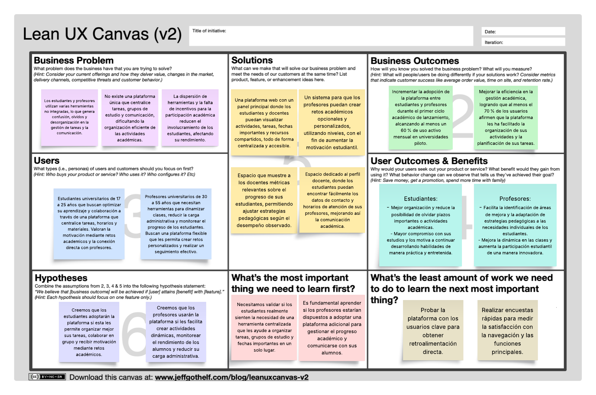

# Universidad Peruana de Ciencias Aplicadas

### **CURSO:** Desarrollo de Aplicaciones Open Source

### **NRC**: 4334

### **Profesor:** Hugo Allan Mori Paiva

### **Ingeniería de software**

## Informe de Trabajo Final

### **Nombre del startup:** APX-01

### **Nombre del producto:** EduHive

## **Integrantes**

| **Nombre**                             | **Codigo** |
| -------------------------------------- | ---------- |
| **Alejo Cardenas Jose Antonio**        | U202122484 |
| **Luquillas Asto Omar**                | U20211G641 |
| **Real Calderón Sebastián Omar**     | U20221D964 |
| **Flores Apaico Josue Antonio**        | U20201F773 |
| **Mendoza Vergara Franklin Alejandro** | U202312343 |

**Abril 2025**

## Registro de Versiones del Informe

| Versión | Fecha | Autor | Descripción de modificación |
| -------- | ----- | ----- | ----------------------------- |

## Project Report Collaboration Insights

## Contenido

- [Student Outcome](#student-outcome)
- [Objetivos SMART](#objetivos-smart)
- [Capítulo I](#capítulo-i)
  - [1.1. Startup Profile](#11-startup-profile)
    - [1.1.1. Descripción de la Startup](#111-descripción-de-la-startup)
    - [1.1.2. Perfiles de integrantes del equipo](#112-perfiles-de-integrantes-del-equipo)
  - [1.2. Solution Profile](#12-solution-profile)
    - [1.2.1. Antecedentes y problemática](#121-antecedentes-y-problemática)
    - [1.2.2. Lean UX Process](#122-lean-ux-process)
      - [1.2.2.1. Lean UX Problem Statements](#1221-lean-ux-problem-statements)
      - [1.2.2.2. Lean UX Assumptions](#1222-lean-ux-assumptions)
      - [1.2.2.3. Lean UX Hypothesis Statements](#1223-lean-ux-hypothesis-statements)
      - [1.2.2.4. Lean UX Canvas](#1224-lean-ux-canvas)
  - [1.3. Segmentos Objetivo](#13-segmentos-objetivo)
- [Capítulo II: Requirements Elicitation & Analysis](#capítulo-ii-requirements-elicitation--analysis)
  - [2.1. Competidores](#21-competidores)
    - [2.1.1. Análisis competitivo](#211-análisis-competitivo)
    - [2.1.2. Estrategias y tácticas frente a competidores](#212-estrategias-y-tácticas-frente-a-competidores)
  - [2.2. Entrevistas](#22-entrevistas)
    - [2.2.1. Diseño de entrevistas](#221-diseño-de-entrevistas)
    - [2.2.2. Registro de entrevistas](#222-registro-de-entrevistas)
    - [2.2.3. Análisis de entrevistas](#223-análisis-de-entrevistas)
  - [2.3. Needfinding](#23-needfinding)
    - [2.3.1. User Personas](#231-user-personas)
    - [2.3.2. User Task Matrix](#232-user-task-matrix)
    - [2.3.3. User Journey Mapping](#233-user-journey-mapping)
    - [2.3.4. Empathy Mapping](#234-empathy-mapping)
    - [2.3.5. As-is Scenario Mapping](#235-as-is-scenario-mapping)
  - [2.4. Ubiquitous Language](#24-ubiquitous-language)
- [Capítulo III: Requirements specification](#capítulo-iii-requirements-specification)
  - [3.1. To-Be Scenario Mapping](#31-to-be-scenario-mapping)
  - [3.2. User Stories](#32-user-stories)
  - [3.3. Impact Mapping](#33-impact-mapping)
  - [3.4. Product Backlog](#34-product-backlog)
- [Capítulo IV: Product Design](#capítulo-iv-product-design)
  - [4.1. Style Guidelines](#41-style-guidelines)
    - [4.1.1. General Style Guidelines](#411-general-style-guidelines)
    - [4.1.2. Web Style Guidelines](#412-web-style-guidelines)
  - [4.2. Information Architecture](#42-information-architecture)
    - [4.2.1. Organization Systems](#421-organization-systems)
    - [4.2.2 Labeling Systems](#422-labeling-systems)
    - [4.2.3 SEO Tags and Meta Tags](#423-seo-tags-and-meta-tags)
    - [4.2.4. Searching Systems](#424-searching-systems)
    - [4.2.5. Navigation Systems](#425-navigation-systems)
  - [4.3. Landing Page UI Design](#43-landing-page-ui-design)
    - [4.3.1. Landing Page Wireframe](#431-landing-page-wireframe)
    - [4.3.2. Landing Page Mock-up](#432-landing-page-mock-up)
  - [4.4. Web Applications UX/UI Design](#44-web-applications-uxui-design)
    - [4.4.1. Web Applications Wireframes](#441-web-applications-wireframes)
    - [4.4.2. Web Applications Wireflow Diagrams](#442-web-applications-wireflow-diagrams)
    - [4.4.2. Web Applications Mock-ups](#442-web-applications-mock-ups)
    - [4.4.3. Web Applications User Flow Diagrams](#443-web-applications-user-flow-diagrams)
  - [4.5. Web Applications Prototyping](#45-web-applications-prototyping)
  - [4.6. Domain-Driven Software Architecture](#46-domain-driven-software-architecture)
    - [4.6.1. Software Architecture Context Diagram](#461-software-architecture-context-diagram)
    - [4.6.2. Software Architecture Container Diagrams](#462-software-architecture-container-diagrams)
    - [4.6.3. Software Architecture Components Diagrams](#463-software-architecture-components-diagrams)
  - [4.7. Software Object-Oriented Design](#47-software-object-oriented-design)
    - [4.7.1. Class Diagrams](#471-class-diagrams)
    - [4.7.2. Class Dictionary](#472-class-dictionary)
  - [4.8. Database Design](#48-database-design)
    - [4.8.1. Database Diagram](#481-database-diagram)
- [Capítulo V: Product Implementation, Validation & Deployment](#capítulo-vi-product-implementation-validation--deployment)
  - [5.1. Software Configuration Management](#51-software-configuration-management)
    - [5.1.1. Software Development Environment Configuration](#511-software-development-environment-configuration)
    - [5.1.2. Source Code Management](#512-source-code-management)
    - [5.1.3. Source Code Style Guide & Conventions](#513-source-code-style-guide--conventions)
    - [5.1.4. Software Deployment Configuration](#514-software-deployment-configuration)
  - [5.2. Landing Page, Services & Applications Implementation](#52-landing-page-services--applications-implementation)
    - [5.2.1. Sprint 1](#521-sprint-1)
      - [5.2.1.1. Sprint Planning 1](#5211-sprint-planning-1)
      - [5.2.1.2. Aspect Leaders and Collaborators](#5212-aspect-leaders-and-collaborators)
      - [5.2.1.3. Sprint Backlog 1](#5213-sprint-backlog-1)
      - [5.2.1.4. Development Evidence for Sprint Review](#5214-development-evidence-for-sprint-review)
      - [5.2.1.5. Execution Evidence for Sprint Review](#5215-execution-evidence-for-sprint-review)
      - [5.2.1.6. Services Documentation Evidence for Sprint Review](#5216-services-documentation-evidence-for-sprint-review)
      - [5.2.1.7. Software Deployment Evidence for Sprint Review](#5217-software-deployment-evidence-for-sprint-review)
      - [5.2.1.8. Team Collaboration Insights during Sprint](#5218-team-collaboration-insights-during-sprint)
  - [5.3. Validation Interviews](#53-validation-interviews)
    - [5.3.1. Diseño de entrevistas](#531-diseño-de-entrevistas)
    - [5.3.2. Registro de entrevistas](#532-registro-de-entrevistas)
    - [5.3.3. Evaluaciones según heurísticas](#533-evaluaciones-según-heurísticas)
  - [5.4. Video About-the-Product](#54-video-about-the-product)
- [Conclusiones](#conclusiones)
- [Bibliografía](#bibliografía)
- [Anexos](#anexos)

## Student Outcome

## Objetivos SMART

## Capitulo I

### 1.1. Startup Profile

#### 1.1.1. Descripción de la Startup

APX-01 es una startup fundada por estudiantes de la Universidad Peruana de Ciencias Aplicadas (UPC), dedicada a desarrollar soluciones tecnológicas para revolucionar la educación en Perú. Nuestro primer proyecto, EduHive, es una plataforma integral que conecta a estudiantes y profesores en un ecosistema dinámico, donde la gestión de grupos de estudio, retos académicos y tareas se simplifica y gamifica.

EduHive ofrece una experiencia integral para los estudiantes, permitiéndoles gestionar sus tareas, revisar retos académicos activos y acceder a sus horarios de clases de manera sencilla y organizada. Además, los alumnos pueden explorar los perfiles de sus profesores, conocer sus especializaciones, horarios de atención y métodos de contacto, facilitando una comunicación más fluida y efectiva. De la misma manera, los profesores pueden crear y administrar grupos de estudio en los que podrán establecer retos académicos y monitorear el progreso de sus alumnos. La plataforma también incorpora elementos de gamificación, como sistemas de puntuación y reconocimientos, para motivar el aprendizaje y fomentar la participación activa en grupos de estudio y desafíos educativos, promoviendo un ecosistema educativo dinámico, digital y accesible.

#### 1.1.2. Perfiles de integrantes del equipo

### 1.2. Solution Profile

#### 1.2.1. Antecedentes y problemática

En el contexto educativo peruano, aún persisten desafíos significativos en la implementación de herramientas digitales que faciliten el aprendizaje colaborativo. Muchas universidades continúan utilizando métodos tradicionales para gestionar grupos de estudio y asignar tareas, lo que genera procesos académicos poco eficientes. Esta situación se ve agravada por la falta de plataformas integradas que permitan una interacción fluida y natural entre estudiantes y docentes, limitando las oportunidades para un aprendizaje más dinámico y participativo.

Por el lado de los estudiantes, es común observar dificultades para organizar trabajos grupales y mantener una comunicación efectiva con sus profesores. Los docentes, por su parte, enfrentan el reto constante de motivar a sus alumnos y gestionar eficientemente las actividades académicas. Esta problemática evidencia la necesidad de desarrollar soluciones tecnológicas que no solo simplifiquen los procesos educativos, sino que también fomenten un mayor engagement mediante enfoques innovadores y adaptados a la realidad local.

#### 1.2.2. Lean UX Process

El Lean UX process es una metodología iterativa de diseño que pone al usuario en el centro del proceso, enfocándose en la colaboración continua del equipo y en ciclos cortos de trabajo. A través de investigaciones, pruebas rápidas y validación constante de ideas, se busca comprobar la validez de las ideas planteadas. A diferencia de los métodos tradicionales, este evita la documentación pesada y prioriza la retroalimentación temprana para validar o descartar hipótesis de manera ágil, siempre orientándose a satisfacer las necesidades reales de los usuarios.

##### 1.2.2.1. Lean UX Problem Statements

Actualmente, los estudiantes y profesores universitarios se enfrentan a varios desafíos cuando intentan organizar sus actividades académicas y comunicarse de forma eficiente. En la mayoría de los casos, dependen de múltiples herramientas que no están conectadas entre sí, como aplicaciones de mensajería, correos electrónicos y agendas separadas, lo que provoca confusiones, olvidos y dificulta llevar un buen control de tareas y responsabilidades.

Para los estudiantes, esto significa tener que recordar plazos de entrega, participar en grupos y mantenerse al día con algunas tareas de manera dispersa. Por otro lado, los profesores tienen dificultades para crear y gestionar grupos de estudio, monitorear el progreso de sus alumnos y mantener una comunicación clara, directa y constante con ellos.

Esta situación no solo genera desorganización, sino que también puede disminuir la motivación y participación de los estudiantes, afectando su rendimiento académico. Por eso, es necesario contar con una plataforma integrada que centralice todas estas funciones, facilitando la organización de tareas, la realización de retos académicos y la interacción directa entre estudiantes y profesores, promoviendo así un entorno educativo más dinámico, ordenado y participativo.

##### 1.2.2.2. Lean UX Assumptions

**User Assumptions (Suposiciones de Usuario)**

- ¿Quién es el usuario?: Los usuarios son estudiantes y profesores universitarios que buscan mejorar la organización de sus actividades académicas, productividad y la comunicación en el entorno educativo.
- ¿Dónde encaja nuestro producto en su trabajo o vida?: Nuestro producto encaja como una herramienta diaria para planificar clases, tareas, retos académicos y la gestión de grupos de estudio, facilitando la interacción constante entre estudiantes y profesores.
- ¿Qué problemas resuelve nuestro producto?: Nuestro producto resuelve problemas de desorganización, falta de comunicación efectiva, dispersión de herramientas y baja motivación por la falta de dinamismo en las actividades académicas.
- ¿Cuándo y cómo se usa nuestro producto?: Nuestro producto se utiliza antes y después de clases, para revisar tareas pendientes, crear o unirse a grupos de estudio, consultar horarios, participar en retos académicos y comunicarse directamente con los profesores o compañeros.
- ¿Qué características son importantes?: Las características importantes son la gestión de tareas, administración de grupos de estudio, perfiles detallados de profesores, sistema de retos académicos, visualización de horarios, interfaz sencilla e intuitiva.
- ¿Cómo debe verse y comportarse nuestro producto?: Nuestro producto debe tener un diseño amigable y moderno, con navegación fluida, colores que generen motivación y claridad visual, y tiempos de respuesta rápidos para no frustrar a los usuarios.

**Business Assumptions (Suposiciones de Negocio)**

- Necesidades y problemas: Creemos que las universidades necesitan herramientas que mejoren la productividad académica y la colaboración digital entre alumnos y docentes.
- Plataforma: Estas necesidades se pueden resolver mediante una aplicación web para mayor accesibilidad.
- Segmentación: Los usuarios serán estudiantes y profesores universitarios de todas las áreas académicas.
- Comportamientos: El valor principal que un usuario quiere obtener de nuestro servicio es una mayor facilidad, colaboración y disciplina en el área académica.
- Beneficios: Los usuarios obtendrán una mejora de la organización académica, aumento en la participación de los estudiantes, comunicación más fluida y mayor motivación.
- Captación de clientes: Obtendremos nuestros usuarios a través de promociones de alianzas con universidades, redes sociales, y recomendaciones de usuarios dentro de las comunidades universitarias.
- Modelos de ingresos: Generaremos ingresos mediante una suscripción para funciones avanzadas en la plataforma.
- Competencia: Nuestra competencia serán las plataformas similares en el área de educación, gestión académica y organización.
- Ventaja competitiva: Superaremos a la competencia gracias a nuestra plataforma que ofrece varias funciones en un solo lugar y que esta enfocada en la experiencia, motivación y colaboración del estudiante y profesor universitario.

**Technical Assumptions (Suposiciones Técnicas)**

- Tecnología utilizada: Se utilizarán tecnologías web modernas para el desarrollo de la plataforma.
- Integraciones: La plataforma se integrará con servicios externos de calendarios digitales y comunicación.
- Escalabilidad: La aplicación será diseñada para soportar un número creciente de usuarios y datos.

**Market Assumptions (Suposiciones de Mercado)**

- Tamaño del mercado: El mercado objetivo incluye universidades, abarcando a estudiantes y docentes que buscan soluciones digitales para la organización académica.
- Competencia: Los principales competidores son otras plataformas de organización y gestión educativa.
- Tendencias: Existe un crecimiento en la digitalización de la educación y mayor preferencia por soluciones de productividad.

**Design Assumptions (Suposiciones de Diseño)**

- Interacción del usuario: La plataforma estará diseñada para una navegación sencilla, intuitiva y accesible.
- Experiencia del usuario: El enfoque estará en ofrecer una experiencia fluida y agradable, facilitando la realización de actividades sin complicaciones.
- Colores y tipografía: Los usuarios valoran el uso de una paleta de colores que transmita dinamismo y profesionalismo, junto con tipografías modernas y legibles que mejoren la experiencia visual.
- Preferencias visuales: Los usuarios prefieren un diseño visual atractivo pero limpio, que los permita concentrarse fácilmente en las funciones principales de la plataforma.
- Prototipos y pruebas: Se desarrollarán validaciones de las características principales que serán evaluados mediante pruebas de usabilidad.

##### 1.2.2.3. Lean UX Hypothesis Statements

Hypothesis Statement 01:

- Creemos que los usuarios necesitan una plataforma centralizada para gestionar actividades académicas y mejorar la comunicación.
- Sabremos que estamos en lo correcto cuando veamos una adopción activa de la herramienta dentro de grupos de estudio y recibamos comentarios positivos sobre la facilidad de organización que ofrece.

Hypothesis Statement 02:

- Creemos que la falta de integración entre herramientas actuales genera desorganización y pérdida de información importante para los estudiantes y docentes.
- Sabremos que estamos en lo correcto cuando los usuarios nos indiquen que ya no necesitan usar múltiples aplicaciones por separado y notemos una reducción en quejas relacionadas con la desorganización.

Hypothesis Statement 03:

- Creemos que una plataforma que permita crear y gestionar grupos de estudio facilitará la colaboración entre estudiantes.
- Sabremos que estamos en lo correcto cuando veamos un aumento en la creación de grupos dentro de la plataforma.

Hypothesis Statement 04:

- Creemos que la inclusión de un calendario ayudará a los usuarios a cumplir con sus tareas y fechas de entrega de forma oportuna.
- Sabremos que estamos en lo correcto cuando observemos una disminución en los retrasos de tareas.

Hypothesis Statement 05:

- Creemos que la implementación de retos académicos incentivará la participación y el compromiso de los estudiantes.
- Sabremos que estamos en lo correcto cuando veamos un aumento en la participación de actividades opcionales y retos dentro de la plataforma.

Hypothesis Statement 06:

- Creemos que una interfaz intuitiva y accesible facilitará la adopción de la plataforma por parte de los usuarios.
- Sabremos que estamos en lo correcto cuando los usuarios utilicen la aplicación con fluidez y la tasa de abandono inicial sea baja.

Hypothesis Statement 07:

- Creemos que permitir a los profesores monitorear el progreso de sus estudiantes mejorará la efectividad del seguimiento académico.
- Sabremos que estamos en lo correcto cuando los profesores utilicen frecuentemente las funciones de seguimiento y den feedback positivo.

Hypothesis Statement 08:

- Creemos que facilitar el acceso a la información de contacto y disponibilidad de los profesores mejorará la comunicación entre estudiantes y docentes.
- Sabremos que estamos en lo correcto cuando los estudiantes reporten mayor facilidad para contactar a sus profesores y se reduzcan las consultas relacionadas con cómo ubicarlos.

Hypothesis Statement 09:

- Creemos que los usuarios valoran la personalización de recordatorios en el calendario según sus preferencias.
- Sabremos que estamos en lo correcto cuando la mayoría de los usuarios personalicen sus ajustes de recordatorios.

Hypothesis Statement 10:

- Creemos que ofrecer una vista consolidada del horario académico, incluyendo entregas, exámenes y actividades de grupo, ayudará a los usuarios a visualizar mejor su carga semanal.
- Sabremos que estamos en lo correcto cuando los usuarios consulten frecuentemente la vista de horario y reporten sentirse más organizados.

Hypothesis Statement 11:

- Creemos que mostrar logros y avances individuales motivará a los estudiantes a continuar usando la plataforma.
- Sabremos que estamos en lo correcto cuando observemos una alta interacción con los paneles de progreso y mejoras.

Hypothesis Statement 12:

- Creemos que la privacidad y seguridad de la información son fundamentales para la adopción de la plataforma.
- Sabremos que estamos en lo correcto cuando los usuarios expresen confianza en el manejo de sus datos y no haya incidentes reportados.

Hypothesis Statement 13:

- Creemos que una experiencia de usuario que minimice la curva de aprendizaje aumentará la retención de usuarios nuevos.
- Sabremos que estamos en lo correcto cuando los nuevos usuarios se familiaricen con la plataforma en menos de una semana.

Hypothesis Statement 14:

- Creemos que una paleta de colores atractiva y una tipografía clara mejorarán la experiencia visual y la permanencia en la aplicación.
- Sabremos que estamos en lo correcto cuando los usuarios valoren positivamente el diseño en encuestas de satisfacción.

Hypothesis Statement 15:

- Creemos que ofrecer soporte rápido y accesible motivará a los usuarios a permanecer en la plataforma.
- Sabremos que estamos en lo correcto cuando las consultas de soporte sean resueltas de manera efectiva.

Hypothesis Statement 16:

- Creemos que el crecimiento de la educación híbrida aumentará la demanda de herramientas digitales integradas.
- Sabremos que estamos en lo correcto cuando identifiquemos un incremento sostenido en la adopción de la plataforma durante ciclos académicos híbridos o virtuales.

Hypothesis Statement 17:

- Creemos que permitir a los estudiantes compartir recursos y materiales dentro de sus grupos mejorará el aprendizaje colaborativo.
- Sabremos que estamos en lo correcto cuando observemos una alta frecuencia de archivos y enlaces compartidos en los espacios grupales.

Hypothesis Statement 18:

- Creemos que la disponibilidad de estadísticas y reportes académicos ayudará a los profesores a tomar mejores decisiones pedagógicas.
- Sabremos que estamos en lo correcto cuando los profesores utilicen estas herramientas para ajustar sus clases y estrategias de enseñanza.

Hypothesis Statement 19:

- Creemos que promocionar la plataforma a través de programas académicos y redes sociales, atraerá la mayoría de nuestros usuarios.
- Sabremos que estamos en lo correcto cuando veamos un aumento significativo en los registros de nuevos usuarios.

Hypothesis Statement 20:

- Creemos que incluir una sección de anuncios importantes permitirá mantener informada a la comunidad académica sin depender de medios externos.
- Sabremos que estamos en lo correcto cuando los usuarios accedan frecuentemente a esta sección.

##### 1.2.2.4. Lean UX Canvas

### 1.3. Segmentos Objetivo

### **Segmento Objetivo 1: Estudiantes Universitarios**

Jóvenes que buscan herramientas digitales para optimizar su aprendizaje colaborativo. Necesitan centralizar tareas, horarios y materiales académicos, además de motivación mediante retos gamificados. Benefician de conexión directa con profesores y sistemas de reconocimiento por logros.

**Edad aproximada:** 17-25 años

**Necesidades:**

- Organización eficiente de estudios grupales
- Acceso centralizado a materiales, horarios y tareas
- Motivación mediante gamificación y reconocimiento académico
-

**Beneficios clave:**

- Plataforma única para gestión de aprendizaje colaborativo
- Sistema de retos que potencia habilidades prácticas
- Conexión directa con profesores y compañeros

### **Segmento Objetivo 2: Profesores Universitarios**

Educadores innovadores que requieren soluciones para dinamizar sus clases y reducir carga administrativa. Buscan crear actividades interactivas, monitorear progreso estudiantil y adaptarse a diferentes metodologías pedagógicas.

**Edad aproximada:** 30-55 años

**Necesidades:**

- Herramientas para dinamizar la enseñanza
- Reducción de carga administrativa
- Monitoreo del progreso estudiantil

**Beneficios clave:**

- Creación de retos académicos personalizables
- Panel de analytics para seguimiento de alumnos
- Integración flexible con metodologías educativas existentes

## Capítulo II: Requirements Elicitation & Analysis

### 2.1. Competidores

#### 2.1.1. Análisis competitivo

#### 2.1.2. Estrategias y tácticas frente a competidores

### 2.2. Entrevistas

#### 2.2.1. Diseño de entrevistas

#### 2.2.2. Registro de entrevistas

#### 2.2.3. Análisis de entrevistas

### 2.3. Needfinding

#### 2.3.1. User Personas

#### 2.3.2. User Task Matrix

#### 2.3.3. User Journey Mapping

#### 2.3.4. Empathy Mapping

#### 2.3.5. As-is Scenario Mapping

### 2.4. Ubiquitous Language

## Capítulo III: Requirements specification

### 3.1. To-Be Scenario Mapping

### 3.2. User Stories

### 3.3. Impact Mapping

### 3.4. Product Backlog

## Capítulo IV: Product Design

### 4.1. Style Guidelines

#### 4.1.1. General Style Guidelines

#### 4.1.2. Web Style Guidelines

### 4.2. Information Architecture

#### 4.2.1. Organization Systems

#### 4.2.2 Labeling Systems

#### 4.2.3 SEO Tags and Meta Tags

#### 4.2.4. Searching Systems

#### 4.2.5. Navigation Systems

### 4.3.  Landing Page UI Design.

#### 4.3.1. Landing Page Wireframe.

#### 4.3.2. Landing Page Mock-up.

### 4.4.  Web Applications UX/UI Design.

#### 4.4.1. Web Applications Wireframes

#### 4.4.2. Web Applications Wireflow Diagrams

#### 4.4.2. Web Applications Mock-ups

#### 4.4.3. Web Applications User Flow Diagrams

### 4.5.  Web Applications Prototyping

### 4.6.  Domain-Driven Software Architecture

#### 4.6.1. Software Architecture Context Diagram

#### 4.6.2. Software Architecture Container Diagrams

#### 4.6.3. Software Architecture Components Diagrams

### 4.7.  Software Object-Oriented Design

#### 4.7.1. Class Diagrams

#### 4.7.2. Class Dictionary

### 4.8.  Database Design

#### 4.8.1. Database Diagram

## Capítulo V: Product Implementation, Validation & Deployment

### 5.1. Software Configuration Management

#### 5.1.1. Software Development Environment Configuration

#### 5.1.2. Source Code Management

#### 5.1.3. Source Code Style Guide & Conventions

#### 5.1.4. Software Deployment Configuration

### 5.2. Landing Page, Services & Applications Implementation.

#### 5.2.1. Sprint 1

##### 5.2.1.1. Sprint Planning 1

##### 5.2.1.2. Aspect Leaders and Collaborators

##### 5.2.1.3. Sprint Backlog 1

##### 5.2.1.4. Development Evidence for Sprint Review

##### 5.2.1.5. Execution Evidence for Sprint Review

##### 5.2.1.6. Services Documentation Evidence for Sprint Review

##### 5.2.1.7. Software Deployment Evidence for Sprint Review

##### 5.2.1.8. Team Collaboration Insights during Sprint

### 5.3. Validation Interviews

#### 5.3.1. Diseño de entrevistas

#### 5.3.2. Registro de entrevistas

#### 5.3.3. Evaluaciones según heurísticas

### 5.4. Video About-the-Product

## Conclusiones

## Bibliografía

## Anexos
