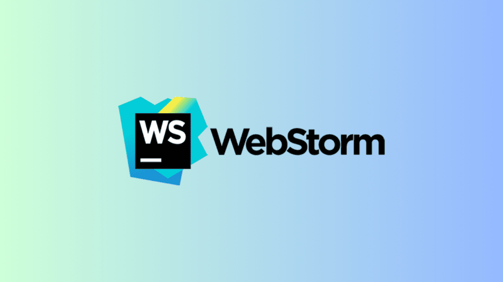

# Universidad Peruana de Ciencias Aplicadas

### **CURSO:** Desarrollo de Aplicaciones Open Source

### **NRC**: 4334

### **Profesor:** Hugo Allan Mori Paiva

### **Ingeniería de software**

## Informe de Trabajo Final

### **Nombre del startup:** APX-01

### **Nombre del producto:** EduHive

## **Integrantes**


| **Nombre**                             | **Codigo** |
| -------------------------------------- | ---------- |
| **Alejo Cardenas Jose Antonio**        | U202122484 |
| **Luquillas Asto Omar**                | U20211G641 |
| **Real Calderón Sebastián Omar**     | U20221D964 |
| **Flores Apaico Josue Antonio**        | U20201F773 |
| **Mendoza Vergara Franklin Alejandro** | U202312343 |

Abril 2025

## Registro de Versiones del Informe


| Versión | Fecha | Autor | Descripción de modificación |
| -------- | ----- | ----- | ----------------------------- |

## Project Report Collaboration Insights

## Contenido

- [Student Outcome](#student-outcome)
- [Objetivos SMART](#objetivos-smart)
- [Capítulo I](#capítulo-i)
  - [1.1. Startup Profile](#11-startup-profile)
    - [1.1.1. Descripción de la Startup](#111-descripción-de-la-startup)
    - [1.1.2. Perfiles de integrantes del equipo](#112-perfiles-de-integrantes-del-equipo)
  - [1.2. Solution Profile](#12-solution-profile)
    - [1.2.1. Antecedentes y problemática](#121-antecedentes-y-problemática)
    - [1.2.2. Lean UX Process](#122-lean-ux-process)
      - [1.2.2.1. Lean UX Problem Statements](#1221-lean-ux-problem-statements)
      - [1.2.2.2. Lean UX Assumptions](#1222-lean-ux-assumptions)
      - [1.2.2.3. Lean UX Hypothesis Statements](#1223-lean-ux-hypothesis-statements)
      - [1.2.2.4. Lean UX Canvas](#1224-lean-ux-canvas)
  - [1.3. Segmentos Objetivo](#13-segmentos-objetivo)
- [Capítulo II: Requirements Elicitation & Analysis](#capítulo-ii-requirements-elicitation--analysis)
  - [2.1. Competidores](#21-competidores)
    - [2.1.1. Análisis competitivo](#211-análisis-competitivo)
    - [2.1.2. Estrategias y tácticas frente a competidores](#212-estrategias-y-tácticas-frente-a-competidores)
  - [2.2. Entrevistas](#22-entrevistas)
    - [2.2.1. Diseño de entrevistas](#221-diseño-de-entrevistas)
    - [2.2.2. Registro de entrevistas](#222-registro-de-entrevistas)
    - [2.2.3. Análisis de entrevistas](#223-análisis-de-entrevistas)
  - [2.3. Needfinding](#23-needfinding)
    - [2.3.1. User Personas](#231-user-personas)
    - [2.3.2. User Task Matrix](#232-user-task-matrix)
    - [2.3.3. User Journey Mapping](#233-user-journey-mapping)
    - [2.3.4. Empathy Mapping](#234-empathy-mapping)
    - [2.3.5. As-is Scenario Mapping](#235-as-is-scenario-mapping)
  - [2.4. Ubiquitous Language](#24-ubiquitous-language)
- [Capítulo III: Requirements specification](#capítulo-iii-requirements-specification)
  - [3.1. To-Be Scenario Mapping](#31-to-be-scenario-mapping)
  - [3.2. User Stories](#32-user-stories)
  - [3.3. Impact Mapping](#33-impact-mapping)
  - [3.4. Product Backlog](#34-product-backlog)
- [Capítulo IV: Product Design](#capítulo-iv-product-design)
  - [4.1. Style Guidelines](#41-style-guidelines)
    - [4.1.1. General Style Guidelines](#411-general-style-guidelines)
    - [4.1.2. Web Style Guidelines](#412-web-style-guidelines)
  - [4.2. Information Architecture](#42-information-architecture)
    - [4.2.1. Organization Systems](#421-organization-systems)
    - [4.2.2 Labeling Systems](#422-labeling-systems)
    - [4.2.3 SEO Tags and Meta Tags](#423-seo-tags-and-meta-tags)
    - [4.2.4. Searching Systems](#424-searching-systems)
    - [4.2.5. Navigation Systems](#425-navigation-systems)
  - [4.3. Landing Page UI Design](#43-landing-page-ui-design)
    - [4.3.1. Landing Page Wireframe](#431-landing-page-wireframe)
    - [4.3.2. Landing Page Mock-up](#432-landing-page-mock-up)
  - [4.4. Web Applications UX/UI Design](#44-web-applications-uxui-design)
    - [4.4.1. Web Applications Wireframes](#441-web-applications-wireframes)
    - [4.4.2. Web Applications Wireflow Diagrams](#442-web-applications-wireflow-diagrams)
    - [4.4.2. Web Applications Mock-ups](#442-web-applications-mock-ups)
    - [4.4.3. Web Applications User Flow Diagrams](#443-web-applications-user-flow-diagrams)
  - [4.5. Web Applications Prototyping](#45-web-applications-prototyping)
  - [4.6. Domain-Driven Software Architecture](#46-domain-driven-software-architecture)
    - [4.6.1. Software Architecture Context Diagram](#461-software-architecture-context-diagram)
    - [4.6.2. Software Architecture Container Diagrams](#462-software-architecture-container-diagrams)
    - [4.6.3. Software Architecture Components Diagrams](#463-software-architecture-components-diagrams)
  - [4.7. Software Object-Oriented Design](#47-software-object-oriented-design)
    - [4.7.1. Class Diagrams](#471-class-diagrams)
    - [4.7.2. Class Dictionary](#472-class-dictionary)
  - [4.8. Database Design](#48-database-design)
    - [4.8.1. Database Diagram](#481-database-diagram)
- [Capítulo V: Product Implementation, Validation & Deployment](#capítulo-v-product-implementation-validation--deployment)
  - [5.1. Software Configuration Management](#51-software-configuration-management)
    - [5.1.1. Software Development Environment Configuration](#511-software-development-environment-configuration)
    - [5.1.2. Source Code Management](#512-source-code-management)
    - [5.1.3. Source Code Style Guide & Conventions](#513-source-code-style-guide--conventions)
    - [5.1.4. Software Deployment Configuration](#514-software-deployment-configuration)
  - [5.2. Landing Page, Services & Applications Implementation](#52-landing-page-services--applications-implementation)
    - [5.2.1. Sprint 1](#521-sprint-1)
      - [5.2.1.1. Sprint Planning 1](#5211-sprint-planning-1)
      - [5.2.1.2. Aspect Leaders and Collaborators](#5212-aspect-leaders-and-collaborators)
      - [5.2.1.3. Sprint Backlog 1](#5213-sprint-backlog-1)
      - [5.2.1.4. Development Evidence for Sprint Review](#5214-development-evidence-for-sprint-review)
      - [5.2.1.5. Execution Evidence for Sprint Review](#5215-execution-evidence-for-sprint-review)
      - [5.2.1.6. Services Documentation Evidence for Sprint Review](#5216-services-documentation-evidence-for-sprint-review)
      - [5.2.1.7. Software Deployment Evidence for Sprint Review](#5217-software-deployment-evidence-for-sprint-review)
      - [5.2.1.8. Team Collaboration Insights during Sprint](#5218-team-collaboration-insights-during-sprint)
  - [5.3. Validation Interviews](#53-validation-interviews)
    - [5.3.1. Diseño de entrevistas](#531-diseño-de-entrevistas)
    - [5.3.2. Registro de entrevistas](#532-registro-de-entrevistas)
    - [5.3.3. Evaluaciones según heurísticas](#533-evaluaciones-según-heurísticas)
  - [5.4. Video About-the-Product](#54-video-about-the-product)
- [Conclusiones](#conclusiones)
- [Bibliografía](#bibliografía)
- [Anexos](#anexos)

## Student Outcome

## Objetivos SMART

## Capitulo I

### 1.1. Startup Profile

#### 1.1.1. Descripción de la Startup

#### 1.1.2. Perfiles de integrantes del equipo

### 1.2. Solution Profile

#### 1.2.1. Antecedentes y problemática

#### 1.2.2. Lean UX Process

##### 1.2.2.1. Lean UX Problem Statements

##### 1.2.2.2. Lean UX Assumptions

##### 1.2.2.3. Lean UX Hypothesis Statements

##### 1.2.2.4. Lean UX Canvas

### 1.3. Segmentos Objetivo

## Capítulo II: Requirements Elicitation & Analysis

### 2.1. Competidores

#### 2.1.1. Análisis competitivo

#### 2.1.2. Estrategias y tácticas frente a competidores

### 2.2. Entrevistas

#### 2.2.1. Diseño de entrevistas

#### 2.2.2. Registro de entrevistas

#### 2.2.3. Análisis de entrevistas

### 2.3. Needfinding

#### 2.3.1. User Personas

#### 2.3.2. User Task Matrix

#### 2.3.3. User Journey Mapping

#### 2.3.4. Empathy Mapping

#### 2.3.5. As-is Scenario Mapping

### 2.4. Ubiquitous Language

## Capítulo III: Requirements specification

### 3.1. To-Be Scenario Mapping

### 3.2. User Stories

### 3.3. Impact Mapping

### 3.4. Product Backlog

## Capítulo IV: Product Design

### 4.1. Style Guidelines

#### 4.1.1. General Style Guidelines

#### 4.1.2. Web Style Guidelines

### 4.2. Information Architecture

#### 4.2.1. Organization Systems

#### 4.2.2 Labeling Systems

#### 4.2.3 SEO Tags and Meta Tags

#### 4.2.4. Searching Systems

#### 4.2.5. Navigation Systems

### 4.3.  Landing Page UI Design.

#### 4.3.1. Landing Page Wireframe.

#### 4.3.2. Landing Page Mock-up.

### 4.4.  Web Applications UX/UI Design.

#### 4.4.1. Web Applications Wireframes

#### 4.4.2. Web Applications Wireflow Diagrams

#### 4.4.2. Web Applications Mock-ups

#### 4.4.3. Web Applications User Flow Diagrams

### 4.5.  Web Applications Prototyping

### 4.6.  Domain-Driven Software Architecture

#### 4.6.1. Software Architecture Context Diagram

#### 4.6.2. Software Architecture Container Diagrams

#### 4.6.3. Software Architecture Components Diagrams

### 4.7.  Software Object-Oriented Design

#### 4.7.1. Class Diagrams

#### 4.7.2. Class Dictionary

### 4.8.  Database Design

#### 4.8.1. Database Diagram

## Capítulo V: Product Implementation, Validation & Deployment

### 5.1. Software Configuration Management

#### 5.1.1. Software Development Environment Configuration

Antes de comenzar, es importante definir claramente los requisitos de  la página web. Esto incluye las funcionalidades que se desean ofrecer  en nuestra plataforma.

* Project Management:

  * Trello
    Propósito de Uso: Gestión de tareas del equipo, seguimiento de actividades y organización del flujo de trabajo del proyecto.
    Ruta de Referencia/Descarga: [Trello](https://trello.com) (SaaS)

  
* Requirements Management:

  * Google Docs

    Propósito de Uso: Redactar y compartir la documentación de requisitos funcionales y no funcionales del proyecto, permitiendo colaboración en tiempo real entre los miembros del equipo.
    Ruta de Referencia/Descarga: [Google Docs](https://docs.google.com) (SaaS)

    
* Product UX/UI Design:

  * Figma

    Propósito de Uso: Diseño de wireframes, prototipos navegables y diagramas de flujo de pantallas (wireflows).
    Ruta de Referencia/Descarga: [Figma](https://www.figma.com) (SaaS)

    
* Software Development:

  * GitHub (con GitFlow)

    Propósito de Uso: Control de versiones, colaboración entre desarrolladores, organización mediante ramas y almacenamiento del código y documentación.
    Ruta de Referencia/Descarga: [GitHub](https://github.com) (SaaS)

    
  * WebStorm IDE

    Propósito de Uso: Edición del código fuente del proyecto.
    Ruta de Referencia/Descarga: [WebStorm IDE](https://www.jetbrains.com/webstorm/) (SaaS)

    
  * Postman:

    Propósito de Uso: Pruebas de APIs para verificar peticiones, respuestas y funcionamiento de los endpoints.
    Ruta de Referencia/Descarga: [Postman](https://www.postman.com/downloads/) (SaaS)

    
* Software Deployment:

  * Firebase

    Propósito de Uso: Plataforma utilizada para el despliegue y alojamiento del producto digital, así como servicios backend como base de datos, autenticación y funciones en la nube.
    Ruta de Referencia/Descarga: [Fire Base](https://firebase.google.com) (SaaS)

    
  * GitHub Page

    Propósito de Uso: Despliegue de la landing page del proyecto, permitiendo su visualización pública desde el repositorio.
    Ruta de Referencia/Descarga: [GitHub Actions](https://pages.github.com) (SaaS)

    
  * Microsoft Azure

    Propósito de Uso: Plataforma para el despliegue del backend del sistema, incluyendo servicios como API hosting, bases de datos y autenticación.
    Ruta de Referencia/Descarga: [Microsoft Azure](https://azure.microsoft.com) (SaaS)

    
* Software Documentation:

  * Git Hub
    Propósito de Uso: Almacenamiento, versionado y colaboración en la documentación del proyecto, así como la gestión del repositorio que contiene la documentación.
    Ruta de Referencia/Descarga: [Git Hub](https://github.com) (SaaS)

    
  * Web Storm IDE
    Propósito de Uso: Edición de archivos Markdown y documentación técnica relacionada al proyecto. Se utiliza para estructurar y organizar la documentación de forma eficiente.
    Ruta de Referencia/Descarga: [Web Storm IDE](https://www.jetbrains.com/webstorm/) (SaaS)

  

  Con esta configuración, nuestro equipo puede colaborar de manera  eficiente y gestionar el ciclo de vida completo del desarrollo del  producto digital, desde la planificación hasta el despliegue y  mantenimiento.

#### 5.1.2. Source Code Management

En esta sección, nuestro equipo establece los medios y el esquema de  organización que aplicará para el seguimiento de modificaciones  utilizando GitHub como plataforma y sistema de control de versiones.  De esta manera, configuramos un repositorio remoto en GitHub para  almacenar el código fuente y colaborar con los compañeros del grupo.

* Plataforma de control de versiones:
  De esta manera, configuramos un repositorio remoto en GitHub para  almacenar el código fuente y colaborar con los compañeros del grupo.  Los URLs de los repositorios son los siguientes:

  * Landing Page : [Landing Page](https://github.com/APX-01/Landing-Page)
  * Frontend Web Applications : [Frontend Web Applications](https://github.com/APX-01/Frontend-Web-Applications)
  * Backend Web Services : [Backend Web Services](https://github.com/APX-01/Backend-Web-Services)
* Implementación de GitFlow:
  Organizamos el repositorio en ramas para diferentes entornos.

  * Ramas base:

    - Main branch (rama principal): Contiene la versión de producción.
    - Develop branch: Contiene el código en desarrollo, que eventualmente  será fusionado en la rama principal.
  * Feature branches:

    * Feature branch:

      Para cada funcionalidad nueva se crea una rama desde develop.Convención para el nombre: `feature/nombre-corto-descriptivo`
  * Release branches:

    - Release branch:

      Se crean cuando el proyecto está listo para pasar a producción, desde develop.
      Convención: `release/x.y.z` (usando versionado semántico)
  * Hotfix branches:

    * Hotfix branch:

      Se crean desde `main` para corregir errores críticos en producción.
      Convención: `hotfix/x.y.z`
* Versionado semántico (Semantic Versioning)

  - Semantic Versioning Format:

    Aplicamos semantic versioning para nombrar nuestras releases siguiendo  el esquema MAJOR.MINOR.PATCH

    <table border="1" cellspacing="0" cellpadding="8">
      <thead>
        <tr>
          <th>Parte</th>
          <th>Significado</th>
        </tr>
      </thead>
      <tbody>
        <tr>
          <td><strong>MAJOR</strong></td>
          <td>Cambios importantes que rompen la compatibilidad con versiones anteriores (por ejemplo, eliminas funciones o cambias APIs que otros ya usaban).</td>
        </tr>
        <tr>
          <td><strong>MINOR</strong></td>
          <td>Añades nuevas funcionalidades de forma compatible (sin romper lo que ya funciona).</td>
        </tr>
        <tr>
          <td><strong>PATCH</strong></td>
          <td>Solucionas errores o bugs, sin agregar nuevas funciones ni romper nada.</td>
        </tr>
      </tbody>
    </table>
* Mensajes de commit con Conventional Commits

  Utilizamos Conventional Commits para los mensajes en nuestros commits. Usando el siguiente template:

  `<tipo>(<opcional-alcance>): <mensaje>`

  - Tipos:

  `feat`: nueva funcionalidad

  `fix`: corrección de errores

  `docs`: cambios en la documentación

  `style`: cambios de estilo/formato (sin afectar funcionalidad)

  `refactor`: reestructuración del código (sin cambios funcionales)

  `test`: añadir o modificar pruebas

  `chore`: tareas de mantenimiento

  * Ejemplos:

    feat(auth): Added auth

    fix(landing): fix landing header

#### 5.1.3. Source Code Style Guide & Conventions

El equipo ha definido las siguientes convenciones de nombres y estilos de codificación, aplicadas en los lenguajes **HTML, CSS, JavaScript, TypeScript y Java**. Todas las nomenclaturas están en **inglés**, buscando claridad, estandarización y buenas prácticas de desarrollo. Se han adoptado guías de estilo reconocidas y actualizadas para cada tecnología.

### HTML

- **Guía adoptada**: [W3C HTML Style Guide](https://www.w3.org/TR/html5/)
- **Nomenclatura y convenciones**:
  - Minúsculas para etiquetas y atributos: `<div class="container">`
  - Indentación: 2 espacios.
  - Atributos entre comillas dobles: ``
  - Uso semántico de etiquetas: `<header>`, `<section>`, `<footer>`
  - Comentarios HTML: `<!-- This is a comment -->`

### CSS

- **Guía adoptada**: [Google HTML/CSS Style Guide](https://google.github.io/styleguide/htmlcssguide.html)
- **Nomenclatura y convenciones**:
  - `kebab-case` para clases e IDs:
    Ejemplo: `.main-header`, `#footer-section`
  - Agrupación de estilos por componente.
  - Evitar `!important` a menos que sea necesario.
  - Indentación: 2 espacios.

### JavaScript

- **Guía adoptada**: [Google JavaScript Style Guide](https://google.github.io/styleguide/jsguide.html)
- **Nomenclatura y convenciones**:
  - `camelCase` para variables y funciones:
    Ejemplo: `let userName = 'José';`, `function calculateTotal() {}`
  - `PascalCase` para clases:
    Ejemplo: `class ShoppingCart { }`
  - Evitar `snake_case`.
  - Usar `const` y `let` en lugar de `var`.
  - Comentarios:
    - Línea: `// Get user info`
    - Bloque:
      ```js
      /**
       * Calculates total price with tax.
       */
      function calculateTotal() {}
      ```

### TypeScript

- **Guía adoptada**: [Google TypeScript Style Guide](https://google.github.io/styleguide/tsguide.html)
- **Nomenclatura y convenciones**:
  - `camelCase` para variables, funciones y propiedades:
    Ejemplo: `let isActive: boolean = true;`, `function getUserData() {}`
  - `PascalCase` para clases, interfaces, enums y tipos:
    Ejemplo: `class ProductItem {}`, `interface UserDTO {}`, `enum Status { Active, Inactive }`
  - Tipado estricto (`strict: true`) habilitado.
  - Interfaces nombradas con sufijo `DTO` o `Props`.
  - Uso de modificadores `readonly`, `private`, `public`.

### Java

- **Guía adoptada**: [Google Java Style Guide](https://google.github.io/styleguide/javaguide.html)
- **Nomenclatura y convenciones**:
  - `PascalCase` para clases:
    Ejemplo: `public class OrderService {}`
  - `camelCase` para variables, métodos y atributos:
    Ejemplo: `int totalAmount;`, `calculateTotalPrice();`
  - Constantes en MAYÚSCULAS con `snake_case`:
    Ejemplo: `public static final int MAX_USERS = 100;`
  - Comentarios tipo Javadoc:
    ```java
    /**
     * Gets the total price of all items.
     * @return total price
     */
    public double getTotalPrice() {}
    ```
  - Paquetes en minúsculas separados por punto:
    Ejemplo: `com.project.backend.controller`

Adicionalmente hemos considerado tener convenciones para los siguientes apartados:

### Gherkin Conventions for Readable Specifications

- **Guía adoptada**: [Gherkin Syntax and Conventions](https://cucumber.io/docs/gherkin/reference/)
- **Nomenclatura y convenciones**:
  - **Estructura**:
    - **Given**: Define el contexto o el estado inicial.
    - **When**: Define la acción o evento que ocurre.
    - **Then**: Define el resultado o la expectativa después de la acción.
  - Ejemplo:
    ```gherkin
    Feature: User login
      Scenario: Successful login with valid credentials
        Given the user is on the login page
        When the user enters valid credentials
        Then the user should be redirected to the dashboard
    ```
  - **Uso de tablas** para datos:
    Ejemplo:
    ```gherkin
    Given the following users exist:
      | username | password |
      | user1    | pass123  |
      | user2    | pass456  |
    ```

### Angular Coding Style Guide

- **Guía adoptada**: [Angular Style Guide](https://angular.io/guide/styleguide)
- **Nomenclatura y convenciones**:
  - **Estructura de carpetas**:
    - `app/` para componentes, servicios y módulos.
    - `assets/` para imágenes, fuentes y otros recursos.
  - **Nombres de clases**: `PascalCase` para componentes, servicios y directivas.
    Ejemplo: `export class UserProfileComponent { }`
  - **Componentes Standalone**: Usar `standalone: true` en la declaración de `@Component`.
  - **Indentación**: 2 espacios.
  - **Uso de `trackBy` en `*ngFor`**: Para mejorar el rendimiento al iterar sobre listas grandes.
  - **Servicios**: `camelCase` para nombres de funciones y métodos.

### Spring Boot Features

- **Guía adoptada**: [Spring Boot Features](https://spring.io/projects/spring-boot)
- **Nomenclatura y convenciones**:
  - **Paquetes**: El paquete raíz debe ser el nombre del proyecto, seguido de subpaquetes para organización.
    Ejemplo: `com.projectname.backend`
  - **Clases y métodos**: Usar `PascalCase` para clases y `camelCase` para métodos y variables.
  - **Configuración**: Usar `@Value` para inyectar propiedades desde archivos `application.properties`.
  - **Controladores**:
    Ejemplo:
    ```java
    @RestController
    @RequestMapping("/api/users")
    public class UserController {
      @GetMapping("/{id}")
      public ResponseEntity<User> getUser(@PathVariable Long id) {
        // Logic
      }
    }
    ```
  - **Logging**: Usar `@Slf4j` para la integración de `SLF4J` en clases de servicios y controladores.

#### 5.1.4. Software Deployment Configuration

Esta sección describe la configuración y los pasos necesarios para realizar el despliegue exitoso de los diferentes productos digitales en la solución. A continuación se especifican los pasos para desplegar la **Landing Page en GitHub Pages**, el **Frontend Web Application en Firebase** y los **Web Services Backend en Azure**.

### Despliegue de la Landing Page en GitHub Pages

#### Pasos de despliegue:

1. **Preparar el repositorio**:

   - Asegúrate de que tu código de la Landing Page esté en el repositorio correcto de GitHub.
   - El repositorio debe contener todos los archivos estáticos necesarios (HTML, CSS, JavaScript, imágenes, etc.).
2. **Configurar GitHub Pages**:

   - En el repositorio de GitHub, ve a la pestaña **Settings**.
   - En la sección **Pages**, selecciona la rama que deseas usar para desplegar el sitio. Generalmente, se usa la rama `main` o `gh-pages` (si se tiene una rama específica para ello).
   - En la opción **Source**, selecciona la carpeta del proyecto (usualmente `root` o `docs` si es necesario) y confirma la configuración.
3. **Desplegar**:

   - Una vez configurado, GitHub generará una URL en la sección **GitHub Pages** (por ejemplo, `https://tu-usuario.github.io/tu-repositorio`).
   - El despliegue se realizará automáticamente con cada cambio realizado en la rama seleccionada, siempre y cuando se realicen **commits** que actualicen el repositorio.
4. **Verificación**:

   - Accede a la URL proporcionada por GitHub Pages y verifica que el sitio esté funcionando correctamente.

### Despliegue de la Frontend Web Application en Firebase

#### Pasos de despliegue:

1. **Instalar Firebase CLI**:

   - Si no lo has hecho, instala Firebase CLI en tu máquina local:
     ```bash
     npm install -g firebase-tools
     ```
2. **Iniciar sesión en Firebase**:

   - Inicia sesión en Firebase desde la terminal:
     ```bash
     firebase login
     ```
3. **Inicializar el proyecto en Firebase**:

   - Navega a la raíz de tu proyecto y ejecuta el siguiente comando para inicializar Firebase:
     ```bash
     firebase init
     ```
   - Selecciona las opciones de Firebase Hosting durante la configuración.
   - Asegúrate de elegir la carpeta correcta donde se encuentran los archivos de tu Frontend (generalmente `build/` o `dist/` si usas frameworks como React, Angular o Vue).
4. **Construir la aplicación (si es necesario)**:

   - Si usas un framework de JavaScript, ejecuta el comando para construir la aplicación:
     - **React**:
       ```bash
       npm run build
       ```
     - **Angular**:
       ```bash
       ng build --prod
       ```
     - **Vue**:
       ```bash
       npm run build
       ```
   - Esto generará los archivos estáticos listos para el despliegue en una carpeta como `build/`, `dist/`, etc.
5. **Desplegar a Firebase Hosting**:

   - Una vez que el proyecto esté configurado y la aplicación esté construida, ejecuta el siguiente comando para desplegar:
     ```bash
     firebase deploy
     ```
6. **Verificación**:

   - Accede a la URL proporcionada por Firebase para ver tu aplicación en vivo (por ejemplo, `https://tu-proyecto.web.app`).

### Despliegue de los Web Services (Backend) en Azure

#### Pasos de despliegue:

1. **Preparar el proyecto**:

   - Asegúrate de que tu backend esté listo para el despliegue. Esto incluye tener una aplicación Java, Node.js, Python o cualquier otro framework adecuado para los Web Services.
2. **Crear un recurso en Azure**:

   - En el portal de **Azure**, ve a la sección de **App Services** y selecciona **Create a Resource**.
   - Elige la opción **App Service** y sigue los pasos para crear un nuevo recurso, configurando el nombre, la región y el sistema operativo (Linux o Windows).
3. **Configurar el entorno de ejecución**:

   - Selecciona el tipo de tecnología que utilizarás (por ejemplo, **Java**, **Node.js**, etc.).
   - Asegúrate de que el servicio tenga acceso a los recursos necesarios, como bases de datos o almacenamiento en la nube, si es requerido.
4. **Conectar el proyecto con el repositorio GitHub**:

   - En la sección de **Deployment Center** de tu nuevo **App Service** en Azure, selecciona la opción **GitHub** como origen para el despliegue automático.
   - Conecta tu cuenta de GitHub y selecciona el repositorio y la rama que contiene el código del backend.
5. **Desplegar la aplicación**:

   - Una vez conectado el repositorio de GitHub, configura los detalles del despliegue (si es necesario) y habilita el despliegue automático.
   - Azure detectará automáticamente cualquier cambio en la rama seleccionada y desplegará los cambios cuando se realicen nuevos **commits**.
6. **Verificación**:

   - Una vez completado el despliegue, podrás acceder a tu Web Service a través de la URL proporcionada por Azure (por ejemplo, `https://mi-aplicacion.azurewebsites.net`).

### 5.2. Landing Page, Services & Applications Implementation.

#### 5.2.1. Sprint 1

##### 5.2.1.1. Sprint Planning 1


<table >
  <tr>
    <th>Sprint #</th>
    <td>Sprint 1</td>
  </tr>
  <tr>
    <th colspan="2"><b>Sprint Planning Background</b></th>
  </tr>
  <tr>
    <th>Date</th>
    <td>2025-04-25</td>
  </tr>
  <tr>
    <th>Time</th>
    <td>18:24 PM</td>
  </tr>
  <tr>
    <th>Location</th>
    <td> Reunión virtual en Discord </td>
  </tr>
  <tr>
    <th>Prepared By</th>
    <td>José Antonio Alejo Cárdenas y Omar Luquillas Asto</td>
  </tr>
  <tr>
    <th>Attendees (to planning meeting)</th>
    <td>José Antonio Alejo Cárdenas, Omar Luquillas Asto, Real Calderón Sebastián Omar, Flores Apaico Josue Antonio y Mendoza Vergara Franklin Alejandro</td>
  </tr>
  <tr>
    <th colspan="2"><b>Sprint Goal & User Stories</b></th>
  </tr>
  <tr>
    <th>Sprint 1 Goal</th>
    <td>Nuestro enfoque está en crear una landing page que muestre claramente el propósito del producto con diseño responsive y contenido atractivo. Creemos que esto generará mayor interés por parte de los usuarios. Esto se confirmará cuando recibamos registros a través del formulario en la página.</td>
  </tr>
  <tr>
    <th>Sprint 1 Velocity</th>
    <td>26 puntos</td>
  </tr>
  <tr>
    <th>Sum of Story Points</th>
    <td>26 puntos</td>
  </tr>
</table>

##### 5.2.1.2. Aspect Leaders and Collaborators

En el presente Sprint, el equipo trabajará en la construcción de una **Landing Page** que contempla diversas funcionalidades y secciones clave para la experiencia del usuario. Los principales aspectos considerados en este Sprint incluyen **features**, **funcionalidades** y **secciones** específicas.
Cada aspecto contará con un **líder** responsable de su desarrollo y **colaboradores** que apoyarán en tareas específicas relacionadas, con el objetivo de lograr una comunicación efectiva y una distribución clara de responsabilidades en el equipo.

A continuación, se presenta la **Leadership-and-Collaboration Matrix (LACX)**:


<table  cellpadding="8" cellspacing="0">
  <thead>
    <tr>
      <th>Team Member (Last Name, First Name)</th>
      <th>GitHub Username</th>
      <th>Funcionalidad Login</th>
      <th>Funcionalidad Register</th>
      <th>Sección Contacto</th>
      <th>Feature Barra de navegación</th>
      <th>Sección de características principales</th>
      <th>Sección Cursos Populares</th>
      <th>Sección Explore Course</th>
      <th>Sección Blog</th>
    </tr>
  </thead>
  <tbody>
    <tr>
      <td>Cardenas Jose Antonio Alejo</td>
      <td>Firtness</td>
      <td>L</td>
      <td>C</td>
      <td>C</td>
      <td>C</td>
      <td>C</td>
      <td>L</td>
      <td>C</td>
      <td>C</td>
    </tr>
    <tr>
      <td>Luquillas Asto Omar</td>
      <td>LLAOmar</td>
      <td>C</td>
      <td>L</td>
      <td>C</td>
      <td>C</td>
      <td>C</td>
      <td>C</td>
      <td>L</td>
      <td>C</td>
    </tr>
    <tr>
      <td>Real Calderón Sebastián Omar</td>
      <td>sebastianrealcalderon</td>
      <td>C</td>
      <td>C</td>
      <td>L</td>
      <td>C</td>
      <td>C</td>
      <td>C</td>
      <td>C</td>
      <td>L</td>
    </tr>
    <tr>
      <td>Flores Apaico Josue Antonio</td>
      <td>JosueFloresAp</td>
      <td>C</td>
      <td>C</td>
      <td>C</td>
      <td>L</td>
      <td>C</td>
      <td>C</td>
      <td>C</td>
      <td>C</td>
    </tr>
    <tr>
      <td>Mendoza Vergara Franklin Alejandro</td>
      <td>AlexBoo1</td>
      <td>C</td>
      <td>C</td>
      <td>C</td>
      <td>C</td>
      <td>L</td>
      <td>C</td>
      <td>C</td>
      <td>C</td>
    </tr>
  </tbody>
</table>

##### 5.2.1.3. Sprint Backlog 1


##### 5.2.1.4. Development Evidence for Sprint Review


<table border="1">
  <thead>
    <tr>
      <th>Repository</th>
      <th>Branch</th>
      <th>Commit Id</th>
      <th>Commit Message</th>
      <th>Commit Message Body</th>
      <th>Commited on (Date)</th>
    </tr>
  </thead>
  <tbody>
    <tr>
      <td>Firtness/repositoryname</td>
      <td>feature/login</td>
      <td>X</td>
      <td>feat(login): Added login</td>
      <td>Login functionality was added to landing page</td>
      <td>25/04/2025</td>
    </tr>
    <tr>
      <td>LLAOmar/Landing-Page</td>
      <td>feature/register</td>
      <td>X</td>
      <td>feat(register): Added register</td>
      <td>Register functionality was added to landing page</td>
      <td>25/04/2025</td>
    </tr>
    <tr>
      <td>sebastianrealcalderon/Landing-Page</td>
      <td>feature/contact-section</td>
      <td>X</td>
      <td>feat(contact-section): Added contact section</td>
      <td>Contact section was added to landing page</td>
      <td>25/04/2025</td>
    </tr>
    <tr>
      <td>JosueFloresAp/Landing-Page</td>
      <td>feature/bar-nav</td>
      <td>X</td>
      <td>feat(bar-nav): Added bar nav</td>
      <td>Barnav was added to landing page</td>
      <td>25/04/2025</td>
    </tr>
    <tr>
      <td>AlexBoo1/Landing-Page</td>
      <td>feature/main-characteristics-section</td>
      <td>X</td>
      <td>feat(main-characteristics-section): Added main characteristics section</td>
      <td>Main characteristics section was added to landing page</td>
      <td>25/04/2025</td>
    </tr>
<tr>
      <td>Firtness/Landing-Page</td>
      <td>feature/popular-courses-section</td>
      <td>X</td>
      <td>feat(popular-courses-section): Added main popular courses section</td>
      <td>Popular courses section was added to landing page</td>
      <td>25/04/2025</td>
    </tr>
<tr>
      <td>LLAOmar/Landing-Page</td>
      <td>feature/explore-course-section</td>
      <td>X</td>
      <td>feat(explore-course-section): Added explore course section</td>
      <td>Explore course section was added to landing page</td>
      <td>25/04/2025</td>
    </tr>
<tr>
      <td>sebastianrealcalderon/Landing-Page</td>
      <td>feature/blog-section</td>
      <td>X</td>
      <td>feat(blog-section): Added blog section</td>
      <td>Blog section was added to landing page</td>
      <td>25/04/2025</td>
    </tr>
  </tbody>
</table>


##### 5.2.1.5. Execution Evidence for Sprint Review

##### 5.2.1.6. Services Documentation Evidence for Sprint Review

Durante este Sprint, el foco principal fue el desarrollo de la **landing page estática**, la cual no requiere consumo de APIs o Web Services. Dado que el alcance del proyecto actual no incluye backend ni interacciones con endpoints, no se generó documentación OpenAPI. Es decir, la landing page es un producto frontend estático (sin lógica de servidor). Ademas, en esta no se implementaron acciones CRUD (GET/POST/PUT/DELETE) ni interacciones con APIs externas.

* Aunque no se documentaron endpoints (por no ser aplicables), se cumplió con:
  * Documentación del proyecto estático.
  * Registro de cambios en commits.
  * Evidencia de despliegue funcional.

##### 5.2.1.7. Software Deployment Evidence for Sprint Review

##### 5.2.1.8. Team Collaboration Insights during Sprint

### 5.3. Validation Interviews

#### 5.3.1. Diseño de entrevistas

#### 5.3.2. Registro de entrevistas

#### 5.3.3. Evaluaciones según heurísticas

### 5.4. Video About-the-Product

## Conclusiones

## Bibliografía

## Anexos
