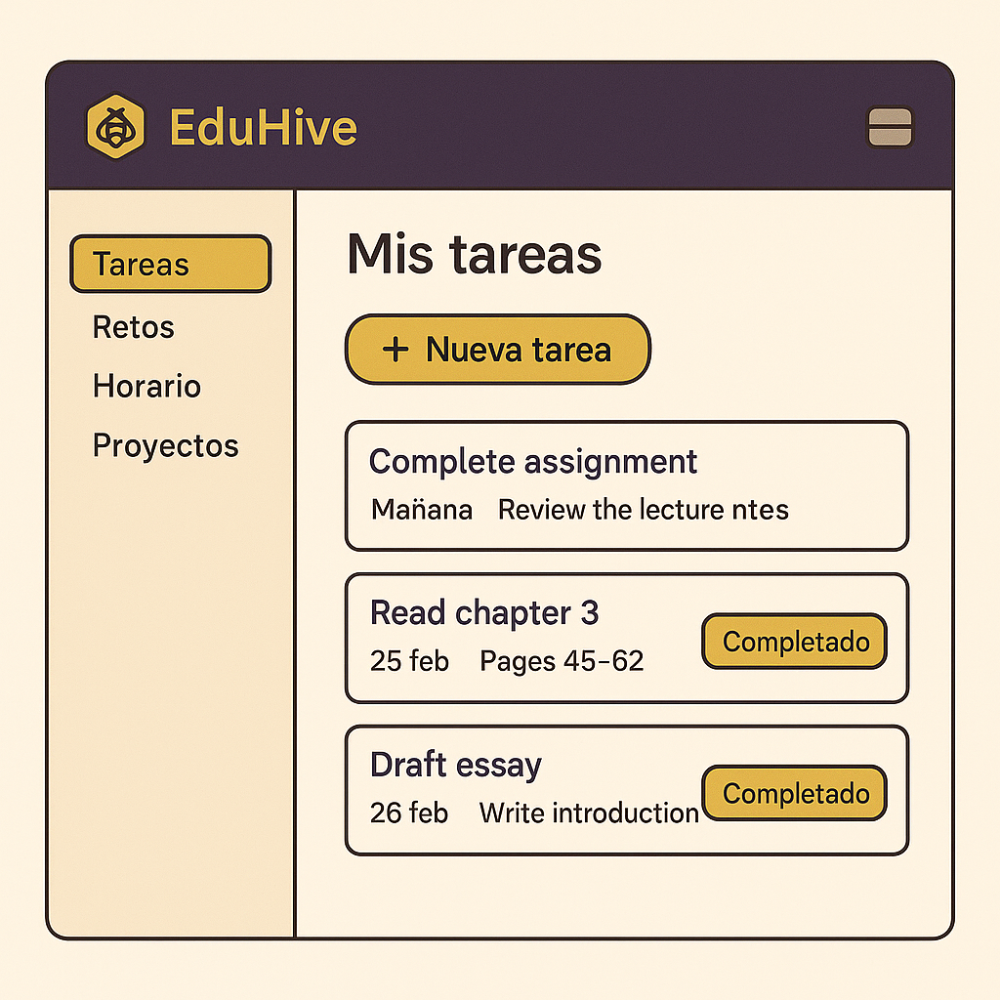
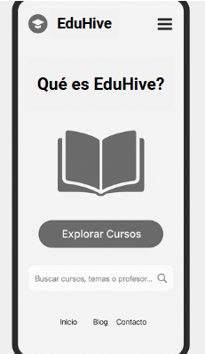

# Universidad Peruana de Ciencias Aplicadas

### **CURSO:** Desarrollo de Aplicaciones Open Source

### **NRC**: 4334

### **Profesor:** Hugo Allan Mori Paiva

### **Ingeniería de software**

## Informe de Trabajo Final

### **Nombre del startup:** APX-01

### **Nombre del producto:** EduHive

## **Integrantes**

| **Nombre**                             | **Codigo** |
| -------------------------------------- | ---------- |
| **Alejo Cardenas Jose Antonio**        | U202122484 |
| **Luquillas Asto Omar**                | U20211G641 |
| **Real Calderón Sebastián Omar**     | U20221D964 |
| **Flores Apaico Josue Antonio**        | U20201F773 |
| **Mendoza Vergara Franklin Alejandro** | U202312343 |

Abril 2025

## Registro de Versiones del Informe

| Versión | Fecha | Autor | Descripción de modificación |
| -------- | ----- | ----- | ----------------------------- |

## Project Report Collaboration Insights

## Contenido

- [Student Outcome](#student-outcome)
- [Objetivos SMART](#objetivos-smart)
- [Capítulo I](#capítulo-i)
  - [1.1. Startup Profile](#11-startup-profile)
    - [1.1.1. Descripción de la Startup](#111-descripción-de-la-startup)
    - [1.1.2. Perfiles de integrantes del equipo](#112-perfiles-de-integrantes-del-equipo)
  - [1.2. Solution Profile](#12-solution-profile)
    - [1.2.1. Antecedentes y problemática](#121-antecedentes-y-problemática)
    - [1.2.2. Lean UX Process](#122-lean-ux-process)
      - [1.2.2.1. Lean UX Problem Statements](#1221-lean-ux-problem-statements)
      - [1.2.2.2. Lean UX Assumptions](#1222-lean-ux-assumptions)
      - [1.2.2.3. Lean UX Hypothesis Statements](#1223-lean-ux-hypothesis-statements)
      - [1.2.2.4. Lean UX Canvas](#1224-lean-ux-canvas)
  - [1.3. Segmentos Objetivo](#13-segmentos-objetivo)
- [Capítulo II: Requirements Elicitation & Analysis](#capítulo-ii-requirements-elicitation--analysis)
  - [2.1. Competidores](#21-competidores)
    - [2.1.1. Análisis competitivo](#211-análisis-competitivo)
    - [2.1.2. Estrategias y tácticas frente a competidores](#212-estrategias-y-tácticas-frente-a-competidores)
  - [2.2. Entrevistas](#22-entrevistas)
    - [2.2.1. Diseño de entrevistas](#221-diseño-de-entrevistas)
    - [2.2.2. Registro de entrevistas](#222-registro-de-entrevistas)
    - [2.2.3. Análisis de entrevistas](#223-análisis-de-entrevistas)
  - [2.3. Needfinding](#23-needfinding)
    - [2.3.1. User Personas](#231-user-personas)
    - [2.3.2. User Task Matrix](#232-user-task-matrix)
    - [2.3.3. User Journey Mapping](#233-user-journey-mapping)
    - [2.3.4. Empathy Mapping](#234-empathy-mapping)
    - [2.3.5. As-is Scenario Mapping](#235-as-is-scenario-mapping)
  - [2.4. Ubiquitous Language](#24-ubiquitous-language)
- [Capítulo III: Requirements specification](#capítulo-iii-requirements-specification)
  - [3.1. To-Be Scenario Mapping](#31-to-be-scenario-mapping)
  - [3.2. User Stories](#32-user-stories)
  - [3.3. Impact Mapping](#33-impact-mapping)
  - [3.4. Product Backlog](#34-product-backlog)
- [Capítulo IV: Product Design](#capítulo-iv-product-design)
  - [4.1. Style Guidelines](#41-style-guidelines)
    - [4.1.1. General Style Guidelines](#411-general-style-guidelines)
    - [4.1.2. Web Style Guidelines](#412-web-style-guidelines)
  - [4.2. Information Architecture](#42-information-architecture)
    - [4.2.1. Organization Systems](#421-organization-systems)
    - [4.2.2 Labeling Systems](#422-labeling-systems)
    - [4.2.3 SEO Tags and Meta Tags](#423-seo-tags-and-meta-tags)
    - [4.2.4. Searching Systems](#424-searching-systems)
    - [4.2.5. Navigation Systems](#425-navigation-systems)
  - [4.3. Landing Page UI Design](#43-landing-page-ui-design)
    - [4.3.1. Landing Page Wireframe](#431-landing-page-wireframe)
    - [4.3.2. Landing Page Mock-up](#432-landing-page-mock-up)
  - [4.4. Web Applications UX/UI Design](#44-web-applications-uxui-design)
    - [4.4.1. Web Applications Wireframes](#441-web-applications-wireframes)
    - [4.4.2. Web Applications Wireflow Diagrams](#442-web-applications-wireflow-diagrams)
    - [4.4.2. Web Applications Mock-ups](#442-web-applications-mock-ups)
    - [4.4.3. Web Applications User Flow Diagrams](#443-web-applications-user-flow-diagrams)
  - [4.5. Web Applications Prototyping](#45-web-applications-prototyping)
  - [4.6. Domain-Driven Software Architecture](#46-domain-driven-software-architecture)
    - [4.6.1. Software Architecture Context Diagram](#461-software-architecture-context-diagram)
    - [4.6.2. Software Architecture Container Diagrams](#462-software-architecture-container-diagrams)
    - [4.6.3. Software Architecture Components Diagrams](#463-software-architecture-components-diagrams)
  - [4.7. Software Object-Oriented Design](#47-software-object-oriented-design)
    - [4.7.1. Class Diagrams](#471-class-diagrams)
    - [4.7.2. Class Dictionary](#472-class-dictionary)
  - [4.8. Database Design](#48-database-design)
    - [4.8.1. Database Diagram](#481-database-diagram)
- [Capítulo V: Product Implementation, Validation & Deployment](#capítulo-v-product-implementation-validation--deployment)
  - [5.1. Software Configuration Management](#51-software-configuration-management)
    - [5.1.1. Software Development Environment Configuration](#511-software-development-environment-configuration)
    - [5.1.2. Source Code Management](#512-source-code-management)
    - [5.1.3. Source Code Style Guide & Conventions](#513-source-code-style-guide--conventions)
    - [5.1.4. Software Deployment Configuration](#514-software-deployment-configuration)
  - [5.2. Landing Page, Services & Applications Implementation](#52-landing-page-services--applications-implementation)
    - [5.2.1. Sprint 1](#521-sprint-1)
      - [5.2.1.1. Sprint Planning 1](#5211-sprint-planning-1)
      - [5.2.1.2. Aspect Leaders and Collaborators](#5212-aspect-leaders-and-collaborators)
      - [5.2.1.3. Sprint Backlog 1](#5213-sprint-backlog-1)
      - [5.2.1.4. Development Evidence for Sprint Review](#5214-development-evidence-for-sprint-review)
      - [5.2.1.5. Execution Evidence for Sprint Review](#5215-execution-evidence-for-sprint-review)
      - [5.2.1.6. Services Documentation Evidence for Sprint Review](#5216-services-documentation-evidence-for-sprint-review)
      - [5.2.1.7. Software Deployment Evidence for Sprint Review](#5217-software-deployment-evidence-for-sprint-review)
      - [5.2.1.8. Team Collaboration Insights during Sprint](#5218-team-collaboration-insights-during-sprint)
  - [5.3. Validation Interviews](#53-validation-interviews)
    - [5.3.1. Diseño de entrevistas](#531-diseño-de-entrevistas)
    - [5.3.2. Registro de entrevistas](#532-registro-de-entrevistas)
    - [5.3.3. Evaluaciones según heurísticas](#533-evaluaciones-según-heurísticas)
  - [5.4. Video About-the-Product](#54-video-about-the-product)
- [Conclusiones](#conclusiones)
- [Bibliografía](#bibliografía)
- [Anexos](#anexos)

## Student Outcome

## Objetivos SMART

## Capitulo I

### 1.1. Startup Profile

#### 1.1.1. Descripción de la Startup

#### 1.1.2. Perfiles de integrantes del equipo

### 1.2. Solution Profile

#### 1.2.1. Antecedentes y problemática

#### 1.2.2. Lean UX Process

##### 1.2.2.1. Lean UX Problem Statements

##### 1.2.2.2. Lean UX Assumptions

##### 1.2.2.3. Lean UX Hypothesis Statements

##### 1.2.2.4. Lean UX Canvas

### 1.3. Segmentos Objetivo

## Capítulo II: Requirements Elicitation & Analysis

### 2.1. Competidores

#### 2.1.1. Análisis competitivo

#### 2.1.2. Estrategias y tácticas frente a competidores

### 2.2. Entrevistas

#### 2.2.1. Diseño de entrevistas

#### 2.2.2. Registro de entrevistas

#### 2.2.3. Análisis de entrevistas

### 2.3. Needfinding

#### 2.3.1. User Personas

#### 2.3.2. User Task Matrix

#### 2.3.3. User Journey Mapping

#### 2.3.4. Empathy Mapping

#### 2.3.5. As-is Scenario Mapping

### 2.4. Ubiquitous Language

## Capítulo III: Requirements specification

### 3.1. To-Be Scenario Mapping

### 3.2. User Stories

### 3.3. Impact Mapping

### 3.4. Product Backlog

## Capítulo IV: Product Design

### 4.1. Style Guidelines

En esta parte, daremos a conocer nuestra propuesta para el diseño, estilo y aspecto visual tanto de la página web como de las secciones de nuestra aplicación. Buscamos ofrecer a los usuarios una experiencia cómoda y sencilla mediante una interfaz clara e intuitiva. Para ello, seleccionamos cuidadosamente elementos visuales que resulten atractivos y agradables, además de definir límites que nos permitan evitar el uso de gráficos que puedan afectar negativamente la estética.

#### 4.1.1. General Style Guidelines

**Branding:** Creamos un logotipo distintivo y memorable que encapsula la esencia de nuestra plataforma educativa colaborativa. Incorporamos elementos visuales que representan tanto el mundo académico como el sentido de comunidad y organización, usando una colmena estilizada y una abeja con birrete como símbolos centrales de aprendizaje colectivo, constancia y crecimiento.

**Tipografía** 
Open Sans ha sido seleccionada como la fuente principal para todos los textos de la aplicación. Esta tipografía se distingue por su excelente legibilidad y su estilo moderno, lo que garantiza una experiencia de lectura clara y agradable en cualquier dispositivo.

El tamaño de la fuente se ajusta de manera automática según la pantalla, asegurando una visualización óptima tanto en móviles como en computadoras.

**Colores** 
La paleta de colores está compuesta por cinco tonos principales, cuidadosamente seleccionados para transmitir una apariencia limpia, moderna y profesional en cada sección de la aplicación.

 

<strong>Color Primario:</strong> 
Amarillo Dorado (#F4BE1D): Este color es el más predominante en el diseño, utilizado en botones principales, resaltados visuales y líneas de separación. Aporta energía y visibilidad, creando una experiencia amigable y dinámica para el usuario.

<strong>Colores Secundarios:</strong> 

<ul>
<li>Morado Oscuro (#362A5E): Utilizado en títulos o textos destacados. Añade contraste y profundidad al diseño.
<li>Beige Claro (#FEF8EB): Funciona como fondo o zonas de descanso visual, aportando claridad sin perder calidez.
<li>Gris Oscuro (#2B2B2B): Utilizado para tipografía y elementos de interfaz. Este color garantiza buena legibilidad.
<li>Beige Suave (#F4E0A5): Aparece en elementos secundarios o de soporte, equilibrando la paleta general.
</ul>

<strong>Texto</strong> 
Todos los textos utilizan el color #2B2B2B (Gris Oscuro) para asegurar un alto contraste y una lectura fluida sobre fondos claros.
La tipografía empleada en toda la aplicación es Open Sans, una fuente legible, moderna y profesional.

<strong>Botones</strong> 
Los botones siguen un sistema de color funcional:

<ul>

<li>Botones de Acción Principal:

<ul>
<li>Fondo: #F4BE1D (Amarillo Dorado)
<li>Texto: Blanco
<li>Hover: El fondo se oscurece ligeramente para reforzar la retroalimentación visual.
</ul>

<li>Botones de Acción Secundaria:

<ul>
<li>Fondo: Blanco con borde y texto en #F4BE1D
<li>Hover: Puede invertirse el color de fondo y texto o intensificar el borde para marcar interacción.
</ul>

</ul>

<strong>Formularios</strong> 

<ul>
<li>Los campos de texto siguen un diseño simple con líneas delimitadoras delgadas.
<li>Indicadores como el tiempo, la señal y los íconos del sistema están incluidos para crear una maqueta realista.
</ul>

<strong>Íconos y Sistema Visual</strong> 

<ul>
<li>Los íconos siguen un estilo de línea simple, usando colores oscuros (#2B2B2B) y están inspirados en la librería Vuesax.
<li>Están diseñados para facilitar la comprensión sin sobrecargar la interfaz.
</ul>

<strong>Estados de Hover</strong> 
Cuando el usuario interactúa con botones o íconos, los colores de fondo se intensifican levemente, mejorando la experiencia visual y confirmando la acción.

<strong>Espaciado y Distribución</strong> 
El diseño se basa en un sistema modular de 8px, asegurando alineación precisa y consistencia visual entre todos los elementos.

#### 4.1.2. Web Style Guidelines

1. <strong>Diseño:</strong> 
El diseño tiene que ser claro, actual y adaptable, asegurando una correcta visualización y funcionalidad en cualquier tipo de dispositivo.

  <td colspan="1" rowspan="6">
    
  </td>

2. <strong>Botones:</strong>
   Los botones, tanto principales como secundarios, deben resaltar de forma clara utilizando una paleta de colores uniforme y coherente.

  <td colspan="1" rowspan="6">
    
  </td>

3. <strong>Tema:</strong>
   La apariencia visual debe alinearse con la identidad de la aplicación, haciendo uso de los colores previamente definidos.

* **mode-light**

  <td colspan="1" rowspan="6">
    
  </td>

 

* **mode-black**

  <td colspan="1" rowspan="6">
    
  </td>

 

4. <strong>Logo:</strong>
   El logotipo debe ser claro y fácilmente visible en todo el sitio, conservando siempre sus proporciones originales.

  <td colspan="1" rowspan="6">
    
  </td>

### 4.2. Information Architecture

#### 4.2.1. Organization Systems
Para la landing page de EduHive, se usará una organización de forma jerárquica, en la que se ordenará la información en distintas secciones de una forma clara, ordenada e intuitiva:

**Estudiante:** Para los estudiantes, las principales funciones que buscan son las de usar las herramientas académicas que ofrece la aplicación, por lo que se usará una organización jerárquica, pues esta juntaría todas las subfunciones que conforman el tema de las actividades de estudio.

**Profesor:** Para los profesores, se buscará una organización jerárquica y secuencial, ya que se busca ordenar sus propias subfunciones referentes al del docente y luego seguir pasos para corrección y comunicación con los alumnos.

**Contacto:** Para contactar al equipo se utilizará una opción de ayuda organizada, de modo que la comunicación se pueda dar de manera correcta.

#### 4.2.2. Labeling Systems
Las etiquetas en la landing page son simples y fáciles de entender para no generar confusión en los usuarios, tienen información y títulos claros y descriptivos que sirven para identificar cada funcionalidad sin problema alguno y sin ayuda de terceros. Esto debido a que se omite tecnicismos y muchas palabras para optar por la simpleza.

#### 4.2.3. SEO Tags and Meta Tags
Se utilizaron diversos meta tags que mejoran la visibilidad del sitio web en los motores de búsqueda. 

#### 4.2.4. Searching Systems
La aplicación cuenta con una barra de búsqueda para que los usuarios puedan ingresar a la información y actividades que buscan, como serían las tareas o los retos académicos. Se optó por un sistema de búsqueda sencillo y eficaz, para que el usuario no se pierda entre tantas opciones y encuentre sus búsquedas rápido.

#### 4.2.5. Navigation Systems
El sistema principal de navegación es intuitivo y claro. Este se muestra principalmente en una barra de búsqueda que cuenta con todas las funciones de la aplicación, con las que podremos interactuar y nos dirigirá a cada actividad buscada.

### 4.3. Landing Page UI Design

#### 4.3.1. Landing Page Wireframe

El wireframe presenta la estructura esencial y el flujo de la landing page, adaptado para versiones tanto en **Desktop** como en **Mobile**. Se organiza en diferentes secciones clave:

**Desktop**

* **Home Landing Page**

<strong>Encabezado:</strong> 
Incluye el logotipo en la esquina superior izquierda y un menú de navegación con las secciones: “Why DriveNow”, “Testimonies”, “Safety”, “Contact”, “Register” y “Login”. Además, se destacan los botones de acceso a cuenta (“Login” y “Register”) dentro de una franja de diseño distintivo que facilita su visibilidad.

<strong>Sección Hero:</strong> 
Contiene un título llamativo: “Upgrade Yourself”, que comunica el propósito de la página. Está acompañado de un breve texto introductorio (placeholder de lorem ipsum) que da contexto al visitante.
También incluye un campo de búsqueda visible con un ícono de lupa, lo que sugiere que el sitio está orientado a encontrar cursos o contenidos personalizados.
Visualmente se apoya en dos imágenes: una junto al título y otra en el lado derecho, ayudando a equilibrar el diseño y hacerlo más atractivo.

  <td colspan="1" rowspan="6">
    
  </td>

 

* **Why DriveNow**

  <td colspan="1" rowspan="6">
    
  </td>

 

* **Testimonies**

  <td colspan="1" rowspan="6">
    
  </td>

 

* **Safety**

  <td colspan="1" rowspan="6">
    
  </td>

 

* **Contact**

  <td colspan="1" rowspan="6">
    
  </td>

 

* **Register**

  <td colspan="1" rowspan="6">
    
  </td>

 

* **Login**

  <td colspan="1" rowspan="6">
    
  </td>

 

**Mobile**

* **Mobile Landing Page**

  <td colspan="1" rowspan="6">
    
  </td>

 

* **Mobile Why DriveNow**

  <td colspan="1" rowspan="6">
    
  </td>

 

* **Mobile Testimonies**

  <td colspan="1" rowspan="6">
    
  </td>

 

* **Mobile Safety**

  <td colspan="1" rowspan="6">
    
  </td>

 

* **Mobile Footer**

  <td colspan="1" rowspan="6">
    
  </td>

 

* **Mobile Register**

  <td colspan="1" rowspan="6">
    
  </td>

 

* **Mobile Login**

  <td colspan="1" rowspan="6">
    
  </td>

 

#### 4.3.2. Landing Page Mock-up

### 4.4. Web Applications UX/UI Design

#### 4.4.1. Web Applications Wireframes

#### 4.4.2. Web Applications Wireflow Diagrams

#### 4.4.2. Web Applications Mock-ups

#### 4.4.3. Web Applications User Flow Diagrams

### 4.5. Web Applications Prototyping

### 4.6. Domain-Driven Software Architecture

#### 4.6.1. Software Architecture Context Diagram

#### 4.6.2. Software Architecture Container Diagrams

#### 4.6.3. Software Architecture Components Diagrams

### 4.7. Software Object-Oriented Design

#### 4.7.1. Class Diagrams

#### 4.7.2. Class Dictionary

### 4.8. Database Design

#### 4.8.1. Database Diagram

## Capítulo V: Product Implementation, Validation & Deployment

### 5.1. Software Configuration Management

#### 5.1.1. Software Development Environment Configuration

#### 5.1.2. Source Code Management

#### 5.1.3. Source Code Style Guide & Conventions

#### 5.1.4. Software Deployment Configuration

### 5.2. Landing Page, Services & Applications Implementation.

#### 5.2.1. Sprint 1

##### 5.2.1.1. Sprint Planning 1

##### 5.2.1.2. Aspect Leaders and Collaborators

##### 5.2.1.3. Sprint Backlog 1

##### 5.2.1.4. Development Evidence for Sprint Review

##### 5.2.1.5. Execution Evidence for Sprint Review

##### 5.2.1.6. Services Documentation Evidence for Sprint Review

##### 5.2.1.7. Software Deployment Evidence for Sprint Review

##### 5.2.1.8. Team Collaboration Insights during Sprint

### 5.3. Validation Interviews

#### 5.3.1. Diseño de entrevistas

#### 5.3.2. Registro de entrevistas

#### 5.3.3. Evaluaciones según heurísticas

### 5.4. Video About-the-Product

## Conclusiones

## Bibliografía

## Anexos
